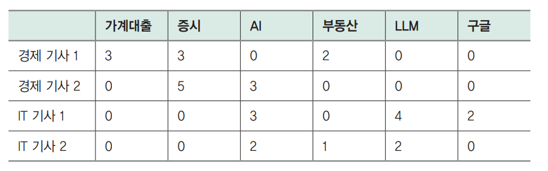

# **임베딩 모델로 데이터 의미 압축하기**  
검색 증강 생성(RAG)는 프롬프트의 요청의 맥락 정보를 추가해 LLM의 생성 품질을 향상하는 기술이다. 맥락 정보를 저장하고 검색하기 위해서는 텍스트를 
임베딩 벡터로 변환해야 하는데 이때 임베딩 모델을 사용한다. 지금까지 임베딩 모델의 활용에만 집중할 수 있도록 상업용 임베딩 모델인 OpenAI의 text-embedding-ada-002를 
사용했다.  
  
텍스트를 숫자로 표현하지만 의미를 담지는 못하는 원핫 인코딩(one-hot encoding)부터 문장을 벡터로 표현하는 문장 임베딩(sentence embedding)까지 
AI 분야에서는 텍스트를 의미를 담아 더 압축적인 임베딩 벡터를 만드는 방향으로 발전해 왔다.  
  
텍스트 임베딩 모델은 문장의 의미를 담아 임베딩 벡터로 변환하기 때문에 문자열이 동일하지 않더라도 검색할 수 있다. 임베딩 벡터의 유사도를 기반으로 
검색하는 방법을 의미 검색(semantic search)이라고 부른다.  
  
의미 검색은 검색할 때 벡터 유사도를 활용하기 때문에 의미상 유사한 문서를 찾을 수 있다는 장점이 있지만 문자열을 비교하는 키워드 검색 방식보다는 
관련도가 떨어지는 문서가 검색될 수 있다는 단점이 있다. 이런 단점을 보완하기 위해 키워드 검색과 의미 검색을 조합해 사용하는 하이브리드 검색을 사용할 
수 있다. 대표적인 키워드 검색 방식인 BM25, 그리고 키워드 검색과 의미 검색의 순위를 조합해 최종 순위를 산정할 때 사용하는 RRF(Reciprocal Rank Fusion)를 
알아본다.  
  
하단 명령어를 실행해 라이브러리를 다운로드 한다.  
  
!pip install transformers==4.40.1 datasets==2.19.0 sentence-transformers==2.7.0  
faiss-cpu==1.8.0 llama-index==0.10.34 llama-index-embeddings-huggingface==0.2.0 -qqq  
  
# **텍스트 임베딩 이해하기**  
9장에서는 "북태평양 기단과 오호츠크해 기단이 만나 국내에 머무르는 기간은?"이라는 질문에 관련된 기사 본문을 찾아 프롬프트에 추가했다. 여기서 질문과 
기사가 문자열 그대로 일치하지 않는데 검색할 수 있었다는 점이 중요하다. 여러 문장의 텍스트를 임베딩 벡터로 변환하는 방식을 텍스트 임베딩 또는 문장 임베딩
이라고 부른다. 문장 임베딩 방식은 이제 널리 사용되지만 최근까지도 텍스트의 의미를 담아 임베딩 벡터로 표현하는 과제는 어려운 문제였다.  
  
임베딩(embedding)이란 '데이터의 의미를 압축한 숫자 배열(벡터)'을 말한다. 기본적으로 컴퓨터는 숫자 형식의 데이터만 연산할 수 있기 때문에 컴퓨터로 
처리하기 위해서는 텍스트, 이미지, 음성 등 모든 데이터를 숫자 형식으로 바꿔야 한다. 이때 가능하면 데이터의 의미를 담아 숫자로 변환할 수 있다면 
좋을 텐데 비교적 최근까지도 어려운 과제였다.  
  
# **문장 임베딩 방식의 장점**  
만약 데이터의 의미를 숫자로 표현할 수 있다면 데이터가 서로 유사한지, 관련이 있는지와 같이 중요한 정보를 활용할 수 있다. 예를 들어 '학교', '공부', 
'운동'이라는 세 단어가 있을 때 아래 예제를 사용해 임베딩으로 변환하면 단어 간의 코사인 유사도를 통해 '학교'가 '공부'와 0.595만큼 유사하고 '학교'와 
'운동'은 0.325만큼 유사하다는 정보를 활용할 수 있다.  
  
chapter10.ipynb 파일에서 문장 임베딩을 활용한 단어 간 유사도 계산 참조  
  
문장 임베딩 방식을 사용하면 서로 다른 텍스트를 마치 사람이 이해하는 것처럼 서로 유사한지, 서로 관련이 있는지 판단할 수 있다는 장점이 있다.  
  
# **원핫 인코딩**  
앞서 활용한 예시를 그대로 활용해 '학교', '공부', '운동'이라는 세 가지 단어가 있다고 하자. 세 데이터를 숫자로 변환한다고 하면 다음과 같이 간단히 
1, 2, 3을 아이디로 붙일 수 있다.  
  
학교 - 1, 공부 - 2, 운동 - 3  
  
숫자로 변환은 했지만 이 방법을 사용할 경우 공부가 학교의 두 배(2 = 1 * 2)라거나 운동이 학교의 세 배(3 = 1 * 3)라는 오해가 생길 수 있다. 이런 
문제를 피하기 위해 다음과 같이 표현하는 것을 원핫 인코딩(one-hot encoding)이라고 한다.  
  
학교 - [1, 0, 0], 공부 - [0, 1, 0], 운동 - [0, 0, 1]  
  
이 방식을 사용하면 '식사'라는 새로운 데이터를 추가해도 아래처럼 독립적으로 추가할 수 있고 단어와 단어 사이에 아무런 관계도 나타내지 않는다.  
  
학교 - [1, 0, 0, 0], 공부 - [0, 1, 0, 0], 운동 - [0, 0, 1, 0], 식사 - [0, 0, 0, 1]  
  
원핫 인코딩은 범주형 데이터 사이에 의도하지 않은 관계가 담기는 걸 방지한다는 장점이 있지만 충분히 관련이 있는 단어 사이의 관계도 표현할 수 없다는 
치명적인 단점이 있다. '학교'와 '공부'사이에는 '무언가를 배운다'는 공통점이 있지만 원핫 인코딩에서는 그 의미를 전혀 살릴 수 없다. 아래 예제의 코드를 
실행하면 원핫 인코딩으로 표현했을 때 학교와 공부의 유사도는 0이고 학교와 운동의 유사도도 0이다.  
  
chapter10.ipynb 파일에서 원핫 인코딩의 한계 참조  
  
# **백오브워즈**  
백오브워즈(Bag of Words)는 '비슷한 단어가 많이 나오면 비슷한 문장 또는 문서'라는 가정을 활용해 문서를 숫자로 변환한다. 백오브워즈는 단어의 순서에 
관계없이 해당 문서에 등장한 단어와 그 등장 횟수를 집계한다. 예를 들어 경제 기사 2개와 IT 기사 2개에 등장하는 단어 빈도가 아래 표와 같다고 하자.  
  
  
  
경제 기사라면 다루는 내용에 따라 차이는 있겠지만 기본적으로 '대출', '증시', '부동산'과 같은 단어를 사용할 가능성이 높다. 물론 IT 기사에도 '부동산' 
같은 단어가 등장할 수 있지만 일반적으로 경제 기사보다는 낮은 빈도를 보일 것이다. 백오브워즈는 아이디어가 직관적이고 구현이 간단함에도 훌륭히 작동하기 
떄문에 문장과 문서의 의미를 표현하는 방법으로 오랫동안 사용돼 왔다.  
  
하지만 백오브워즈는 한 가지 문제가 있는데 어떤 단어가 많이 나왔다고 해서 문서의 의미를 파악하는 데 크게 도움이 되지 않는 경우가 있다는 점이다. 
예를 들어 '은/는/이/가', '을/를' 같은 조사는 거의 모든 한국어 문서에 등장한다. 또한 위의 예시에서 'AI'라는 단어는 분야를 가리지 않고 여러 기사에서 
언급하기 떄문에 'AI'라는 단어가 등장했다는 사실만으로는 문서의 의미를 예측하기 어렵다.  
  
# **TF-IDF**  
TF-IDF(Term Frequency-Inverse Document Frequency)는 앞서 설명한 '어느 문서에나 나오는 단어'문제를 보완하기 위해 다음 수식을 활용해 많은 
문서에 등장하는 단어의 중요도를 작게 만든다. 수식에서 TF(w)는 특정 문서에서 특정 단어 w가 등장한 횟수(Term Frequency)를 나타낸다. 백오브워즈의 빈도 
집계와 같은 부분이다. DF(w)는 특정 단어 w가 등장한 문서의 수(Document Frequency)를 의미한다.  
  
TF-IDF(w) = TF(w) * log(N/DF(w))  
  
  
  
위 표에서 전체 문서의 수(N)가 4일 때 'AI'라는 단어는 3개의 문서에 등장했으므로 DF("AI") = 3이다. log(N/DF(w))는 특정 단어가 여러 문서에 
등장할수록 값이 작아지는데 만약 '이'라는 조사가 4개의 문서에 모두 등장했다면 log(N/DF("이")) = log(4/4) = 0이 된다.  
  
위 표를 살펴보면 조사 '이'는 'LLM'에 비해 IT 기사에서 더 많이 등장하지만 모든 문서에 등장했기 때문에 중요도가 없다(log(4/4) = 0)고 판단해서 
최종적으로 TF-IDF("이") 값은 0이 된다. TF-IDF는 백오브워즈의 문제를 성공적으로 보완하면서 오랫동안 활발히 사용됐고 검색에서도 BM25(Best Matching 25) 
와 같은 TF-IDF의 변형 방식이 현재까지도 가장 보편적인 연관도 점수 계산 방식으로 사용되고 있다.  
  
원핫 인코딩, 백오브워즈, TF-IDF는 문서에 등장하는 단어의 수만큼 차원이 커지는데 경제 기사 1, 2와 IT 기사 1, 2에 포함된 모든 단어의 수만큼 표가 
가로로 길어져야 한다. 만약 총 10000개의 단어가 전체 문서에 사용됐다면 하나의 문장과 문서를 표현하기 위해 10000차원의 벡터를 사용하게 되는데 그러면 
필연적으로 대부분의 수가 0인 벡터가 된다. 이렇게 대부분이 0인 벡터를 희소(sparse)하다고 하는데 희소한 벡터는 의미를 '압축'해서 담고 있지 못하기 
떄문에 벡터와 벡터 사이의 관계를 활용하기 어렵다. 앞으로 설명할 워드투벡과 문장 임베딩은 보통 100 ~ 1000차원 정도로 훨씬 압축된 형태인데 회소한 
벡터와 대비해서 밀집 임베딩(dense embedding)이라고 부른다.  
  
# **워드투벡**  
워드투벡(word2vec)은 단어가 '함께 등장하는 빈도' 정보를 활용해 단어의 의미를 압축하는 단어 임베딩 방법이다. 글을 읽다 보면 자주 함께 사용되는 
단어들이 있다. 예를 들어 'AI'는 'ML'또는 '머신러닝'과, '한강'은 '라면'이나 '자전거'와 함께 자주 등장한다. 그렇다면 특정 단어 주변에 어떤 
단어가 있는지 예측하는 모델을 만든다면 단어의 의미를 표현한 임베딩을 모델이 생성할 수 있지 않을까?  
  
  
  
워드투벡은 이런 가정에 기반해 위 그림과 같이 주변 단어로 가운데 단어를 예측하는 방식(CBOW)과 중간 단어로 주변 단어를 예측하는 방식(스킵그램)으로 
모델을 학습시킨다.  
  
그림을 좀 더 자세히 살펴보면 CBOW(Continuous Bag of Words)는 주변의 단어 정보로 중간에 있을 단어를 예측하는 방식이다. 그림 a에서는 t번째 단어를 
예측하기 위해 위아래로 2개의 단어 정보(t - 2, t - 1, t + 1, t + 2)를 활용한다. 스킵그램(skip-gram)은 반대로 가운데 단어 정보로 주변의 단어를 
예측하는데 그림 b에서 t번째 단어 정보로 주변의 4개의 단어(t - 2, t - 1, t + 1, t + 2번째)가 무엇인지 맞추는 방식으로 학습한다.  
  
  
  
이렇게 주변 단어를 예측하는 방식을 사용해 학습한 모델로 단어를 임베딩 벡터로 변환했을 때 위 그림과 같이 '여자'라는 단어의 임베딩 벡터와 '남자'라는 
단어의 임베딩 벡터 사이의 거리와 방향이 '여왕'과 '왕' 사이의 거리 및 방향과 비슷하게 나왔다. 단어의 의미를 압축해 숫자로 표현하니 단어와 단어 
사이의 관계를 계산할 수 있고 그 관계에도 의미가 담겨 있음을 확인한 것이다.  
  
원핫 인코딩, 백오브워즈, TF-IDF에서는 희소 벡터를 통해 텍스트를 표현했고 워드투벡은 인공신경망을 사용해 단어의 의미를 압축해 밀집 임베딩으로 표현하도록 
발전했다. 워드투벡의 성공 이훌 단어를 넘어 문장을 밀집 임베딩으로 표현하는 방법이 개발됐다.  
  
# **문장 임베딩 방식**  
워드투벡은 단어를 임베딩 벡터로 변환함으로써 단어와 단어 사이의 관계를 판단하는 데 밀집 임베딩을 활용할 수 있는 길을 열었다. 하지만 우리가 텍스트를 
활용할 때는 단어 단위보다는 문장이나 문단 같은 더 큰 단위를 사용한다. 따라서 여러 단위가 합쳐진 문장을 임베딩 벡터로 변환하는 방법이 필요했다.  
  
# **문장 사이의 관계를 계산하는 두 가지 방법**  
워드투벡의 성공 이후 인공신경망을 활용해 텍스트를 밀집 임베딩으로 표현하는 기술이 개발됐다. 문장 임베딩을 활용하면 문장 사이의 유사도나 관련성을 
벡터 연산을 통해 쉽게 계산할 수 있다는 장점이 있다. 트랜스포머 인코더 구조를 활용한 BERT(Bidirectional Encoder Representations from Transformers)모델은 
입력 문장을 문장 임베딩으로 변환하는 데 있어 뛰어난 성능을 보였다.  
  
  
  
BERT 모델을 사용해 문장과 문장 사이의 관계를 계산하는 방법은 크게 두 가지로 나눌 수 있다. 첫 번째는 그림 a에 나와 있는 바이 인코더(bi-encoder) 
방식이다. 이 방식에서는 각각의 문장(문장 A와 B)를 독립적으로 BERT 모델에 입력으로 넣고 모델의 출력 결과인 문장 임베딩 벡터(그림의 u와 v) 사이의 
유사도를 코사인 유사도(Cosine similarity)와 같은 별도의 계산을 통해 구한다. 그림에서 풀링 층은 문장의 길이가 달라져도 문장 임베딩의 차원이 같도록 
맞춰주는 층이다. 두 번째 방식은 그림 b에 나와 있는 교차 인코더(cross-encoder) 방식이다. 이 방식에서는 두 문장을 함께 BERT 모델에 입력으로 넣고 
모델이 직접 두 문장 사이의 관계를 0에서 1 사이의 값으로 출력한다. 교차 인코더 방식은 바이 인코더 방식에 비해 계산량이 많지만 두 문장의 상호작용을 
고려할 수 있어 좀 더 정확한 관계 예측이 가능하다.  
  
  
  
바이 인코더와 교차 인코더의 차이를 더 정확히 이해하기 위해 위 그림에서 교차 인코더를 활용해 문서를 검색하는 경우를 예시로 살펴보자. 교차 인코더 방식은 
하나의 BERT 모델에 검색 쿼리 문장과 검색 대상 문장을 함께 입력으로 넣고 텍스트 사이의 유사도 점수(그림의 s)를 계산한다. 이렇게 계산했을 때 그림에서 
확인할 수 있듯이 직접적으로 두 텍스트 사이의 관계를 모두 계산하기 때문에 두 텍스트의 유사도를 정확히 계산할 수 있다는 장점이 있다. 하지만 입력으로 넣은 
두 문장의 유사도만 계산하기 때문에 다른 문장과 검색 쿼리의 유사도를 알고 싶으면 다시 동일한 연산을 반복해야 한다는 단점이 있다.  
  
  
  
예를 들어 위 그림과 같이 1000개의 문장을 저장하고 있을 때 문장 A와 가장 유사한 문장을 찾고 싶다고 하자. 그러면 교차 인코더를 사용하면 문장 A와 
문장 1의 유사도를 계산하고 순차적으로 문장 2, 문장 3, ..., 문장 1000까지 모두 계산해 1000번의 계산을 거쳐야 한다. 하지만 BERT 모델이 사용하는 
어텐션 연산은 계산량이 많은 무거운 연산이기 때문에 가급적 적게 수행해야 한다.  
  
  
  
하지만 교차 인코더를 사용하는 경우 새로운 문장과 유사한 문장을 찾고 싶을 때마다 동일한 연산을 수행해야 한다. 위 그림에서 새로운 문장 B와 가장 
유사한 문장을 검색하고 싶다면 다시 문장 1부터 문장 1000까지 1000번의 BERT 연산을 수행해야 한다. 즉 새로운 검색 문장마다 매번 저장된 문장 수
(그림에서는 1000)만큼의 BERT 연산을 수행해야 가장 유사한 문장을 찾을 수 있다.  
  
  
  
교차 인코더는 모든 문장 조합에 대해 유사도를 계산해야 가장 유사한 문장을 검색할 수 있어 확장성이 떨어진다. 이런 문제를 극복하기 위해 위 그림과 
같이 검색 쿼리 문장과 검색 대상 문장을 각각의 모델에 입력하는 바이 인코더 방식이 개발됐다. 그림에서 각 문장은 동일한 모델을 통과해 각 문장에 대한 
임베딩으로 변환된다. 그리고 두 문장 사이의 유사도는 각 문장 임베딩을 코사인 유사도와 같은 유사도 계산 방식을 통해 최종적인 유사도 점수(그림의 s)를 
산출한다.  
  
두 문장 사이의 유사도 점수를 결과로 반환하는 교차 인코더와 달리 바이 인코더는 각 문장의 독립적인 임베딩을 결과로 반환하기 때문에 유사도를 계산하고 싶은 
문장이 바뀌더라도 추가적인 BERT 연산이 필요 없다.  
  
  
  
이해를 돕기 위해 위 그림을 살펴보자. 저장된 1000개의 문장 중 문장 A와 가장 유사한 문장을 찾고 있다. 그럴 때 바이 인코더를 통해 문장 A에 대한 
문장 임베딩을 생성하고 문장 1부터 문장 1000까지 1000개의 문장에 대한 문장 임베딩을 생성한다. 그리고 문장 임베딩끼리 코사인 유사도를 사용해 유사도 
점수를 계산한다. 여기서 코사인 유사도는 BERT 연산에 비해 훨씬 계산량이 적기 때문에 빠르게 수행할 수 있다.  
  
  
  
바이 인코더의 강점은 새로운 문장 B와 가까운 문장을 검색할 때 드러난다. 위 그림에서 새로운 문장 B와 가장 가까운 문장을찾는 경우, 문장 1에서 문장 1000의 
문장 임베딩은 이미 문장 A를 검색할 때 만들었기 때문에 문장 B를 문장 임베딩으로 만드는 한 번의 BERT 연산만 수행하면 문장 B와 유사한 문장을 검색할 
수 있다. 앞서 교차 인코더의 경우 검색하는 문장이 바뀔 때마다 1000번의 연산을 수행해야 했는데 바이 인코더를 사용하면 검색하는 문장에 대해서만 
BERT 연산을 수행하기 때문에 계산량이 줄고 확장성이 높아진다.  
  
문장 임베딩을 계산하는 바이 인코더를 활용하면 각 문장에 대해 한 번씩만 BERT 연산을 수행하면 유사도는 코사인 유사도 같은 가벼운 연산으로 구할 
수 있기 때문에 문장이 ㅁ낳아져도 계산에 오랜 시간이 걸리지 않는다. 만약 1000개의 문서에 대한 관계를 모두 계산하고 싶다고 할 때 교차 인코더에서는 
1000개의 조합 수(499500)만큼 BERT 연산이 필요하지만 바이 인코더에서는 1000번의 BERT 연산만 수행하면 나머지는 코사인 유사도 계산으로 구할 수 있다.  
  
바이 인코더를 사용하면 문장을 문장 임베딩으로 변환하고 빠르게 검색을 수행할 수 있다. Sentence-Transformers 라이브러리는 허깅페이스 트랜스포머 
라이브러리를 기반으로 쉽게 바이 인코더를 사용할 수 있는 다양한 기능을 지원한다.  
  
# **바이 인코더 모델 구조**  
  
  
바이 인코더는 위 그림과 같이 BERT 모델의 출력을 풀링 층을 통해 고정된 크기의 문장 임베딩으로 만든다. BERT 모델은 입력 토큰마다 출력 임베딩을 
생성한다. 따라서 입력하는 문장의 길이가 달라질 경우 출력하는 임베딩의 수가 달라진다. 문장의 길이가 다를 때 서로 다른 개수의 임베딩이 반환된다면 
문장과 문장 사이의 유사도를 쉽게 계산하기 어렵다. 따라서 풀링 층을 사용해 문장을 대표하는 1개의 임베딩으로 통합한다. 풀링 층을 통해 문장의 길이가 
달라져도 1개의 고정된 차원의 임베딩이 반환되기 때문에 코사인 유사도와 같은 거리 계산 방식을 활용해 두 문장 임베딩 사이의 거리를 쉽게 계산할 수 있다.  
  
Sentence-Transformers 라이브러리를 사용하면 쉽게 바이 인코더를 사용할 수 있다. 아래 예제의 코드를 사용하면 허깅페이스 모델 허브에서 모델을 불러와 
바이 인코더를 만들 수 있다. Sentence-Transformers 라이브러리에서 제공하는 models 모듈의 Transformer 클래스를 사용하면 허깅페이스 모델 허브의 
모델을 불러올 수 있다. 아래 예제에서는 klue/roberta-base 저장소에서 모델을 불러온다. 기본 언어 모델에 앞서 설명한 풀링 층을 models.Pooling 클래스를 
활용해 생성한다. 풀링 층에 입력으로 들어오는 토큰 임베딩의 차원을 알려주기 위해 기본 언어 모델의 get_word_embedding_dimension() 메서드를 사용한다. 
마지막으로 SentenceTransformer 클래스에 모듈로 언어 모델인 word_embedding_model과 풀링 층인 pooling_model을 리스트 형태로 입력해 바이 인코더를 
생성한다.  
  
chapter10.ipynb 파일에서 Sentence-Transformers 라이브러리로 바이 인코더 생성하기 참조  
  
  
  
생성한 model을 출력해 보면 위 그림과 같이 바이 인코더의 구조를 확인할 수 있다. 출력된 결과를 자세히 보면 세 가지의 풀링 모드(pooling_mode)가 
있음을 확인할 수 있다. pooling_mode_cls_tokens, pooling_mode_mean_tokens, pooling_mode_max_tokens 세 가지 설정이 있고 이 중에서 
pooling_mode_mean_tokens가 True로 설정돼 있다.  
  
풀링 모드란 언어 모델이 출력한 결과 임베딩을 고정된 크기의 문장 임베딩으로 통합할 때 통합하는 방식을 말한다. 세 가지 방식을 자세히 설명하면 
다음과 같다.  
  
- 클래스 모드(pooling_mode_cls_tokens): BERT 모델의 첫 번째 토큰인 [CLS] 토큰의 출력 임베딩을 문장 임베딩으로 사용한다.  
- 평균 모드(pooling_mode_mean_tokens): BERT 모델에서 모든 입력 토큰의 출력 임베딩을 평균한 값을 문장 임베딩으로 사용한다.  
- 최대 모드(pooling_mode_max_tokens): BERT 모델의 모든 입력 토큰의 출력 임베딩에서 문장 길이(sequence) 방향에서 최댓값을 찾아 문장 임베딩으로 
사용한다.  
  
클래스 모드의 경우 언어 모델의 첫 번째 임베딩을 문장 임베딩으로 사용하기 때문에 쉽게 이해할 수 있다. 다음으로 평균 모드의 경우 아래 예제와 같은 
방식으로 풀링을 수행한다. mean_pooling 함수의 입력으로 model_output과 attention_mask를 받는데, 여기서 model_output은 언어 모델의 출력이고 
attention_mask는 패딩 토큰의 위치를 확인할 수 있는 어텐션 마스크다. model_output[0]을 통해 언어 모델의 출력 중 마지막 층의 출력만 사용한다. 
입력이 패딩 토큰인 부분은 평균 계산에서 무시하기 위해 input_mask_expanded를 만들고 출력 임베딩에 곱해 준다. 마지막으로 출력 임베딩의 합을 패딩 
토큰이 아닌 실제 토큰 입력의 수로 나눠준다.  
  
chapter10.ipynb 파일에서 코드로 살펴보는 평균 모드 참조  
  
최대 모드의 경우 아래 예제와 같은 코드로 구현할 수 있다. 함수의 입력과 언어 모델의 마지막 층 출력을 사용하고 어텐션 마스크를 통해 패딩 토큰 부분을 
구분하는 것은 동일하다. 이후 패딩 토큰인 부분은 -1e9로 아주 작은 값을 입력해 최댓값이 될 수 없도록 설정하고 출력 임베딩의 토큰 길이 차원에서 
가장 큰 값을 찾는다.  
  
chapter10.ipynb 파일에서 코드로 살펴보는 최대 모드 참조  
  
새 가지 풀링 모드 중에서는 평균 모드를 일반적으로 많이 활용한다.  
  
# **Sentence-Transformers로 텍스트와 이미지 임베딩 생성해 보기**  
Sentence-Transformers 라이브러리는 허깅페이스 모델을 불러와 쉽게 사용할 수 있도록 지원한다. 따라서 허깅페이스 모델 허브에서 제공하는 모델이라면 
텍스트뿐만 아니라 이미지 모델도 불러와 사용할 수 있다. 아래 예제와 같이 한국어 문장 임베딩 모델인 snunlp/KR-SBERT-V40K-klueNLI-augSTS 저장소의 
모델을 불러온다. 문장 임베딩 모델은 encode 메서드를 통해 입력 문장을 문장 임베딩으로 변환한다. 아해 예제에서는 '잠이 안 옵니다', '졸음이 옵니다', 
'기차가 옵니다'라는 3개의 문장을 문장 임베딩 모델에 입력했다. 그 결과 세 문장에 대한 임베딩을 반환하는데 각 문장 사이의 유사도를 계산하기 위해 
util.cos_sim 함수를 사용해 문장 임베딩 사이의 코사인 유사도를 계산한다. 출력된 유사도 계산 결과를 보면 '잠'과 '기차'로 주제가 다른 첫 번째 문장과 
세 번째 문장은 0.1887, '졸음'과 '기차'로 주제가 다른 두 번째 문장과 세 번째 문장은 0.273으로 비교적 낮은 유사도 점수를 보인 것을 확인할 수 있다.  
  
chapter10.ipynb 파일에서 한국어 문장 임베딩 모델로 입력 문장 사이의 유사도 계산 참조  
  
허깅페이스 모델 허브에서 제공하는 이미지 모델을 활용하면 이미지도 임베딩으로 쉽게 변환할 수 있다.  
  
  
  
예시로 사용할 이미지는 위의 a,b이다.  
  
아래 예제는 위 그림을 이미지 임베딩으로 변환한다. 예제에서는 clip-ViT-B-32 모델을 사용했다. CLIP(Contrastive Language-Image Pre-training) 모델은 
OpenAI가 개발한 텍스트-이미지 멀티 모달(Multi-Modal) 모델로 이미지와 텍스트의 임베딩을 동일한 벡터 공간상에 배치해 유사한 텍스트와 이미지를 찾을 
수 있다. 다음으로 encode 메서드를 사용해 강아지 이미지와 고양이 이미지를 이미지 임베딩(img_embs)으로 변환하고 'A dog on grass'(잔디 위의 강아지)
와 'Brown cat on yellow background'(노란 배경의 갈색 고양이)라는 텍스트를 텍스트 임베딩(text_embs)으로 변환한다. 이미지 임베딩과 텍스트 임베딩 
사이의 코사인 유사도를 계산하면 강아지 이미지와 강아지 텍스트의 유사도는 0.2771이지만 고양이 이미지와 강아지 텍스트의 유사도는 0.2071로 강아지 
이미지와 텍스트가 대응됐을 때 유사도가 더 높다. 또란 고양이 이미지와 텍스트 역시 0.3180과 0.1509로 서로 대응됐을 때 더 높은 유사도를 보였다.  

chapter10.ipynb 파일에서 CLIP 모델을 활용한 이미지와 텍스트 임베딩 유사도 계산 참조  
  
Sentence-Transformers 라이브러리를 활용하면 불러오는 오픈소스 모델에 따라 텍스트 또는 이미지를 쉽게 임베딩으로 변환할 수 있다.  
  
# **오픈소스와 상업용 임베딩 모델 비교하기**  
임베딩 모델을 활요하는 방법은 크게 오픈소스 모델과 상업용 모델로 나눌 수 있다. 대표적인 상업용 임베딩 모델로는 OpenAI의 text-embedding-ada-002 
모델이 있다. 오픈소스 모델은 일반적으로 Sentence-Transformers 라이브러리를 사용해 사전 학습 모델을 불러와 활용한다.  
  
  
  
상업용 모델은 대량의 데이터로 학습된 만큼 성능이 뛰어나다는 장점이 있다. 또한 위 표와 같이 LLM 텍스트 생성에 비해 훨씬 낮은 비용으로 사용이 가능하다. 
gpt-3.5-turbo 모델의 경우 1000개 토큰당 비용이 0.001달러가 발생하지만 2세대 임베딩 모델인 text-embedding-ada-002는 그 1/10 수준이고 
2024년 1월 25일 발표된 3세대 임베딩 모델인 text-embedding-3-small은 1/50 수준이다. 3세대 모델의 경우 2세대 모델에 비해 영어 검색 성능은 물론 
다국어 검색 성능도 높아졌다. 영어 및 다국어 검색 성능에 대한 더 자세한 사항은 3세대 임베딩 모델 소개 페이지(https://openai.com/blog/new-embedding-models-and-api-updates)
에서 확인할 수 있다.  
  
허자먼 OpenAI는 gpt-3.5-turbo 같은 일부 텍스트 생성 모델에 대해서는 사용자의 데이터로 미세 조정할 수 있는 기능을 제공하지만 임베딩 모델에 대한 
미세 조정 기능은 지원하지 않는다. 따라서 사용자가 자신의 데이터에 특화된 임베딩 모델을 만들 수 없다. 오픈소스 모델을 활용하면 자신의 데이터에 맞춰 미세 
조정을 수행할 수 있다는 장점이 있다.  
  
# **실습:의미 검색 구현하기**  
sentence-transformers와 faiss 라이브러리를 활용해 의미 검색(semantic search)을 직접 구현한다. 의미 검색이란 단순히 키워드 매칭을 통한 
검색이 아니라 밀집 임베딩을 이용해 문장이나 문서의 의미를 고려한 검색을 수행하는 것을 말한다. 실습에 사용할 faiss 라이브러리는 메타(구 페이스북)
에서 개발한 벡터 연산 라이브러리다. faiss는 코사인 유사도, 유클리드 거리 등 가장 기본적인 벡터 거리 계산 방법을 지원할 뿐만 아니라 벡터 검색 
속도를 향상해 주는 ANN(Approximate Nearest Neighbor) 알고리즘도 다양하게 제공한다.  
  
# **의미 검색 구현하기**  
이번 실습에서는 KLUE(Korean Language Understanding Evaluation) 데이터셋의 MRC(Machine Reading Comprehension) 데이터를 활용한다. 
해당 데이터셋은 기사 본문과 기사 본문에 관련된 질문을 모은 데이터셋이다. 허깅페이스 데이터셋 허브의 KLUE MRC 저장소(https://huggingface.co/datasets/klue/viewer/mrc)
에서 데이터셋을 확인할 수 있다. 의미 검색을 구현하기 위해 먼저 아래 예제의 코드로 실습에 사용할 한국어 임베딩 모델의 KLUE의 MRC 데이터셋을 불러온다.  

chapter10.ipynb 파일에서 실습에 사용할 모델과 데이터셋 불러오기 참조  
  
다음으로 아래 예제를 사용해 KLUE MRC 데이터셋의 앞에서부터 1000개의 데이터만 추출하고 텍스트 임베딩으로 변환한다. MRC 데이터셋의 학습 데이터는 
원래 17554개의 데이터로 구성된다. 하지만 실습에서는 더 빠른 진행을 위해 그중에서 1000개의 데이터만 사용한다. train_test_split 메서드를 사용하면 
데이터셋을 학습 데이터와 테스트 데이터로 구분할 수 있다. 아래 예제에서는 학습 데이터 크기(train_size)를 1000으로 하고 같은 결과를 확인할 수 
있도록 데이터셋을 섞지 않게(shuffle=False) 설정했다. 다음으로 기사 본문 데이터를 저장하고 있는 context 컬럼을 문장 임베딩 모델에 입력으로 넣어 
문장 임베딩으로 변환한다. 출력된 결과를 확인하면 1000개의 문장 임베딩이 잘 생성된 것을 확인할 수 있다.  
  
chapter10.ipynb 파일에서 실습 데이터에서 1000개만 선택하고 문장 임베딩으로 변환 참조  
  
아래 예제에서는 기본 KNN(K-Nearest Neighbor) 알고리즘을 활용하는 faiss의 IndexFlatL2 클래스를 사용해 인덱스를 만든다. MySQL 같은 관계형 
데이터베이스를 다뤄본 경험이 있다면 데이터를 저장할 테이블을 생성한다고 생각하면 된다. 인덱스 유형에는 KNN뿐만 아니라 검색 속도를 높일 수 있는 
ANN 알고리즘을 사용하는 인덱스도 있다. 인덱스를 만든 이후에는 임베딩 벡터를 인덱스에 저장한다.  

chapter10.ipynb 파일에서 KNN 검색 인덱스를 생성하고 문장 임베딩 저장 참조  
  
의미 검색을 구현하기 위해서는 검색 쿼리 문장을 문장 임베딩으로 변환하고 인덱스에서 검색하면 된다. 아래 예제에서는 "이번 연도에는 언제 비가 많이 올까?" 
라는 검색 쿼리 문장을 문장 임베딩 모델의 encode 메서드를 사용해 문장 임베딩으로 변환하고 인덱스의 search 메서드로 검색을 수행했다. 이때 search 메서드의 
두 번째 인자로 3을 입력했는데 쿼리 임베딩(query_embedding)과 가장 가까운 3개의 문서를 반환받겠다는 의미다. 검색한 3개의 문서를 출력하면 가장 
먼저 올여름 장마에 대한 기사 본문이 검색됐고 다음으로 오리너구리에 대한 기사가 검색된 것을 확인할 수 있다. 가장 먼저 출력된 '올여름 장마가...' 
기사는 실습 데이터셋의 첫 번째 데이터인데 검색 쿼리 문장과 겹치는 단어가 거의 없음에도 가장 가까운 문서로 검색됐다. 의미 검색은 키워드 검색과 
달리 동일한 키워드가 사용되지 않아도 의미적 유사성이 있다면 가깝게 평가한다는 장점이 있다.  
  
chapter10.ipynb 파일에서 의미 검색의 장점 참조  
  
의미 검색의 한계를 확인하기 위해 아래 예제와 같이 실습 데이터셋의 4번째(인덱스 3) 질문을 검색 쿼리 문장으로 입력해 보자. 검색 쿼리 문장은 아래 예제에서 
주석으로 표시한 대로 로버트 헨리 딕이 개발한 것을 묻는 질문이다. 로버트 헨리 딕은 레이더를 개발한 사람으로 의미 검색이 잘 작동한다면 매사추세츠 
연구소에서 레이더를 개발한 기사 본문이 가장 먼저 검색돼야 한다. 하지만 실제로 예제를 실행하면 출력된 결과와 같이 태평양 전쟁에 대한 기사가 가장 먼저 
검색된다. 태평양 전쟁에 대한 데이터는 실습 데이터셋의 79, 80번째 데이터에 있는데 전문을 출력해 읽어보면 로버트 헨리 딕이나 매사추세츠 연구소와 
관련된 내용이 전혀 없다. 이처럼 의미 검색은 키워드가 동일하지 않아도 의미가 유사하면 찾을 수 있다는 장점이 있는 반면, 관련성이 떨어지는 검색 결과가 
나오기도 한다는 잔점이 있다.  
  
chapter10.ipynb 파일에서 의미 검색의 한계 참조  
  
# **라마인덱스에서 Sentence-Transformers 모델 사용하기**  
라마인덱스는 기본적으로 OpenAI의 text-embedding-ada-002를 사용하기 때문에 OpenAI API 키만 설정하면 라미인덱스에서 내부적으로 임베딩 API를 
호출해 변환을 수행한다.  
  
라마인덱스는 아래 예제와 같이 간단하게 Sentence-Transformers의 임베딩 모델을 통합할 수 있는 기능을 지원한다. 허깅페이스 허브에 모델이 저장된 경우, 
HuggingFaceEmbedding 클래스에 모델 이름으로 모델 저장소 이름을 입력하면 해당 저장소의 모델을 불러온다. 만약 로컬에 저장된 모델을 활용하고 싶다면 
주석 처리된 내용과 같이 ServiceContext에서 로컬 모델의 경로를 설정해 주면 된다. 더 자세한 사항은 라마인덱스의 오픈소스 임베딩 모델 공식 문서(
https://docs.llamaindex.ai/en/stable/module_guides/models/embeddings.html#local-embedding-models)에서 확인할 수 있다.  

chapter10.ipynb 파일에서 라마인덱스에서 Sentence-Transformers 임베딩 모델 활용 참조  
  
의미 검색은 키워드가 동일하지 않아도 유사한 의미의 기사를 검색할 수 있다는 장점이 있었지만 관련성이 떨어지는 기사가 먼저 검색되는 한계도 보였다.  
  

