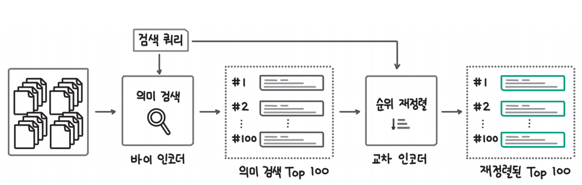
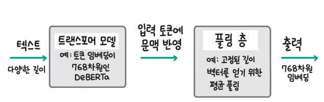
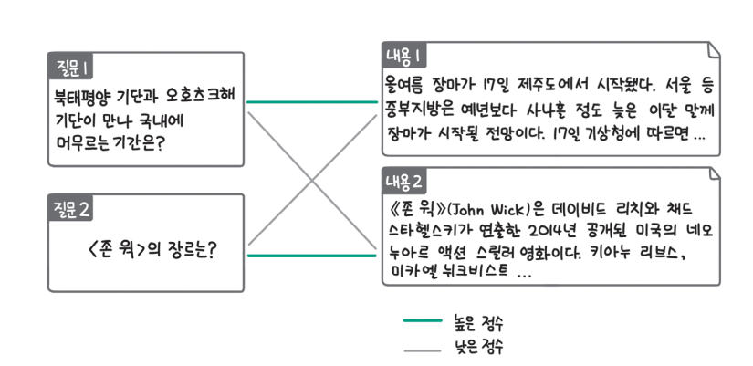
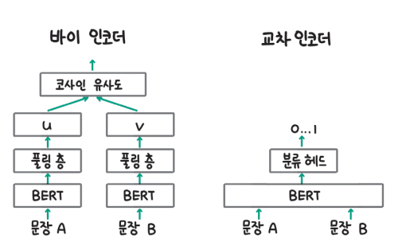

# **자신의 데이터에 맞춘 임베딩 모델 만들기: RAG 개선하기**  
교차 인코더는 비교하려는 두 문장을 입력으로 받아 직접 비교학 떄문에 유사도를 더 정확히 계산할 수 있지만 느리고 확장성이 떨어졌다. 바이 인코더는 
입력 문장에 대해 독립적인 문장 임베딩을 생성하고 임베딩끼리 코사인 유사도 같은 가벼운 거리 계산 방식으로 유사도를 계산하기 때문에 큰 데이터셋에서도 
빠르게 가장 비슷한 문장을 찾을 수 있었다. 이런 장점을 통해 바이 인코더는 문장 임베딩을 생성하는 대표적인 방식으로 사용되며 검색 증강 생성(RAG)
의 필수 구성요소로 활용된다.  
  
이번 장에서는 먼저 느리지만 정확한 교차 인코더와 빠르지만 덜 정확한 바이 인코더를 결합해 RAG의 검색 성능을 높이는 방법을 알아본다.  
  
교차 인코더는 느리기 때문에 대규모 데이터의 유사도를 계산하는 데 사용하지 않고 바이 인코더를 통해 선별된 소수의 데이터를 대상으로 더 정확한 
유사도 계산을 위해 사용한다. 교차 인코더를 활용해 필터링된 문장 사이의 유사도를 계산하고 순위를 변경하는 것을 순위 재정렬(re-rank)이라고 한다. 
  
실습에 필요한 라이브러리 설치  

!pip install sentence-transformers==2.7.0 datasets==2.19.0 huggingface_hub==0.23.0 faiss-cpu==1.8.0 -qqq  
  
# **검색 성능을 높이기 위한 두 가지 방법**  
문장의 유사도를 계산할 때 바이 인코더와 교차 인코더를 사용할 수 있다. 교차 인코더는 비교하려는 두 문장을 직접 입력으로 받아 비교하기 때문에 
유사도를 더 정확하게 계산할 수 있지만 유사도를 계산하려는 조합의 수만큼 모두 BERT와 같은 트랜스포머 인코더 연산을 수행하기 때문에 확장성이 
떨어진다. 바이 인코더를 사용하면 독립적인 문장 임베딩 사이의 유사도를 가벼운 벡터 연산을 통해 계산하기 때문에 빠른 검색이 가능하다. 하지만 
바이 인코더는 교차 인코더만큼 정확하게 유사도를 계산하기 어렵다.  
  
  
  
위 그림과 같이 바이 인코더와 교차 인코더를 결합해 사용할 수 있다. 먼저 바이 인코더를 사용해 대규모의 문서에서 검색 쿼리와 유사한 소수의 문서(
예: 상위 100개)를 선별한다. 의미 검색을 통해 선별한 소수의 문서는 유사도를 더 정확히 계산할 수 있는 교차 인코더를 사용해 유사한 순서대로 재정렬한다. 
교차 인코더는 계산량이 많지만 소수의 선별된 문서를 대상으로 계산하기 때문에 정확하면서도 빠르게 계산할 수 있다.  
  
위와 같이 검색 과정을 변경했을 때 검색 성능을 높이기 위한 방법은 두 가지로 나눌 수 있다. 먼저 바이 인코더를 추가 학습해 검색 성능을 높일 수 있다.  
10장에서는 허깅페이스 모델 허브에서 사전 학습된 문장 임베딩을 불러와 그대로 사용했다. 따라서 문장 임베딩 모델은 우리가 사용하려는 데이터셋에 
최적화된 상태가 아니었다. 문장 임베딩 모델도 다른 딥러닝 모델과 마찬가지고 학습 데이터와 유사한 입력 데이터에 대해 더 잘 작동한다. 따라서 
문장 임베딩 모델을 사용하려는 데이터셋으로 추가 학습해 검색 성능을 높일 수 있다.  
  
다음으로 교차 인코더를 추가해 검색 성능을 높일 수 있다. 10장에서는 바이 인코더만을 사용해 검색을 구현했기 때문에 관련성이 떨어지는 결과도 포함됐었다. 
하지만 검색 쿼리 문장과 검색 대상 문장을 함께 입력으로 받는 교차 인코더를 추가하면 바이 인코더를 사용해 좁힌 소수의 후보군에서 더 관련성이 높은 
문서를 상위에 올릴 수 있다. 검색 증강 생성에서는 검색된 모든 문서를 프롬프트에 추가하지 않고 상위 몇 개의 입력만 프롬프트에 추가한다. 따라서 
검색 쿼리와 관련이 높은 문서가 상위 검색 결과에 포함되어야 검색 증강 생성이 효과적으로 작동한다.  
  
# **언어 모델을 임베딩 모델로 만들기**  
  
Sentence_transformers 라이브러리를 사용하면 문장 임베딩 모델을 쉽게 활용할 수 있다. 문장 임베딩 모델은 위 그림과 같이 크게 2개의 층으로 
나뉜다. 첫 번째 층은 대량의 텍스트 데이터로 사전 학습한 BERT나 RoBERTa 같은 언어 모델이다. 두 번째 층은 풀링 층으로 입력 문장의 길이에 따라 
달라질 수 있는 출력 차원을 고정된 차원(예: 768차원)으로 맞추는 역할을 한다. 풀링 층은 언어 모델 출력의 첫 번째 토큰을 사용하는 클래스 모드, 
언어 모델의 출력을 평균 내 사용하는 평균 모드, 언어 모델의 출력 중 가장 큰 값들을 모아 사용하는 최대 모드가 있는데 일반적으로 평균 모드를 많이 
사용한다.  
  
문장 임베딩 모델을 만들기 위해서는 위 그림과 같이 사전 학습된 언어 모델을 불러오고 그 위에 풀링 층을 추가하고 문장의 의미를 잘 담을 수 있도록 
학습해야 한다.  
  
# **대조 학습**  
문장 임베딩 모델을 학습시킬 때는 일반적으로 대조 학습(contrastive learning)을 사용한다. 대조 학습이란 관련이 있거나 유사한 데이터는 더 
가까워지도록 만들고 관련이 없거나 유사하지 않은 데이터는 더 멀어지도록 하는 학습 방식을 말한다. 대조 학습을 통해 임베딩 모델을 학습시킬 때 
다양한 데이터를 사용할 수 있다.  
  
  
  
예를 들어 위 그림에서 임베딩 모델에 2개의 문장(문장 A와 B)을 각각 입력하고 서로 유사한 데이터인 경우는 가깝게, 서로 유사하지 않은 경우는 멀게 
만들 수 있다. 또는 문장 A와 문장 B가 서로 이어지는 문장이라면 서로 가깝게, 아니라면 서로 멀게 만들 수도 있다. 마지막으로 두 문장이 서로 질문과 
답변 관계인 경우 가깝도록, 아닌 경우 멀도록 학습시킬 수도 있다.  
  
일반적으로는 서로 유사한 데이터를 수집한 데이터셋이나 서로 이어지는 문장을 수집해 임베딩 모델의 학습에 사용한다.  
  
# **실습: 학습 준비하기**  
언어 모델을 임베딩 모델로 만들기 전에 허깅페이스 모델 허브의 언어 모델을 그대로 불러와 사용해도 문장의 의미를 반영한 문장 임베딩을 잘 만들 수 
있는지 확인해보자. 아래 예제의 코드에서는 Sentence-Transformers 라이브러리인 models 모듈을 활용해 klue/roberta-base 모델을 불러오고 
평균 풀링 층을 만들었다. 마지막으로 SentenceTransformer 클래스로 두 모듈을 결합해 문장 임베딩 모델을 만들었다. 언어 모델을 불러와 추가로 
학습시키지 않았기 때문에 지금의 문장 임베딩 모델은 언어 모델의 출력을 단순히 평균 내 고정된 차원의 벡터로 만들 뿐이다.  
  
chapter11.ipynb 파일에서 사전 학습된 언어 모델을 불러와 문장 임베딩 모델 만들기 참조  
  
다음으로 문장 임베딩 모델이 의미를 담아 임베딩을 잘 생성하는지 확인하는 데 사용할 데이터셋을 불러온다. 이번 실습에서는 KLUE의 STS(Sentence Textual
 Similarity)데이터셋을 사용한다.(https://huggingface.co/datasets/klue/viewer/sts) KLUE는 한국어 벤치마크 데이터셋이고 그중에서 STS 데이터셋은 
2개의 문장이 서로 얼마나 유사한지 점수를 매긴 데이터셋이다. 아래 예제의 코드로 데이터셋을 내려받고 확인해 보자. datasets 라이브러리의 load_dataset 
함수를 사용해 학습 데이터셋(klue_sts_train)과 평가 데이터셋(klue_sts_test)을 내려받는다. 데이터의 형태를 확인하기 위해 첫 번째 학습 데이터를 
확인하면 sentence1과 sentence2 컬럼에 문장이 있고 labels 컬럼에 두 문장이 얼마나 유사한지를 나타내는 다양한 형식의 레이블이 있다. 이번 실습에서는 
소수점 한 자리까지 나타낸 label 점수를 사용한다.  
  
chapter11.ipynb 파일에서 실습 데이터셋 다운로드 및 확인 참조  
  
이번 실습에서는 다음 세 가지 데이터 전처리를 수행한다.  
  
- 학습 데이터의 일부를 검증을 위한 데이터셋으로 분리한다.  
- 유사도 점수를 0 ~ 1 사이로 정규화한다.  
- torch.utils.data.DataLoader를 사용해 배치 데이터로 만든다.  
  
먼저 아래 코드로 학습 데이터 중 10%를 학습이 잘 진행되는지 확인할 때 사용할 검증 데이터로 분리한다. 학습 데이터와 검증 데이터를 동일하게 분리할 
수 있도록 seed=42로 설정했다.  
  
chapter11.ipynb 파일에서 학습 데이터에서 검증 데이터셋 분리하기 참조  
  
다음으로 아래 예제에서 유사도 점수를 0 ~ 1 사이로 정규화하고 Sentence-Transformers에서 데이터를 관리하는 형식인 InputExample 클래스를 사용해 
데이터를 준비한다. prepare_sts_examples 함수는 데이터셋을 입력으로 받아 데이터셋을 순회하면서 InputExample 클래스에 텍스트 쌍을 리스트 
형태로 입력하고 원본 데이터셋에는 0 ~ 5점 척도로 되어 있는 label 점수를 5로 나눠 0 ~ 1 범위로 정규화한다. 앞서 준비한 3개의 데이터셋(학습, 
검증, 평가)을 prepare_sts_examples 함수를 사용해 전처리한다.  
  
chapter11.ipynb 파일에서 label 정규화하기 참조  
  
이제 학습 데이터셋은 파이토치의 DataLoader 클래스를 사용해 배치 데이터로 만든다. 아래 예제에서는 학습 데이터셋(train_examples)을 DataLoader에 
입력하면서 배치 크기가 16인 배치 데이터로 만든다.  
  
chapter11.ipynb 파일에서 학습에 사용할 배치 데이터셋 만들기 참조  
  
남은 검증 데이터셋과 평가 데이터셋은 Sentence-Transformers 라이브러리에서 제공하는 EmbeddingSimilarityEvaluator 클래스를 사용해 임베딩 모델의 
성능을 평가할 때 사용할 수 있도록 준비한다. 아래 예제에서는 EmbeddingSimilarityEvaluator 클래스의 from_input_examples 메서드를 사용해 
검증 데이터셋과 평가 데이터셋을 사용하는 평가 객체를 만든다.  
  
chapter11.ipynb 파일에서 검증을 위한 평가 객체 준비 참조  
  
위 예제에서 만든 test_evaluator를 활용해 언어 모델을 그대로 문장 임베딩 모델로 만든 embedding_model이 얼마나 문장의 의미를 잘 반영해 문장 
임베딩을 생성하는지 확인해보자. 다음 예제에서 test_evaluator에 embedding_model을 입력했다. 그러면 평가 데이터셋의 정답 유사도 점수와 embedding_model을 
사용해 측정한 유사도 점수를 비교해 문장 임베딩 모델이 얼마나 잘 작동하는지 평가한다. 출력된 결과를 보면 0.364로 언어 모델을 그대로 사용할 경우 
문장 임베딩 모델로서의 역할을 잘하지 못하는 것을 확인할 수 있다.  

chapter11.ipynb 파일에서 언어 모델을 그대로 활용할 경우 문장 임베딩 모델의 성능 참조  
  
# **실습: 유사한 문장 데이터로 임베딩 모델 학습하기**  
문장 임베딩 모델의 학습은 아래 예제의 코드로 진행한다. 이 코드에서 학습은 4 에포크 동안 진행하고 기본 언어 모델은 klue/roberta-base를 사용한다. 
학습에 사용할 손실 함수는 CosineSimilarityLoss를 사용하는데 학습 데이터를 문장 임베딩으로 변환하고 두 문장 사이의 코사인 유사도와 정답 유사도를 비교해 
학습을 수행한다. fit() 메서드에 앞서 준비한 학습 데이터셋과 학습 손실 함수, 검증에 사용할 평가 객체(eval_evaluator)등 인자를 전달하면 학습이 
진행된다.  
  
chapter11.ipynb 파일에서 임베딩 모델 학습 참조  
  
학습이 끝나면 아래 예제를 실행해 학습한 모델의 성능을 확인한다. 학습한 모델이 저장된 model_save_path에서 모델을 읽어오고 test_evaluator를 
활용해 임베딩 모델을 평가한다. 출력 결과를 확인하면 학습 전에 0.364였던 점수가 0.896으로 크게 향상된 것을 볼 수 있다.  
  
chapter11.ipynb 파일에서 학습한 임베딩 모델의 성능 평가 참조  
  
학습한 모델은 나중에 다시 불러와 사용할 수 있도록 아래 예제를 사용해 허깅페이스 허브에 저장한다. 이 코드에서는 허깅페이스 허브에 접근할 수 있는 
계정 토큰을 통해 접속하고 모델을 업로드할 저장소를 생성한 후 sentence-transformers 라이브러리에서 모델 학습 후 저장한 폴더(model_save_path)
를 업로드한다.  
  
chapter11.ipynb 파일에서 허깅페이스 허브에 모델 저장 참조  
  
Sentence-Transformers 라이브러리를 사용하면 간단한 학습만으로도 언어 모델을 문장 임베딩 모델로 만들 수 있다.  
  
# **임베딩 모델 미세 조정하기**  
검색 증강 생성은 검색 쿼리와 관련된 문서를 찾아 LLM 프롬프트에 맥락 데이터로 추가할 때 임베딩 모델을 활용한다. 그렇기 때문에 좋은 임베딩 모델이라면 
검색 쿼리와 관련이 있는 문서는 유사도가 높게 나오고(1에 가깝게) 관련이 없는 문서는 유사도가 낮게(0에 가깝게) 나와야 한다.  
  
# **실습: 학습 준비**  
이번 절부터는 KLUE의 MRC 데이터셋을 사용해 실습을 진행한다. KLUE의 MRC 데이터셋은 기사 본문 및 해당 기사와 관련된 질문을 수집한 데이터셋이다. 
아래 예제의 코드를 실행해 실습 데이터셋을 내려받고 데이터 형태를 확인하기 위해 첫 번째 데이터를 출력해 보자. datasets 라이브러리의 load_dataset 함수에 
데이터셋의 이름인 klue와 서브셋 이름인 mrc를 전달하고 학습 데이터셋만 내려받기 위해 split 인자에 train을 전달한다. 출력된 예시 데이터를 
확인하면 context 컬럼에 기사 본문이 있고 question 컬럼에 기사와 관련된 질문이 있는 것을 볼 수 있다.  
  
chapter11.ipynb 파일에서 실습 데이터를 내려받고 예시 데이터 확인 참조  
  
데이터는 다음과 같은 필드로 구성돼 있다. 데이터셋에 대한 자세한 설명은 KLUE 데이터셋 웹사이트(https://klue-benchmark.com/)에서 확인할 수 있다.  
  
- title: 기사나 글의 제목 
- context: 글 내용 
- news_category: 뉴스의 카테고리 
- source: 데이터 출처
- guid: 데이터 ID
- is_impossible: 답변이 가능한 대답인지 여부
- question_type: 질문의 유형
- question: 질문 내용
- answer: 질문에 대한 답변  
  
KLUE의 MRC 데이터셋을 활용해 사용자의 질문에 적절히 응답하는 챗봇을 만든다고 해보자. 그러면 검색 증강 생성을 통해 사용자의 질문과 관련된 기사 
본문을 찾고 LLM이 참고할 수 있도록 프롬프트에 추가해야 한다.  
  
  
  
검색 증강 생성이 잘 동작하기 위해서는 질문과 관련된 기사 본문이 검색 결과의 상위에 나타나야 하고 그러기 위해서는 위 그림과 같이 관련 있는 질문 - 내용 
쌍에는 높은 유사도 점수를, 관련이 없는 질문 - 내용 쌍에는 낮은 유사도 점수를 줘야한다.  
  
문장 임베딩 모델도 다른 딥러닝 모델과 마찬가지로 학습 데이터와 유사한 데이터에서 가장 잘 동작한다. 따라서 사전 학습된 임베딩 모델을 그대로 활용하는 
경우 사전 학습에 사용된 데이터셋이 실습에 사용하는 MRC 데이터셋과 단어, 주제 등이 다르면 성능이 낮아진다. 그렇기 때문에 MRC 데이터셋에 임베딩 
모델을 활용하려는 경우 그 목적에 맞게 MRC 데이터셋으로 미세 조정해야 한다.  
  
아래 예제의 코드로 허깅페이스 모델 허브에 업로드한 기본 임베딩 모델을 불러온다. 이전 절에서 자신의 계정에 모델을 업로드했다면 적절히 모델 아이디를 변경해 
임베딩 모델을 불러오자.  
  
chapter11.ipynb 파일에서 기본 임베딩 모델 불러오기 참조  
  
아래 예제에서는 실습에 사용할 KLUE의 MRC 데이터셋을 load_dataset 함수를 사용해 불러오고 전처리하기 쉽도록 to_pandas() 메서드를 사용해 판다스 
데이터프레임으로 변환한다. 마지막으로 필요한 3개의 컬럼(title, question, context)을 제회한 나머지 컬럼을 제거한다.  
  
chapter11.ipynb 파일에서 데이터 전처리 참조  
  
다음으로 아래 예제에서는 데이터프레임에 질문과 관련이 없는 임의의 텍스트를 추가하는 add_ir_context 함수를 정의한다. MRC 데이터셋에는 서로 대응되는 
질문-내용 쌍만 있기 때문에 문장의 유사도를 잘 계산하는지 평가할 때 사용하기 위한 MRC 데이터셋의 질문과 관련이 없는 임의의 텍스트를 irrelevant_context 
컬럼에 추가한다. add_ir_context 함수는 데이터셋을 입력으로 받아 데이터를 순회하면서 질문과 관련이 없는 기사 본문을 찾는다. MRC 데이터셋에는 동일한 
기사 본문에 여러 개의 질문이 대응되어 있는데 질문과 관련 없는 기사 본문을 가져오기 위해 데이터의 title 컬럼을 확인해 제목이 다른 경우에서 데이터를 랜덤으로 
선택한다.  
  
chapter11.ipynb 파일에서 질문과 관련이 없는 기사를 irrelevant_context 컬럼에 추가 참조  
  
아래 예제의 코드로 앞서 irrelevant_context 컬럼에 질문과 관련 없는 기사 본문을 추가한 데이터셋을 활용해 임베딩 모델의 성능 평가에 사용할 데이터를 
만든다. 이 코드에서는 동일한 질문-내용 데이터에 해당하는 question과 context 컬럼은 관련이 있기 때문에 label을 1로 지정하고 서로 관련이 없는 
question과 irrelevant_context 컬럼의 텍스트는 label을 0으로 지정한다.  
  
chapter11.ipynb 파일에서 성능 평가에 사용할 데이터 생성 참조  
  
아직 기존 임베딩 모델을 미세 조정하지 않은 상태에서 이전 실습에서도 사용했던 EmbeddingSimilarityEvaluator 클래스를 사용해 임베딩 모델의 성능을 
측정해 보자. 아래 예제에서는 EmbeddingSimilarityEvaluator의 from_input_examples() 메서드를 사용해 평가 객체(evaluator)를 만들고 기본 
임베딩 모델(sentence_model)의 성능을 평가한다. 출력 결과를 확인하면 미세 조정 전인 기본 임베딩 모델의 성능은 0.815이다.  
  
chapter11.ipynb 파일에서 기본 임베딩 모델의 성능 평가 결과 참조  
  
# **MNR 손실을 활용해 미세 조정하기**  
기존 임베딩 모델을 만들 때 코사인 유사도 손실을 활용해 모델을 학습시켰다. 이번 실습에서는 새로운 학습 손실인 MNR(Multiple Negatives Ranking)
손실을 사용해 미델을 미세 조정한다. MNR 손실은 MRC 데이터셋과 같이 데이터셋에 서로 관련이 있는 문장만 있는 경우 사용하기 좋은 손실 함수다. 앞서 
임베딩 모델의 성능 평가를 위해 인위적으로 서로 관련이 없는 질문과 기사 본문을 뽑아 irrelevant_context 컬럼에 추가했었다. 하지만 MNR 손실을 
사용하면 하나의 배치 데이터 안에서 다른 데이터의 가시 본문을 관련이 없는(negative) 데이터로 사용해 모델을 학습시킨다. 따라서 아래 예제와 같이 
서로 관련이 있는 데이터만으로 학습 데이터를 구성하면 된다. 이 코드에서는 같은 데이터의 question과 context 컬럼만 InputExample에 입력한다.  
  
chapter11.ipynb 파일에서 긍정 데이터만으로 학습 데이터 구성 참조  
  
학습 데이터에 중복 데이터가 포함될 수도 있기 때문에 아래 예제와 같이 Sentence-Transformers 라이브러리에서 제공하는 NoDuplicatesDataLoader 클래스를 
활용해 중복 데이터를 제거한다. 배치 크기는 16으로 지정했다.  
  
chapter11.ipynb 파일에서 중복 학습 데이터 제거 참조  
  
다음으로 아래 예제와 같이 학습세 사용할 손실 함수로 앞서 설명한 MNR 손실을 사용한다. Sentence-Transformers 라이브러리에서는 MultipleNegativesRankingLoss 
클래스를 통해 MNR 손실을 사용할 수 있다.  
  
chapter11.ipynb 파일에서 MNR 손실 함수 불러오기 참조  
  
모든 준비가 끝났으니 아래 예제를 사용해 기본 임베딩 모델을 미세 조정한다. 이 코드에서 학습은 1 에포크 동안 수행하고 모델 학습이 끝나면 save_path에 
지정한 경로에 모델을 저장한다. fit() 메서드에 학습 데이터와 손실 함수, 학습 에포크 수, 모델 저장 경로 등을 입력으로 전달해 학습을 진행한다.  
  
chapter11.ipynb 파일에서 MRC 데이터셋으로 미세 조정 참조  
  
미세 조정이 끝나면 아래 예제의 코드로 미세 조정한 임베딩 모델의 성능을 평가한다. 출력된 결과를 확인하면 미세 조정 전에 0.815였던 성능이 0.860으로 
높아진 것을 볼 수 있다.  
  
chapter11.ipynb 파일에서 미세 조정한 모델 성능 평가 참조  
  
마지막으로 미세 조정을 마친 모델을 이후에 쉽게 불러와 활용할 수 있도록 허깅페이스 모델 허브에 업로드한다. 아래 예제에서는 허깅페이스 허브 라이브러리
(huggingface_hub)를 활용해 저장소를 생성하고 미세 조정한 모델을 저장한 폴더를 upload_folder() 메서드를 사용해 그대로 업로드한다.  
  
chapter11.ipynb 파일에서 허깅페이스 허브에 미세 조정한 모델 업로드 참조  
  
짧은 시간동안의 미세 조정으로도 임베딩 성능이 개선된 것을 확인할 수 있었다. 언어 모델을 불러와 KLUE의 STS 데이터셋으로 기본 임베딩 모델을 만들고 
KLUE의 MRC 데이터셋을 사용해 미세 조정까지 해보면서 바이 인코더를 개선하는 과정을 모두 살펴봤다.  
  
# **검색 품질을 높이는 순위 재정렬**  
  
  
위 그림의 바이 인코더와 교차 인코더를 비교하면서 빠른 검색(유사도 비교) 속도를 위해 바이 인코더를 활용한다고 설명했다. 하지만 바이 인코더는 위 그림에서 
확인할 수 있듯이 교차 인코더에 비해 문장 사이의 관계를 판단하는 성능이 떨어진다. 교차 인코더는 2개의 문장을 입력으로 받고 문장 사이의 관계를 더 직접적으로 
계산하는 구조이기 때문에 속도는 느리지만 두 문장 사이의 유사도를 더 정확히 계산할 수 있다.  
  
이런 두 모델의 장단점을 보완하기 위해 먼저 바이 인코더로 후보군을 압축하고 후보군 내에서 교차 인코더로 순위를 재정렬하는 방법을 사용할 수 있다. 
교차 인코더르는 일반적으로 문장 분류 모델을 활용한다. 유사도를 계산하는 문제는 2개의 문장을 입력으로 받아 관련이 있는지, 없는지로 분류하는 문제로 
문제로 바라볼 수 있기 때문이다. 문장 분류 문제이므로 허깅페이스 transformers 라이브러리로 모델을 직접 학습하는 방식도 가능하지만 이번 절에서는 
sentence-transformers에서 제공하는 CrossEncoder와 미세 조정 메서드를 사용한다. 실습을 진행하기 위해 아해 예제를 실행해 허깅페이스 모델 허브에서 
모델을 불러온다. 지금까지 사용한 SentenceTransformer 클래스를 사용하지 않고 교차 인코더를 위한 CrossEncoder 클래스를 사용한다. 교차 인코더는 
많은 계산을 해야 하기 때문에 파라미터 수가 작은 klue/roberta_small 모델을 사용한다.  
  
chapter11.ipynb 파일에서 교차 인코더로 사용할 사전 학습 모델 불러오기 참조  
  
klue/roberta-small 모델은 분류 헤드가 없는 언어 모델이기 때문에 교차 인코더로 불러오면 분류 헤드는 랜덤으로 초괴화된다. 이를 확인하기 위해 
앞에 예제에서 만든 테스트 데이터셋으로 성능 평가를 진행해 보자. 아래 예제에서는 교차 인코더를 평가할 때 사용하는 CECorrelationEvaluator 클래스를 
불러와 from_input_examples() 메서드로 평가 데이터셋을 입력해 평가 객체를 생성한다. 생성한 ce_evaluator를 사용해 교차 인코더를 평가해 보면 
촐력 결과(0.0033)에서 확인할 수 있듯이 교차 인코더가 문장의 관련성을 잘 계산하기 못한다.  
  
chapter11.ipynb 파일에서 미세 조정하지 않은 교차 인코더의 성능 평가 결과 참조  
  
미세 조정이 필요하다는 사실을 확인했으므로 앞선 예제에서 만들었던 데이터셋을 사용해 교차 인코더 학습 데이터셋을 생성한다. 교차 인코더는 관련이 있는 
질문-내용 쌍과 관련이 없는 질문-내용 쌍을 구분해야 하기 때문에 학습 데이터셋에 관련이 있는 질문-내용 쌍과 관련이 없는 질문-내용 쌍이 모두 포함돼야 한다. 
이를 위해 아래 예제에서는 서로 대응되는 질문-내용 쌍에는 label을 1로 지정하고 서로 대응되지 않는 질문-내용 쌍에는 label을 0으로 지정한다.  
  
chapter11.ipynb 파일에서 교차 인코더 학습 데이터셋 준비 참조  
  
이제 데이터셋 준비가 끝났으니 아래 예제를 통해 교차 인코더의 학습을 진행한다. 이 코드에서 배치 크기는 16으로 하고 학습은 1 에포크 동안 수행하도록 
설정했다. 모델 학습이 끝나면 model_save_path에 지정한 경로에 학습한 모델을 저장한다. 학습 데이터셋은 DataLoader를 사용해 학습 데이터로더로 
만든다. 마지막으로 fit() 메서드에 학습 데이터와 설정값을 전달해 학습을 수행한다.  
  
chapter11.ipynb 파일에서 교차 인코더 학습 수행 참조  
  
학습이 끝나면 다시 교차 인코더에 대한 성능 평가를 수행한다. 아래 예제의 코드를 실행하면 학습 전에는 거의 0이었던 성능이 0.865로 크게 높아진 것을 
확인할 수 있다.  
  
chapter11.ipynb 파일에서 학습한 교차 인코더 평가 결과 참조  
  
마지막으로 학습한 교차 인코더를 허깅페이스 허브 라이브러리를 사용해 모델 허브에 업로드한다. 코드는 아래 예제와 같다.  
  
chapter11.ipynb 파일에서 학습을 마친 교차 인코더를 허깅페이스 허브에 업로드 참조  
  
지금까지 KLUE의 MRC 데이터셋을 사용해 순위 재정렬에 사용할 교차 인코더를 학습하는 방법을 알아봤다.  
  
# **바이 인코더와 교차 인코더로 개선된 RAG 구현하기**  
이번 장에서 언어 모델을 임베딩 모델로 변환한 기본 임베딩 모델과 기본 임베딩 모델을 MRC 데이터셋으로 미세 조정한 임베딩 모델, MRC 데이터셋으로 
학습시킨 교차 인코더까지 총 3개의 모델을 학습시켰다. 이제부터는 바이 인코더와 교차 인코더를 조합해 더 개선된 검색 증강 생성을 구현하고 각각의 
성능과 시간을 비교한다.  
  
다음과 같은 세 가지 케이스로 나눠 비교한다.  
- 기본 임베딩 모델로 검색하기  
- 미세 조정한 임베딩 모델로 검색하기  
- 미세 조정한 모델과 교차 인코더를 결합해 검색하기  
  
데이터셋은 KLUE의 MRC 서브셋 중 검증(validation) 데이터를 활용한다. 질문(question) 컬럼을 입력했을 때 검색된 상위 10개의 기사 본문(context)
에 정답이 있는 비율(HitRate@10)을 성능 지표로 사용하고 전체 검색을 수행하는 데 걸리는 시간도 비교한다.  
  
검증 데이터셋이 많으면 더 정확한 성능 평가를 수행할 수 있지만 평가에 더 오랜 시간이 걸린다. 더 원활한 실습 진행을 위해 아래 예제의 코드를 통해 
검증 데이터셋에서 1000개의 데이터를 선별한다. 이 코드에서는 load_dataset 함수로 KLUE의 MRC 데이터셋 중 검증 데이터만 불러왔다. 이후에는 train_test_split 
메서드를 사용해 1000개의 데이터만 선별했다.  
  
chapter11.ipynb 파일에서 평가를 위한 데이터셋을 불러와 1000개만 선별 참조  
  
검증 데이터셋에 대한 평가를 수행하기 위해서는 검증 데이터셋을 문장 임베딩으로 변환하고 벡터 검색을 수행해야 하는데 아래 예제에서 검증 데이터셋을 
임베딩 모델을 통해 문장 임베딩으로 변환하고 faiss의 인덱스에 저장하는 make_embedding_index 함수와 인덱스에서 검색 쿼리와 유사한 k개의 문서를 
검색하는 find_embedding_top_k 함수를 정의한다.  
  
chapter11.ipynb 파일에서 임베딩을 저장하고 검색하는 함수 구현 참조  
  
교차 인코더로 순위 재정렬을 수행하기 위해서는 검색 쿼리 문장과 유사도를 계산할 모든 기사 본문의 쌍을 교차 인코더의 입력 데이터로 만들어야 한다. 
이를 위해 아래 예제에서는 make_question_context_pairs 함수를 정의한다. make_question_context_pairs 함수는 질문의 인덱스(question_idx)와 
기사 본문의 인덱스 리스트(indices)를 입력으로 받는데 질문의 인덱스는 고정한 상태로 기사 본문 리스트를 순회하면서 모든 질문-내용 쌍을 생성한다. 
다음으로 교차 인코더에 질문-내용 쌍을 입력하고 교차 인코더의 유사도 점수 계산 결과에 따라 순위를 재정렬하는 rerank_top_k 함수를 정의한다. 
생성한 질문-내용 쌍을 교차 인코더의 predict() 메서드에 입력해 유사도 점수(relevance_scores)를 계산하고 유사도 점수가 높은 순으로 기사 본문의 
인덱스를 재정렬한다.  
  
chapter11.ipynb 파일에서 교차 인코더를 활용한 순위 재정렬 함수 정의 참조  
  
마지막으로 아래 예제에서 성능 지표인 히트율(hit rate)을 계산하는 함수를 정의한다. evaluate_hit_rate 함수 내에서는 먼저 각 질문별로 k개의 유사 문서를 
검색하고 해당 검색 결과 내에 정답 데이터가 포함돼 있는 경우 정답을 맞췄다고 계산한다. 그리고 전체 평가 데이터 중 맞춘 데이터의 수와 평가에 걸린 시간을 
결과로 반환한다.  

chapter11.ipynb 파일에서 성능 지표(히트율)와 평가에 걸린 시간을 반환하는 함수 정의 참조  
  
# **기본 임베딩 모델로 검색하기**  
먼저 기본 임베딩 모델의 성능을 평가하기 위해 아래 예제의 코드를 실행한다. 기본 임베딩 모델이 저장된 저자의 허깅페이스 모델 저장소 아이디를 지정해 
문장 임베딩 모델을 불러온다. 직접 학습한 모델을 업로드했다면 적절히 저장소 아이디를 변경해 자신의 임베딩 모델을 사용하면 된다. 다음으로 불러올 기본 
임베딩 모델과 평가 데이터셋의 context 컬럼을 make_embedding_index 함수의 입력으로 넣어 벡터 검색에 사용할 인덱스를 만든다. 마지막으로 평가 
데이터셋과 기본 임베딩 모델, 인덱스를 evaluate_hit_rate 함수의 입력으로 넣어 성능과 평가에 걸린 시간을 확인한다. 이때 상위 10개 검색 결과의 
히트율을 확인하기 위해 마지막 인자로 10을 입력했다. 출력된 결과를 확인하면 88%의 데이터에서 정답을 잘 찾았고 평가에는 13.21초가 걸렸다. 총 1000개의 
평가 데이터를 사용했기 때문에 데이터 하나당 걸린 시간은 약 0.013초다.  
  
chapter11.ipynb 파일에서 기본 임베딩 모델 평가 참조  
  
