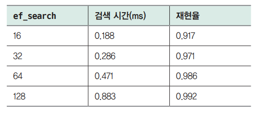

# **벡터 데이터베이스로 확장하기: RAG 구현하기**
RAG에서 데이터를 저장하고 검색할 때 저장소 역할을 하는것이 벡터 데이터베이스다. 챗GPT의 출시 이후 벡터 데이터베이스에 대한 관심이 높아지면서 
선택할 수 있는 벡터 데이터베이스의 수가 빠르게 늘고 있다.  
  
벡터 검색을 수행하는 가장 기본적인 방법은 모든 벡터 사이의 거리를 계산하는 KNN(K-Nearest Neighbor)검색이다. 하지만 KNN 검색은 데이터의 수가 
많아지면 느려지는데 이런 문제를 극복하기 위한 ANN(Approximate Nearest Neighbor)검색 방식이 있다. 다양한 ANN 검색 알고리즘 중에서 가장 많이 
활용되는 HNSW(Hierarchical Navigable Small World) 알고리즘이 있다.  
  
아래 명령어를 실행해 라이브러리 설치  
!pip install pinecone-client==3.2.2 sentence-transformers==2.7.0 datasets==2.19.0 faiss-cpu==1.8.0 transformers==4.40.1 openai==1.25.2 llama-index==0.10.34 llama-index-vector-stores-pinecone==0.1.6  -qqq  
  
# **벡터 데이터베이스란**  
벡터 데이터베이스란 벡터 임베딩을 키로 사용하는 데이터베이스를 말한다. 벡터 임베딩은 '데이터의 의미를 담은 숫자 배열(벡터)'이다.  
  
  
  
모든 데이터는 적절한 임베딩 모델만 있다면 임베딩으로 변환할 수 있는데 위 그림과 같이 텍스트, 이미지, 음성과 같은 비정형(unstructured) 데이터는 
물론이고 서비스에서 판매하는 상품이나 서비스를 사용하는 사용자도 임베딩 모델을 통해 벡터로 표현할 수 있다. 데이터를 적절한 임베딩 모델을 통해 
임베딩 벡터로 변환헀다면 이제 벡터 데이터베이스에 저장하고 임베딩 벡터의 거리 계산을 통해 유사하거나 관련이 깊은 데이터를 검색할 수 있다. 벡터 
데이터베이스는 벡터 사이의 거리 계싼에 특화된 데이터베이스라고 할 수 있다.  
  
  
  
예를 들어 위 그림과 같은 동물 이미지가 있을 때 개인지 고양이인지, 또 어떤 색상인지 분류해야 한다고 해보자. 그러면 기존의 머신러닝에서는 사람이 
직접 '고양이는 귀가 뾰족하다'거나 '고양이는 수염이 있다'는 특징을 정의해서 모델에 입력해야 했다. 위 그림은 모두 동물이 정면을 바라보는 이미지이지만, 
만약 동물이 다양한 방향을 보고 있다면 이미지에서 정의하기도 쉽지 않다. 또 목표로 하는 작업이 달라지면(예: 새로운 동물의 추가) 매번 새롭게 특징을 
정의하는 단계가 필요하기 때문에 시간이 오래 걸리고 확장성이 떨어졌다. 딥러닝에서는 데이터만 충분하다면 모델이 알아서 이런 특징을 뽑는 과정도 학습하는데 
이를 표현 학습(representation learning)이라고 한다.  
  
  
  
딥러닝 모델은 동물 이미지 분류를 위해 학습되는 과정에서 데이터의 특징을 추출하는 방법을 함께 학습한다. 제대로 표현 학습이 수행된 딥러닝 모델로 
데이터의 특징을 숫자로 표현한 임베딩을 공간상에 배치하면 위 그림의 오른쪽 그림과 같이 색상과 종이 같은 입력 데이터는 가깝게 모여 있고 다른 데이터끼리는 
멀게 위치해서 구분할 수 있게 된다.  
  
  
  
비슷한 데이터는 가깝게 있고 다른 데이터는 멀리 위치하게 되는 임베딩 벡터의 특징을 이용하면 임베딩 벡터 사이의 거리를 계산해서 서로 비슷한 데이터를 
찾을 수 있다. 벡터 데이터베이스는 이런 임베딩 벡터의 특징을 이용하기 위한 목적으로 개발됐다. 벡터 데이터베이스를 활용하기 위한 단계는 위 그림과 같이 
세 단계로 나뉜다.  
  
1. 저장: 저장할 데이터(예: 문서)를 임베딩 모델을 거쳐 벡터로 변환하고 벡터 데이터베이스에 저장한다.  
2. 검색: 검색할 데이터(예: 검색 쿼리)를 임베딩 모델을 거쳐 벡터로 변환하고 벡터 데이터베이스에서 검색한다.  
3. 결과 반환: 벡터 데이터베이스에서는 검색 쿼리의 임베딩과 거리가 가까운 벡터를 찾아 반환한다.  
  
이 방식을 사용하면 검색 쿼리와 거리가 가장 가까운 벡터를 찾을 수 있는데 앞서 언급한 대로 가장 가까운 벡터는 가장 유사한 데이터를 의미한다. 벡터 사이의 
거리를 측정하는 다양한 방법이 있는데 일반적으로 유클리드 거리, 코사인 유사도, 점곱(dot product, 내적)을 가장 많이 활용한다. 딥러닝 기술이 
폭넓게 활용되면서 데이터의 특징을 추출한 임베딩을 활용하는 경우가 많아졌고 임베딩을 저장하고 관리하는 기능에 특화된 벡터 데이터베이스의 필요성이 커지면서 
여러 벡터 데이터베이스가 등장했다. 대표적으로 이미지 검색과 같이 비정형 데이터의 유사성을 기반으로 검색을 제공하는 서비스(예: 핀터레스트)나 사용자가 구매한 
상품과 유사한 상품을 추천하는 추천 시스템을 구현할 때 벡터 임베딩을 활용한다.  
  
벡터 데이터베이스는 2022년 말 챗GPT가 출시된 이후 폭발적으로 많은 관심을 받고 있고 지금은 대부분의 데이터베이스에 벡터 검색 기능이 추가되고 있다. 
그 이유는 임베딩 벡터의 유사도를 기반으로 한 문서 검색을 활용하는 RAG가 LLM의 환각 현상을 줄이고 학습 없이도 최신 정보를 추가하는 핵심 기법으로 
활용되기 떄문이다.  
  
# **벡터 데이터베이스 지형 파악하기**  
  
  
벡터 임베딩을 저장하고 검색하는 기능을 구현하려고 할 때 다양한 소프트웨어를 접하게 된다. 이때 만나는 소프트웨어는 크게 위 그림과 같이 세 가지로 
구분할 수 있다. 먼저 벡터 라이브러리로 메타의 Faiss, 스포티파이의 Annoy, 구글의 ScaNN, NMSLIB 등이 있으며 벡터를 저장하고 검색하는 핵심 기능을 
구현한 구현체라고 할 수 있다. 다음으로 벡터 전용 데이터베이스로 파인콘(Pinecone), 위비에이트(Weaviate), 밀버스(Milvus), 크로마(Chroma) 등이 
있다. 마지막으로 기존의 데이터베이스에 벡터 저장과 검색 기능을 추가한 일래스틱서치, PostgreSQL, MongoDB, Neo4j 등이 있다. 2023년 이후 벡터 
데이터베이스에 대한 관심이 커지면서 많은 데이터베이스가 벡터 기능을 추가하고 있다.  
  
벡터 라이브러리와 벡터 데이터베이스의 차이는 무엇일까? 벡터 라이브러리가 벡터의 저장과 검색 같은 벡터 데이터베이스의 핵심 기능을 제공하기 때문에 
둘 간의 차이가 처음에는 크게 느껴지지 않는다. 실제로 소규모 프로젝트에서는 벡터 라이브러리를 통해서도 충분히 벡터 검색 기능을 구현할 수 있다. 
하지만 벡터 데이터베이스는 저장과 검색 기능 외에도 다음과 같은 기능을 제공한다.  
  
- 메타 데이터의 저장 및 필터링 기능  
- 데이터의 백업 및 관리  
- 모니터링, 관련 AI 도구 등 에코시스템과의 통합  
- 데이터 보안과 액세스 관리  
  
따라서 간단히 벡터 저장과 검색 기능을 구현하거나 벡터 데이터베이스가 제공하는 부가 기능이 필요하지 않은 경우 벡터 라이브러리를 통해 벡터 연산을 
수행해도 괜찮지만 그렇지 않다면 벡터 데이터베이스를 활용하는 것이 좋다.  
  
  
  
이제 데이터베이스로 좁혀 지형을 파악하자면 위 그림과 같이 크게 구분할 수 있다. 그림 왼쪽은 벡터 전용 데이터베이스이며 오른쪽은 벡터 이외의 데이터도 
다룰 수 있는 데이터베이스다. 그림 위쪽은 오픈소스 데이터베이스이고 아래쪽은 상업 서비스를 제공하는 제품이다.  
  
벡테 데이터베이스 도입을 고려하는 경우 위 그림의 기준을 통해 네 가지로 경우를 나눠 선택할 수 있다. 먼저 고급 벡터 검색이 필요하고 워크로드가 큰
(데이터 수, 차원 수 등) 경우 그림 왼쪽의 벡터 전용 데이터베이스를 선택하는 것이 좋다. 벡터 전용 데이터베이스는 벡터 저장과 검색 관련 기능과 
그 최적화에 집중하기 때문에 벡터 데이터 처리에 더 뛰어난 경우가 많다. 다음으로 벡터 데이터베이스에 대해 이해도가 있고 직접 오픈소스 서비스를 활용해 
시스템을 구축할 수 있고 선호한다면 그림 왼쪽 위의 오픈소스 벡터 데이터베이스가 좋은 선택이 될 수 있다. 만약 그렇지 않다면 제품 형태로 제공하는 
그림 왼쪽 아래의 벡터 데이터베이스를 활용하는 것이 좋다.  
  
그림 오른쪽의 벡터 기능을 추가한 데이터베이스의 경우 벡터 이외의 데이터 형태를 처리할 수 있다는 점에서 벡터 전용 데이터베이스 대비 큰 장점이 있다. 
또 비교적 최근에 등장한 벡터 전용 데이터베이스(파인콘과 위비에이트가 2019년 등장)에 비해 PostgreSQL, 일래스틱서치, 레디스 등은 더 오랜 역사를 
지니고 있고 엔터프라이즈 규모에서 필요한 다양한 기능을 갖추고 있다. 따라서 벡터 검색 기능을 무겁게 사용하지 않고 기존에 이미 도입한 데이터베이스가 있는 
경우 해당 데이터베이스가 벡터 기능을 지원하는지 확인해 활용하는 것이 좋은 선택일 수 있다. 그림 오른쪽의 위와 아래는 오픈소스와 제품이라는 차이도 있지만 
각 데이터베이스가 처리하는 데이터의 유형에도 차이가 있어 함께 활용할 데이터 형식에 따라 선택하는 것이 좋다.  
  
# **벡터 데이터베이스 작동 원리**  
벡터 데이터베이스는 벡터 사이의 거리를 계산해서 유사한 벡터를 찾는다. 벡터 사이의 거리를 계산해 유사한 벡터를 찾는 가장 기본적인 방법은 KNN
(K-Nearest Neighbor)검색으로 저장된 모든 임베딩 벡터를 조사해 가장 유사한 K개의 벡터를 반환하는 방법이다. KNN 검색 방식의 한계를 극복하기 위해 
사용되는 ANN(Approximate Nearest Neighbor)알고리즘이 있다. 대표적인 ANN 알고리즘 중 하나는 HNFW다.  
  
# **KNN 검색과 그 한계**  
KNN 검색은 검색하려는 벡터와 가장 가까운 K개의 이웃 벡터를 찾는 검색 방식을 말한다. KNN은 직관적이고 모든 데이터를 조사하기 때문에 정확하다는 
장점이 있지만 모든 벡터를 조사하기 떄문에 연산량이 데이터 수에 비례하게 늘어나 속도가 느려지기 때문에 확장성이 떨어진다는 한계가 있다. 이를 확인하기 
위해 다음 실습에서 100만개의 128차원 임베딩 데이터인 SIFT1M 데이터셋을 활용해 데이터 수가 증가할 때 검색 시간이 어떻게 달라지는지 확인해 본다. 
SIFT1M 데이터셋에 대한 더 많은 정보는 SIFT1M 데이터셋 다운로드 페이지(http://corpus-texmex.irisa.fr/)에서 확인할 수 있다.  
  
벡터 검색을 위해서는 먼저 인덱스를 만들어야 한다. 인덱스는 관계형 데이터베이스의 테이블과 비슷한 레벨로 볼 수 있다. 인덱스에 벡터를 저장하는데. 
이렇게 벡터를 저장하는 과정을 '색인한다'라고 표현한다.  
  
  
  
벡터 검색에서는 중요한 성능 지표가 몇 가지 있는데 위 그림에서 확인할 수 있듯이 색인 단계에서는 인덱스의 메모리 사용량과 색인 시간이 중요하고 검색 
단계에서는 검색 시간과 재현율이 중요하다. 재현율(recall)이란 실제로 가장 가까운 K개의 정답 데이터 중 몇 개가 검색 결과로 반환됐는지 그 비율을 
나타낸 값이다. KNN 검색은 모든 벡터와 거리를 측정해 결과를 반환하기 때문에 재현율은 100%이다. 아래의 KNN 검색 실습에서는 데이터가 늘어날 때 
메모리 사용량, 색인 시간, 검색 시간이 어떻게 변하는지를 중심으로 살펴본다.  
  
먼저 아래 예제의 명령을 통해 필요한 데이터를 내려받는다. wget 명령에 앞서 언급한 SIFT1M 다운로드 링크를 입력해 데이터 압축 파일을 내려받는다. 
다음으로 tar 명령을 사용해 압축 파일의 압축을 해제한다. mkdir 명령으로 data/sift1M 폴더를 생성하고 압축 해제한 SIFT1M 데이터셋을 mv 명령을 통해 
생성한 폴더에 저장한다.  
  
chapter12.ipynb 파일에서 실습 데이터 다운로드 참조  
  
다음으로 아래 예제를 실행해 메모리 사용량을 확인할 때 사용할 유틸리티 함수를 정의하고 내려받은 데이터를 불러온다. get_memory_usage_mb 함수는 현재 
프로세스가 사용하는 메모리 사용량을 메가바이트 단위로 반환한다. faiss 라이브러리에서 제공하는 DatasetSIFT1M 클래스를 사용해 내려받은 SIFT1M 
데이터셋을 불러온다. 데이터셋의 get_queries, get_database, get_groundtruth 메서드를 사용해 검색에 사용할 데이터와 저장된 벡터 데이터, 실제 
정답 데이터를 불러온다.  
  
chapter12.ipynb 파일에서 실습 데이터 불러오기 참조  
  
아래 예제를 통해 데이터를 200000개에서 1000000개까지 점차적으로 늘리면서 메모리 사용량, 색인 시간, 검색 시간이 어떻게 달라지는지 확인한다. 빠른 
실습 진행을 위해 검색할 데이터 수는 1000개로 제한한다. 저장하는 데이터 수를 range를 사용해 점차 늘리면서 IndexFlatL2 클래스로 인덱스를 만들고 
add 메서드로 임베딩 벡터를 색인한다. 마지막으로 search 메서드를 사용해 검색을 수행한다.  
  
chapter12.ipynb 파일에서 데이터가 늘어날 때 색인/검색 시간, 메모리 사용량 변화 참조  
  
  
  
출력된 결과를 정리하면 위 표와 같다. 데이터가 늘어나면서 색인 시간이 증가하고 메모리 사용량도 약 97MB 정도 지속적으로 증가하는 것을 확인할 수 
있다. 검색 시간도 600000개일 때 약간 튀긴 했지만 전체적으로 데이터양에 따라 함께 거의 선형적으로 증가하고 있다. KNN 검색의 경우 인덱스에 더 빠른 
검색을 위한 별도의 데이터를 저장하지 않기 때문에 메모리 사용량이 적고 색인 시간도 거의 무시할 정도의 시간이 걸린다. 200000개의 데이터를 추가할 때 
증가하는 메모리 사용량(약 97MB)은 200000개 128차원 벡터의 순수 용량과 거의 같다(200000 * 128 * 4(바이트)는 약 97.65MB이다).  
  
이번 실습에서 사용한 SIFT1M 데이터는 128차원의 벡터를 사용하는데 벡터의 차원이 커지면 검색에 더 오랜 시간이 걸린다. BERT 모델이 768차원의 
임베딩을 사용하고 OpenAI의 text-embedding-ada-002는 1536차원의 임베딩을 사용하는데 이렇게 벡터 차원이 커지면 검색 속도가 느려진다. KNN 
검색에서 정확도를 일정 부분 희생하더라도 속도를 높이기 위해 다양한 기술이 개발됐는데 이런 기술을 통칭 ANN이라고 부른다.  
  
# **ANN 검색이란**  
근사 최근접 이웃(Approximate Nearest Neighbor, ANN) 검색은 대용량 데이터셋에서 주어진 쿼리 항목과 가장 유사한 항목을 효율적으로 찾는 데 
사용되는 기술이다. 최근접 이웃 검색과 달리 ANN 검색은 약간의 정확도를 희생하는 대신 훨씬 더 빠른 검색 속도를 제공한다. 실제 응용 사례에서는 
데이터셋의 크기가 크고 고차원의 데이터를 다루는 경우가 많기 때문에 ANN 검색에 대해 잘 이해하고 활용할 수 있어야 한다.  
  
KNN 검색이 확장설이 떨어지는 이유는 저장된 모든 벡터를 비교하면서 거리를 계산하기 때문인데 KNN 검색의 한계를 극복하기 위해 ANN은 임베딩 벡터를 
빠르게 탐색할 수 있는 구조로 저장해서 검색 시 탐색할 범위를 좁히는 데 집중한다. 대표적인 ANN 알고리즘은 IVF(Inverted File Index), HNSW
(Hierarchical Navigable Small World)등이 있다.  
  
IVF는 검색 공간을 제한하기 위해 데이터셋 벡터들을 클러스터로 그룹화하는 근사 최근접 이웃 검색 알고리즘이다. 인덱싱 시점에 IVF는 데이터를 가져와서 
중심점(유사한 벡터들의 클러스터)을 형성한다. 쿼리 시점에는 먼저 가장 가까운 중심점을 찾은 다음, 해당 중심점 내에서 가장 가까운 데이터 포인트를 
찾음으로써 가장 가까운 데이터 포인트를 찾는다. 전체 데이터셋 대신 몇 개의 클러스터만 검색하는 것이 IVF의 전략으로 검색되지 않은 클러스터에 할당된 
일부 이웃을 놓칠 수 있다는 비용을 감수하면서도 검색 시간을 크게 향상시킬 수 있다.  
  
HNSW는 효율적인 ANN 검색을 위한 그래프 기반 인덱싱 구조다. 상위 계층에는 연결이 적고 하위 계층에는 연결이 밀집된 다층 그래프를 구축한다. 최상위 
계층에는 연결이 적기 때문에 데이터 사이의 거리가 먼데, 한 번에 먼 거리를 이동할 수 있기 때문에 그래프를 더 바르게 탐색할 수 있게 된다. 각 하위 
계층에는 더 많은 연결이 추가되기 때문에 더 꼼꼼한 탐색이 가능하다. 검색은 최상위 계층에서 시작한 다음 검색을 구체화하기 위해 아래 계층으로 이동한다. 
HNSW는 가장 많이 활용되는 ANN 검색 알고리즘이다.  
  
탐색 속도를 높이기 위해 ANN 기법들은 각자의 방법으로 거리 계산을 수행할 벡터의 범위를 좁힌다. 반대로 계산 범위를 좁히다 보면 거리가 가까운 벡터도 
놓치는 경우가 발생하는데 그러면 재현율이 떨어진다. 각 기법에서 설정해야 하는 파라미터는 속도와 검색 성능(재현율) 사이를 절충해서 결정하기 때문에 
파라미터의 의미를 잘 이해해야 한다.  
  
여기서 재현율이란 실제 정답이 예측한 정답에 얼마나 많이 포함돼 있는지 평가하는 지표다.  
  
재현율 = (예측 중 정답에 해당하는 수) / (실제 정답의 수)  
  
ANN 검색에서 재현율의 의미는 다음과 같다. 아래 수식에서 K는 검색할 근접 데이터의 수다.  
  
ANN 검색의 재현율 = (KNN으로 찾은 실제 가장 가까운 K개 중 ANN이 찾은 개수) / K  
  
다양한 ANN 검색 방식이 있지만 그래프를 활용하는 HNSW는 탐색 속도가 빠르면서 검색 성능이 뛰어나 가장 많이 활용되고 있다. HNSW의 이름은 탐색 
가능한 작은 세계(Navigable Small World, NSW)와 계층 구조(hierarchy)를 결합한 것이다.  
  
# **탐색 가능한 작은 세계(NSW)**  
  
  
HNSW는 그래프 기반의 ANN 검색 알고리즘인데 그래프는 위 그림과 같이 노트(node)와 간선(edge)으로 이뤄진다. 여기서 노드는 저장하는 데이터를 의미하고 
벡터 데이터베이스에서는 벡터 임베딩이 노드가 된다. 간선은 노드와 노드를 연결하는 선으로 간선을 통해 서로 연결된 노드끼리만 탐색이 가능하기 때문에 
노드와 노드 사이에 얼마나 많은 간선을 연결할지가 검색 성능과 검색 속도에 영향을 미친다.  
  
  
  
탐색 가능한 작은 세계란 완전히 랜덤한 그래프(그림 a)와 완전히 규칙적인 그래프(그림 c)사이에 '적당히 랜덤하게'연결된 그래프 상태(그림 b)를 말한다. 
그래프가 적당히 랜덤하게 연결되면 어떤 점이 좋을까? 완전히 규칙적인 그래프는 그래프 안의 모든 노드가 서로 연결되기 떄문에 정확하게 탐색할 수 
있다는 장점이 있지만 촘촘하게 연결돼 있기 때문에 탐색 과정에 많은 단계를 거쳐야 하고 검색 시간이 길어진다는 단점이 있다. 완전히 랜덤인 그래프는 
노드의 연결 상태에 따라 빠르게 탐색할 수 있는 경우도 있지만 서로 연결되지 않은 노드가 있는 경우 탐색할 수 없고 경우에 따라서는 오히려 더 느리게 탐색될 
수 있다. 탐색 가능한 작은 세계는 규칙적인 연결에서 일부 연결만 랜덤하게 바꾼 형태로 규칙적인 연결을 통해 정확한 탐색이 가능하면서도 랜덤한 성질을 
통해 빠른 탐색이 가능해진다는 특징이 있다.  
  
  
  
이해를 돕기 위해 그래프의 형태를 바꿔서 설명하면 그래프 안의 모든 점이 완전히 규칙적으로 연결된 그림 c는 위 그림처럼 그릴 수 있다. 규칙적으로 
연결된 경우 가장 가까운 노드로 한 칸씩 이동하면서 탐색하기 떄문에 검색하려는 벡터와 가장 가까운 점을 정확히 찾을 수 있다는 장점이 있지만 많은 
단계를 거쳐야 하기 떄문에 시간이 오래 걸린다. 위 그림에서는 쿼리 벡터와 가까운 노드를 찾기 위해 5번의 이동(녹색 선)을 거쳐야 했다.  
  
  
  
위 그림은 완전히 규칙적인 연결 상태에서 몇 개의 간선을 끊고 랜덤 간선을 추가한 탐색 가능한 작은 세계를 나타낸다. 그림 b와 같은 상태라고 할 수 있다.  
랜덤으로 연결된 간선은 한 번에 더 긴 거리의 탐색을 가능하도록 만든다. 위 그림에서는 두 번의 탐색 단계 만에 쿼리 벡터와 가장 가까운 노드를 찾았다. 
탐색 가능한 작은 세계는 이런 직관을 바탕으로 한다.  
  
  
  
이렇게 탐색 단계를 줄여주는 랜덤 연결을 만들기 위해 탐색 간으한 작은 세계에서는 벡터의 순서를 랜덤으로 섞어 저장하는 방식을 사용한다. 하지만 
랜덤으로 저장하다 보니 위 그림과 같이 진입점에서 출발했을 때 찾으려는 검색 벡터(Q)와 가장 가까운 점(E)이 아닌 점 A에서 탐색을 멈추는 지역 최솟값
(local minimum)문제가 있었다. 이런 문제를 해결하기 위해 계층 구조를 추가했다.  
  
# **계층 구조**  
  
  
위 그림과 같은 연결 리스트(linked list)가 있다고 하자. 연결 리스트는 많이 활용되는 자료구조로 새로운 데이터를 추가하거나 삭제할 때 서로를 
연결하는 주소 정보를 추가하거나 삭제하면 되기 떄문에 데이터의 추가/삭제가 자유롭다는 장점이 있다. 하지만 탐색을 할 때는 앞에서부터 순차적으로 
확인해야 하기 떄문에 탐색 속도가 느리다는 단점이 있다.  
  
  
  
그러면 어떻게 탐색 속도를 높일 수 있을까? 데이터가 크기순으로 정렬되어 있다면 위 그림과 같은 방식으로 탐색 단계를 줄일 수 있다. 레벨 0에는 모든 
데이터가 있도록 하고 레벨 1, 레벨 2로 갈수록 데이터를 듬성듬성 배치한다. 탐색은 가장 위층부터 시작한다. 91을 찾는다고 할 때 레벨 2에서는 68에서 
멈춘다. 레벨 2에서 한 칸을 더 가면 None으로 가기 때문에 레벨 1로 내려온다. 레벨 1에서는 바로 77을 건너뛰고 88에서 멈춘다. 다음 칸은 96이기 떄문에 
찾고자 하는 91을 지나치기 떄문이다. 마지막으로 모든 데이터가 있는 레벨 0까지 내려오면 다음 칸에서 91을 찾을 수 있다. 만약 레벨 0에서 순차적으로 
탐색했다면 8단계 만에 91을 찾는다. 하지만 위 그림과 같은 스킵 리스트를 활용하면 3단계 만에 91을 찾을 수 있다.  
  
  
  
HNSW는 이런 계층 구조를 NSW에 접목해 위 그림과 같이 여러 계층에 그래프를 배치하는 방식으로 벡터르 저장한다. 위 그렘에서 레벨 0에는 모든 벡터를 
저장한다. 그리고 레벨 1, 레벨 2로 갈수록 적은 데이터만 저장한다. 스킵 리스트와 마찬가지로 높은 층에 있는 데이터는 그보다 낮은 층에 항상 존재한다. 
그렇다면 높은 층에 벡터를 저장할지 말지 어떻게 결정할까? 실제로는 더 복잡하지만 다음과 같은 방식으로 정한다.  
  
- 최대가 6인 주사위를 굴려서 6이 나오면 0, 1, 2층 모두 배치한다.  
- 주사위를 굴려서 4 ~ 5가 나오면 0, 1층에 배치한다.  
- 주사위를 굴려서 1, 2, 3이 나오면 0층에만 배치한다.  
  
이렇게 확률을 이용해 높은 층으로 갈수록 데이터가 적어지는 구조를 만든다. 그러면 높은 층에 있는 벡터는 NSW에서 일부 랜덤 연결이 탐색 단계를 줄인 
것처럼 탐색 단계를 줄여준다. 그러면서도 낮은 층에는 모든 벡터가 저장돼 있기 떄문에 지역 최솟값에 빠질 위험을 줄일 수 있다.  
  
# **실습: HNSW 인덱스의 핵심 파라미터 이해하기**  
HNSW 인덱스의 경우 하나의 벡터에 연결하는 최소 연결 수(m), 색인 과정에서 가장 가까운 M개를 선택하기 위해 저장하는 후보의 수(ef_construction), 
검색 과정에서 가장 가까운 K개를 선택할 때 저장하는 후보의 수(ef_search) 세 가지 파라미터로 메모리 사용량, 색인 시간, 재현율, 검색 시간이 달라진다.  
  
# **파라미터 m 이해하기**  
HNSW에서 파라미터 m은 추가하는 임베딩 벡터에 연결하는 간선의 수다. 벡터에 연결되는 간선이 많을수록 그래프가 더 촘촘하게 연결되기 때문에 검색의 
품질(재현율)이 좋아진다. 하지만 더 많은 연결을 생성하고 정보를 저장해야 하기 때문에 메모리 사용량이 커지고 색인 시간이 길어진다. 또한 탐색 과정에서 더 
많은 간선을 고려하기 때문에 검색 시간도 증가한다.  
  
아래 예제는 파라미터 m이 색인과 검색 성능에 어떤 영향을 미치는지 확인하는 코드다. 반복문을 통해 m을 8, 16, 32, 64로 키운다. faiss 라이브러리에서는 
HNSW 인덱스를 생성할 수 있는 IndexHNSWFlat 클래스를 지원한다. HNSW 인덱스를 생성하면서 m 파라미터를 설정한다. 예제를 실행하면 m 값을 변경하면서 
색인 시간과 메모리 사용량, 재현율과 검색 시간을 측정한다.  
  
chapter12.ipynb 파일에서 파라미터 m의 변경에 따른 성능 확인 참조  
  
  
  
위의 코드를 실행해 출력된 결과를 정리하면 위 표와 같다. 예제에서는 별도로 ef_construction과 ef_search를 지정하지 않아 기보낪을 사용하는데 
faiss의 기본 설정을 보면 ef_construction은 40, ef_search는 16이다. 결과를 확인해 보면 m이 커지면서 재현율이 크게 증가한다. 또한 메모리 사용량이 
증가하고 색인과 검색 시간이 길어졌다. 주목할 만한 부분은 m을 64로 설정했을 때 검색 시간이 0.237ms밖에 걸리지 않는데 KNN과 비교했을 때 93.2% 
정도는 정확하게 가장 가까운 벡터를 찾았다. KNN을 사용했을 때는 검색에 약 7.6ms가 걸렸으니 30배 이상 빨라진 것이다.  
  
HNSW 인덱스를 생성할 떄는 KNN과 달리 탐색 속도를 높일 수 있도록 그래프 구조를 저장하기 때문에 메모리를 추가로 사용하고 색인에 오랜 시간이 걸린다. 
표를 보면 백만 개의 벡터를 저장할 때 필요한 메모리는 약 488MB이다. 위 표에서 m을 64로 설정하면 두 배 이상의 메모리르 사용한다. m은 보통 5 ~ 48 
정도의 값을 사용하는데 메모리가 허용하는 선에서는 값을 키워 검색 품질을 높이는 것이 유리하다.  
  
# **파라미터 ef_construction 이해하기**  
인덱스에 새로운 벡터를 추가하는 경우 검색할 때와 유사하게 추가한 벡터와 가장 가까운 벡터를 탐색한다. 이때 ef_construction은 M개의 가장 가까운 
벡터를 선택할 후보군의 크기로, ef_construction이 크면 더 많은 후보를 탐색하기 때문에 실제로 추가한 벡터와 가장 가까운 벡터를 선택할 가능성이 
높아진다. 즉 생성하는 그래프의 품질이 좋아진다. 따라서 ef_construction이 커지면 재현율이 올라간다. 하지만 더 많은 후보를 탐색하기 때문에 색인 
시간이 증가한다. 메모리 사용량과 검색 시간은 크게 영향받지 않는다.  
  
아래 예제는 ef_construction을 40, 80, 160, 320으로 증가시키면서 색인과 검색에 어떤 영향을 미치는지 확인한다. faiss에서 HNSW 인덱스의 ef_construction은 
index.hnsw.efConstruction 속성으로 설정한다.  
  
chapter12.ipynb 파일에서 ef_construction을 변화시킬 때 성능 확인 참조  
  
  
  
위의 코드를 실행했을 때 출력된 결과를 정리하면 위 표와 같다. ef_construction이 증가하면서 재현율이 증가하고 색인 시간도 함께 증가한다. 메모리 
사용량과 검색 시간은 크게 영향받지 않는다. ef_construction이 80일 때의 재현율이 ef_construction이 40일 때보다 낮아졌는데 그래프 생성 시 랜덤성이 
들어가기 때문에 결과가 언제나 의도한 대로 나타나지는 않는다. 나머지 실험에서는 재현율이 증갛는 패턴을 확인할 수 있다. ef_search는 기본 설정인 
16을 사용했다. 다음 절에서는 ef_construction을 320으로 둔 상태로 ef_search를 변경해 본다.  
  
# **파라미터 ef_search 이해하기**  
ef_search는 ef_construction이 색인 단계에서 후보군의 크기를 결정한 것과 동일하게 검색 단계에서 후보군의 크기를 결정한다. 후보군이 커지면 더 
많은 벡터를 탐색하고 결과적으로 재현율이 높아진다. 하지만 더 많은 벡터를 탐색하기 때문에 검색 시간이 길어진다.  
  
아래 예제에서는 이전 절의 실습에 이어서 ef_search를 16, 32, 64, 128로 증가시키면서 검색 시간과 재현율을 확인한다. ef_search는 색인과는 
관련이 없기 떄문에 메모리 사용량이나 색인 시간에는 영향을 주지 않는다. faiss 라이브러리에서는 ef_search 인자를 index.hnsw.efSearch 속성을 
통해 설정할 수 있다.  
  
chapter12.ipynb 파일에서 ef_search 변경에 따른 성능 확인 참조  
  
  
  
위의 코드를 실행했을 때 출련된 결과를 정리하면 위 표와 같다. ef_search를 32 이상으로 설정했을 때 재현율 0.97 이상을 달성했다. 검색 시간은 1ms 
미만으로 KNN이 약 7.6ms가 걸렸던 것에 비하면 약 10배 이상 빠르다.  
  
# **실습: 파인콘으로 벡터 검색 구현하기**  
파인콘은 대표적인 벡터 데이터베이스 중 하나다.  
  
# **파인콘 클라이언트 사용법**  
  
  
파인콘을 사용하기 위해서는 계정과 API 키가 필요하다. 계정은 파인콘 사이트(https://www.pinecone.io/)에서 회원가입을 통해 생성할 수 있다. 
생성한 계정으로 로그인하면 콘솔 창에서 API Keys 탭을 선택해 위 그림과 같이 API 키를 확인할 수 있다.  
  
다음으로 데이터를 저장할 인덱스를 생성한다. 인덱스는 파인콘 웹 UI에서 생성할 수도 있고 아래 예제의 코드로 생성할 수도 있다. 파인콘 라이브러리의 
Pinecone 클래스에 API키를 입력으로 전달해 생성한 파인콘 계정에 접근한다. 다음으로 인덱스의 이름과 입력할 임베딩 벡터의 차원 수를 설정해 인덱스를 
생성한다. 아래 예제에서는 인덱스 이름을 llm-book으로, 임베딩 벡터의 차원 수를 768로 설정했다. 다음으로 Index 클래스에 생성한 인덱스의 이름을 
입력해 사용할 인덱스를 불러온다.  
  
chapter12.ipynb 파일에서 파인콘 계정 연결 및 인덱스 생성 참조  
  
저장할 인덱스를 만들었으니 아래 예제의 코드로 임베딩을 생성한다. 먼저 SentenceTransformer 클래스를 사용해 한국어 임베딩 모델을 불러온다. 
다음으로 실습에 사용할 KLUE DP 데이터셋을 datasets 라이브러리의 load_dataset 함수로 불러온다. 마지막으로 임베딩 모델의 encode 메서드를 사용해 
실습 데이터셋 sentence 컬럼의 텍스트를 텍스트 임베딩으로 변환한다.  
  
chapter12.ipynb 파일에서 임베딩 생성 참조  
  
다음으로 아래 예제의 코드로 파인콘 인덱스에 저장할 수 있도록 형태를 변경한다. 이 코드에서 embeddings는 넘파이 라이브러리의 데이터 타입인데 
tolist() 메서드를 사용해 파이썬 기본 리스트 형식으로 변경한다. 파인콘 인덱스에 저장하기 위해서는 예제에 주석 처리한 대로 "id", "values", 
"metadata"로 구성된 사전 형식으로 데이터를 변환해야 한다. 따라서 실습 데이터와 임베딩 벡터를 결합해 insert_data 리스트에 저장한다.  
  
chapter12.ipynb 파일에서 파인콘 입력을 위한 데이터 형태 변경 참조  
  
마지막으로 아래 예제를 통해 준비한 임베딩 데이터를 upsert 메서드를 통해 파인콘 인덱스에 저장한다. 이때 네임스페이스(namespace)를 지정하는데 
파인콘에서는 하나의 인덱스 안에서도 여러 네임스페이스를 구분할 수 있다. 아래 예제에서는 네임스페이스를 llm-book-sub로 지정했다.  

chapter12.ipynb 파일에서 임베딩 데이터를 인덱스에 저장 참조  
  
저장한 데이터를 검색할 때는 아래 예제와 같이 query 메서드를 사용한다. 이때 인자로 검색할 네임스페이스와 몇 개의 결과를 검색할지(top_k), 검색 
결과에 포함시킬 데이터 종류(include_values 또는 include_metadata), 마지막으로 검색할 벡터(vector)를 전달한다.  
  
chapter12.ipynb 파일에서 인덱스 검색하기 참조  
  
파인콘에서는 아래 예제와 같은 방식으로 문서의 ID를 기반으로 데이터를 수정하고 삭제할 수 있다. 데이터를 수정하기 위해서는 update 메서드에 수정하려는 
문서의 아이디(id)와 변경할 값(values의 set_metadata)을 입력하면 된다. 삭제할 때는 delete 메서드에 삭제하려는 문서의 아이디와 네임스페이스를 
전달하면 된다. 파인콘 클라이언트 라이브러리를 활용하면 쉽게 벡터 데이터베이스의 CRUD를 수행할 수 있다.  
  
chapter12.ipynb 파일에서 파인콘에서 문서 수정 및 삭제 참조  
  
# **라마인덱스에서 벡터 데이터베이스 변경하기**  
9장에서 라마인덱스로 RAG를 구현하면서 라마인덱스의 기본 벡터 데이터베이스를 사용했다. 만약 파인콘이나 크로마 같은 벡터 데이터베이스를 사용하고 
싶다면 어떻게 할까? 라마인덱스에서는 다양한 벡터 데이터베이스와 쉽게 통합할 수 있는 기능을 지원한다. 아래 예제를 보면 파인콘을 사용하기 위한 기본 설정 
부분과 PineconeVectorStore와 StorageContext를 이용해 생성한 인덱스를 사용한다는 설정만 추가하면 파인콘을 RAG의 벡터 데이터베이스로 사용할 
수 있다.  
  
chapter12.ipynb 파일에서 라마인덱스에서 다른 벡터 데이터베이스 참조  
  
# **실습: 파인콘을 활용해 멀티 모달 검색 구현하기**  
최근 RAG를 위해 벡터 데이터베이스를 사용하는 경우가 많아지면서 기본적으로 텍스트 데이터를 임베딩으로 만드는 경우가 많지만 적절한 임베딩 모델만 있다면 
어떤 데이터든 임베딩 벡터로 만들 수 있다. 이번 절에서는 이미지와 텍스트를 동일한 벡터 공간에 임베딩으로 변환할 수 있는 CLIP(Contrastive Language-Image Pre-training)
모델을 사용해 입력한 이미지와 비슷한 이미지를 생성하는 기능을 파인콘 벡터 데이터베이스로 구현한다.  
  
