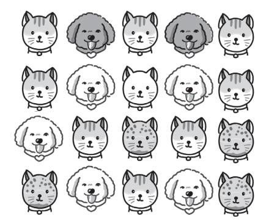

# **벡터 데이터베이스로 확장하기: RAG 구현하기**
RAG에서 데이터를 저장하고 검색할 때 저장소 역할을 하는것이 벡터 데이터베이스다. 챗GPT의 출시 이후 벡터 데이터베이스에 대한 관심이 높아지면서 
선택할 수 있는 벡터 데이터베이스의 수가 빠르게 늘고 있다.  
  
벡터 검색을 수행하는 가장 기본적인 방법은 모든 벡터 사이의 거리를 계산하는 KNN(K-Nearest Neighbor)검색이다. 하지만 KNN 검색은 데이터의 수가 
많아지면 느려지는데 이런 문제를 극복하기 위한 ANN(Approximate Nearest Neighbor)검색 방식이 있다. 다양한 ANN 검색 알고리즘 중에서 가장 많이 
활용되는 HNSW(Hierarchical Navigable Small World) 알고리즘이 있다.  
  
아래 명령어를 실행해 라이브러리 설치  
!pip install pinecone-client==3.2.2 sentence-transformers==2.7.0 datasets==2.19.0 faiss-cpu==1.8.0 transformers==4.40.1 openai==1.25.2 llama-index==0.10.34 llama-index-vector-stores-pinecone==0.1.6  -qqq  
  
# **벡터 데이터베이스란**  
벡터 데이터베이스란 벡터 임베딩을 키로 사용하는 데이터베이스를 말한다. 벡터 임베딩은 '데이터의 의미를 담은 숫자 배열(벡터)'이다.  
  
  
  
모든 데이터는 적절한 임베딩 모델만 있다면 임베딩으로 변환할 수 있는데 위 그림과 같이 텍스트, 이미지, 음성과 같은 비정형(unstructured) 데이터는 
물론이고 서비스에서 판매하는 상품이나 서비스를 사용하는 사용자도 임베딩 모델을 통해 벡터로 표현할 수 있다. 데이터를 적절한 임베딩 모델을 통해 
임베딩 벡터로 변환헀다면 이제 벡터 데이터베이스에 저장하고 임베딩 벡터의 거리 계산을 통해 유사하거나 관련이 깊은 데이터를 검색할 수 있다. 벡터 
데이터베이스는 벡터 사이의 거리 계싼에 특화된 데이터베이스라고 할 수 있다.  
  
  
  
예를 들어 위 그림과 같은 동물 이미지가 있을 때 개인지 고양이인지, 또 어떤 색상인지 분류해야 한다고 해보자. 그러면 기존의 머신러닝에서는 사람이 
직접 '고양이는 귀가 뾰족하다'거나 '고양이는 수염이 있다'는 특징을 정의해서 모델에 입력해야 했다. 위 그림은 모두 동물이 정면을 바라보는 이미지이지만, 
만약 동물이 다양한 방향을 보고 있다면 이미지에서 정의하기도 쉽지 않다. 또 목표로 하는 작업이 달라지면(예: 새로운 동물의 추가) 매번 새롭게 특징을 
정의하는 단계가 필요하기 때문에 시간이 오래 걸리고 확장성이 떨어졌다. 딥러닝에서는 데이터만 충분하다면 모델이 알아서 이런 특징을 뽑는 과정도 학습하는데 
이를 표현 학습(representation learning)이라고 한다.  
  
  
  
딥러닝 모델은 동물 이미지 분류를 위해 학습되는 과정에서 데이터의 특징을 추출하는 방법을 함께 학습한다. 제대로 표현 학습이 수행된 딥러닝 모델로 
데이터의 특징을 숫자로 표현한 임베딩을 공간상에 배치하면 위 그림의 오른쪽 그림과 같이 색상과 종이 같은 입력 데이터는 가깝게 모여 있고 다른 데이터끼리는 
멀게 위치해서 구분할 수 있게 된다.  
  
  
  
비슷한 데이터는 가깝게 있고 다른 데이터는 멀리 위치하게 되는 임베딩 벡터의 특징을 이용하면 임베딩 벡터 사이의 거리를 계산해서 서로 비슷한 데이터를 
찾을 수 있다. 벡터 데이터베이스는 이런 임베딩 벡터의 특징을 이용하기 위한 목적으로 개발됐다. 벡터 데이터베이스를 활용하기 위한 단계는 위 그림과 같이 
세 단계로 나뉜다.  
  
1. 저장: 저장할 데이터(예: 문서)를 임베딩 모델을 거쳐 벡터로 변환하고 벡터 데이터베이스에 저장한다.  
2. 검색: 검색할 데이터(예: 검색 쿼리)를 임베딩 모델을 거쳐 벡터로 변환하고 벡터 데이터베이스에서 검색한다.  
3. 결과 반환: 벡터 데이터베이스에서는 검색 쿼리의 임베딩과 거리가 가까운 벡터를 찾아 반환한다.  
  
이 방식을 사용하면 검색 쿼리와 거리가 가장 가까운 벡터를 찾을 수 있는데 앞서 언급한 대로 가장 가까운 벡터는 가장 유사한 데이터를 의미한다. 벡터 사이의 
거리를 측정하는 다양한 방법이 있는데 일반적으로 유클리드 거리, 코사인 유사도, 점곱(dot product, 내적)을 가장 많이 활용한다. 딥러닝 기술이 
폭넓게 활용되면서 데이터의 특징을 추출한 임베딩을 활용하는 경우가 많아졌고 임베딩을 저장하고 관리하는 기능에 특화된 벡터 데이터베이스의 필요성이 커지면서 
여러 벡터 데이터베이스가 등장했다. 대표적으로 이미지 검색과 같이 비정형 데이터의 유사성을 기반으로 검색을 제공하는 서비스(예: 핀터레스트)나 사용자가 구매한 
상품과 유사한 상품을 추천하는 추천 시스템을 구현할 때 벡터 임베딩을 활용한다.  
  
벡터 데이터베이스는 2022년 말 챗GPT가 출시된 이후 폭발적으로 많은 관심을 받고 있고 지금은 대부분의 데이터베이스에 벡터 검색 기능이 추가되고 있다. 
그 이유는 임베딩 벡터의 유사도를 기반으로 한 문서 검색을 활용하는 RAG가 LLM의 환각 현상을 줄이고 학습 없이도 최신 정보를 추가하는 핵심 기법으로 
활용되기 떄문이다.  
  
# **벡터 데이터베이스 지형 파악하기**  
  
  
벡터 임베딩을 저장하고 검색하는 기능을 구현하려고 할 때 다양한 소프트웨어를 접하게 된다. 이때 만나는 소프트웨어는 크게 위 그림과 같이 세 가지로 
구분할 수 있다. 먼저 벡터 라이브러리로 메타의 Faiss, 스포티파이의 Annoy, 구글의 ScaNN, NMSLIB 등이 있으며 벡터를 저장하고 검색하는 핵심 기능을 
구현한 구현체라고 할 수 있다. 다음으로 벡터 전용 데이터베이스로 파인콘(Pinecone), 위비에이트(Weaviate), 밀버스(Milvus), 크로마(Chroma) 등이 
있다. 마지막으로 기존의 데이터베이스에 벡터 저장과 검색 기능을 추가한 일래스틱서치, PostgreSQL, MongoDB, Neo4j 등이 있다. 2023년 이후 벡터 
데이터베이스에 대한 관심이 커지면서 많은 데이터베이스가 벡터 기능을 추가하고 있다.  
  
벡터 라이브러리와 벡터 데이터베이스의 차이는 무엇일까? 벡터 라이브러리가 벡터의 저장과 검색 같은 벡터 데이터베이스의 핵심 기능을 제공하기 때문에 
둘 간의 차이가 처음에는 크게 느껴지지 않는다. 실제로 소규모 프로젝트에서는 벡터 라이브러리를 통해서도 충분히 벡터 검색 기능을 구현할 수 있다. 
하지만 벡터 데이터베이스는 저장과 검색 기능 외에도 다음과 같은 기능을 제공한다.  
  
- 메타 데이터의 저장 및 필터링 기능  
- 데이터의 백업 및 관리  
- 모니터링, 관련 AI 도구 등 에코시스템과의 통합  
- 데이터 보안과 액세스 관리  
  
따라서 간단히 벡터 저장과 검색 기능을 구현하거나 벡터 데이터베이스가 제공하는 부가 기능이 필요하지 않은 경우 벡터 라이브러리를 통해 벡터 연산을 
수행해도 괜찮지만 그렇지 않다면 벡터 데이터베이스를 활용하는 것이 좋다.  
  
  
  
이제 데이터베이스로 좁혀 지형을 파악하자면 위 그림과 같이 크게 구분할 수 있다. 그림 왼쪽은 벡터 전용 데이터베이스이며 오른쪽은 벡터 이외의 데이터도 
다룰 수 있는 데이터베이스다. 그림 위쪽은 오픈소스 데이터베이스이고 아래쪽은 상업 서비스를 제공하는 제품이다.  
  
벡테 데이터베이스 도입을 고려하는 경우 위 그림의 기준을 통해 네 가지로 경우를 나눠 선택할 수 있다. 먼저 고급 벡터 검색이 필요하고 워크로드가 큰
(데이터 수, 차원 수 등) 경우 그림 왼쪽의 벡터 전용 데이터베이스를 선택하는 것이 좋다. 벡터 전용 데이터베이스는 벡터 저장과 검색 관련 기능과 
그 최적화에 집중하기 때문에 벡터 데이터 처리에 더 뛰어난 경우가 많다. 다음으로 벡터 데이터베이스에 대해 이해도가 있고 직접 오픈소스 서비스를 활용해 
시스템을 구축할 수 있고 선호한다면 그림 왼쪽 위의 오픈소스 벡터 데이터베이스가 좋은 선택이 될 수 있다. 만약 그렇지 않다면 제품 형태로 제공하는 
그림 왼쪽 아래의 벡터 데이터베이스를 활용하는 것이 좋다.  
  
그림 오른쪽의 벡터 기능을 추가한 데이터베이스의 경우 벡터 이외의 데이터 형태를 처리할 수 있다는 점에서 벡터 전용 데이터베이스 대비 큰 장점이 있다. 
또 비교적 최근에 등장한 벡터 전용 데이터베이스(파인콘과 위비에이트가 2019년 등장)에 비해 PostgreSQL, 일래스틱서치, 레디스 등은 더 오랜 역사를 
지니고 있고 엔터프라이즈 규모에서 필요한 다양한 기능을 갖추고 있다. 따라서 벡터 검색 기능을 무겁게 사용하지 않고 기존에 이미 도입한 데이터베이스가 있는 
경우 해당 데이터베이스가 벡터 기능을 지원하는지 확인해 활용하는 것이 좋은 선택일 수 있다. 그림 오른쪽의 위와 아래는 오픈소스와 제품이라는 차이도 있지만 
각 데이터베이스가 처리하는 데이터의 유형에도 차이가 있어 함께 활용할 데이터 형식에 따라 선택하는 것이 좋다.  
  
# **벡터 데이터베이스 작동 원리**  
벡터 데이터베이스는 벡터 사이의 거리를 계산해서 유사한 벡터를 찾는다. 벡터 사이의 거리를 계산해 유사한 벡터를 찾는 가장 기본적인 방법은 KNN
(K-Nearest Neighbor)검색으로 저장된 모든 임베딩 벡터를 조사해 가장 유사한 K개의 벡터를 반환하는 방법이다. KNN 검색 방식의 한계를 극복하기 위해 
사용되는 ANN(Approximate Nearest Neighbor)알고리즘이 있다. 대표적인 ANN 알고리즘 중 하나는 HNFW다.  
  
