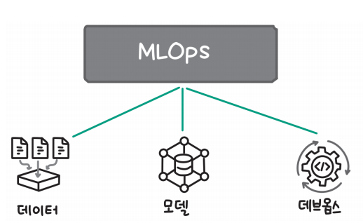
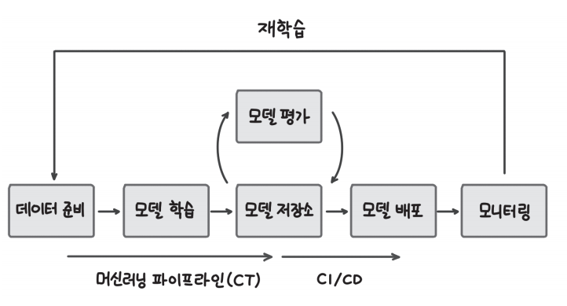
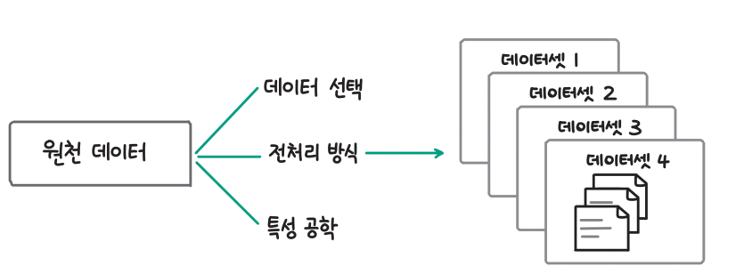
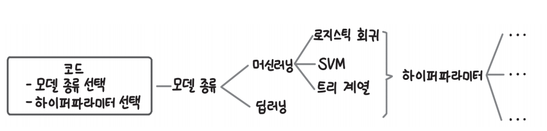
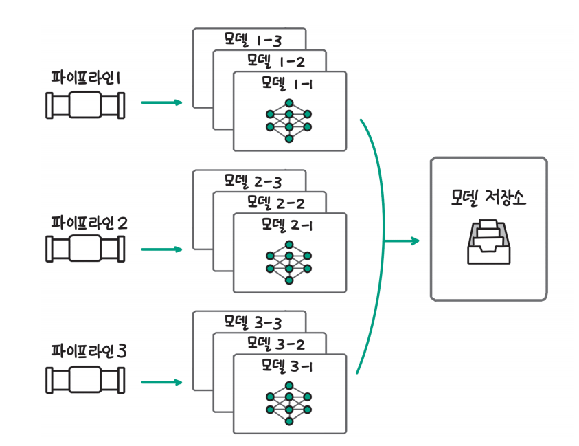
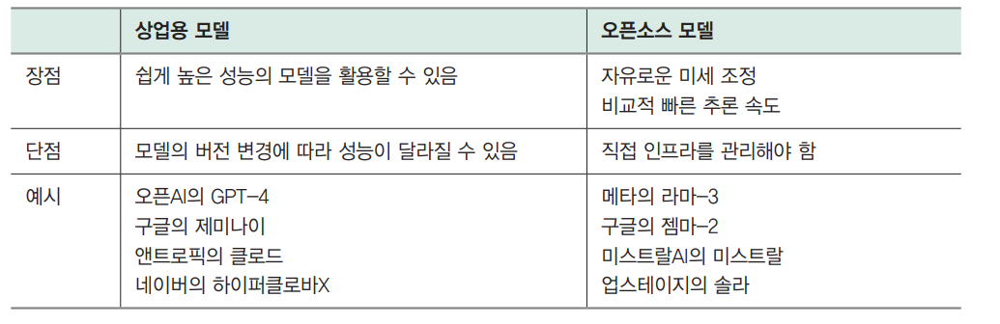
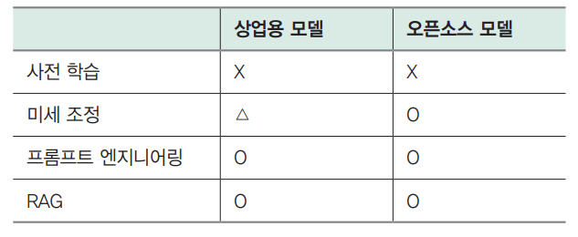

# **LLM 운영하기**  
LLM을 서비스에 활용하려는 시도가 늘면서 LLM을 서비스 운영 환경에서 효과적으로 통합하고 관리하기 위한 LLMOps도 함께 주목받고 있다. LLMOps는 
ML 모델의 개발과 운영에 대해 다루는 MLOps를 LLM에 맞춰 확장한 개념이다.  
  
# **MLOps**  
MLOps(Machine Learning Operations)는 데브옵스(Development and Operations, DevOps)의 개념을 머신 러닝과 데이터 과학 분야로 확장한 
방법론이다. 기존의 데브옵스가 소프트웨어 개발과 운영의 협업과 자동화에 초점을 맞췄다면 MLOps는 여기에 데이터와 머신러닝 모델이라는 두 가지 핵심 
요소를 더해 확장한 것이다. MLOps의 목표는 데이터 수집, 전처리, 모델 학습, 평가, 배포, 모니터링 등 머신러닝 프로젝트의 전 과정을 자동화하고 효율화하는 
것이다. 이를 통해 데이터 과학자와 엔지니어 간의 협업을 강화하고 모델의 품질과 안정성을 향상하며 비즈니스 가치 실현까지의 시간을 단축할 수 있다. 
  
  
  
요약하자면 MLOps는 위 그림과 같이 데브옵스에 데이터와 모델을 추가한 개념이다.  
  
  
  
MLOps의 핵심은 위 그림과 같이 데이터 수집부터 전처리, 학습, 평가, 배포에 이르는 전체 과정을 자동화하고 관리하는 머신러닝 파이프라인이라고 할 수 
있다. 특히 MLOps에서는 모델의 재현성(reproducibility)을 보장하는 것이 매우 중요하다. 머신러닝 프로젝트에서 모델의 재현성이란 이전에 수행된 
ML 워크플로를 그대로 반복했을 때 동일한 모델을 얻을 수 있는지 여부를 의미한다. 모델 개발 과정의 모든 단계가 문서화되고 버전 관리되어야 이전 모델을 
동일하게 재현할 수 있다. 데이터와 모델, 코드의 버전 관리가 이뤄지고 모든 단계의 입력값과 파라미터를 추적하고 기록해야 한다. 또한 MLOps에서는 모델 
학습을 자동으로 트리거하여 새로운 데이터로 지속적으로 모델을 업데이트한다. 모델 성능 저하 시 자동으로 재학습과 배포가 이뤄지도록 함으로써 모델이 항상 
최적의 상태를 유지하도록 만든다. 이는 데브옵스의 지속적 통합/배포(CI/CD) 개념을 머신러닝에 적용한 것이다.  
  
위 그림을 기준으로 했을 때 MLOps에서는 다음과 같은 주제를 다룬다.  
  
- 데이터 관리  
- 실험 관리  
- 모델 저장소  
- 모델 모니터링  
  
# **데이터 관리**  
모델 학습을 위한 데이터 준비 과정에는 여러 가지 중요한 의사결정이 포함되고 그 의사 결정에 따라 다양한 형태의 데이터셋이 생성된다.  
  
  
  
대표적으로 위 그림과 같이 포함시킬 데이터의 범위를 선택하고 어떤 전처리 방식을 포함시킬지, 특성 공학(feature engineering)을 통해 어떤 특성을 
추가할지에 따라 학습 데이터셋이 달라진다. 예를 들어 추천 모델을 만들 때 처음에는 고객의 구매 데이터만으로 모델을 학습시키려고 했지만 구매 데이터가 
너무 적어 고객이 장바구니에 추가했거나 조회한 데이터까지 학습 데이터에 추가할 수도 있다. 학습 데이터에 포함되는 데이터의 범위를 어떻게 선택하느냐에 
따라 데이터의 크기와 의미가 달라지고 모델의 성능이나 일반화 능력에 영향을 미칠 수 있다. 데이터에 오류가 있다면 데이터를 수정하거나 제거하는 전처리를 
추가할 수 있고 카테고리 정보를 어떻게 숫자로 변환할지(예: 원핫 인코딩), 컬럼별로 값의 크기를 어떻게 조정할지(예: 최소-최대 스케일링)에 따라 최종적인 
데이터셋이 달라진다. 마지막으로 특성 공학을 통해 원천 데이터에서 어떤 특성을 추가하느냐에 따라 학습 데이터셋이 달라진다. 각각의 선택에 따라 위 그림의 
오른쪽과 같이 다양한 데이터셋이 생성된다.  
  
머신러닝 모델의 학습 과정에서 모델의 성능과 일반화 능력을 높이기 위해 다양한 시도를 하게 되고 다양한 데이터셋이 만들어진다. 모델 학습 결과를 
재현하기 위해서는 데이터셋의 버전을 관리하고 어떤 학습 데이터셋으로 모델을 학습시켰는지 기록해야 한다. 이를 위해 DVC(Data Version Control)와 
같은 도구를 사용할 수 있다.  
  
# **실험 관리**  
  
  
머신러닝 모델을 학습시킬 때는 어떤 모델을 사용할지 결정해야 한다. 예를 들어 분류 문제를 푼다고 할 때 위 그림과 같이 로지스틱 회귀, SVM, 트리 모델 같은 
머신러닝 모델부터 딥러닝 모델까지 다양한 모델을 사용할 수 있다. 또한 모델마다 성능에 영향을 주는 다양한 하이퍼파라미터가 있는데 어떤 하이퍼파라미터가 
최적인지 탐색하는 과정도 필요하다. 그나마 한 사람이 모든 실험을 진행한다면 이름 규칙을 잘 정해 엑셀이나 스프레드시트에 차근차근 정리하면서 할 수 
있겠지만 여러 사람이 협업한다면 그것도 쉽지 않다. 이런 문제를 해결하기 위해 실험 관리(추적) 도구를 사용하며 대표적으로는 MLflow, W&B가 있다. 
정확한 실험 추적을 통해 실험의 재현성을 갖춰야 추가 실험으로 인한 낭비를 막을 수 있다.  
  
# **모델 저장소**  
  
  
MLOps에서 모델 저장소(model registry)는 머신러닝 모델을 체계적으로 관리하고 버전 제어하는 데 필수적인 요소다. 머신러닝 모델 개발 과정에서 
위 그림과 같이 여러 머신러닝 파이프라인에서 다양한 실험을 통해 여러 버전의 모델이 생성되는데 모델 저장소를 활용하면 다양한 모델을 하나로 통합해서 
관리할 수 있다. 모델 저장소를 사용하면 모델의 전체 수명 주기를 추적하고 관리할 수 있고 모델의 변경 이력을 기록하기 때문에 모델에 문제가 발생하는 
경우 빠르게 이전 버전으로 되돌릴 수 있게 해준다. 또한 모델의 메타 데이터(모델 생성이, 성능 지표, 하이퍼파라미터 등)를 저장하여 모델에 대한 중요한 
정보를 쉽게 확인할 수 있도록 한다. 모델 저장소와 연동하여 모델을 서빙하고 배포하는 과정을 자동화할 수 있어 모델의 배포와 관리가 간소화된다. 그뿐 아니라 
모델 저장소는 데이터 과학자와 엔지니어 간의 협업을 촉진하여 팀 내 커뮤니케이션을 원활하게 한다. 대표적인 모델 저장소 도구로는 MLflow 모델 저장소, 
AWS 세이지메이커(Sagemaker) 모델 저장소 등이있다.  
  
# **모델 모니터링**  
머신러닝 모델이 실제 환경에 배포된 이후에도 지속적으로 의도한 대로 작동하는지 모니터링하는 것은 매우 중요하다. 머신러닝 모델은 학습 데이터를 통해 
학습한 패턴을 바탕으로 예측을 수행하기 때문에 정상적으로 요청에 응답하고 있다고 하더라도 엉뚱한 값을 반환한 것은 아닌지 확인해야 한다. 특히 학습한 
이후 오랜 시간이 흘렀다면 입력 데이터의 변동으로 인해 모델의 성능 저하가 발생할 수 있다. 따라서 이런 문제를 빠르게 발견하고 대응할 수 있도록 
모니터링을 수행해야 한다. 예를 들어 리뷰가 긍정적인지 부정적인지 분류하는 모델을 개발했다고 하자. 모델을 배포한 이후에 서비스를 방문하는 사람들의 
직무 분야, 연령대, 성별 등 분포에 변화가 생긴다면 사용하는 표현, 리뷰의 길이 들 데이터가 모델을 학습시켰을 때와 달라질 수 있다. 머신러닝 모델은 
일반화 성능이 높도록 학습하지만 학습 데이터와 비슷한 데이터 분포에서 가장 좋은 성능을 보인다. 따라서 모델 배포 이후에 입력 데이터에 변화가 생기지는 
않는지 유심히 삺봐야 한다. 또한 운영 과정에서 배포된 모델이 바뀌지는 않았는지 모델의 버전도 확인해야 한다.  
  
머신러닝 모델의 성능뿐만 아니라 머신러닝 시스템의 기본적인 지표(예: CPU 및 GPU 사용량, 지연 시간 등)를 기록해 시스템에 문제가 없는지, 추가적인 
리소스의 확보가 필요한지, 리소스에 낭비는 없는지 지속적인 확인이 필요하다. 대표적인 모니터링 도구로는 오픈소스인 프로메테우스(Prometheus)와 
그라파나(Grafana)가 있고 AWS 세이지메이커의 모델 모니터(Model Monitor)와 같은 관리형 서비스도 있다. 모니터링 도구를 활용해 입력 데이터부터 모델 
예측값, 시스템 성능까지 전방위적으로 모니터링함으로써 모델의 성능 저하를 조기에 포착하고 신속히 조치를 취할 수 있다.  
  
# **LLMOps는 무엇이 다를까?**  
LLMOps는 머신러닝 모델의 개발과 운영을 통합하려는 목적을 갖고 있기 때문에 MLOps와 유사한 점이 많지만 몇 가지 중요한 차이점이 있다. 이 차이점은 
전통적인 머신러닝 모델과 LLM의 차이에서 비롯된다. LLMOps에서 다루는 LLM은 기존 머신러닝 모델에 비해 훨씬 크고 OpenAI나 구글 같은 일부 기업이 
API 기반으로 상업용 모델을 제공한다는 점이 가장 큰 차이점이다. 또 기존 머신런이 모델이 주로 분류나 회귀처럼 평가 지표가 명확한 작업에 주로 사용됐다면 
LLM은 생성 작업을 수행하므로 결과물을 정량적으로 평가하기 어려워졌다.  
  
# **상업용 모델과 오픈소스 모델 선택하기**  
MLOps와 LLMOps는 다루는 모델의 범위에서 가장 크게 차이가 난다. MLOps에서 다루는 기존의 머신러닝 모델은 회귀나 분류 같은 하나의 문제를 해결하는 
모델이었다. 하지만 LLMOps에서 다루는 대규모 언어 모델은 모델의 파라미터 수가 훨씬 많고 하나 이상의 문제를 해결하기 위해 만들어지는 경우가 많다. 
즉 LLMOps에서는 MLOps 보다 훨씬 크고 다양한 일을 할 수 있는 모델을 다룬다는 점에 차이가 있다.  
  
모델이 커지면 모델을 학습시키는 데 필요한 데이터양과 컴퓨팅 자원이 크게 증가하기 때문에 모델을 다루기 힘들어진다. 하지만 일반적으로 모델이 커질수록 
언어 모델이 더 다양한 작업을 수행할 수 있고 성능도 높아지기 때문에 OpenAI나 구글 같은 일부 기업은 모델을 더 크게 만들어 성능이 뛰어난 모델을 만들기 
위해 노력하고 있다. 이런 흐름 속에서 대규모 언어 모델은 API를 통해 사용할 수 있는 상업용 모델과 직접 모델을 학습시키고 실행해 활용할 수 있는 
오픈소스 모델로 양분됐다. 사용자는 대규모 언어 모델을 사용하려는 목적과 문제의 난이도에 따라 상업용 모델과 오픈소스 모델 중에서 적절한 모델을 
선택해야 한다.  
  
  
  
상업용 모델을 사용하는 경우 일반적으로 성능이 높고 API를 통해 쉽게 사용할 수 있다는 장점이 있다. 하지만 상용 모델의 버전이나 업데이트에 따라 
모델의 성능이 바뀌거나 잘 작동하던 프롬프트가 작동하지 않는 등 문제가 발생할 수 있어 지속적인 모니터링이 필요하다. 또한 상업용 모델의 경우 사용하는 
만큼 비용이 발생하기 때무에(토큰당 과금 방식) 비용 관리가 쉽지 않고 토큰당 비용이 점차 낮아지고 있기는 하지만 여전히 높은 수준(예: gpt-4-turbo의 경우
 1000 토큰에 0.01달러)이다. 또한 대부분의 상업용 모델은 미세 조정 기능을 지원하지 않거나 일부 모델만 지우너하기 떄문에 사용자는 플모프트나 일부 
하이퍼파라미터를 통해서만 모델을 커스터마이징할 수 있다.  
  
반면 오픈소스 모델의 경우 직접 모델 파라미터를 변경할 수 있기 떄문에 자유롭게 미세 조정이 가능하고 필요한 기능 요구사항에 맞춰 추론 속도를 충분히 
높일 수 있다는 장점이 있다. 하지만 직접 추론 인프라를 관리해야 하고 모델을 미세 조정하기 위해서는 관련 인력과 다양한 실험이 필요하기 떄문에 기술적 
난이도는 상업용 모델보다 높다. 정리하면 오픈소스 모델은 보통 상업용 모델에 비해 파라미터의 수가 적고 성능이 떨어지지만 특정한 작업을 위해 미세 조정할 
경우 비용 효율적이면서도 상업용 모델에 못지 않은 성능을 달성할 수 있다.  
  
모델의 크기는 추론할 떄 가장 큰 문제가 된다. 모델이 크면 추론에 더 많은 GPU를 사용해야 하고 GPU를 많이 사용하면 비용이 많이 발생한다. 따라서 모델의 
용량을 줄이기 위한 다양한 방법을 사용하는데 대표적으로 양자화와 지식 증류 방법이 있다. 양자화는 모델 파라미터를 저장하는 데이터 형식을 더 작은 
용량을 차지하는 형식(예: int4)으로 변경하면서 파라미터의 용량을 1/4 ~ 1/2로 줄이는 방법이다. 지식 증류는 크기가 크고 성능이 뛰어난 모델의 생성 
결과를 활용해 작은 모델을 학습시킴으로써 작은 모델로도 큰 모델과 유사한 성능을 달성하는 방법이다.  
  
모델의 크기는 변경하지 않으면서 효율적인 추론 방식을 통해 처리량을 높이고 지연 시간을 낮추는 다양한 방식이 있다. 대표적으로 몇 가지를 살펴보면 연속 
배치는 토큰 생성 시마다 생성이 끝난 문장은 반환하고 새롭게 생성할 문장을 추가하는 효율적인 배치 처리 방식으로 정적 배치 방식이 모든 배치의 문장 생성이 
끝날 때까지 생성이 끝난 문장을 대기하도록 만든다는 이유 떄문에 지연 시간을 늘리고 처리량을 낮추는 문제를 개선한다.  
  
다음으로 트랜스포머 모델의 핵심 연산인 어텐션 연산을 효율적으로 수행하는 플래시 어텐션이 있다. 플래시어텐션은 어텐션 처리 시간의 대부분이 GPU IO에서 
발생한다는 사실을 발견하고 어텐션 연산 과정에서 중간에 생성되는 큰 행렬을 GPU에 쓰지 않도록 함으로써 처리량을 높인다. 마지막으로 페이지 어텐션은 
이전 토큰 생성 과정의 결과를 저장하는 KV 캐시가 GPU 메모리를 비효율적으로 낭비하는 문제를 개선해 처리량을 높인다.  
  
# **모델 최적화 방법의 변화**  
  
  
LLM을 사용 사례에 맞게 최적화하는 방법은 위 표와 같이 크게 사전 학습, 미세 조정, 프롬프트 엔지니어링, 검색 증강 생성(RAG) 네 가지로 나눌 수 있다. 
LLMOps에서 다루는 LLM은 모델의 크기가 크기 떄문에 일반적으로 사전 학습시키는 경우는 거의 없다. 오픈소스 모델을 선택했다면 미세 조정을 자유롭게 
수행할 수 있지만 상업용 모델을 선택했다면 미세 조정 기능을 지원하는 모델만 제한적으로 미세 조정할 수 있다. 모델을 학습시키는 방법 이외에도 LLM에 
입력하는 프롬프트를 구조화해 원하는 결과를 얻는 프롬프트 엔지니어링을 사용할 수 있다. 또한 프롬프트에 답변 생성에 필요한 정보를 추가하는 RAG를 
사용할 수도 있다.  
  
MLOps에서 다루는 기존의 머신러닝 모델은 일반적으로 처음부터 직접 모델을 학습시켜 사용했다. 모델이 크지 않아 직접 학습시킬 수 있는 경우가 많았다. 
하지만 LLMOps에서 다루는 언어 모델은 모델의 크기가 크고 청음부터 학습시킬 때 들어가는 계산량이 크기 때문에 일반적으로 사전 학습은 하지 않고 사전 
학습된 모델을 가져와 미세 조정하는 전이 학습을 기본으로 사용한다.