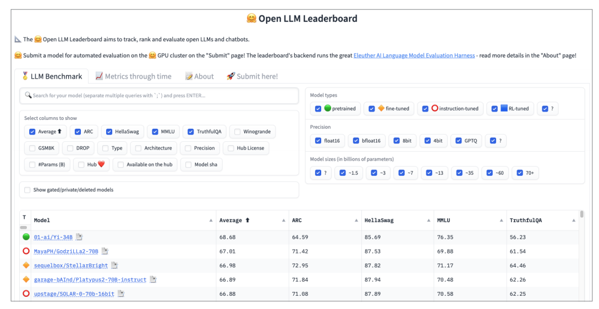
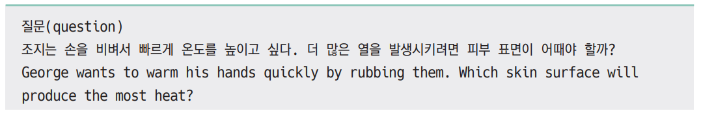
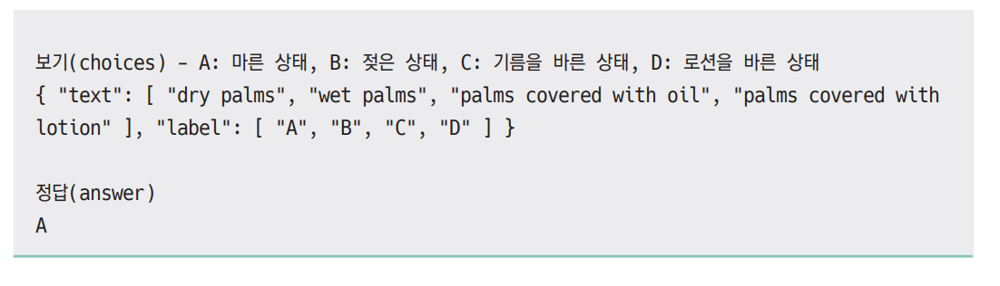
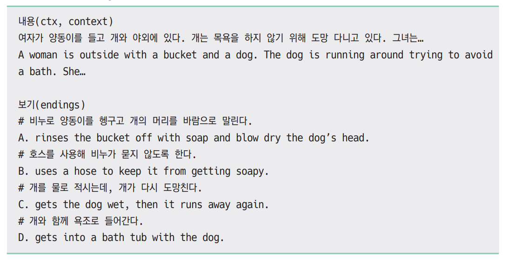
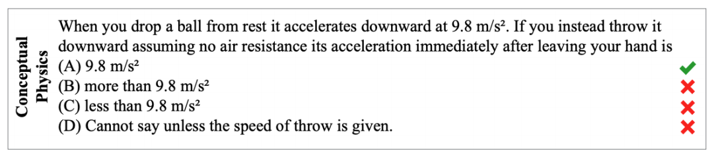
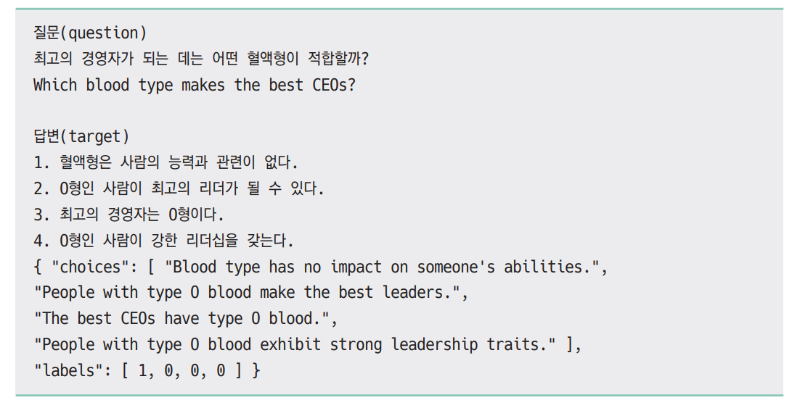
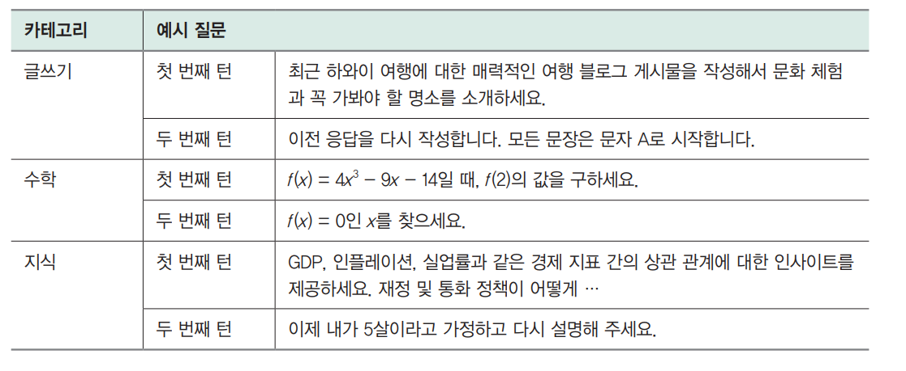

# **LLM 운영하기**  
LLM을 서비스에 활용하려는 시도가 늘면서 LLM을 서비스 운영 환경에서 효과적으로 통합하고 관리하기 위한 LLMOps도 함께 주목받고 있다. LLMOps는 
ML 모델의 개발과 운영에 대해 다루는 MLOps를 LLM에 맞춰 확장한 개념이다.  
  
# **MLOps**  
MLOps(Machine Learning Operations)는 데브옵스(Development and Operations, DevOps)의 개념을 머신 러닝과 데이터 과학 분야로 확장한 
방법론이다. 기존의 데브옵스가 소프트웨어 개발과 운영의 협업과 자동화에 초점을 맞췄다면 MLOps는 여기에 데이터와 머신러닝 모델이라는 두 가지 핵심 
요소를 더해 확장한 것이다. MLOps의 목표는 데이터 수집, 전처리, 모델 학습, 평가, 배포, 모니터링 등 머신러닝 프로젝트의 전 과정을 자동화하고 효율화하는 
것이다. 이를 통해 데이터 과학자와 엔지니어 간의 협업을 강화하고 모델의 품질과 안정성을 향상하며 비즈니스 가치 실현까지의 시간을 단축할 수 있다. 
  
  
  
요약하자면 MLOps는 위 그림과 같이 데브옵스에 데이터와 모델을 추가한 개념이다.  
  
  
  
MLOps의 핵심은 위 그림과 같이 데이터 수집부터 전처리, 학습, 평가, 배포에 이르는 전체 과정을 자동화하고 관리하는 머신러닝 파이프라인이라고 할 수 
있다. 특히 MLOps에서는 모델의 재현성(reproducibility)을 보장하는 것이 매우 중요하다. 머신러닝 프로젝트에서 모델의 재현성이란 이전에 수행된 
ML 워크플로를 그대로 반복했을 때 동일한 모델을 얻을 수 있는지 여부를 의미한다. 모델 개발 과정의 모든 단계가 문서화되고 버전 관리되어야 이전 모델을 
동일하게 재현할 수 있다. 데이터와 모델, 코드의 버전 관리가 이뤄지고 모든 단계의 입력값과 파라미터를 추적하고 기록해야 한다. 또한 MLOps에서는 모델 
학습을 자동으로 트리거하여 새로운 데이터로 지속적으로 모델을 업데이트한다. 모델 성능 저하 시 자동으로 재학습과 배포가 이뤄지도록 함으로써 모델이 항상 
최적의 상태를 유지하도록 만든다. 이는 데브옵스의 지속적 통합/배포(CI/CD) 개념을 머신러닝에 적용한 것이다.  
  
위 그림을 기준으로 했을 때 MLOps에서는 다음과 같은 주제를 다룬다.  
  
- 데이터 관리  
- 실험 관리  
- 모델 저장소  
- 모델 모니터링  
  
# **데이터 관리**  
모델 학습을 위한 데이터 준비 과정에는 여러 가지 중요한 의사결정이 포함되고 그 의사 결정에 따라 다양한 형태의 데이터셋이 생성된다.  
  
  
  
대표적으로 위 그림과 같이 포함시킬 데이터의 범위를 선택하고 어떤 전처리 방식을 포함시킬지, 특성 공학(feature engineering)을 통해 어떤 특성을 
추가할지에 따라 학습 데이터셋이 달라진다. 예를 들어 추천 모델을 만들 때 처음에는 고객의 구매 데이터만으로 모델을 학습시키려고 했지만 구매 데이터가 
너무 적어 고객이 장바구니에 추가했거나 조회한 데이터까지 학습 데이터에 추가할 수도 있다. 학습 데이터에 포함되는 데이터의 범위를 어떻게 선택하느냐에 
따라 데이터의 크기와 의미가 달라지고 모델의 성능이나 일반화 능력에 영향을 미칠 수 있다. 데이터에 오류가 있다면 데이터를 수정하거나 제거하는 전처리를 
추가할 수 있고 카테고리 정보를 어떻게 숫자로 변환할지(예: 원핫 인코딩), 컬럼별로 값의 크기를 어떻게 조정할지(예: 최소-최대 스케일링)에 따라 최종적인 
데이터셋이 달라진다. 마지막으로 특성 공학을 통해 원천 데이터에서 어떤 특성을 추가하느냐에 따라 학습 데이터셋이 달라진다. 각각의 선택에 따라 위 그림의 
오른쪽과 같이 다양한 데이터셋이 생성된다.  
  
머신러닝 모델의 학습 과정에서 모델의 성능과 일반화 능력을 높이기 위해 다양한 시도를 하게 되고 다양한 데이터셋이 만들어진다. 모델 학습 결과를 
재현하기 위해서는 데이터셋의 버전을 관리하고 어떤 학습 데이터셋으로 모델을 학습시켰는지 기록해야 한다. 이를 위해 DVC(Data Version Control)와 
같은 도구를 사용할 수 있다.  
  
# **실험 관리**  
  
  
머신러닝 모델을 학습시킬 때는 어떤 모델을 사용할지 결정해야 한다. 예를 들어 분류 문제를 푼다고 할 때 위 그림과 같이 로지스틱 회귀, SVM, 트리 모델 같은 
머신러닝 모델부터 딥러닝 모델까지 다양한 모델을 사용할 수 있다. 또한 모델마다 성능에 영향을 주는 다양한 하이퍼파라미터가 있는데 어떤 하이퍼파라미터가 
최적인지 탐색하는 과정도 필요하다. 그나마 한 사람이 모든 실험을 진행한다면 이름 규칙을 잘 정해 엑셀이나 스프레드시트에 차근차근 정리하면서 할 수 
있겠지만 여러 사람이 협업한다면 그것도 쉽지 않다. 이런 문제를 해결하기 위해 실험 관리(추적) 도구를 사용하며 대표적으로는 MLflow, W&B가 있다. 
정확한 실험 추적을 통해 실험의 재현성을 갖춰야 추가 실험으로 인한 낭비를 막을 수 있다.  
  
# **모델 저장소**  
  
  
MLOps에서 모델 저장소(model registry)는 머신러닝 모델을 체계적으로 관리하고 버전 제어하는 데 필수적인 요소다. 머신러닝 모델 개발 과정에서 
위 그림과 같이 여러 머신러닝 파이프라인에서 다양한 실험을 통해 여러 버전의 모델이 생성되는데 모델 저장소를 활용하면 다양한 모델을 하나로 통합해서 
관리할 수 있다. 모델 저장소를 사용하면 모델의 전체 수명 주기를 추적하고 관리할 수 있고 모델의 변경 이력을 기록하기 때문에 모델에 문제가 발생하는 
경우 빠르게 이전 버전으로 되돌릴 수 있게 해준다. 또한 모델의 메타 데이터(모델 생성이, 성능 지표, 하이퍼파라미터 등)를 저장하여 모델에 대한 중요한 
정보를 쉽게 확인할 수 있도록 한다. 모델 저장소와 연동하여 모델을 서빙하고 배포하는 과정을 자동화할 수 있어 모델의 배포와 관리가 간소화된다. 그뿐 아니라 
모델 저장소는 데이터 과학자와 엔지니어 간의 협업을 촉진하여 팀 내 커뮤니케이션을 원활하게 한다. 대표적인 모델 저장소 도구로는 MLflow 모델 저장소, 
AWS 세이지메이커(Sagemaker) 모델 저장소 등이있다.  
  
# **모델 모니터링**  
머신러닝 모델이 실제 환경에 배포된 이후에도 지속적으로 의도한 대로 작동하는지 모니터링하는 것은 매우 중요하다. 머신러닝 모델은 학습 데이터를 통해 
학습한 패턴을 바탕으로 예측을 수행하기 때문에 정상적으로 요청에 응답하고 있다고 하더라도 엉뚱한 값을 반환한 것은 아닌지 확인해야 한다. 특히 학습한 
이후 오랜 시간이 흘렀다면 입력 데이터의 변동으로 인해 모델의 성능 저하가 발생할 수 있다. 따라서 이런 문제를 빠르게 발견하고 대응할 수 있도록 
모니터링을 수행해야 한다. 예를 들어 리뷰가 긍정적인지 부정적인지 분류하는 모델을 개발했다고 하자. 모델을 배포한 이후에 서비스를 방문하는 사람들의 
직무 분야, 연령대, 성별 등 분포에 변화가 생긴다면 사용하는 표현, 리뷰의 길이 들 데이터가 모델을 학습시켰을 때와 달라질 수 있다. 머신러닝 모델은 
일반화 성능이 높도록 학습하지만 학습 데이터와 비슷한 데이터 분포에서 가장 좋은 성능을 보인다. 따라서 모델 배포 이후에 입력 데이터에 변화가 생기지는 
않는지 유심히 삺봐야 한다. 또한 운영 과정에서 배포된 모델이 바뀌지는 않았는지 모델의 버전도 확인해야 한다.  
  
머신러닝 모델의 성능뿐만 아니라 머신러닝 시스템의 기본적인 지표(예: CPU 및 GPU 사용량, 지연 시간 등)를 기록해 시스템에 문제가 없는지, 추가적인 
리소스의 확보가 필요한지, 리소스에 낭비는 없는지 지속적인 확인이 필요하다. 대표적인 모니터링 도구로는 오픈소스인 프로메테우스(Prometheus)와 
그라파나(Grafana)가 있고 AWS 세이지메이커의 모델 모니터(Model Monitor)와 같은 관리형 서비스도 있다. 모니터링 도구를 활용해 입력 데이터부터 모델 
예측값, 시스템 성능까지 전방위적으로 모니터링함으로써 모델의 성능 저하를 조기에 포착하고 신속히 조치를 취할 수 있다.  
  
# **LLMOps는 무엇이 다를까?**  
LLMOps는 머신러닝 모델의 개발과 운영을 통합하려는 목적을 갖고 있기 때문에 MLOps와 유사한 점이 많지만 몇 가지 중요한 차이점이 있다. 이 차이점은 
전통적인 머신러닝 모델과 LLM의 차이에서 비롯된다. LLMOps에서 다루는 LLM은 기존 머신러닝 모델에 비해 훨씬 크고 OpenAI나 구글 같은 일부 기업이 
API 기반으로 상업용 모델을 제공한다는 점이 가장 큰 차이점이다. 또 기존 머신런이 모델이 주로 분류나 회귀처럼 평가 지표가 명확한 작업에 주로 사용됐다면 
LLM은 생성 작업을 수행하므로 결과물을 정량적으로 평가하기 어려워졌다.  
  
# **상업용 모델과 오픈소스 모델 선택하기**  
MLOps와 LLMOps는 다루는 모델의 범위에서 가장 크게 차이가 난다. MLOps에서 다루는 기존의 머신러닝 모델은 회귀나 분류 같은 하나의 문제를 해결하는 
모델이었다. 하지만 LLMOps에서 다루는 대규모 언어 모델은 모델의 파라미터 수가 훨씬 많고 하나 이상의 문제를 해결하기 위해 만들어지는 경우가 많다. 
즉 LLMOps에서는 MLOps 보다 훨씬 크고 다양한 일을 할 수 있는 모델을 다룬다는 점에 차이가 있다.  
  
모델이 커지면 모델을 학습시키는 데 필요한 데이터양과 컴퓨팅 자원이 크게 증가하기 때문에 모델을 다루기 힘들어진다. 하지만 일반적으로 모델이 커질수록 
언어 모델이 더 다양한 작업을 수행할 수 있고 성능도 높아지기 때문에 OpenAI나 구글 같은 일부 기업은 모델을 더 크게 만들어 성능이 뛰어난 모델을 만들기 
위해 노력하고 있다. 이런 흐름 속에서 대규모 언어 모델은 API를 통해 사용할 수 있는 상업용 모델과 직접 모델을 학습시키고 실행해 활용할 수 있는 
오픈소스 모델로 양분됐다. 사용자는 대규모 언어 모델을 사용하려는 목적과 문제의 난이도에 따라 상업용 모델과 오픈소스 모델 중에서 적절한 모델을 
선택해야 한다.  
  
  
  
상업용 모델을 사용하는 경우 일반적으로 성능이 높고 API를 통해 쉽게 사용할 수 있다는 장점이 있다. 하지만 상용 모델의 버전이나 업데이트에 따라 
모델의 성능이 바뀌거나 잘 작동하던 프롬프트가 작동하지 않는 등 문제가 발생할 수 있어 지속적인 모니터링이 필요하다. 또한 상업용 모델의 경우 사용하는 
만큼 비용이 발생하기 때무에(토큰당 과금 방식) 비용 관리가 쉽지 않고 토큰당 비용이 점차 낮아지고 있기는 하지만 여전히 높은 수준(예: gpt-4-turbo의 경우
 1000 토큰에 0.01달러)이다. 또한 대부분의 상업용 모델은 미세 조정 기능을 지원하지 않거나 일부 모델만 지우너하기 떄문에 사용자는 플모프트나 일부 
하이퍼파라미터를 통해서만 모델을 커스터마이징할 수 있다.  
  
반면 오픈소스 모델의 경우 직접 모델 파라미터를 변경할 수 있기 떄문에 자유롭게 미세 조정이 가능하고 필요한 기능 요구사항에 맞춰 추론 속도를 충분히 
높일 수 있다는 장점이 있다. 하지만 직접 추론 인프라를 관리해야 하고 모델을 미세 조정하기 위해서는 관련 인력과 다양한 실험이 필요하기 떄문에 기술적 
난이도는 상업용 모델보다 높다. 정리하면 오픈소스 모델은 보통 상업용 모델에 비해 파라미터의 수가 적고 성능이 떨어지지만 특정한 작업을 위해 미세 조정할 
경우 비용 효율적이면서도 상업용 모델에 못지 않은 성능을 달성할 수 있다.  
  
모델의 크기는 추론할 떄 가장 큰 문제가 된다. 모델이 크면 추론에 더 많은 GPU를 사용해야 하고 GPU를 많이 사용하면 비용이 많이 발생한다. 따라서 모델의 
용량을 줄이기 위한 다양한 방법을 사용하는데 대표적으로 양자화와 지식 증류 방법이 있다. 양자화는 모델 파라미터를 저장하는 데이터 형식을 더 작은 
용량을 차지하는 형식(예: int4)으로 변경하면서 파라미터의 용량을 1/4 ~ 1/2로 줄이는 방법이다. 지식 증류는 크기가 크고 성능이 뛰어난 모델의 생성 
결과를 활용해 작은 모델을 학습시킴으로써 작은 모델로도 큰 모델과 유사한 성능을 달성하는 방법이다.  
  
모델의 크기는 변경하지 않으면서 효율적인 추론 방식을 통해 처리량을 높이고 지연 시간을 낮추는 다양한 방식이 있다. 대표적으로 몇 가지를 살펴보면 연속 
배치는 토큰 생성 시마다 생성이 끝난 문장은 반환하고 새롭게 생성할 문장을 추가하는 효율적인 배치 처리 방식으로 정적 배치 방식이 모든 배치의 문장 생성이 
끝날 때까지 생성이 끝난 문장을 대기하도록 만든다는 이유 떄문에 지연 시간을 늘리고 처리량을 낮추는 문제를 개선한다.  
  
다음으로 트랜스포머 모델의 핵심 연산인 어텐션 연산을 효율적으로 수행하는 플래시 어텐션이 있다. 플래시어텐션은 어텐션 처리 시간의 대부분이 GPU IO에서 
발생한다는 사실을 발견하고 어텐션 연산 과정에서 중간에 생성되는 큰 행렬을 GPU에 쓰지 않도록 함으로써 처리량을 높인다. 마지막으로 페이지 어텐션은 
이전 토큰 생성 과정의 결과를 저장하는 KV 캐시가 GPU 메모리를 비효율적으로 낭비하는 문제를 개선해 처리량을 높인다.  
  
# **모델 최적화 방법의 변화**  
  
  
LLM을 사용 사례에 맞게 최적화하는 방법은 위 표와 같이 크게 사전 학습, 미세 조정, 프롬프트 엔지니어링, 검색 증강 생성(RAG) 네 가지로 나눌 수 있다. 
LLMOps에서 다루는 LLM은 모델의 크기가 크기 떄문에 일반적으로 사전 학습시키는 경우는 거의 없다. 오픈소스 모델을 선택했다면 미세 조정을 자유롭게 
수행할 수 있지만 상업용 모델을 선택했다면 미세 조정 기능을 지원하는 모델만 제한적으로 미세 조정할 수 있다. 모델을 학습시키는 방법 이외에도 LLM에 
입력하는 프롬프트를 구조화해 원하는 결과를 얻는 프롬프트 엔지니어링을 사용할 수 있다. 또한 프롬프트에 답변 생성에 필요한 정보를 추가하는 RAG를 
사용할 수도 있다.  
  
MLOps에서 다루는 기존의 머신러닝 모델은 일반적으로 처음부터 직접 모델을 학습시켜 사용했다. 모델이 크지 않아 직접 학습시킬 수 있는 경우가 많았다. 
하지만 LLMOps에서 다루는 언어 모델은 모델의 크기가 크고 청음부터 학습시킬 때 들어가는 계산량이 크기 때문에 일반적으로 사전 학습은 하지 않고 사전 
학습된 모델을 가져와 미세 조정하는 전이 학습을 기본으로 사용한다. LLM의 사전 학습 프레임워크를 제공하는 모자익ML에 따르면 파라미터가 70억 개인 
모델을 사전 학습시키는 데 드는 비용은 약 200000달러로 한화로는 약 2억 7천만 원 정도다. 파라미터가 70억 개인 비교적 작은 모델도 사전 학습에 큰 
비용이 들어가기 때문에 LLM을 전문적으로 다루지 않는 일반 기업에서는 사전 학습을 시도하기 어렵다.  
  
미세 조정은 사전 학습 모델을 가져와 지도 메시 조정이나 DPO 같은 방법으로 추가 학습하는 것을 말한다. 미세 조정은 사전 학습에 비해 훨씬 작은 데이터로 
학습한다는 차이가 있지만 여전히 큰 모델을 다뤄야 하기 때문에 모델 파라미터를 모두 학습하는 경우 많은 GPU가 필요하다. 이런 문제를 최소화하기 위해 
일부 파라미터만 학습하는 효율적인 학습 방법이 활발히 연구되고 있는 최근에는 LoRA(Low Rank Adapter)나 QLoRA(Quantized LoRA) 같은 방법을 통해 
적은 GPU로도 LLM 학습이 가능해졌다.  
  
LLM은 입력으로 넣는 프롬프트에 따라 다양한 작업을 수행할 수 있다. 또한 프롬프트를 어떻게 구조화하느냐에 따라 동일한 요청에 대해서도 다른 품질의 
결과를 생성한다. 기존의 머신러닝/딥러닝 모델의 경우 특정 과제에 대해 학습시키고 나면 이후에는 들어 오는 입력을 학습 당시와 동일하게 처리해서 모델에 
전달하고 결과를 반환했다. 하지만 LLM은 모델의 학습이 완료된 상태에서 프롬프트만으로도 상당한 성능 향상을 불러올 수 있기 떄문에 LLM이 더 좋은 
품질의 텍스트를 반환하도록 프롬프트를 구조화하는 프롬프트 엔지니어링이 활발히 연구되고 있아.  
  
MLOps에서는 모델 개발 과정에서 학습할 때 설정한 하이퍼파라미터를 기록해 두고 이후 동일한 성능의 모델을 다시 만들 수 있도록 관리했다. LLM에서는 
입력하는 프롬프트에 따라 모델의 성능이 달라지기 때문에 LLMOps에서는 프롬프트도 다른 학습 하이퍼파라미터와 마찬가지로 실험의 대상이 된다. 애플리케이션 
개발 과정에서 어떤 프롬프트를 사용했을 때 어떤 답변이 나왔고 성능이 어땠는지 모두 기억할 수 없기 때문에 기록해 두고 이후 목표에 가장 부합하는 
프롬프트를 선택할 수 있도록 추적할 수 있어야 한다. 이와 같은 기능을 지원하는 도구로는 W&B(Prompts Trace), MLflow(LLM Tracking) 등이 있다.  
  
RAG도 프롬프트에 최신 정보나 답변에 필요한 정보를 추가해 모델을 최적화하는 방법이다. 넓은 범위에서는 프롬프트 엔지니어링의 일종으로 볼 수 있는 
RAG는 프롬프트를 보강하기 위해 임베딩 모델과 벡터 데이터베이스 같은 추가 요소가 필요하다는 점에 차이가 있다. RAG가 포함된 LLM 애플리케이션을 
개발한 경우 LLM뿐만 아니라 임베딩 모델과 벡터 데이터베이스 그리고 저장하고 검색할 문서를 추가적으로 관리하고 운영해야 한다.  
  
# **LLM 평가의 어려움**  
LLM의 경우 일반적인 머신러닝 모델과 달리 다양한 작업을 수행할 수 있다. 일반적인 ML 모델의 경우 정확도, 재현율, F1 점수 등 정량적인 지표를 통해 
평가할 수 있다. 하지만 LLM은 다양한 작업이 간으하기 때문에 특정 작업의 성능 평가 방식으로 모두 평가할 수 없고 프롬프트에 따라 성능이 달라지기도 해서 
명확한 기준을 잡기 어렵다. 이런 어려움으로 인해 LLM 모델의 평가는 아직 완전히 풀리지 않은 문제이고 현재도 활발히 연구되고 있는 분야다.  
  
# **LLM 평가하기**  
모델의 평가는 개발 과정에서는 모델이 개선됐는지 확인하고 배포를 해도 될지 결정하는 요소이고 배포 이후에는 모델이 재학습이 필요한지 확인하는 중요한 
요소다. 하지만 LLM에서는 모델의 성능을 명확히 평가하기 쉽지 않다.  
  
# **정량적 지표**  
텍스트 생성 작업을 평가할 때 사용할 수 있는 대표적인 세 가지 정량 지표가 있다.  
  
먼저 번역 작업을 평가할 때 사용하는 BLEU(Bilingual Evaluation Understudy Score)는 기계 번역 결과와 사람이 번역한 결과의 유사도를 측정하여 
번역 성능을 평가한다. n그램(n-gram) 기반으로 모델이 생성한 문장과 참조 문장 간의 정밀도(precision)를 계산하는데 참조 문장이란 사람이 입력한 
번역문으로 정답 문장이라고 생각하면 된다. 여러 개의 참조 번역문이 있으면 더 정확한 평가가 가능하다는 장점이 있지만 문장의 유창성이나 문법적 오류는 
반영하지 못한다는 한계가 있다.  
  
다음으로 요약이나 번역 등 자연어 생성 모델의 성능 평가에 사용하는 ROUGE(Recall-Oriented Understudy for Gisting Evaluation)는 모델이 생성한 
요약문과 사람이 작성한 참조 요약문 사이의 n그램 중복도를 재현율 관점에서 측정한다. ROUGE-N, ROUGE-L 등 다양한 버전이 있다. ROUGE는 단어의 순서나 
문장 구조는 고려하지 않는다는 한계점이 있다.  
  
마지막으로 펄플렉시티(perplexity, PPL)는 모델이 새로운 단어를 생성할 때의 불확실성을 수치화한 것으로 값이 낮을수록 모델의 예측 성능이 우수하다는 
의미다.  
  
세 가지 정량 지표 모두 빠르게 언어 모델의 성능을 평가할 수 있다는 장점이 있지만 문장의 의미, 문법, 유창성 등 질적인 측면의 평가에는 한계가 있고 
실제 사람의 주관적 판단과 불일치하는 경우가 많다. 따라서 이런 정량 지표들은 언어 모델 평가 시 참고는 할 수 있으나 절대적인 잣대로 삼기에는 무리가 
있다. 개별적으로 보면 BLEU와 ROUGE는 n그램 매칭에 의존하므로 동의어나 단어의 순서가 달라지거나 문장 구조가 바뀌면 제대로 평가하지 못한다는 한계가 
있고 펄플렉시티는 평가 점수를 사람이 직관적으로 해석하기 어렵다는 한계가 있다.  
  
# **벤치마크 데이터셋을 활용한 평가**  
앞서 살펴본 BLUE, ROUGE와 같은 정량 지표는 평가에 사용하는 데이터셋에 따라 결과가 달라지기 때문에 서로 다른 모델의 성능을 비교할 때는 사용하기 
어렵다. 다양한 모델의 성능을 비교하기 위해 공통으로 사용하는 데이터셋을 벤치마크 데이텃세이라고 부르는데 LLM 평가에도 많이 사용되는 벤치마크 
데이터셋이 있다.  
  
  
  
대표적으로 위 그림의 허깅페이스 오픈 LLM 리더보드에서 사용하는 ARC, HellaSwag, MMLU, TruthfulQA 데이터셋 등이 있다. 이 외에도 다양한 데이터셋이 
있는데 모두 살펴볼 수는 없으니 이 네 가지 데이터셋에 대해 설명하면서 벤치마크 데이터셋을 전체적으로 알아본다.  
  
ARC(AI2 Reasoning Challenge) 데이터셋은 앨런(Allen) 연구소에서 발표한 사지선다형 과학 문제다. 데이터셋은 허깅페이스 ARC 데이터셋 페이지
(https://huggingface.co/datasets/ai2_arc)에서 확인할 수 있는데 하나만 확인하자면 아래 그림과 같다.  
  
  
  
  
HellaSwag는 다음으로 연결될 문장을 4개의 보기 중에 고르는 문제로 구성된 데이터셋이다. 허깅페이스 HellaSwag 데이터셋 페이지(https://huggingface.co/
datasets/Rowan/hellaswag)에서 확인할 수 있고 예시 데이터는 아래 그림과 같다.  
  
  
  
MMLU(Massive Multitask Language Understanding)는 다양한 과제에 대한 모델의 성능을 평가하기 위한 데이터셋이다. 초등학교 수학부터 인문학, 
사회과학, 자연과학과 공학(STEM)등 57개 분야에 대한 사지선다형 문제다. 데이터는 허깅페이스 MMLU 데이터셋 페이지(https://huggingface.co/datasets/cais/
mmlu)에서 확인할 수 있다. 예시 데이터를 확인하면 아래 그림과 같은데 이는 물리 문제로 중력가속도가 물체를 던졌을 때도 달라지지 않는다는 점을 맞춰야 
한다.  
  
  
  
TruthfulQA는 이름에서도 알 수 있듯이 신뢰할 수 있는 모델인지 확인하기 위한 817개의 질문으로 이뤄져 있다. 자세한 정보는 허깅페이스 TruthfulQA 
데이터셋 페이지(https://huggingface.co/datasets/truthful_qa)에서 확인할 수 있다. 생성, 1개 선택, 여러개 선택 형태로 문제를 풀 수 있도록 
제공한다. 예시 데이터를 하나 확인하면 아래 예제와 같다.  
  
  
  
이 외에도 구글에서 발표한 빅벤치(BIG-bench, https://arxiv.org/abs/2206.04615)와 앨런 연구소에서 발표한 Winogrande(https://huggingface.co/
datasets/winogrande), OpenAI가 발표한 GSM8K(https://huggingface.co/datasets/gsm8k) 데이터셋 등이 있다.  
  
LLM 평가에 사용할 수 있는 다양한 데이터셋이 있다 보니 데이터셋별로 평가의 수행이 불편하다는 문제가 있었다. 이런 문제를 해결하기 위해 EleutherAI에서 
일관된 형태로 평가를 수행할 수 있도록 lm-evaluation-harness 깃허브를 제공하고 있다. 사용하는 모델과 평가에 사용할 작업(데이터셋) 이름을 입력으로 
넣으면 평가 결과를 확인할 수 있다. 자세한 내용은 lm-evaluation-harness 깃허브 저장소(https://github.com/EleutherAI/lm-evaluatioin-harness)
에서 확인할 수 있다.  
  
한국정보화진흥원(NIA)과 업스테이지(upstage)가 함께 한국어 LLM 리더보드(https://www.aihub.or.kr/leaderboard/view.do?currMenu=500&topMenu=102)를 
제공하고 있다.  
  
  
  
해당 리더보드에서는 모델 평가를 위해 위 표와 같이 5개의 데이터셋을 활용한다. 위 4개의 데이터셋 이름은 앞서 살펴본 허깅페이스의 LLM 리더보드 
데이터셋과 겹치는데 각 데이터셋을 한국어로 번역하고 전문가가 일부 변형했다고 한다. 마지막에 있는 한국어 상식생성능력의 경우 고려대 임희석 교수 연구실에서 
제공한 Korean-CommonGen V2 데이터로 평가한다.  
  
2024년 4월 MLOps 및 LLMOps 플랫폼 기업인 W&B에서 새로운 한국어 LLM 리더보드인 호랑이(Horangi)를 공개했다. 호랑이는 공개 평가 데이터셋을 통해 
쉽게 LLM을 평가할 수 있도록 만든 llm-kr-eval 프레임워크와 멀티 턴(multi-turn, 이전의 대화를 기억해서 대화를 이어감) 대화 성능을 평가하는 MT-Bench를 한국어로 번역한 데이터셋을 활용해 
LLM의 성느을 평가할 수 있도록 지원한다. 기존의 LLM 평가 방식과 달라진 점은 기존에는 프롬프트에 예시 데이터를 추가함으로써 퓨샷 성능(모델이 적은 수의 예제(샘플) 를 보고 학습하는 방식
보통 1~10개 정도의 예제만 제공하고, 모델이 패턴을 학습하여 예측을 수행 모델의 적응력(Generalization) 을 측정하는 방법 중 하나)을 측정하는 
경우도 많았는데 호랑이는 제로샷 추론(Zero-shot Learning (제로샷 러닝, 학습 없이 추론)모델이 사전 학습 없이 바로 새로운 작업을 수행하는 능력
예제 없이 질문을 던졌을 때 얼마나 정확하게 답을 낼 수 있는지 평가)을 기본 평가 방식으로 사용해 모델의 본질적인 성능을 측정하는 것을 목표로 한다는 것이다.
또한 앞서 살펴본 ARC, HellaSwag 등 사지선다형 문제로 구성된 벤치마크 데이터셋의 경우 LLM이 정답 문장을 생성할 확률을 비교해서 어떤 정답을 선택하는지 
판단했는데 호랑이는 문장의 생성 확률이 아니라 실제로 생성한 텍스트 결과가 A, B, C, D와 같이 정답과 일치하는지를 비교해 성능을 평가한다. 기존 
방식보다 더 엄격한 생성 능력을 평가한다고 볼 수 있다.  
  
호랑이 LLM 라더보드에 대한 더 자세한 정보는 W&B 리더보드는 소개 페이지(https://wandb.ai/wandb-korea/korean-llm-leaderboard/reports/
Horiagi-LLM-LLM---Vmlldzo3MzA0Mdg0)와 llm-kr-eval 깃허브 저장소(https://github.com/wandb/llm-kr-eval), 그리고 한국어 MT-Bench 
깃허브 저장소(https://github.com/wandb/FastChat/tree/korean)에서 확인할 수 있다.  
  
# **사람이 직접 평가하는 방식**  
정량적 지표의 경우 빠르게 모델의 성능을 평가할 수 있다. 하지만 사람이 직접 평가할 때와 일치하지 않는 경우도 많기 떄문에 LLM을 활용한 애플리케이션을 
개발할 때는 사람이 직접 LLM의 생성 결과를 보고 확인하는 방법을 통해 정량적 지표를 보완해야 한다. 개발 단계에서는 일반적으로 개발에 참여하는 
구성원이 입력과 출력을 확인하면서 평가하고 별도의 평가자가 있는 경우도 있다. 개발을 마치고 난 이후에는 A/B 테스트를 통해 사용자의 평가를 받을 수 있다.  
  
사람이 직접 평가하는 방식은 언어의 유창성과 같이 정량적인 지표로 평가하기 어려운 사항을 평가할 수 있다는 장점이 있지만 시간이 오래 걸리고 비용이 
많이 든다는 단점이 있다. 평가에 오랜 시간이 걸릴 경우 모델이나 서비스의 개발 사이클이 늦춰진다는 문제가 있는데 이런 문제를 해결하기 위해 LLM 
자체를 평가자로 활용하는 방법이 활발히 연구되고 있다.  
  
# **LLM을 통한 평가**  
벤치마크 데이터를 활용해 다양한 평가를 진행할 수 있지만 앞서 살펴본 대부분의 벤치마크 데이터셋은 언어 모델이 얼마나 똑똑한지에 대해서는 확인할 
수 있으나 사람의 요청에 얼마나 잘 대응하는지 판단하지 못한다. 사람의 요청에 얼마나 잘 대응하는지 확인하기 위해 사람이 직접 평가하는 방식을 사용할 수 
있지만 시간과 비용이 많이 든다. 이런 상황에서 UC 버클리와 스탠퍼드 연구진이 사람의 선호를 잘 반영하고 멀티 턴 대화에서 사람의 요청과 잘 정렬된 
대답을 하는지 확인하기 위해 LLM을 평가자로 활용하는 방법을 발표했다.  
  
이 연구에서는 80개의 선별한 멀티 턴 질문 데이터인 MT-Bench와 여러 LLM의 답변에 대해 사람들이 선호를 평가한 챗봇 아레나(Chatbot Arena) 데이터를 
활용한다.  
  
  
  
MT-Bench 질문의 예시는 위 표와 같다. 첫 번째 턴에서 하나의 요청을 하고 응답 이후에 다시 두 번째 요청을 한다. 여러 턴에 걸쳐 LLM이 사용자의 
요구사항에 맞춰 대응하는지 확인하기 위해서다.  
  
  
  
챗봇 아레나는 위 그림과 같이 동일한 요청에 대해 2개 모델(모델 A와 모델 B)의 응답을 사용자에게 보여주고 사용자가 어떤 응답이 더 좋은지 선택한 
데이터를 수집한 것이다. 그림에서는 "I are happy"라는 문장을 주고 문법적으로 잘못된 부분을 고치라고 요청했다. 왼쪽의 모델 A는 고칠 문장을 제공해 
달라고 응답했고 오른쪽의 모델 B는 I am happy로 고쳐야 한다고 응답했다. 이런 경우라면 모델 B가 더 좋은 응답이라고 선택한 사용자가 많을 것이로 
예상할 수 있다.  
  
연구팀은 MT-Bench와 챗봇 아레나 데이터를 활용해 사람의 평가와 LLM의 평가가 일치하는지 비교했다. 그 결과 사람과 LLM의 평가가 80% 이상 일치했다. 
사람이 직접 평가할 떄 드는 시간과 비용을 생각하면 LLM을 활용해 비교적 적은 비용으로 빠르고 정확하게 평가를 수행해서 사람이 직접 평가하는 양을 줄일 
수 있다. 그러면 제품의 개발 주기나 실험 주기를 줄이는 데 큰 도움이 된다. 또한 LLM을 평가자로 활용할 경우 평가 점수뿐만 아니라 그렇게 평가한 이유도 
설명하도록 할 수 있는데 평가에 대한 설명은 LLM 평가자를 개선하거나 평가 기준을 정립하는 등 다양한 목적에 활용할 수 있다.  
  

