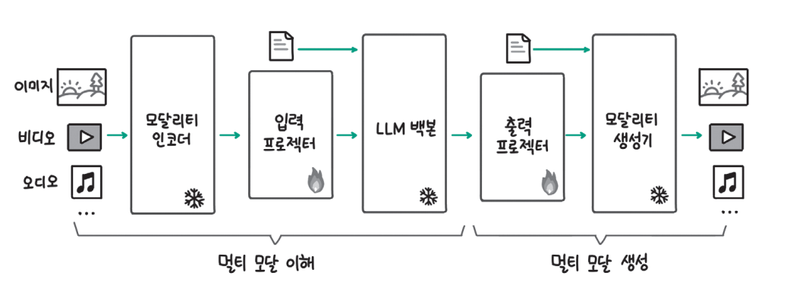
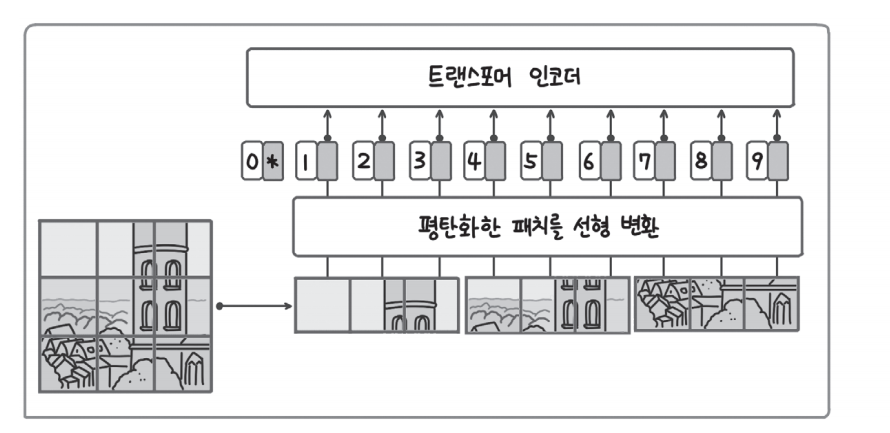
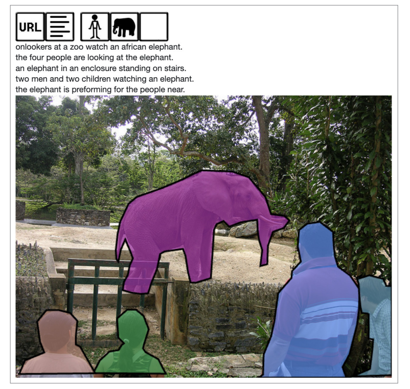
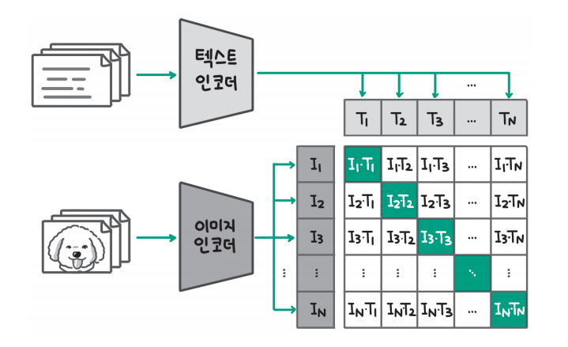
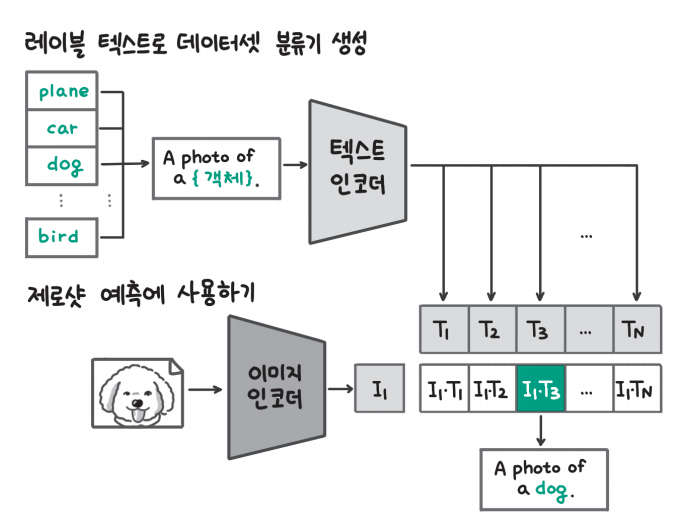
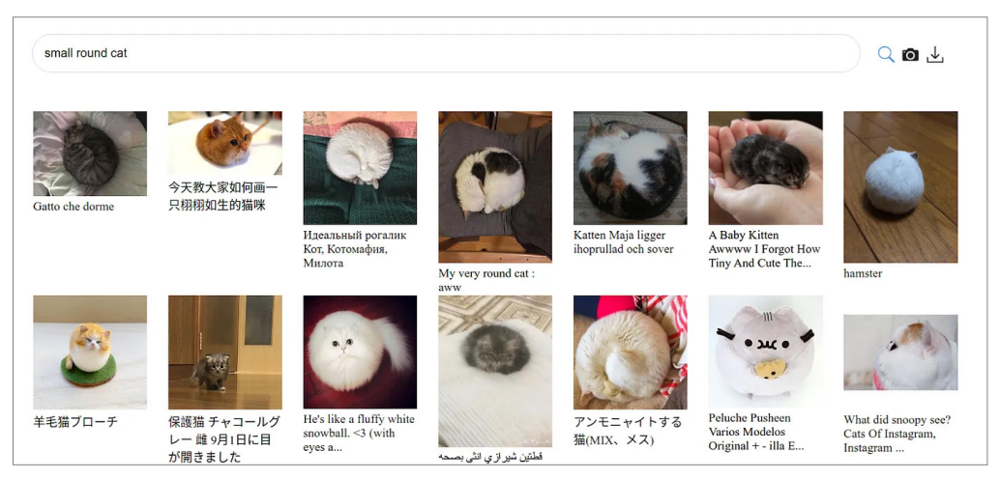
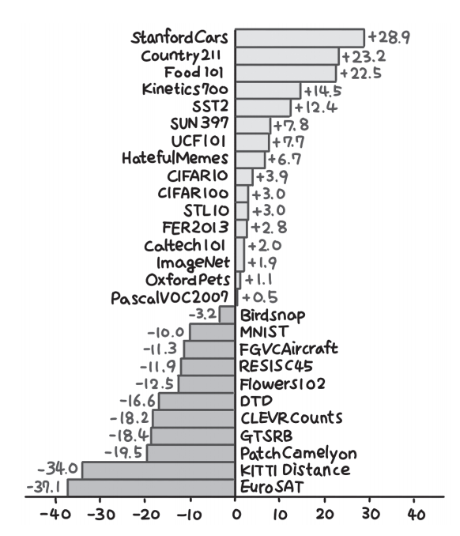

# **멀티 모달 LLM**  
LLM은 이름에서 알 수 있듯이 언어(텍스트)를 다루는 모델이다. 세상에는 텍스트 외에도 이미지, 음성, 영상 등 다양한 데이터 유형이 있다. AI 모델이 
더 많은 종류의 일을 처리하기 위해서는 더 많은 데이터 유형을 활요할 수 있어야 한다. 이 문제를 풀기 위해 멀티 모달(multi modal) 연구가 활발히 
진행되고 있다. OpenAI가 발표한 GPT-4V(GPT-4 Vision)나 GPT-4o(GPT-4 Omni)모델은 텍스트에 대해 이미지나 음성을 추가로 처리할 수 있는 기능을 
제공한다. OpenAI의 GPT-4o와 구글의 제미나이 모델을 필두로 멀티 모달 기능이 발표되면서 멀티 모달 모델에 대한 관심이 더 뜨거워지고 있다.  
  
  
  
위 그림에서는 GPT-4V 모델에 바다 사진을 주고 "사막에서 무슨 일이 벌어지고 있어?"라고 질문했을 때 모델은 이미지를 인식해 질문에 속지 않고 사막이 
없다는 점을 명확히 지적한 것을 확인할 수 있다.  
  
오픈소스 진영에서도 LLaVA(Large Language and Visual Assistant)나 Fuyu-8B 같은 멀티 모달 모델을 발표하고 있다. 멀티 모달 모델을 LLM과 
유사하게 LMM(Large Multi-modal Model)이라는 용어로 부르기도 한다.  
  
아래 명령을 실행해 코드 실행에 필요한 라이브러리를 설치한다.  
  
!pip install transformers==4.40.1 -qqq  
  
# **멀티 모달 LLM이란**  
멀티 모달 LLM이란 텍스트뿐만 아니라 이미지, 비디오, 오디오, 3D 등 다양한 형식의 데이터를 이해하고 생성할 수 있는 LLM을 말한다. 2024년에는 텍스트와 
이미지를 처리하는 멀티 모달 LLM이 가장 활발히 연구되고 있는 기술이고 비디오, 오디오, 3D 이미지를 다루는 멀티 모달 LLM은 아직 초기 단계에 해당한다. 
또한 아직까지는 멀티 모달 생성보다는 멀티 모달 이해 성능을 높이기 위한 기술 개발에 집중되어 있다. 설명의 편의를 위해 앞으로는 이미지와 텍스트를 처리하는 
멀티 모달 LLM을 가정하고 설명한다.  
  
멀티 모달 LLM은 LLM의 뛰어난 언어 이해 능력과 추론 능력을 중심으로 다양한 형식의 데이터를 이해하고 생성하는 능력을 추가하는 방식으로 구현된다.  
    
# **멀티 모달 LLM의 구성요소**  
  
  
일반적으로 멀티 모달 LLM은 위 그림과 같이 다섯 가지 구성요소로 이뤄진다. 멀티 모달 LLM은 이름에서도 알 수 있듯이 LLM이 가장 핵심적인 역할을 한다. 
LLM은 뛰어난 이해 능력과 추론 능력을 갖고 있기 때문에 이미지 형식의 데이터를 모달리티 인코더(modality encoder)와 입력 프로젝터(input projector)를 
통해 텍스트로 변환해 LLM에 입력한다.  
  
LLM의 출력은 기본적으로 텍스트인데 출력 프로젝터(output projector)를 통해 이미지 형태의 데이터 출력이 필요한지 판단하고 모달리티 생성기(modality 
generator)를 통해 특정 데이터 형식의 출력을 생성한다.  
  
위 그림에서 입력 프로젝터와 출력 프로젝터는 아래에 불꽃 아이콘이 있고 나머지는 모달리티 인코더, LLM 백본, 모달리티 생성기에는 얼음 아이콘이 있는데, 
멀티 모달 LLM의 학습 과정에서 파라미터의 업데이트 여부를 나타낸다. 얼음 아이콘이 있는 3개의 구성요소는 학습에 많은 데이터와 연산량이 필요하기 때문에 
멀티 모달 LLM 학습 과정에서 파라미터를 업데이트하지 않고 사전 학습된 모델을 그대로 사용한다. 불꽃 아이콘이 있는 입력 프로젝터와 출력 프로젝터는 
모달리티 인코더와 LLM 백본, 모달리티 생성기를 연결하는 구성요소로 멀티 모달 LLM 학습 과정에서 파라미터를 업데이트함으로써 멀티 모달 이해와 생성 
성능을 높인다.  
  
모달리티 인코더란 이미지, 비디오, 오디오 같이 텍스트 이외의 데이터 형식을 처리하기 위해 학습된 사전 학습 모델을 말한다. 인코더를 통과한 입력 데이터는 
특징 벡터로 변환되고 특징 벡터는 이후에 다룰 입력 프로젝터를 통해 텍스트로 변환된다. 즉 모달리티 인코더는 다양한 형식의 입력 데이터를 텍스트로 변환하기 
위한 준비 단계라고 할 수 있다.  
  
  
  
이미지를 처리하는 모달리티 인코더로 한정하면 위 그림과 같은 비전 트랜스포머(vision transformer)가 가장 많이 활용된다. 비전 트랜스포머는 텍스트를 
처리하기 위해 개발된 트랜스포머 아키텍처를 이미지에 적용한 모델로 위 그림과 같이 이미지를 패치(patch) 단위로 자른 후 마치 텍스트에서 단어를 처리하는 
것과 같이 일렬로 나열해 입력해 처리한다. 텍스트 토큰의 경우 토크나이저를 통해 숫자 아이디와 토큰 임베딩으로 변환할 수 있었는데 이미지 패치의 경우 
사전(vocabulary)을 구축하기 어렵기 때문에 선형 변환을 통해 이미지 임베딩 벡터로 변환함으로써 토큰 임베딩과 유사하게 만든다.  
  
이미지를 처리하는 모달리티 인코더로는 OpenAI가 개발한 CLIP(Contrastive Language-Image Pre-training)모델이 많이 사용된다. CLIP 모델은 인터넷상에서 
수집한 이미지와 캡션 데이터를 활용해 이미지와 텍스트를 같은 벡터 공간에 임베딩하도록 만들어진 모델로 내부적으로 이미지 처리 모델과 텍스트 처리 
모델이 함께 사용된다.  
  
모달리티 인코더가 이미지 데이터를 처리해서 이미지 임베딩으로 변환했다면 입력 프로젝터는 이미지 임베딩을 LLM 백본이 이해할 수 있는 텍스트로 변환한다. 
모달리티 인코더와 입력 프로젝터를 통해 모든 입력 데이터가 텍스트로 변환됐기 때문에 이제는 LLM이 전체를 입력으로 받아 추론 능력과 컨텍스트 학습 
능력 등 LLM의 처리 능력을 활용해 텍스트를 생성하고 반환한다.  
  
아직까지는 멀티 모달 생성을 수행하는 모델이 많지 않지만 구글의 제미나이 같은 멀티 모달 LLM은 텍스트는 물론 이미지를 생성할 수도 있다. LLM의 생성 
결과를 바탕으로 이미지를 생성하기 위해서는 크게 두 가지 단계가 필요하다. 먼저 이미지 생성이 필요한지 판단하는 단계와 만약 필요하다면 어떤 이미지를 
생성할지 정하는 단계다. 이 두 단계는 출력 프로젝터를 통해 수행되며 이미지 생성이 필요한 경우 이미지 생성 모델에 적절한 프롬프트를 생성하는 것이 
프로젝터의 역할이다. 출력 프로젝터를 통해 생성된 이미지 생성 프롬프트는 모달리티 생성기에 전달되고 최종적으로 이미지를 생성한다.  
  
# **멀티 모달 LLM 학습 과정**  
멀티 모달 LLM을 만들기 위해서는 사전 학습된 텍스트 전용 LLM이 멀티 모달 입력과 출력을 지원하기 위한 추가 훈련 단계를 거친다. 멀티 모달 LLM의 
학습 과정은 LLM과 마찬가지로 사전 학습과 지시 데이터셋을 활용한 지시 학습(instruction tuning)으로 나뉜다. 멀티 모달 사전 학습 단계에서 LLM은 
이미지-텍스트 쌍과 같은 대규모 멀티 모달 데이터 세트로 학습된다. 모델은 서로 다른 모달리티의 표현을 이해하고 그 관계를 연결하는 방법을 학습한다. 
이 단계에서는 LLM이 멀티 모달 데이터에 대한 전체적인 이해력을 습득하고 높이는 데 집중한다.  
  
사전 학습이 끝난 후에는 멀티 모달 지시 튜닝 단계를 진행한다. 이때 멀티 모달 LLM을 소규모 멀티 모달 지시 데이터셋으로 미세 조정한다. 여기서 지시란 
모델이 이미지 캡션을 생성하거나 입력 이미지에 대한 질문 응답 같은 특정 멀티 모달 작업을 수행하도록 학습시키는 것을 말한다. 사전 학습이 전체적인 
멀티 모달 이해도 향상을 위한 단계였다면 지시 튜닝은 모델이 특정한 멀티 모달 사용 사례에 맞춰 탁월한 성능을 발휘하도록 학습된다.  
  
앞서 언급한 대로 멀티 모달 LLM의 학습 과정에서 모달리티 인코더, LLM 백본, 모달리티 생성기와 같이 파라미터가 많은 부분은 추가 학습을 수행하지 않고 
세 구성요소를 연결하는 입력 프로젝터와 출력 프로젝터만 학습한다. 입력 프로젝터와 출력 프로젝터는 파라미터가 비교적 작기 때문에(예: 전체 모델의 1 ~ 2%) 
전체 모델의 크기가 크더라도 효율적인 학습이 가능하다.  
  
# **이미지와 텍스트를 연결하는 모델: CLIP**  
이번 절에서는 대표적인 이미지 인코더인 OpenAI의 CLIP 모델을 살펴보면서 이미지 모델과 텍스트 모델이 어떻게 연결되는지 알아본다. CLIP 모델은 
이미지 생성 모델인 DALL-E나 멀티 모달 LLM인 LLaVA의 일부로 사용됐을 만큼 AI 분야에서 중요한 위치를 차지하고 이 장의 나머지를 이해하는 데도 
핵심적인 모델이다.  
  
# **CLIP 모델이란**  
CLIP은 텍스트 데이터와 이미지 데이터의 관계를 계산할 수 있도록 텍스트 모델과 이미지 모델을 함께 학습시킨 모델로 2021년 OpenAI에서 개발했다. 
내부적으로 텍스트 모델과 이미지 모델 2개의 모델로 구성된다. 텍스트 임베딩 모델을 사용하면 두 문장이 서로 유사한지 또는 관련이 있는지 계산할 수 있어 
검색이나 분류 등의 작업에 활용할 수 있었다. 마찬가지로 텍스트와 이미지 데이터의 관계를 계산할 수 있다면 어떤 이미지와 어떤 텍스트가 유사한지 계산할 
수 있고 그 정보를 검색이나 분류에 활용할 수 있다.  
  
문장 임베딩 모델은 텍스트만 처리할 수 있기 때문에 1개의 모델로 서로 유사하거나 관련 있는 문장 쌍 데이터를 활용해 모델을 학습시킬 수 있었다.  
  
# **CLIP 모델의 학습 방법**  
CLIP 모델의 학습 방법을 이해하기 위해서는 먼저 CLIP 모델의 학습 데이터를 이해해야 한다. 문장 임베딩 모델을 학습시킬 때는 서로 유사 또는 비유사한 문장 
쌍, 서로 관련이 있거나 관련이 없는 문장 쌍을 사용했다. 이와 마찬가지로 CLIP 모델을 학습시킬 때는 서로 관련이 있는 이미지와 텍스트 쌍을 활용한다.  
  
  
  
이미지-텍스트 쌍의 데이터란 위 그림과 같이 이미지와 이미지에 대한 설명이 대응된 데이터를 말한다. 해당 그림은 MS-COCO(Common Objects in Context)데이터셋의 
예시 데이터로 코끼리와 사람이 이미지에 있고 동물원에서 사람들이 코끼리를 구경하고 있다는 설명이 붙어 있다. MS-COCO 데이터셋에는 각 물체가 어느 
영역에 있는지 기록한 경계선 정보도 함께 포함돼 있다. CLIP 모델이 개발된 2021년에도 MS-COCO나 Visual Genome(https://homes.cs.washington.edu/
~ranjay/visualgenome/index.html) 데이터셋, YFCC100M 데이터셋 같은 이미지-텍스트 쌍 데이터가 많이 활용됐다. 하지만 퀄리티가 높은 데이터셋은 
데이터의 수가 적고(MS-COCO, Visual Genome), 데이터의 수가 많은면 텍스트가 이미지의 의미를 충분히 담지 못한다는(YFCC100M) 아쉬움이 있었다. 
이런 이유로 CLIP 모델 연구팀은 직접 인터넷상에서 50만 개의 검색어로 4억 개의(이미지, 캡션) 쌍 데이터를 구축했다. 고품질의 데이터셋 구축을 위해서는 
많은 시간과 비용이 들기 때문에 인터넷상의 그림과 캡션을 수집해서 대량 데이터셋을 구축한 것이다.  
  
CLIP은 이름에서도 알 수 있듯이 대조 학습을 통해 모델을 학습시킨다. 대조 학습은 문장 임베딩 모델의 학습에서도 사용됐는데 유사한 데이터 쌍은 더 
가까워지도록 하고 유사하지 않은 데이터 쌍은 더 멀어지도록 학습시키는 방법을 말한다.  
  
  
  
더 자세히 살펴보면 먼저 위 그림과 같이 이미지와 텍스트를 각각 이미지 인코딩 모델과 텍스트 인코딩 모델에 넣어 임베딩으로 만든다. 그리고 그림 오른쪽에 
녹색으로 칠해진 서로 매칭되는 쌍(예: I1-T1, I2-T2...)의 유사도는 커지고 서로 매칭되지 않는 쌍(예: I1-T2)의 유사도는 작아지도록 학습시킨다. 
이때 텍스트 인코더로는 트랜스포머 모델을 사용하고 이미지 인코더로는 앞서 살펴본 ViT(Visual Transformer)나 ResNet 같은 이미지 모델을 사용한다.  
  
# **CLIP 모델의 활용과 뛰어난 성능**  
  
  
학습을 마친 CLIP 모델은 위 그림과 같이 제로샷 추론(zero-shot prediction)을 수행할 수 있다. 여기서 제로샷 추론이란 사전 학습 데이터 이외에 
특정 작업을 위한 데이터로 미세 조정을 하지 않은 상태에서 추론을 수행하는 것을 말한다. 먼저 레이블이 있는 데이터셋에서 레이블을 "A photo of a {객체}"로 
변경하는 프롬프트 엔지니어링을 수행한다. 단어 레이블을 그대로 사용할 경우 동음이의어 등의 문제로 의미를 온전히 담지 못하는 경우가 발생할 수 있기 
때문이다. 입력 텍스트는 학습된 텍스트 인코더를 사용해 텍스트 임베딩으로 만들고 이미지는 학습한 이미지 인코더를 사용해 이미지 임베딩을 만든다. 
임베딩 사이의 유사도가 가장 큰 인덱스가 추론 결과가 된다. 위 그림에서는 세 번째 레이블인 개(dog)와 이미지의 유사도가 가장 크기 떄문에 이미지를 개 
이미지라고 판단한다.  
  
  
  
CLIP 모델은 이미지와 텍스트 데이터의 유사도 계산을 활용해 이미지 검색에도 활용할 수 있다. 이미지 검색이란 위 그림과 같이 이미지와 텍스트의 유사도를 
기반으로 텍스트를 입력했을 때 유사한 이미지를 찾는 기능을 말한다. 그림에서 보면 'small round cat(작은 원형 고양이)'이라고 검색했을 때 고양이가 
동그랗게 몸을 말고 있는 이미지와 전체적으로 동그란 형태의 고양이 이미지를 찾는 것을 볼 수 있다. 이미지의 제목을 보면 다양한 언어가 섞여 있음에도 잘 
검색된 것을 확인할 수 있다.  
  
CLIP 연구팀은 제로샷 추론 성능을 측정하기 위해 27개의 데이터셋에 대해 지도 학습한 ResNet50 모델과 성능을 비교했다.  
  
  
  
결과는 위 그림과 같이 16개 데이터셋에서 해당 데이터셋을 전혀 학습하지 않은 CLIP 모델의 성능이 더 높았다. 심지어 STL10 데이터셋에서는 SOTA
(State of The Art) 성능을 달성하기도 했다. 비교적 CLIP의 성능이 떨어지는 데이터셋도 있었는데 연구팀은 위성 사진(EuroSAT, RESISC45), 
림프절 종양 이미지(PatchCamelyon), 자율주행 관련 데이터(GTSRB, KITTI Distance)처럼 전문화되고 복잡한 데이터에서 CLIP이 잘 작동하지 않았다고 
분석했다.  
  
하지만 위의 성능 평가가 해당 데이터셋으로 학습한 지도 학습 ResNet50과의 비교임을 감안했을 때 CLIP 모델이 상당한 일반화 능력을 갖고 있음을 
확인할 수 있다. CLIP 모델의 공개 이후 최근까지도 CLIP 모델은 이미지-텍스트 멀티 모달 기능을 만들 때 기본 모델로 사용될 정도로 뛰어난 성능을 
보여준다.  
  
