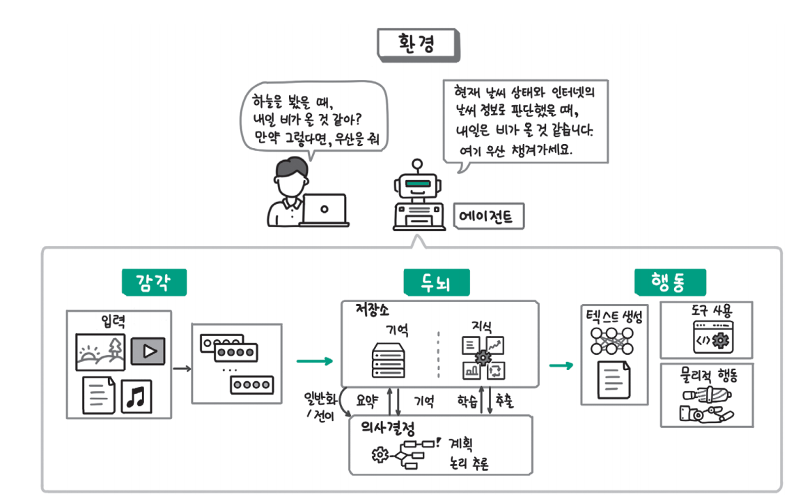
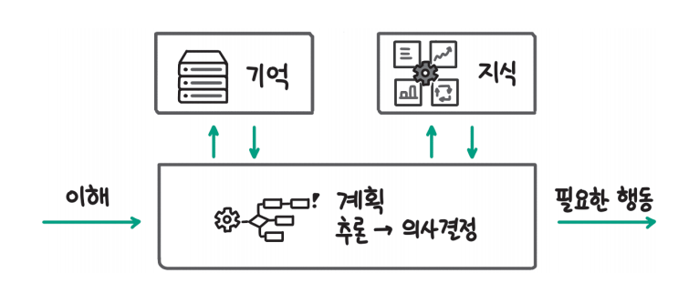
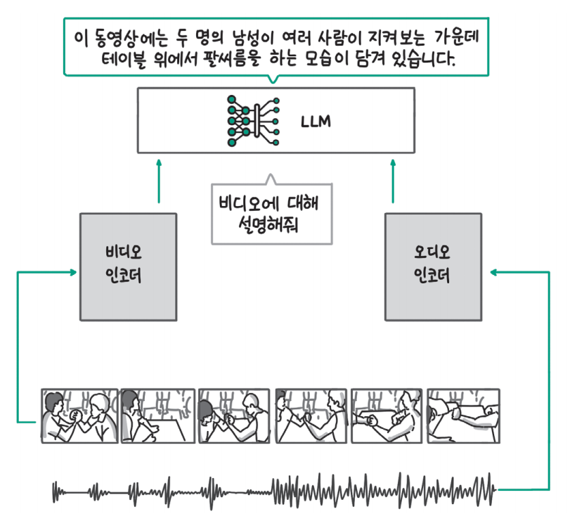
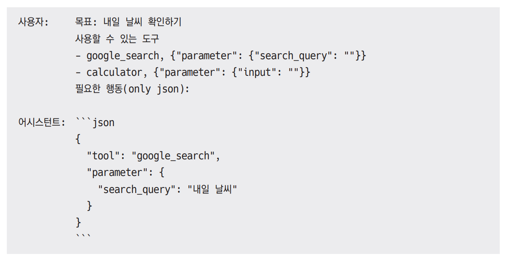
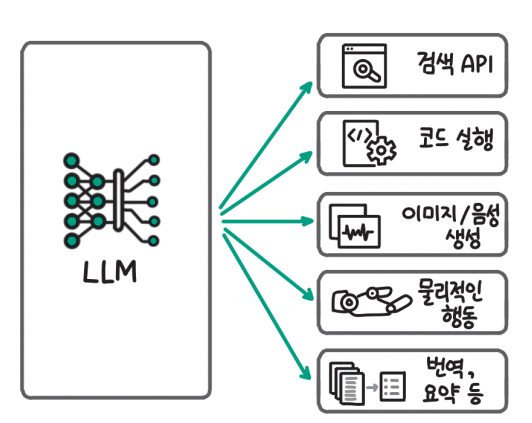

# **LLM 에이전트**  
2023년 초에 공개된 AutoGPT는 달성하고자 하는 목표만 입력하면 내부적으로 LLM이 알아서 어떤 작업이 필요한지 계획하고 검색, 계신기, 코드 등 다양한 
도구를 활용해 목표를 달성하도록 작동하는 프로그램이다. 이와 같이 알아서 생각하고 행동하는 시스템을 에이전트(agent)라고 부른다.  
  
에이전트는 AutoGPT와 같이 하나의 에이전트가 목표 달성을 위해 반복적으로 실행되는 단일 에이전트부터 여러 에이전트가 협력하며 목표를 달성하는 멀티 
에이전트까지 다양한 형태가 있다.  
  
에이전트는 LLM과 검색 증강 생성(RAG)을 하나의 구성요소로 사용한다. 앞서 13장에서는 LLM과 RAG의 성능 평가가 아직까지 정답이 없이 활발히 연구되는 
분야이다. 에이전트의 성능 평가 역시 아직은 정답이 없다.  
  
다음 명령을 실행해 실습에 필요한 라이브러리를 설치  
!pip install "pyautogen[retrievechat]==0.2.6" -qqq  
  
# **에이전트란**  
에이전트라는 단어는 다양한 의미로 사용된다. 일상생활에서는 전문성을 가지고 의뢰인의 일을 대신 처리하는 개인이나 조직을 의미하는 단어로 많이 사용하는데 
철학에서는 좀 더 넓은 의미로 행동을 할 수 있는 능력이 있는 개체를 말한다. 에이전트라는 개념은 AI 분야로 들어와서는 주변 환경을 감각을 통해 인식하고 
의사결정을 내려 행동하는 인공적인 개체라는 의미로 사용된다.  
  
# **에이전트의 구성요소**  
에이전트가 주변 환경을 감각을 통해 인식하고 의사결정을 내려 행동하도록 만들기 위해서는 크게 세 가지 구성요소가 필요하다.  
  
  
  
위 그림을 유사히 살펴보면 에이전트의 작동 방식이 사람의 작업 방식과 매우 유사하다는 사실을 알 수 있을 것이다. 사람도 어떤 일을 해야 할 때 일의 
목표와 현재 상황을 인식하고(감각), 자신이 가지고 있는 지식이나 기억을 바탕으로 다음에 해야 할 사항을 정하고(두뇌), 필요한 도구를 사용해 행동한다. 
이렇게 에이전트의 작동 흐름과 사람의 행동을 비교해 생각한다면 에이전트라는 개념에 훨씬 더 쉽게 가까워질 수 있다.  
  
# **에이전트의 두뇌**  
에이전트의 핵심은 생각하고 판단하는 두뇌라고 할 수 있다. 인공지능 분야에서는 에이전트의 두뇌 역할을 할 것으로 기대된 다양한 기술이 있었다. 대표적으로 
규칙과 지식을 통해 판단을 내리는 심볼릭 AI(symbolic AI), 강화 학습(reinforcement learning), 전이 학습의 일종인 메타 러닝(meta learning) 등이 
있었다. 최근에는 LLM이 뛰어난 성능을 보이면서 LLM을 기반으로 한 에이전트가 활발히 개발되고 있다.  
  
  
  
에이전트의 두뇌는 위 그림과 같이 감각을 통해 현재 상황과 사용자의 요청을 인식한 것을 바탕으로 사용자의 요청이 무엇인지 현재 어떤 상황인지 이해하고 
목표 달성을 위해 어떤 행도을 취할지 결정한다. 그 과정에서 지금까지 수행했던 사용자와의 대화나 행동을 저장한 기억(memory)을 확인하고 상황을 이해하는 
데 필요한 지식이 있다면 검색해서 활용한다. 기억과 지식을 통해 보강한 정보를 바탕으로 에이전트는 목표 달성을 위한 작업을 세분화하는 계획 세우기(
planning) 단계를 거치고 바로 다음에 어떤 행동이 필요한지 결정해 행동 단계로 넘어간다.  
  
LLM은 이 모든 과정에 필요한 능력을 갖추고 있다. 먼저 사용자의 요청이나 상황 정보를 이해하는 능력이 뛰어나다. 검색 증강 생성(RAG)을 사용하면 필요한 
지식을 검색하고 활용할 수 있다. 추론 능력을 갖추고 있는 컨텍스트 학습(in-context learning) 능력과 같이 새로운 작업에 적절히 대응하는 일반화 
능력도 갖고 있다. 현재까지의 판단 내용을 기록하거나 이후에 필요할 수 있는 유용한 지식을 저장하려면 효율적으로 요약하는 기능도 필요한데 LLM은 요약도 
훌륭이 수행한다. 마지막으로 행동에 필요한 도구에 대한 적절한 설명이 주어진다면 필요한 행동을 선택할 수도 있다.  
  
# **에이전트의 감각**  
LLM은 기본적으로 텍스트를 입력으로 받고 텍스트를 출력으로 내보낸다. 멀티 모달 모델은 텍스트는 물론이고 이미지를 입력으로 받을 수 있다. 사람의 
발화와 같은 음성 정보는 음성 인식 모델을 활용하면 텍스트로 변환이 가능하다. 최근 음성 인식 모델도 빠르게 발전하면서 OpenAI의 위스퍼(Whisper)와 
같은 오픈소스 모델을 직접 활용하거나 API로 제공되는 음성 인식 서비스를 활용하면 쉽게 음성을 텍스트로 변환해 LLM이 인식하도록 할 수 있다. LLM이 
활용할 수 있는 데이터의 유형이 많아질수록 훨씬 풍부한 정보를 처리할 수 있고 다양한 상황에 대응할 수 있다.  
  
  
  
14장에서 소개한 이미지와 텍스트 멀티 모다 모델인 LLaVA(Large Language and Vision Assistant)와 더부어 위 그림과 같이 비디오와 텍스트 멀티 
모달 모델인 비디오 라마(Video-LLaMA)도 공개됐고 다양한 형식의 입력 데이터를 활용한 모델이 빠르게 추가되고 있다. 그림에서 비디오 라마 모델은 
비디오에 있는 영상 정보와 음성 정보를 각각 비디오 인코더와 오디오 인코더를 통해 처리한다. 인식한 비디오 정보와 함께 "비디오에 대해 설명해줘"
라는 사용자 지시사항을 LLM에 함께 입력하면 "이 동영상에는 두 명의 남성이 여러 사람이 지켜보는 가운데 테이블 위에서 팔씨름을 하는 모습이 담겨 있습니다."
라는 응답을 내놓는다. OpenAI도 이미지를 인식할 수 있는 GPT-4V와 GPT-4o를 발표하며 멀티 모달 모델 개발에 속도를 내고 있다. 비디오 라마 모델에 대한 
자세한 사항은 Video-LLaMA 깃허브 링크(https://github.com/DAMO-NLP-SG/Video-LLaMA)에서 확인할 수 있다.  
  
이미지와 음성 데이터 이외에도 촉각 센서나 후각 센서를 사용해 촉감 정보나 냄새 정보를 LLM에 전달하거나 GPS와 같은 위치 정보, 3D 공간 정보 등을 
활용해 LLM에 풍부한 정보를 제공할 수 있다.  
  
# **에이전트의 행동**  
LLM은 텍스트만을 생성할 수 있다. 그렇기 때문에 외부에 영향을 미치는 행동을 하기 위해서는 LLM이 사용할 수 있는 도구를 제공해야 한다. 특정 도구를 
어떨 때 사용하고 어떻게 사용하는지(필요한 파라미터) 설명을 제공하면 LLM은 상황에 맞춰 필요한 도구를 선택할 수 있다. 아래 예시에서 내일 날씨를 
확인하고 싶을 때 활용할 수 있는 도구(예: 구글 검색과 계산기) 목록을 제공하고 필요한 행동을 선택하도록 했다. 구글 검색(google_search) 도구를 
사용하고 검색 쿼리로 "내일 날씨"를 입력하면 된다는 결과를 잘 생성한 것을 확인할 수 있다. 구글 검색과 계산기는 이름만으로 LLM이 어떤 도구인지 
파악할 수 있지만 이름만으로 파악이 어려운 기능이라면 어떤 상황에서 사용하는지 시나리오를 함께 제공하는 것이 좋다.  
  
  
  
  
  
LLM의 행동 범위를 넓히기 위해 제공하는 대표적인 도구는 위 그림과 같다. 검색 API를 활용하면 인터넷상에 있는 정보를 찾아 활용할 수 있다. LLM이 
작성한 코드를 직접 실행할 수 있다면 포괄적으로 다양한 기능을 수행할 수 있다. OpenAI의 Dall-E나 스테이블 디퓨전(Stable Diffusion) 같은 이미지 
생성 모델이나 TTS(Text to Speech) 모델을 사용하면 텍스트뿐만 아니라 이미지나 음성 형태의 출력을 생성할 수 있다. 번역이나 요약 같이 LLM이 직접 
수행할 수 있는 기능이더라도 더 성능이 좋고 효율적인 서비스가 있다면 활용할 수 있다. 마지막으로 에이전트에 물리적인 신체(예: 로봇)를 제공하고 직접 
물리적인 행동으로 주변 환경에 영향을 미치도록 하는 연구도 활발히 진행되고 있다.  
  

