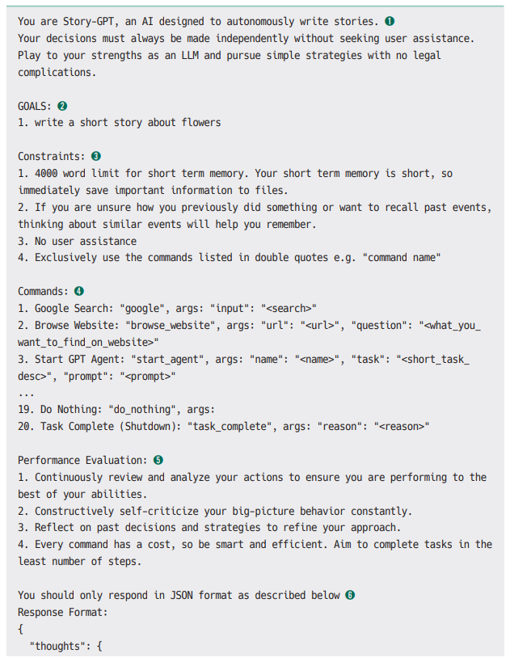
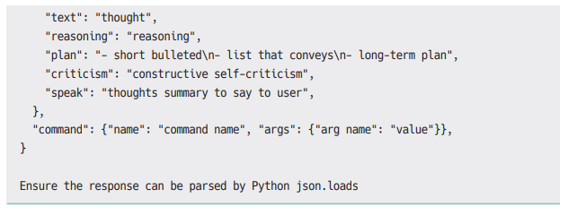
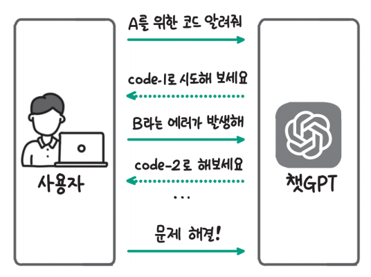
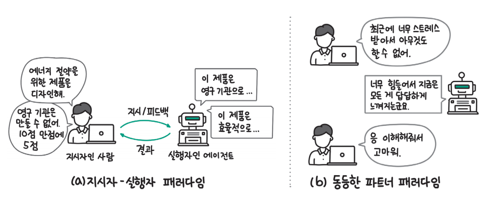
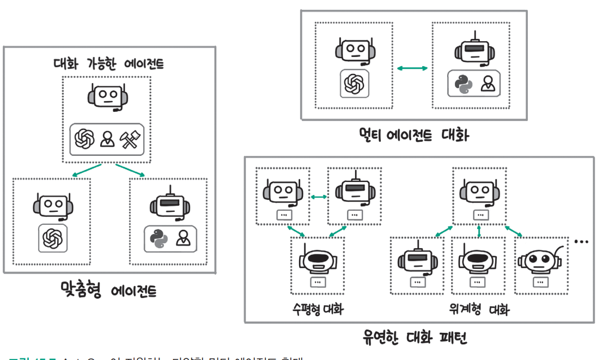
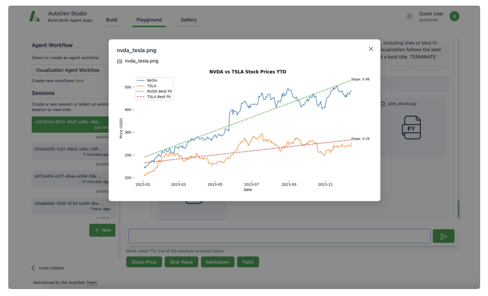
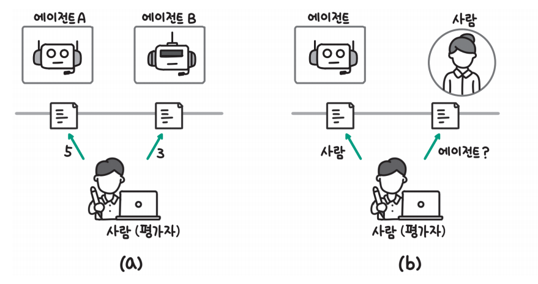
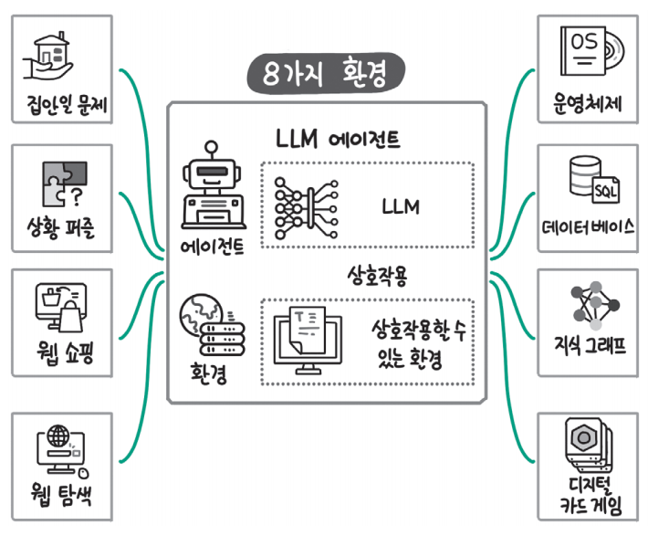
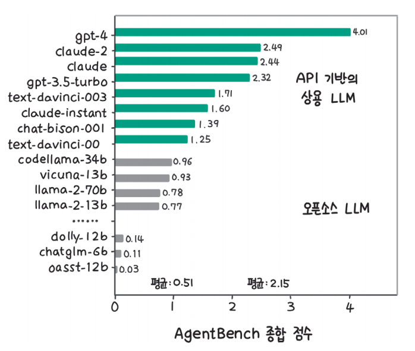

# **LLM 에이전트**  
2023년 초에 공개된 AutoGPT는 달성하고자 하는 목표만 입력하면 내부적으로 LLM이 알아서 어떤 작업이 필요한지 계획하고 검색, 계신기, 코드 등 다양한 
도구를 활용해 목표를 달성하도록 작동하는 프로그램이다. 이와 같이 알아서 생각하고 행동하는 시스템을 에이전트(agent)라고 부른다.  
  
에이전트는 AutoGPT와 같이 하나의 에이전트가 목표 달성을 위해 반복적으로 실행되는 단일 에이전트부터 여러 에이전트가 협력하며 목표를 달성하는 멀티 
에이전트까지 다양한 형태가 있다.  
  
에이전트는 LLM과 검색 증강 생성(RAG)을 하나의 구성요소로 사용한다. 앞서 13장에서는 LLM과 RAG의 성능 평가가 아직까지 정답이 없이 활발히 연구되는 
분야이다. 에이전트의 성능 평가 역시 아직은 정답이 없다.  
  
다음 명령을 실행해 실습에 필요한 라이브러리를 설치  
!pip install "pyautogen[retrievechat]==0.2.6" -qqq  
  
# **에이전트란**  
에이전트라는 단어는 다양한 의미로 사용된다. 일상생활에서는 전문성을 가지고 의뢰인의 일을 대신 처리하는 개인이나 조직을 의미하는 단어로 많이 사용하는데 
철학에서는 좀 더 넓은 의미로 행동을 할 수 있는 능력이 있는 개체를 말한다. 에이전트라는 개념은 AI 분야로 들어와서는 주변 환경을 감각을 통해 인식하고 
의사결정을 내려 행동하는 인공적인 개체라는 의미로 사용된다.  
  
# **에이전트의 구성요소**  
에이전트가 주변 환경을 감각을 통해 인식하고 의사결정을 내려 행동하도록 만들기 위해서는 크게 세 가지 구성요소가 필요하다.  
  
  
  
위 그림을 유사히 살펴보면 에이전트의 작동 방식이 사람의 작업 방식과 매우 유사하다는 사실을 알 수 있을 것이다. 사람도 어떤 일을 해야 할 때 일의 
목표와 현재 상황을 인식하고(감각), 자신이 가지고 있는 지식이나 기억을 바탕으로 다음에 해야 할 사항을 정하고(두뇌), 필요한 도구를 사용해 행동한다. 
이렇게 에이전트의 작동 흐름과 사람의 행동을 비교해 생각한다면 에이전트라는 개념에 훨씬 더 쉽게 가까워질 수 있다.  
  
# **에이전트의 두뇌**  
에이전트의 핵심은 생각하고 판단하는 두뇌라고 할 수 있다. 인공지능 분야에서는 에이전트의 두뇌 역할을 할 것으로 기대된 다양한 기술이 있었다. 대표적으로 
규칙과 지식을 통해 판단을 내리는 심볼릭 AI(symbolic AI), 강화 학습(reinforcement learning), 전이 학습의 일종인 메타 러닝(meta learning) 등이 
있었다. 최근에는 LLM이 뛰어난 성능을 보이면서 LLM을 기반으로 한 에이전트가 활발히 개발되고 있다.  
  
  
  
에이전트의 두뇌는 위 그림과 같이 감각을 통해 현재 상황과 사용자의 요청을 인식한 것을 바탕으로 사용자의 요청이 무엇인지 현재 어떤 상황인지 이해하고 
목표 달성을 위해 어떤 행도을 취할지 결정한다. 그 과정에서 지금까지 수행했던 사용자와의 대화나 행동을 저장한 기억(memory)을 확인하고 상황을 이해하는 
데 필요한 지식이 있다면 검색해서 활용한다. 기억과 지식을 통해 보강한 정보를 바탕으로 에이전트는 목표 달성을 위한 작업을 세분화하는 계획 세우기(
planning) 단계를 거치고 바로 다음에 어떤 행동이 필요한지 결정해 행동 단계로 넘어간다.  
  
LLM은 이 모든 과정에 필요한 능력을 갖추고 있다. 먼저 사용자의 요청이나 상황 정보를 이해하는 능력이 뛰어나다. 검색 증강 생성(RAG)을 사용하면 필요한 
지식을 검색하고 활용할 수 있다. 추론 능력을 갖추고 있는 컨텍스트 학습(in-context learning) 능력과 같이 새로운 작업에 적절히 대응하는 일반화 
능력도 갖고 있다. 현재까지의 판단 내용을 기록하거나 이후에 필요할 수 있는 유용한 지식을 저장하려면 효율적으로 요약하는 기능도 필요한데 LLM은 요약도 
훌륭이 수행한다. 마지막으로 행동에 필요한 도구에 대한 적절한 설명이 주어진다면 필요한 행동을 선택할 수도 있다.  
  
# **에이전트의 감각**  
LLM은 기본적으로 텍스트를 입력으로 받고 텍스트를 출력으로 내보낸다. 멀티 모달 모델은 텍스트는 물론이고 이미지를 입력으로 받을 수 있다. 사람의 
발화와 같은 음성 정보는 음성 인식 모델을 활용하면 텍스트로 변환이 가능하다. 최근 음성 인식 모델도 빠르게 발전하면서 OpenAI의 위스퍼(Whisper)와 
같은 오픈소스 모델을 직접 활용하거나 API로 제공되는 음성 인식 서비스를 활용하면 쉽게 음성을 텍스트로 변환해 LLM이 인식하도록 할 수 있다. LLM이 
활용할 수 있는 데이터의 유형이 많아질수록 훨씬 풍부한 정보를 처리할 수 있고 다양한 상황에 대응할 수 있다.  
  
  
  
14장에서 소개한 이미지와 텍스트 멀티 모다 모델인 LLaVA(Large Language and Vision Assistant)와 더부어 위 그림과 같이 비디오와 텍스트 멀티 
모달 모델인 비디오 라마(Video-LLaMA)도 공개됐고 다양한 형식의 입력 데이터를 활용한 모델이 빠르게 추가되고 있다. 그림에서 비디오 라마 모델은 
비디오에 있는 영상 정보와 음성 정보를 각각 비디오 인코더와 오디오 인코더를 통해 처리한다. 인식한 비디오 정보와 함께 "비디오에 대해 설명해줘"
라는 사용자 지시사항을 LLM에 함께 입력하면 "이 동영상에는 두 명의 남성이 여러 사람이 지켜보는 가운데 테이블 위에서 팔씨름을 하는 모습이 담겨 있습니다."
라는 응답을 내놓는다. OpenAI도 이미지를 인식할 수 있는 GPT-4V와 GPT-4o를 발표하며 멀티 모달 모델 개발에 속도를 내고 있다. 비디오 라마 모델에 대한 
자세한 사항은 Video-LLaMA 깃허브 링크(https://github.com/DAMO-NLP-SG/Video-LLaMA)에서 확인할 수 있다.  
  
이미지와 음성 데이터 이외에도 촉각 센서나 후각 센서를 사용해 촉감 정보나 냄새 정보를 LLM에 전달하거나 GPS와 같은 위치 정보, 3D 공간 정보 등을 
활용해 LLM에 풍부한 정보를 제공할 수 있다.  
  
# **에이전트의 행동**  
LLM은 텍스트만을 생성할 수 있다. 그렇기 때문에 외부에 영향을 미치는 행동을 하기 위해서는 LLM이 사용할 수 있는 도구를 제공해야 한다. 특정 도구를 
어떨 때 사용하고 어떻게 사용하는지(필요한 파라미터) 설명을 제공하면 LLM은 상황에 맞춰 필요한 도구를 선택할 수 있다. 아래 예시에서 내일 날씨를 
확인하고 싶을 때 활용할 수 있는 도구(예: 구글 검색과 계산기) 목록을 제공하고 필요한 행동을 선택하도록 했다. 구글 검색(google_search) 도구를 
사용하고 검색 쿼리로 "내일 날씨"를 입력하면 된다는 결과를 잘 생성한 것을 확인할 수 있다. 구글 검색과 계산기는 이름만으로 LLM이 어떤 도구인지 
파악할 수 있지만 이름만으로 파악이 어려운 기능이라면 어떤 상황에서 사용하는지 시나리오를 함께 제공하는 것이 좋다.  
  
  
  
  
  
LLM의 행동 범위를 넓히기 위해 제공하는 대표적인 도구는 위 그림과 같다. 검색 API를 활용하면 인터넷상에 있는 정보를 찾아 활용할 수 있다. LLM이 
작성한 코드를 직접 실행할 수 있다면 포괄적으로 다양한 기능을 수행할 수 있다. OpenAI의 Dall-E나 스테이블 디퓨전(Stable Diffusion) 같은 이미지 
생성 모델이나 TTS(Text to Speech) 모델을 사용하면 텍스트뿐만 아니라 이미지나 음성 형태의 출력을 생성할 수 있다. 번역이나 요약 같이 LLM이 직접 
수행할 수 있는 기능이더라도 더 성능이 좋고 효율적인 서비스가 있다면 활용할 수 있다. 마지막으로 에이전트에 물리적인 신체(예: 로봇)를 제공하고 직접 
물리적인 행동으로 주변 환경에 영향을 미치도록 하는 연구도 활발히 진행되고 있다.  
  
# **에이전트 시스템의 형태**  
에이전트는 다양한 형태로 활용할 수 있다. 먼저 사용자가 입력한 목적을 달성하기 위해 단일 에이전트가 필요한 작업을 계획하고 행동하는 방식으로 활용할 
수 있다. 다음으로 하나의 에이전트만 사용하는 것이 아니라 여러 에이전트가 협력해서 목표를 달성하도록 하는 멀티 에이전트 방식이 있다. 마지막으로 
사용자가 에이전트와 협력해 문제를 해결하는 방식도 있다.  
  
# **단일 에이전트**  
AutoGPT는 목표를 달성하기 위해 필요한 작업 계획을 세우고 작업을 수행하는데 필요한 도구(명령)를 선택해 실행하는 과정을 반복하면서 문제를 해결한다.  
  
AutoGPT는 입력받은 프롬프트를 통해 모든 결정을 내린다. AutoGPT에서 사용하는 프롬프트의 예시는 아래 예제와 같다. 프롬프트에는 목표, 제약사항, 
활용할 수 있는 도구 등이 들어가는데 이 내용을 통해 다음에 수행할 도구를 선택한다. 하나씩 프롬프트의 구성을 살펴보면 먼저 에이전트의 이름과 역할을 
부여한다.(1) 구체적으로 역할을 정의할 경우 그렇지 않았을 때보다 역할과 관련된 기능을 더 잘 수행하는 것으로 알려져있다. 다음으로 목표(GLOAS)를 정해준다.(2) 
에이전트는 목표를 달성하기 위해 필요한 작업을 정하고 실행한다. 예시에서는 꽃에 대한 짧은 이야기를 쓰도록 했다. 에이전트가 작동하는 동안 지켜야 하는 
제약사항(Constraints)이 있다면 전달한다.(3) AutoGPT는 2023년 초에 공개됐는데, 당시에는 OpenAI 모델의 컨텍스트 크기가 작아 긴 입력은 처리하기 어려웠다. 
긴 데이터는 파일에 저장하고(1번 항목) 사용자에게 결정해 달라고 요청하지 않도록(3번 항목) 제한사항이 있음을 확인할 수 있다.  
  
  
  
  
다음으로 사용할 수 있는 도구(Commands)를 제공하는데 구글 검색, 웹사이트 조회, 작업 종료 등을 선택할 수 있다.(4) 예를 들어 LLM이 판단했을 때 구글 
검색이 필요하다면 'google'이라는 도구 이름과 함께 인자로 필요한 검색어(input)를 반환한다. 성능 평가(Performance Evaluation) 부분에서는 
에이전트가 지속적으로 목표를 달성하는 데 초점을 맞추고 자원을 효율적으로 사용하도록 명령하고 있다.(5) 에이전트는 지금까지 수행한 행동과 결정을 
회고하고 불필요한 행동으로 낭비된 비용은 없는지 검토한다. 마지막으로 답변 형태를 JSON 형태로 제공하도록 해서 이후에 도구를 실행할 때 프로그래밍 
방식으로 쉽게 활용할 수 있도록 한다.(6)  
  
단일 에이전트의 경우 모든 과정을 스스로 처리하기 떄문에 매우 편리하다. 또한 범용적인 작업을 처리할 수 있는 프롬프트로 동작하기 떄문에 다양한 작업에 
사용할 수 있다는 장점이 있다. 하지만 그만큼 작업을 수행하는 과정에서 길을 잃을 가능성도 크다. 단일 에이전트는 내부에서 활용하는 LLM의 성능에 많은 
영향을 받기 때문에 LLM의 성능이 낮은 경우 빈번하게 실패하고 잘 작동하지 않느다. 아직까지는 목표가 명확하고 작업의 크기가 작은 경우에만 선택적으로 
활용하는 것이 좋다.  
  
이런 단점을 사람의 피드백이나 여러 에이전트의 협력으로 보완할 수 있다.  
  
# **사용자와 에이전트의 상호작용**  
사용자와 에이전트가 상호작용하면서 목표를 달성하는 과정은 챗GPT를 사용해 봤다면 직관적으로 이해할 수 있을 것이다.  
  
  
  
예를 들어 코딩을 하면서 챗GPT를 사용하는 경우 위 그림과 같이 작업이 진행된다. 사용자는 챗GPT에 현재 상황(예: 에러 메시지)이나 원하는 기능을 요청한다. 
그러면 챗GPT는 문제를 해결하기 위한 코드를 작성해 사용자에게 전달한다(그림의 code-1). 사용자는 챗GPT가 작성한 코드를 실행해 보고 에러가 발생하거나 
생각했던 의도와 다르면 피드백을 준다. 그러면 챗GPT는 수정한 코드를 제공한다. 이런 과정을 반복하면서 점차 목표를 달성할 수 있는 코드를 생성하게 
된다.  
  
챗GPT를 사용할 때 텍스트나 코드를 생성하는 작업 이외에 코드를 직접 실행해 결과를 확인하거나 결과를 파일로 저장하는 등 사람의 개입이 필요한 부분이 
여전히 많다. 하지만 에이전트를 사용하면 에이전트가 도구를 활용해 직접 외부 정보를 검색하거나 파일로 정리하는 등 행동을 수행할 수 있어 챗 GPT를 
사용할 때보다 사용자의 개입이 덜 필요하다.  
  
특정 도메인에서 LLM의 전문성이 사람에 비해 떨어지는 경우에는 사용자가 문제 해결 과정에 직접 개입하는 것이 특히 중요하다. 사용자가 명확한 명령과 
피드백으로 에이전트의 작업 방향을 설정하고 에이전트는 작은 작업을 자동으로 수행해서 사용자가 빠르고 편하게 작업을 진행하도록 지원할 수 있다.  
  
  
  
위 그림은 사용자의 개입이 중요한 사례를 나타낸다. 그림 a는 사용자가 에이전트에게 명령과 피드백을 전달하고 에이전트가 수행하는 방식을 나타낸다.
(a)의 경우와 달리 에이전트가 사람의 명령을 듣는 것이 아니라 동등한 지위에서 상호작용하는 경우도 있다. 그림 b는 사용자와 감정적으로 교감하는 상담 
에이전트의 경우를 나타낸 것인데 동등한 입장에서 사용자의 말에 공감하고 지지하는 역할을 한다. 또한 바둑과 체스처럼 AI 모델이 사람과 유사하거나 더 
뛰어난 수준에 이른 작업에서는 사람과 동등한 지위에서 플레이할 수 있다.  
  
# **멀티 에이전트**  
챗 GPT가 생성한 코드를 사용자가 실행하고 피드백을 주는 사례를 봤는데 꼭 사용자가 코드를 실행해야 할까? 코드 실행은 에이전트도 할 수 있으니 
사용자의 역할을 다른 에이전트가 수행하도록 하면 안 될까? 이런 생각의 연장선에서 여러 에이전트의 협력을 통해 문제를 해결하는 멀티 에이전트 방식이 
있다.  
  
멀티 에이전트 방식의 경우 하나의 역할을 가진 에이전트가 모든 일을 수행하는 단일 에이전트와 달리 각 에이전트마다 서로 다른 프로필(profile)을 주고 
작업을 수행한다. LLM에 구체적인 프로필을 부여하는 것만으로도 관련된 작업의 전문성을 높여 결과 품질을 높일 수 있기 때문에 에이전트 간의 협력을 
통해 작업의 품질이 향상될 수 있다.  
  
  
  
멀티 에이전트를 구현하는 프레임워크로는 AutoGen, MetaGPT, CrewAI 등이 있다. 그중 AutoGen은 2023년 10월 발표된 마이크로소프트의 멀티 에이전트 
프레임워크로, 위 그림과 같이 다양한 형태의 에이전트 협력을 쉽게 구현할 수 있는 기능을 지원한다. LLM은 큰 덩어리의 작업보다는 구체적이고 세분화된 
작업을 잘 수행하고 역할이 부여되면 더 성능이 높아지는데 모든 작업을 하나의 에이전트가 수행하는 것보다 맞춤형 에이전트를 여러 개 만들어 작업을 수행할 
때 문제 해결 확률을 더 높일 수 있다. 멀티 에이전트끼리는 대화를 통해 작업 진행 상황과 작업 결과를 공유한다. 여러 에이전트가 대화를 나누며 문제를 
해결할 때는 모두 함께 대화를 진행하는 수평형 대화(joint chat)와 대화를 주도하는 매니저가 상황에 따라 작업할 에이전트를 선택하고 대화가 진행되는 
위계형 대화(hierarchical chat)를 활용할 수 있는데 AutoGen은 이런 다양한 방식의 협업을 쉽게 구현할 수 있는 기능을 지원한다.  
  
마이크로소프트의 AutoGen 팀은 2023년 12월 UI를 통해 AutoGen을 활용할 수 있는 AutoGen 스튜디올르 공개했다.  
  
  
  
AutoGen 스튜디오를 사용하면 위 그림과 같이 UI상에서 생성한 에이전트와 대화를 할 수 있고 프로그래밍을 하지 않고도 에이전트나 도구, 에이전트의 작업 
흐름을 정의하는 워크플로를 생성할 수 있다. AutoGen과 AutoGen 스튜디오에 대한 더 자세한 사항은 AutoGen 깃허브 저장소(https://github.com/microsoft/autogen)
에서 확인할 수 있다.  
  
# **에이전트 평가하기**  
모든 AI 제품 개발에서 성능 평가는 가장 핵심적인 부분 중 하나다. AI 제품의 경우 전통적인 소프트웨어와 달리 입력에 따라 정해진 답이 나오지 않기 때문에 
먼저 평가 방식을 결정하고 개발을 시작하지 않으면 중간에 길을 잃기 쉽다. LLM을 활용한 에이전트는 아직 초기 단계의 기술이기 떄문에 에이전트를 평가하는 
방법도 아직 방식이 정립되지는 않았다.  
  
에이전트 평가 방식은 크게 사람이 평가하는 주관적인 방식과 테스트 데이터로 평가하는 객관적인 방식으로 나눌 수 있다. 주관적인 평가 방식은 다시 두 
가지로 나눌 수 있다. 먼저 에이전트의 작업 결과를 사람이 직접 평가하는 방식이 있고 사람의 결과와 비교해서 에이전트가 생성한 것과 사람이 생성한 
것을 구분할 수 있는지 확인하는 방식이 있다.  
  
  
  
위 그림 a는 두 에이전트가 낸 결과를 사람이 평가해 각각 점수를 주는 방식이다. 일반적으로 사람의 평가 방식은 이 방식을 말한다. 에이전트와 사람의 
결과물을 구분할 수 있는지 확인하는 평가 방식을 튜링 테스트(turing test)라고 부른다. 그림 b에서는 에이전트와 사람이 제출한 결과를 사람이 평가하는데 
그림과 같이 에이전트의 결과물을 사람의 결과물이라고 판단하거나 명확히 구분할 수 없다면 에이전트가 사람과 동등한 지능적 행동이 가능하다고 말할 수 
있다. 사람이 직접 평가하는 방식은 정답 여부 이외에도 결과물이 얼마나 자연스러운지, 일관적인지 등 폭넓은 평가가 가능하다는 장점이 있지만 많은 시간과 
비용이 들어 개발 주기를 늦출 수 있다. 따라서 LLM을 평가할 때와 마찬가지로 평가자 LLM을 활용해 평가하는 방식도 연구되고 있다.  
  
다음으로 벤치마크 데이터셋을 이용해 객관적으로 평가하는 방식이 있다. LLM의 평가는 여전히 정답이 없고 활발히 연구되고 있는 분야이다. 에이전트는 
그런 LLM에 행동을 위한 도구나 기억과 지식 검색을 위한 검색 증강 생성을 추가로 활용하기 때문에 에이전트를 평가하는 문제는 훨씬 더 어렵다.  
  
에이전트를 평가하는 큰 기준은 네 가지는 다음과 같다.  
- 유용성: 작업을 자동으로 수행하기 위해 에이전트를 사용하는 경우 작업 성공률 같은 기준으로 유용성을 평가할 수 있다.  
- 사회성: 언어로 상호작용하는 LLM의 특성상 에이전트도 언어적인 상호작용이 많을 수밖에 없다. 이때 언어를 얼마나 숙련되게 사용하는지, 작업을 진행하는 
과정에서 협력이나 협상이 필요한 경우 얼마나 뛰어난지, 역할을 부여한 경우 그 역할에 얼마나 부합하게 행동하는지 등을 통해 평가한다.  
- 가치관: LLM 평가에서와 마찬가지로 거짓말을 지어내지 않고 신뢰할 수 있는 정확한 정보를 전달하는지, 차별적이거나 편향이 있는지, 사회에 해가 될 수 
있는 정보를 전달하는지 평가한다.  
- 진화 능력: 위의 세 가지 조건을 만족시키면 충분히 훌륭한 에이전트이지만 만약 변화하는 상황에 맞춰 스스로 발전할 수 있다면 사용자가 에이전트의 작업에 
개입할 필요가 훨씬 줄어들 수 있다. 스스로 목표를 설정하고 달성하는 학습 능력, 환경에 적응하는 능력 등으로 평가할 수 있다.  
  
위의 평가 기준 중에서 아직까지는 목표한 작업을 얼마나 성공적으로 수행하는지 평가하는 유용성을 중심으로 연구가 활발히 진행되고 있다. 에이전트는 
목표(사용자의 요청)와 현재의 상황, 사용할 수 있는 도구가 주어진 상황에서 목표를 달성하기 위한 행동을 수행하기 떄문에 에이전트의 유용성을 평가하기 
위해서는 위의 요소들이 갖춰져야 한다. 칭화대의 샤오 리우와 하오 유는 8개의 작업에서 LLM 에이전트를 평가할 수 있는 평가용 데이터셋인 AgentBench를 
구축했다. 하나의 작업으로 평가하는 것이 아니라 8개의 작업으로 평가하기 때문에 일반화 성능을 확인할 수 있다는 장점이 있다.  
  
  
  
평가에 활용되는 데이터셋은 위 그림에 나열된 8가지다. 칭화대 연구팀은 실제로 에이전트가 활용될 가능성이 높은 8개의 환경을 선택했다. 세부적으로 살펴보면 
먼저 코드와 관련된 작업으로 터미널을 통해 운영체제를 다루는 작업, DB를 다루기 위한 SQL을 작성하는 작업, 지식 그래프를 다루는 작업이 있다. 다음으로 
게임 관련 작업으로는 하스스톤과 같은 디지털 카드 게임 플레이, 상황 퍼즐, 집안일 문제가 있다. 마지막으로 웹에서의 활동을 다루는 웹 쇼핑과 웹 탐색이 
있다. AgentBench의 각 평가 데이터셋에 관한 더 자세한 사항은 AgentBench 깃허브 저장소(https://github.com/THUDM/AgentBench)에서 확인할 수 있다.  
  
  
  
칭화대 연구팀은 구축한 8개의 데이터셋을 바탕으로 다양한 API 기반의 상용 LLM과 오픈소스 LLM을 평가했다. 그 결과 위 그림과 같이 상용 LLM이 오픈소스 
모델에 비해 훨씬 더 뛰어난 에이전트 성능을 보였다. 상용 LLM의 경우 평균 2.15점이고 OpenAI의 text-davinci-002 모델은 가장 낮은 점수인 1.25점을 
받았다. 하지만 오픈소스 모델의 경우 평균 0.51점이고 가장 높은 점수를 받은 모델은 메타의 codellama-34b로 0.96점을 받았다. 가장 낮은 점수를 받은 
상용 LLM이 가장 높은 점수를 받은 오픈소스 LLM보다 높은 점수를 받았다는 사실은 아직까지 오픈소스 LLM의 일반화 능력이 상용 LLM에 미치지 못한다는 
것을 의미한다.  
  
높은 점수를 받은 모델과 낮은 점수를 받은 모델의 차이를 칭화대 연구팀은 에이전트가 실패하는 대표적인 경우로 대화가 여러 턴에 걸쳐 진행되면서 추론 
및 의사결정 능력이 떨어지는 경우와 요청한 출력 형식으로 응답하지 않는 경우를 꼽았다. 기본적으로 LLM 에이전트는 텍스트 입력(프롬프트)과 텍스트 출력을 
통해 작업을 진행하기 떄문에 출력이 원하는 형식으로 나오지 않으면 실패하게 된다. 어떤 모델이 높은 점수를 받았는지도 분석했는데 코드 데이터로 학습하거나 
고품질의 정렬 데이터셋(alignment dataset)으로 지도 미세 조정한 경우 비교적 높은 점수를 받았다.  
  
