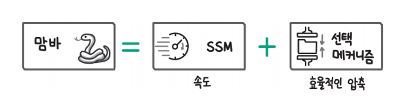
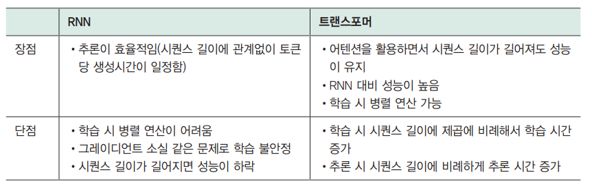
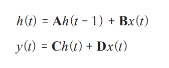
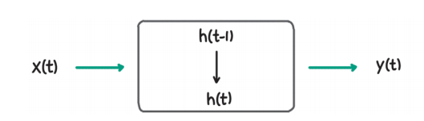
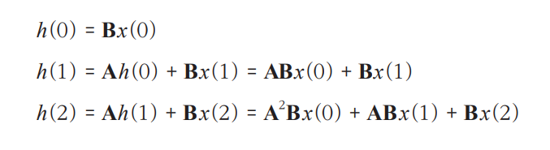
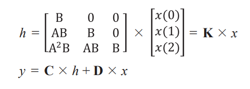
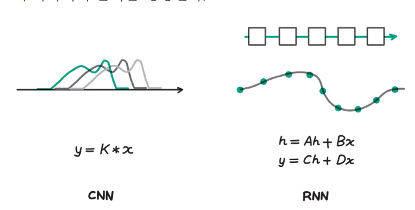
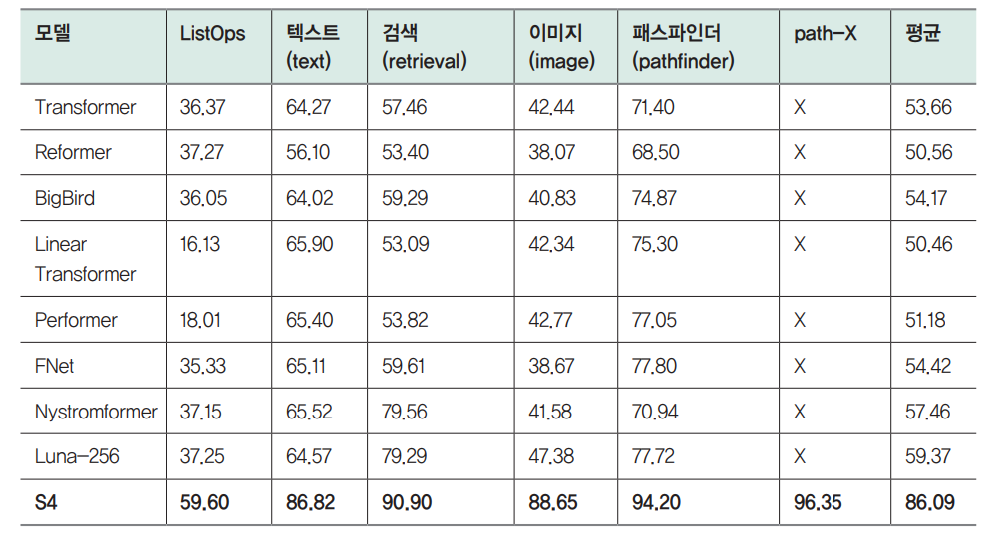

# **새로운 아키텍처**  
트랜스포머 아키텍처는 2017년 발표 이후 자연어 처리는 물론 딥러닝 전 분야에서 핵심 아키텍처로 자리 잡았다. 발전 속도가 빠른 AI 분야에서 이렇게 
널리 퍼지고 오랜 기간 핵심적인 자리를 지키고있다는 점에서 트랜스포머가 얼마나 강력한 아키텍처인지 엿볼 수 있다. 사람들은 항상 '언젠가 새로운 아키텍처가 
나오겠지'라고 생각했지만 오랫동안 트랜스포머 아키텍처의 성능을 뛰어넘는 모델이 나오지 않았다. 그러던 중 2023년 12월 맘바(Mamba) 아키텍처가 
"트랜스포머와 성능이 비슷하거나 뛰어나면서 추론 속도가 5배"라고 주장하며 발표되면서 AI 분야를 뜨겁게 달구고 있다.  
  
  
  
맘바를 이해하기 위해서는 위 그림과 같이 SSM(State Space Model)과 선택 메커니즘(selective mechanism)을 알아야 한다. 맘바는 RNN(Recurrent Neural Network)
을 개선한 모델이라고 할 수 있는데 SSM은 그중에서 속도를 높이기 위한 전략이고 선택 메커니즘은 문장의 맥락을 효율적으로 압축해 성능을 높이려는 
전략이다.  
  
# **기존 아키텍처의 장단점**  
지금까지 자연어 처리에서 사용하던 모델은 크게 두 그룹으로 묶을 수 있다. 먼저 2017년 이전에는 RNN을 주로 활용했고 2017년 이후에는 트랜스포머를 
주로 활용했다.  
  
  
  
각각의 장단점을 비교하면 위 표와 같다. RNN은 추론은 효율적이지만 학습할 때 입력을 병렬로 처리하지 못하고 순차적으로 입력하기 때문에 학습 속도가 
느리다는 단점이 있다. 또한 모델을 업데이트하기 위한 역전파 과정에서 그레이디언트가 너무 작아지거나 커지는 그레이디언트 소실(gradient vanishing) 
또는 그레이디언트 폭발(gradient exploding) 현상이 나타나 학습이 불안정했다. 마지막으로 한정된 메모리에 맥락을 압축하는 RNN의 특성상 문장이 
길어지면 성능이 떨어졌다. 이 문제는 이후 트랜스포머의 기반이 된 어텐션이 개발된 배경이기도 하다.  
  
앞서 언급한 대로 트랜스포머는 어텐션 연산을 사용하면서 시퀀스 길이가 길어져도 성능이 잘 유지된다. 어텐션 연산은 이전까지의 모든 텍스트와 관련도를 
계산하기 때문에 매 순간 모든 텍스트를 참조하기 떄문에 상당히 무겁다. 하지만 병렬화가 가능하다는 장점이 있는데 병렬화로 인해 학습 속도가 빠르고 
어텐션 연산으로 RNN보다 성능이 높아 다양한 사용 사례에서 채택됐다. 트랜스포머는 시퀀스 길이가 길어지면 빠르게 연산량이 커진다는 단점이 있는데 학습 
시에는 시퀀스 길이의 제곱에 비례하여 추론 시에는 시퀀스 길이에 비례하여 연산량이 증가한다.  
  
트랜스포머보다 연산이 가벼우면서 성능이 높은 모델을 개발하기 위해 RNN을 변형하는 연구가 꾸준히 있었다. 대표적으로 SSM 계열의 모델은 RNN이 갖고 있는 
추론의 효율성을 유지하면서 트랜스포머가 가진 학습 시 병렬 연산을 가능하게 하겠다는 목표로 개발됐다.  
  
# **SSM**  
맘바는 SSM 계열의 모델이다. SSM이란 내부 상태를 가지고 시간에 따라 달라지는 시스템을 해석하기 위해 사용하는 모델링 방법을 말한다. 일반적으로 SSM은 
다음과 같은 식으로 내부 상태와 출력이 시간에 따라 달라지는 과정을 수식화한다. 식에서 h는 모델 내부의 상태이고 x는 모델에 들어오는 입력을 말한다. 
A, B, C, D는 입력, 상태와 출력 사이의 관계를 연결하는 행렬이다. 마지막으로 y는 해당 시점의 출력이다.  
  
  
  
  
  
위 그림과 예시를 통해 직관적으로 이해해 보자. 시간에 따라 달라지는 시스템은 위 그림과 같이 표현할 수 있다. t 시점에 입력 x(t)가 들어오면 시스템의 
내부 상태는 h(t - 1)에서 h(t)로 바뀐다. 그리고 현재 시점의 출력 y(t)는 입력과 상태에 관련된다. 예를 들어 흑연을 넣으면 다이아몬드가 만들어지는 
기계가 있다고 하자. 이때 입력 x는 기계에 넣어주는 흑연의 양이고 상태 h는 기계 내부의 온도, 압력 또는 남아 있는 흑연의 양 등이 될 수 있다. 내부 
상태는 현재의 내부 상태와 입력으로 들어온 흑연의 양에 따라 달라진다. 또한 생산되는 다이아몬드의 양 y는 현재의 내부 상태와 입력된 흑연의 양에 따라 
달라진다.  
  
위의 식에서 추가로 중요하게 볼 부분은 입력, 상태, 출력 사이의 관계를 표현하는 A, B, C, D 모두 행렬이기 때문에 선형(linear) 관계를 가정한다는 점이다. 
딥러닝에서는 비선형(non-linear) 관계를 모델이 학습할 수 있도록 ReLU와 같은 활성 함수(activation function)를 계산에 추가해 왔다. 하지만 SSM은 
비선형 연산을 제거해서 계산의 효율성을 높인다.  
  
# **S4**  
대표적인 SSM 모델 중 하나인 S4(Structured State Space for Sequence Modeling)는 [Efficiently Modeling Long Sequences with Structured State Spaces
(구조화된 상태 공간으로 긴 시퀀스를 효율적으로 모델링하기)] 논문에서 제안됐다. S4는 SSM 모델의 계산 효율성을 높여 쉽게 모델을 학습시킬 수 있도록 했다.  
  
S4는 학습을 효율적으로 만들기 위해 A, B, C, D가 시간에 따라 변하지 않도록 고정한다. 이를 선형 시간 불변성(linear time invariant) 특성이라고 
한다. A와 B 행렬이 고정돼 있다면 SSM 모델에서 내부 상태는 다음과 같이 계산할 수 있다. 수식을 자세히 살펴보면 이전에 들어온 입력에 A 행렬이 
계속해서 추가로 곱해지는 형태임을 확인할 수 있다.  
  
  
  
이렇게 규칙적인 관계는 순차적으로 계산할 수도 있지만 다음과 같이 한 번에 계산할 수도 있다. 또한 출력 y는 h에 고정된 C 행렬을 곱하면 되므로 출력까지 
한 번에 계산이 가능하다. 다음 식을 보면 A 행렬이 반복적으로 곱해지는데 이때 더 효율적인 연산을 위해 S4에서는 A 행렬을 대각 행렬(diagonal matrix)
로 만든다.  
  
  
  
이런 특성을 사용해 S4에서는 학습에서는 컨볼루션(convolution) 연산을 통해 병렬로 계산해 학습 속도를 높이고 추론에서는 순차적인 방식으로 계산하는 
CNN과 RNN을 결합한 방식을 사용한다.  
  
  
  
위 그림에서 왼쪽은 학습에서 사용하는 CNN 방식으로 한 번에 여러 시점의 입력 데이터를 처리한다. 오른쪽은 추론에서 사용하는 RNN 방식으로 한 번에 
하나씩의 출력을 생성한다.  
  
이와 같은 계산 효율화 노력으로 S4는 학습과 추론 모두에서 효율적이면서 긴 시퀀스 입력에 뛰어난 성능을 보였다.  
  
  
  
S4는 구글과 딥마인드가 긴 시퀀스 입력(1k ~ 16k 토큰)에 대한 모델 평가를 위해 제안한 LRA(Long Range Arena)에서 위 표와 같이 트랜스포머 계열 
모델에 비해 월등한 성능을 보인다. LRA에 대한 더 자세한 설명은 LRA 논문(https://arxiv.org/pdf/2011.04006.pdf)에서 확인할 수 있다. 이 외에도 
오디오, 시계열 데이터와 같이 텍스트에 비해 입력이 긴 사용 사례에서도 S4는 뛰어난 성능을 보인다.  
  
하지만 S4는 언어 모델링처럼 이산적이고(discrete) 정보 집약적인 작업에서는 트랜스포머보다 낮은 성능을 보였다. 맘바는 자연어 처리에서 성능을 더 
높이기 위해 선택 매커니즘(selective mechanism)을 도입했다.  
  
