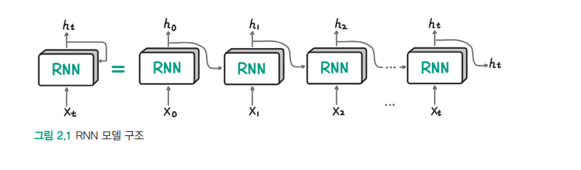

# **LLM의 중추, 트랜스포머 아키텍처 살펴보기**  
LLM(Large Language Model, 대규모 언어 모델)은 모델 크기가 큰 딥러닝 기반의 언어 모델로 2024년 현재 대부분의 LLM이 트랜스포머 아키텍처를  
기반으로 한다. 따라서 트랜스포머 아키텍처를 이해하지 않고는 LLM과 관련된 기술을 정확히 이해하기 어렵다.  
  
트랜스포머 아키텍처는 언어를 이해하는 인코더(encoder)와 언어를 생성하는 디코더(decoder) 부분으로 나뉘는데 자연어 처리 모델은 이중 어떤  
부분을 사용하느냐에 따라 세 가지 그룹으로 나눌 수 있다.  
  
# **트랜스포머 아키텍처란**  
트랜스포머 아키텍처는 2017년 구글의 아쉬쉬 바스와니 외 7인이 발표한 논문에서 처음 등장했다. 이 논문에서는 머신러닝을 통한 언어를 번역하는  
기계 번역 성능을 높이기 위한 방법을 연구했는데 이 방법은 당시 널리 사용되던 RNN에 비해 성능 면에서 큰 폭으로 앞섰다. 또한 트랜스포머는  
RNN에 비해 성능만 높은 것이 아니라 모델 학습 속도도 빨랐다. 완전히 새로운 형태의 모델이 성능과 속도 면에서 뛰어난 모습을 보이자 많은  
인공지능 연구자들이 각자의 연구에 프랜스포머를 적용하기 시작했다. 현재 트랜스포머는 자연어 처리는 물론 컴퓨터 비전, 추천 시스템 등 모든 AI  
분야에서 핵심 아키텍처로 사용되고 있다.  
  
기존에 자연어 처리 문제에서 사용하던 RNN은 텍스트를 순차적으로 하나씩 입력하는 형태다. 사람이 글을 읽을 때 왼쪽에서 오른쪽으로 차례대로  
읽는 것처럼 딥러닝 모델에 텍스트를 순차적으로 넣어준 것이다.  
  
토큰은 거의 모든 자연어 처리 연산의 기본 단위이고 보통 단어보다 짧은 텍스트 단위다. 