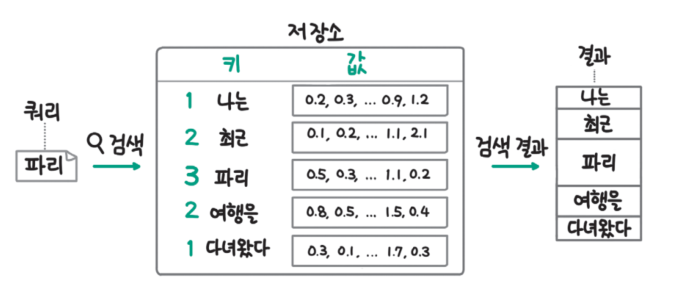
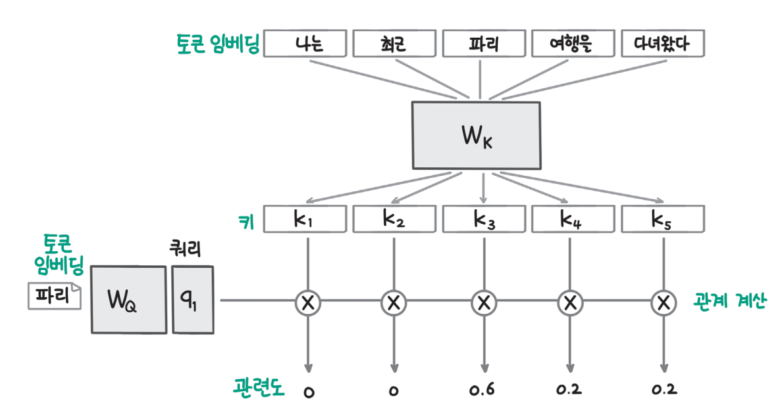

# **LLM의 중추, 트랜스포머 아키텍처 살펴보기**  
LLM(Large Language Model, 대규모 언어 모델)은 모델 크기가 큰 딥러닝 기반의 언어 모델로 2024년 현재 대부분의 LLM이 트랜스포머 아키텍처를
기반으로 한다. 따라서 트랜스포머 아키텍처를 이해하지 않고는 LLM과 관련된 기술을 정확히 이해하기 어렵다.  
  
트랜스포머 아키텍처는 언어를 이해하는 인코더(encoder)와 언어를 생성하는 디코더(decoder) 부분으로 나뉘는데 자연어 처리 모델은 이중 어떤
부분을 사용하느냐에 따라 세 가지 그룹으로 나눌 수 있다.  
  
# **트랜스포머 아키텍처란**  
트랜스포머 아키텍처는 2017년 구글의 아쉬쉬 바스와니 외 7인이 발표한 논문에서 처음 등장했다. 이 논문에서는 머신러닝을 통한 언어를 번역하는
기계 번역 성능을 높이기 위한 방법을 연구했는데 이 방법은 당시 널리 사용되던 RNN에 비해 성능 면에서 큰 폭으로 앞섰다. 또한 트랜스포머는
RNN에 비해 성능만 높은 것이 아니라 모델 학습 속도도 빨랐다. 완전히 새로운 형태의 모델이 성능과 속도 면에서 뛰어난 모습을 보이자 많은
인공지능 연구자들이 각자의 연구에 프랜스포머를 적용하기 시작했다. 현재 트랜스포머는 자연어 처리는 물론 컴퓨터 비전, 추천 시스템 등 모든 AI
분야에서 핵심 아키텍처로 사용되고 있다.  
  
기존에 자연어 처리 문제에서 사용하던 RNN은 텍스트를 순차적으로 하나씩 입력하는 형태다. 사람이 글을 읽을 때 왼쪽에서 오른쪽으로 차례대로
읽는 것처럼 딥러닝 모델에 텍스트를 순차적으로 넣어준 것이다.  
    
x는 텍스트 토큰(token)을 의미한다. 토큰은 거의 모든 자연어 처리 연산의 기본 단위이고 보통 단어보다 짧은 텍스트 단위다. h는 입력 토큰을
RNN 모델에 입력했을 떄의 출력인데 그림에서 확인할 수 있듯이 이전 토큰의 출력을 다시 모델에 입력으로 사용하기 떄문에 입력을 병렬적으로
처리하지 못하는 구조다. 이렇게 순차적으로 처리해야 하기 떄문에 학습 속도가 느리고 입력이 길어지면 먼저 입력한 토큰의 정보가 희석되면서
성능이 떨어진다는 문제가 있다. 또한 성능을 높이기 위해 층을 깊이 쌓으면 그레이디언트 소실(gradient vanishing)이나 그레이디언트 증폭
(gradient exploding)이 발생하며 학습이 불안정했다.  
  
트랜스포머는 이런 RNN의 문제를 해결하기 위해 입력을 하나씩 순차적으로 처리하는 방식을 버리고 셀프 어텐션(self-attention)이라는 개념을
도입했다. 셀프 어텐션은 입력된 문장 내의 각 단어가 서로 어떤 관련이 있는지 계산해서 각 단어의 표현(representation)을 조정하는 역할을
한다.  
  
트랜스포머 아키텍처는 RNN에 비해 다음과 같은 장점을 보였다.  
- 확장성: 더 깊은 모델을 만들어도 학습이 잘된다. 동일한 블록을 반복해 사용하기 떄문에 확장이 용이하다.  
- 효율성: 학습할 때 병렬 연산이 가능하기 떄문에 학습 시간이 단축된다.  
- 더 긴 입력 처리: 입력이 길어져도 성능이 거의 떨어지지 않는다.  
  
현재 사용되는 대부분의 LLM은 트랜스포머 아키텍처를 활용하고 있고 더 정확히 말하자면 트랜스포머 아키텍처가 있었기 떄문에 대규모 언어 모델이
가능했다고 할 수 있다.  
  
  
  
트랜스포머 아키텍처는 위의 그림과 같은 요소로 구성돼 있다. 트랜스포머 아키텍처는 위의 그림만 이해하면 모두 알았다고 봐도 될 정도로 이 그림은
중요하다.  
  
영어를 한국어로 번역한다고 가정하고 그림의 화살표를 따라 트랜스포머 아키텍처를 살펴보자. 트랜스포머 아키텍처는 크게 인코더와 디코더로 나뉜다.
그림의 왼쪽 상자는 언어를 이해하는 역할을 하는 인코더이고 오른쪽 상자는 언어를 생성하는 역할을 하는 디코더다. 공통적으로 입력을 임베딩층을
통해 숫자 집합인 임베딩으로 변환하고 위치 인코딩(positional encoding)층에서 문장의 위치 정보를 더한다. 인코더에서는 층 정규화
(layer normalization), 멀티 헤드 어텐션(multi-head attention), 피드 포워드(feed forward)층을 거치며 영어 문장을 이해하고 그 결과를
그림 중간의 선에 나타나듯이 디코더로 전달한다. 디코더에서는 인코더에서와 유사하게 층 정규화, 멀티 헤드 어텐션 연산을 수행하면서 크로스
어텐션 연산을 통해 인코더가 전달한 데이터를 출력과 함께 종합해서 피드 포워드 층을 거쳐 한국어 번역 결과를 생성한다.  
  
# **텍스트를 임베딩으로 변환하기**  
컴퓨터는 텍스트를 그대로 계산에 사용할 수 없다. 따라서 텍스트를 수자 형식의 데이터로 변경해야 한다. 텍스트를 모델에 입력할 수 있는 숫자형 데이터인
임베딩으로 변환하기 위해서는 크게 세 가지 과정을 거쳐야 한다. 먼저 텍스트를 적절한 단위로 잘라 숫자형 아이디(ID)를 부여하는 토큰화(tokenization)를 
수행한다. 다음으로 토큰 아이디를 토큰 임베딩 층을 통해 여러 숫자의 집합인 토큰 임베딩으로 변환한다. 마지막으로 위치 인코딩 층을 통해 토큰의 위치 정보를 담고 
있는 위치 임베딩을 추가해 최종적으로 모델에 입력할 임베딩을 만든다.  
  
  
  
# **토큰화**  
토큰화란 텍스트를 적절한 단위로 나누고 숫자 아이디를 부여하는 것을 말한다.  

  
  
토큰화란 위 그림과 같이 작게는 자모(자음과 모음) 단위부터 크게는 단어 단위로 나눌 수 있다. 음절은 중간 정도 단위로 볼 수 있다. 토큰화를 할 때는
어떤 토큰이 어떤 숫자 아이디로 연결됐는지 기록해 둔 사전(vocabulary)을 만들어야 한다. 큰 단위를 기준으로 토큰화할수록 텍스트의 의미가 잘 유지된다는 
강점이 있지만 사전의 크기가 커진다는 단점이 있다. 단어로 토큰화를 하는 경우 텍스트에 등장하는 단어의 수만큼 토큰 아이디가 필요하기 떄문에 사전이 커진다. 
또한 이전에 본 적이 없는 새로운 단어는 사전에 없기 때문에 처리하지 못하는 OOV(Out Of Vocabulary, 사전에 없는 단어) 문제가 자주 발생한다.  
  
반대로 작은 단위로 토큰화하는 경우 사전의 크기가 작고 OOV 문제를 줄일 수 있지만 텍스트의 의미가 유지되지 않는다는 단점이 있다.  
  
  
  
작은 단위와 큰 단위 모두 각각의 장단점이 뚜렷하기 떄문에 위의 그림과 같이 데이터에 등장하는 빈도에 따라 토큰화 단위를 결정하는 서브워드(subword) 
토큰화 방식을 사용한다. 서브워드 토큰화 방식에서는 자주 나오는 단어는 단어 단위 그대로 유지하고 가끔 나오는 단어는 더 작은 단위로 나눠 텍스트의 의미를 
최대한 유지하면서 사전의 크기는 작고 효율적으로 유지할 수 있다. 한글의 경우 보통 음절과 단어 사이에서 토큰화된다.  
  
텍스트를 숫자 아이돌 바꾸는 과정은 아래의 예제와 같은 코드로 수행할 수 있다. 최근의 토큰화는 서브워드 토큰화가 기본이지만 편의를 위해 단어 단위(띄어쓰기 단위)
로 토큰화를 수행했다. 앞으로의 예제에서도 표현의 편의상 단어 단위로 토큰화한 경우가 있을 수 있는데 실제로는 서브워드 토큰화를 활용한다는 점은 변함이 없다.  

transformer_with_code.ipynb 파일에서 토큰화 코드 참조  
  
# **토큰 임베딩으로 변환하기**  
딥러닝 모델이 텍스트 데이터를 처리하기 위해서는 입력으로 들어오는 토큰과 토큰 사이의 관계를 계산할 수 있어야 한다. 토큰과 토큰 사이의 관계를 계산하기 
위해서는 토큰의 의미를 숫자로 나타낼 수 있어야 하는데 앞서 토큰화에서 부여한 토큰 아이디는 하나의 숫자일 뿐이므로 토큰의 의미를 담을 수 없다. 의미를 담기 
위해서는 최소 2개 이상의 숫자 집합인 벡터(vector)여야 한다. 데이터를 의미를 담아 숫자 집합으로 변환하는 것을 임베딩이라고 한다. 여기서는 토큰을 
임베딩으로 변환하기 떄문에 토큰 임베딩이라고 부른다.  
  
아래 예제와 같이 파이토치(PyTorch)가 제공하는 nn.Embedding 클래스를 사용하면 토큰 아이디를 토큰 임베딩으로 변환할 수 있다. 이 코드에서는 
nn.Embedding 클래스에 사전 크기가 len(str2idx)(= 5)이고 embedding_dim차원의 임베딩을 생성하는 임베딩 층인 embed_laryer를 만들고 입력 
토큰을 임베딩 층을 통해 임베딩으로 변환했다. embedding_dim을 16으로 설정해 토큰 하나를 16차원의 벡터로 변환한다. 출력 결과를 보면 1개의 문장이고 
5개의 토큰이 있고 16차원의 임베딩이 생성됐음을 확인할 수 있다.  

transformer_with_code.ipynb 파일에서 토큰 아이디에서 벡터로 변환 참조  
  
위의 코드에서 임베딩 층(embed_layer)은 토큰의 의미를 담아 벡터로 변환한 것은 아니다. 지금의 임베딩 층은 그저 입력 토큰 아이디(input_ids)를 16차원의 
임의의 숫자 집합으로 바꿔줄 뿐이다. 임베딩 층이 단어의 의미를 담기 위해서는 딥러닝 모델이 학습 데이터로 훈련되어야 한다.  
  
바로 이 지점에서 딥러닝이 기존 머신러닝과 차별화되는데 딥러닝에서는 모델이 특정 작업을 잘 수행하도록 학습하는 과정에서 데이터의 의미를 잘 담은 임베딩을 
만드는 방법도 함께 학습한다.  
  
  
  
예를 들어 위 그림과 같이 입력 텍스트가 속한 카테고리를 맞추는 텍스트 분류 모델이 있다고 하자. 딥러닝 모델은 학습 데이터를 통해 이 그림과 같이 "나는 
최근 파리 여행을 다녀왔다"라는 문장에 맞는 카테고리로 잘 분류하도록 학습된다. 그 과정에서 딥러닝 모델의 첫 번째 단계인 임베딩 층도 학습되면서 점차 토큰의 
의미를 잘 담은 임베딩을 생성하게 된다.  
  
# **위치 인코딩**  
RNN과 트랜스포머의 가장 큰 차이점은 입력을 순차적으로 처리하는지 여부다. RNN은 입력을 순차적으로 처리하는데 그렇기 때문에 자연스럽게 입력 데이터의 순서 
정보가 고려된다. 트랜스포머는 순차적인 처리 방식을 버리고 모든 입력을 동시에 처리하는데 그 과정에서 순서 정보가 사라지게 된다. 하지만 텍스트에서 순서는 매우 
중요한 정보이기 떄문에 추가해 줘야 하는데 그 역할을 위치 인코딩이 담당한다.  
  
[Attention is All you need] 논문에서는 사인과 코사인을 활용한 수식을 통해 위치에 대한 정보를 입력했다. 하지만 그 이후에는 위치 인코딩도 위치에 따른 
임베딩 층을 추가해 학습 데이터를 통해 학습하는 방식을 많이 활용하고 있다. 수식을 통해 위치 정보를 추가하는 방식이나 임베딩으로 위치 정보를 학습하는 방식 
모두 결국 모델로 추론을 수행하는 시점에서는 입력 토큰의 위치에 따라 고정된 임베딩을 더해주기 때문에 이를 절대적 위치 인코딩(absolute position encoding)
이라고 부른다.  
  
절대적 위치 인코딩 방식은 간단하게 구현할 수 있다는 장점이 있지만 토큰과 토큰 사이의 상대적인 위치 정보는 활용하지 못하고 학습 데이터에서 보기 어려웠던 긴 
텍스트를 추론하는 경우에는 성능이 떨어진다는 문제가 있어 최근에는 상대적 위치 인코딩(relative position encoding)방식도 많이 활용된다. 지금은 트랜스포머가 모든 
입력 토큰을 동등하게 처리하기 때문에 입력으로 위치 정보를 함께 더해준다는 사실만 기억하면 충분하다.  
  
절대적 위치 인코등 중 위치 정보를 학습하는 방식은 아래 예제와 같이 새로운 임베딩 층을 하나 추가하고 위치 인덱스(position_ids)에 따라 임베딩을 더하도록 
구현할 수 있다. 이 코드에서는 최대 토큰 수(max_position)를 12로 설정하여 위치 인코딩을 생성하는 위치 임베딩 층(position_embed_layer)을 정의했다. 
위치 아이디(position_ids)에는 0부터 입력 토큰의 수(input_ids.size(1))까지 1씩 증가하도록 데이터를 생성한다. position_ids를 위치 임베딩 층에 입력해 
위치 인코딩(position_encodings)을 생성하고 토큰 임베딩(token_embeddings)에 위치 인코딩을 더해 모델에 입력할 최종 입력 임베딩(input_embeddings)을 준비한다.  

transformer_with_code.ipynb 파일에서 절대적 위치 인코딩 참조  
  
  
  
위에 진행한 세 가지 과정을 그림으로 다시 정리하면 위와 같다. 먼저 "나는 최근 파리 여행을 다녀왔다"라는 문장을 단어 단위로 토큰화를 수행하고 각 토큰에 토큰 
아이디와 위치 아이디를 부여했다. 이때 그림에서 토큰 아이디와 위치 아이디는 모두 [0, 1, 2, 3, 4]의 값을 갖는데 값은 동일하지만 토큰 아이디는 사전(str2idx)에 
저장된 토큰의 고유한 아이디를 의미하고 위치 아이디는 토큰의 위치를 의미한다. 예시 데이터이기에 같게 표현된 것이고 일반적으로는 같지 않다. 하나의 숫자로 된 
숫자 아이디는 데이터의 의미를 담을 수 없기 떄문에 의미를 담을 수 있도록 토큰 아이디와 위치 아이디를 토큰 임베딩 층과 위치 인코딩 층을 통해 토큰 임베딩과 위치 임베딩으로 
변환한다. 첫 번째 토큰 임베딩의 0.2, 0.3과 같은 개별 수는 의미를 해석하기 어렵지만 숫자의 모임인 [0.2, 0.3, ..., 0.9, 1.2]가 '나는' 이라는 토큰의 의미를 
담게 된다. 위치 임베딩도 동일하다.  
  
# **어텐션 이해하기**  
트랜스포머 카이텍처의 핵심은 어텐션이다. 어텐션의 사전적 의미는 '주의'라고 번역할 수 있는데 텍스트를 처리하는 관점에서는 입력한 텍스트에서 어떤 단어가 서로 
관련되는지 '주의를 기울여' 파악한다는 의미로 이해할 수 있다.  
  
# **사람이 글을 읽는 방법과 어텐션**  
사람이 글을 읽을 때를 생각해 보면 쉬운 글을 읽을 때는 왼쪽에서 오른쪽으로 흐르듯이 읽지만 복잡하고 어려운 글을 읽을 때는 자주 멈추면서 어떤 단어가 어떤 
단어와 연결되는지 문장 안에서 고민하기도 하고 문장 간에 찾아보기도 한다. 어텐션은 이렇게 사람이 단어 사이의 관계를 고민하는 과정을 딥러닝 모델이 수행할 수 있도록 
모방한 연산이다. 어텐션 작동 방식을 직관적으로 이해하기 위해 먼저 사람이 단어 사이의 관계를 확인하는 방법을 살펴보자.  
  
다음 문장을 봤을 때 '파리'가 도시인지 곤충인지 알 수 있겠는가?  
  
- ㅇㅇ ㅇㅇ 파리 ㅇㅇㅇ ㅇㅇㅇ  
  
'파리'의 앞뒤 단어가 가려져 있기 때문에 '파리'가 도시를 말하는지 곤충을 말하는지 판단할 수 없다. 하지만 다음 문장에서는 '파리'가 도시라는 사실을 명확히  
알 수 있다.  
  
- 나는 최근 파리 여행을 다녀왔다.  
  
사람은 단어를 그 단어만으로 해석하지 않고 주변의 단어를 통해 맥락을 추가한 새로운 단어로 이해하기 때문에 두 번째 문장에서의 '파리'를 파악할 수 있다.  
'파리' 주변에 있는 '여행'과 '다녀왔다'라는 맥락을 더해서 새롭게 프랑스의 수도인 '파리'로 이해한다. 어텐션으로 이 과정을 바라보면 '파리'와 관련이 깊은 
'여행을'과 '다녀왔다'에 주의를 기울려 '파리'가 도시라고 해석한 것이다.  
  
사람과 같이 자연스럽게 관련이 있는 단어를 찾고 그 맥락을 반영해 단어를 재해석하는 것처럼 어텐션 연산을 만드려면 먼저 단어와 단어 사이의 관계를 계산해서 그 
값에 따라 관련이 깊은 단어와 그렇지 않은 단어를 구분할 수 있어야 한다. 다음으로 관련이 깊은 단어는 더 많이, 관련이 적은 단어는 더 적게 맥락을 반영해야 한다.  
  
# **쿼리, 키, 값 이해하기**  
단어 사이의 관계를 계산해 관련성을 찾고 관련이 있는 단어의 맥락을 포함시켜 처리하기 위해 트랜스포머 아키텍처를 개발한 연구진은 쿼리, 키, 값이라는 개념을 
도입했다. 쿼리, 키, 값은 정보 검색 분야에서 가져온 용어다. 흔히 검색창에서 검색을 할 때 우리가 입력하는 검색어를 쿼리라고 한다. 쿼리를 입력하고 엔터 키를 치면 
검색 엔진은 수많은 자료 중에 쿼리와 관련이 있는 문서를 찾는다. 이때 쿼리와 관련이 있는지 계산하기 위해 문서가 가진 특징을 키라고 한다. 키로는 문서의 제목, 
문서의 본문, 저자 이름 등이 사용될 수 있다. 검색 엔진이 쿼리와 관련이 깊은 키를 가진 문서를 찾아 관련도순으로 정렬해서 문서를 제공할 때 문서를 값이라고 할 수 있다. 
우리가 검색하면서 원하는 것은 값이다.  
  
  
  
쿼리, 키, 값을 관련 있는 단어 찾기에 대입해 보면 위 그림과 같다. 예시 문장에서 '파리'와 관련이 있는 단어를 찾고자 할 때의 쿼리는 '파리'다. 쿼리와 관련이 
있는 단어를 찾을 때 키는 문장 속의 각 단어다. 쿼리와 관련이 있는 키를 찾은 경우 그 키에 연결된 값을 반환해야 하는데 이떄 값을 키의 토큰 임베딩으로 뒀다. 
이렇게 뒀을 때 '파리'라는 쿼리로 ['나는', '최근', '파리', '여행을', '다녀왔다']라는 키 묶음에서 관련이 있는 키를 찾았을 때 그림 오른쪽과 같이 '파리'와 
'여행을', '다녀왔다'가 적절히 섞인 값이 된다면 사람이 단어를 재해석하는 과정을 모방할 수 있다.  
  
  
  
가장 간단하게 주변 단어의 맥락을 반영하는 방법에는 위 그림과 같이 단어를 모두 동등하게 반영하는 방식이 있다. 이를 '평균'방법이라고 하자. 평균 방법은 그림에서처럼 
모든 단어를 1씩 동등하게 반영하기 떄문에 그 결과 그림 오른쪽과 같이 '파리'라는 단어가 ['나는', '최근', '파리', '여행을', '다녀왔다']를 모두 같은 비율로 
갖게 된다. 이러면 단어를 재해석한다는 목표는 달성하지만 관련이 깊은 단어를 더 많이 반영한다는 목표는 달성하지 못한다. 또 모든 단어에 평균 방법을 사용할 경우 모두 같은 
값을 갖게 된다는 문제도 있다.  
  
  
  
위 그림과 같이 가까이 있는 단어가 더 관련이 깊을 것이라는 가정을 세우고 자기 자신에게 가장 높은 가중치를 주고 멀어질수록 가중치를 낮추는 방식으로 의미를 
반영할 수도 있다. 경험적으로 봤을 때 글에서 가까운 곳에 있는 단어일수록 관계가 있는 경우가 많기 때문에 이 방식으로 '파리'를 재해석했을 때 평균 방식보다는 더 
나은 결과를 기대할 수 있다. 하지만 여전히 이상적인 결과는 나오지 않는다.  
  
앞에 살펴본 두 가지 방식은 모두 쿼리와 키의 관련도를 계산하지 않고 모두 동등하게 반영한다거나 거리에 따라 차등을 둔다는 적당한 가정을 세워 맥락을 반영했다. 
그 결과 원하던 형태의 결과를 얻지 못했고 이렇게 규칙에 기반한 방법은 입력 데이터가 "나는 최근 파리 여행을 다녀왔다"가 아니라 "나는 최근 파리 박물관을 다녀왔다"로 
바뀌더라도 동일한 계산을 하기 때문에 유연성이 떨어진다. 입력 데이터에 따라 다른 결과를 얻기 위해서는 관련도를 규칙이 아니라 데이터 자체에서 계산할 수 있어야 한다. 
  
그렇다면 이제 '파리'와 ['나는', '최근', '파리', '여행을', '다녀왔다']라는 키 집합의 관계를 계산해 보자. 한 가지 문제는 문자열은 그 자체로 계산할 수 없다는 점이다. 
하지만 앞에서 토큰을 의미를 담아 숫자형 데이터로 변환하는 토큰 임베딩을 다뤘다. 따라서 쿼리와 키 토큰을 토큰 임베딩으로 변환하면 계산이 가능하다.  
  
  
  
위 그림에서는 쿼리를 '파리'의 임베딩으로, 키를 각 토큰의 임베딩으로 두고 각각의 관계를 계산해서 관련도를 계산한다. 이때 토큰 자체가 아니라 임베딩임을 
나타내기 위해 토큰을 사각형 박스로 감싼 형태로 표현했다. 벡터와 벡터를 곱해 관계를 계산하면 그 관련도에 따라 주변 맥락을 반영할 수 있고 문자열이 일치하지 
않더라도 유사한 의미의 키로 저장된 정보를 검색할 수 있다.  
  
하지만 위와 같이 임베딩을 직접 활용해 관련도를 계산하는 방식은 두 가지 문제가 발생할 수 있다. 먼저, 같은 단어(예: 쿼리의 '파리'와 키의 '파리')끼리는 임베딩이 
동일하므로 관련도가 크게 계산되면서 주변 맥락을 충분히 반영하지 못하는 경우가 발생할 수 있다. 또한 토큰의 의미가 유사하거나 반대되는 경우처럼 직접적인 관련성을 띨 떄는 
잘 작동하지만 문법에 의거해 토큰이 이어지는 경우처럼 간접적인 관련성은 반영되기 어려울 수 있다. 예를 들어 예시 문장에서 '나는' 토큰과 '최근' 토큰은 '다녀왔다' 
토큰에 누가, 언제를 나타내는 문법 관계로 연결되지만 토큰 자체로 봤을 때는 서로 유사하거나 반대되는 경우가 아니므로 직접 계산해서는 관련성을 찾기 어렵다.  
  
  
  
트랜스포머 아키텍처에서는 이와 같은 문제를 피하기 위해 위 그림과 같이 토큰 임베딩을 변환하는 가중치 Wq,
Wk를 도입했다. 딥러닝에서는 어떤 기능을 잘하게 하고 싶을 때 가중치를 도입하고 학습 단계에서 업데이트되게 한다. 
트랜스포머에서는 Wq, Wk 가중치를 통해 토큰과 토큰 사이의 관계를 계산하는 능력을 학습시킨 것이다. 위 그림에서 가중치를 통해 토큰 임베딩을 변환한 쿼리와 
키를 각각 q,k로 표현했다.  
  
  
  
트랜스포머에서는 위 그림과 같이 값도 토큰 임베딩을 가중치(Wv)를 통해 변환한다. 이렇게 세 가지 가중치를 통해 내부적으로 토큰과 토큰 사이의 관계를 계산해서 
적절히 주변 맥락을 반영하는 방법을 학습한다. 쿼리와 키의 관계를 계산한 관련도 값과 토큰 임베딩을 값 가중치(Wv)로 변환한 값을 가중합 하면 우리가 구하고자 했던 
'파리'를 재해석한 결과를 얻을 수 있다.  
  
# **코드로 보는 어텐션**  
위의 그림에서 살펴본 방식은 트랜스포머 아키텍처의 핵심인 어텐션 연산과 거의 동일하다.  
  
위 그림에서의 가중치를 파이토치에서 제공하는 nn.Linear 층을 사용해 코드로 구현할 수도 있다. 쿼리, 키, 값에 대한 각각의 가중치를 weight_q, weight_k, 
weight_v로 생성하고 입력으로 준비한 input_embedding을 선형 층에 통과시켜 쿼리, 키, 값을 생성한다.  

transformer_with_code.ipynb 파일에서 쿼리, 키, 값 벡터를 만드는 nn.Linear 층 참조  
  
어텐션에는 여러 방식이 있는데 하단 예제에서는 스케일 점곱 방식을 사용해다. 단계별로 설명하면 먼저 쿼리와 키를 곱한다. 이때 분산이 커지는 것을 방지하기 위해 임베딩
차원 수(dim_k)의 제곱근으로 나눈다. 다음으로 쿼리와 키를 곱해 계산한 스코어(scores)를 합이 1이 되도록 소트트맥스(softmax)를 취해 가중치(weights)로 바꾼다. 
마지막으로 가중치와 값을 곱해 입력과 동이한 형태의 출력을 반환한다.  

transformer_with_code.ipynb 파일에서 스케일 점곱 방식의 어텐션 참조  
  
  
  
위 그림은 각 과정을 시각화한 그림이다. 쿼리(q1)는 4개의 키와 각각 곱해 위 예제에서의 스코어를 계산한다. 스코어는 [2.2, 1.1, -1.7, 0.2]로 나왔는데 이대로는 
어떤 단어와의 관계를 얼마나 반영할지 명확히 정하기 어렵기 때문에 합을 1로 만들 수 있도록 소프트맥스를 취한다. 위 그림에서는 x1만 연산해서 나타냈지만 x2, 
x3, x4 모두 동일한 과정으로 연산한다.  
  
  
  
마지막으로 연산으로 구한 가중치와 값을 곱한 후 더해서 주변 단어의 맥락을 반영한 하나의 값 임베딩으로 만든다. 위 그림에서 v1은 가중치가 0.672로 가장 크기 때문에 
가장 많은 비중으로 섞이고, v3은 가중치가 0.013으로 가장 작기 때문에 가장 적은 비중으로 섞인다.  
  
어텐션을 거치고 나면 입력과 형태는 동일하면서 주변 토큰과의 관련도에 따라 값 벡터를 조합한 새로운 토큰 임베딩이 생성되는데 이를 확인하는 코드는 아래 예제와 같다. 
이 코드에서 원본 입력인 input_embeddings의 형태는 [1, 5, 16]인데, compute_attention에 입력해 어텐션을 거치고 난 후의 임베딩인 after_attention_embeddings의 
형태도 [1, 5, 16]임을 확인할 수 있다.  

transformer_with_code.ipynb 파일에서 어텐션 연산의 입력과 출력 참조  
  
지금까지 살펴본 어텐션 연산 과정을 아래 예제와 같이 AttentionHead라는 하나의 클래스로 나타낼 수 있다. 쿼리, 키, 값 벡터를 생성하기 위해 사용하는 선형 층
(weight_q, weight_k, weight_v)을 __init__ 메서드에 생성하고 forward 메서드에서는 앞서 생성한 선형 층을 통해 쿼리, 키, 값 벡터를 생성하고 compute_attention 
함수를 사용해 어텐션 연산을 수행한다. 클래스를 사용할 때는 AttentionHead에 인자로 토큰 임베딩 차원(token_embed_dim)과 출력 차원(head_dim)을 전달하는데 
아래 예제에서는 입력과 출력의 차원이 같도록 둘 다 embedding_dim을 전달했다.  

transformer_with_code.ipynb 파일에서 어텐션 연산을 수행하는 AttentionHead 클래스 참조  
  
# **멀티 헤드 어텐션**  
트랜스포머 아키텍처를 고안한 논문 저자들은 한 번에 하나의 어텐션 연산만 수행하는게 아니라 여러 어텐션 연산을 동시에 적용하면 성능을 더 높일 수 있다는 
사실을 발견했다. 이를 멀티 헤드(Head는 독립적으로 Attention을 수행하는 작은 단위, 여러 개의 Head를 사용하면 여러 개의 다른 시점에서의 중요도를 학습할 수 있다)
어텐션이라고 한다. 직관적으로 이해하자면 토큰 사이의 관계를 한 가지 측면에서 이해하는 것보다 여러 측면을 동시에 고려할 때 
언어나 문장에 대한 이해도가 높아질 것이다.  
  
  
  
위 그림 a는 하나의 어텐션 연산을 수행하는 스케일 점곱 어텐션이고 b는 동시에 헤드의 수(그림의 h)만큼의 어텐션 연산을 수행하는 멀티 헤드 어텐션이다.  
  
코드로는 아래 예제와 같이 구현할 수 있다. AttentionHead와 대부분의 코드가 동일한데 헤드의 수(코드의 n_head)만큼 연산을 수행하기 위해 쿼리, 키, 값을 n_head개로 
쪼개고 각각의 어텐션을 계산한 다음 입력과 같은 형태로 다시 변환한다. 마지막으로 선형층을 통과시키고 최종 결과를 반환한다. 코드와 그림 b를 대응시켜 보면 코드의 
1~1번째 줄은 그림에서 Q,K,V가 처음 통과하는 여러 선형 층에 대응되고 1~1번째는 h번의 스케일 점곱 어텐션에, 1~1은 어텐션 결과를 연결하는 단계에, 1~1은 
마지막 선형 층에 대응된다. 예제에서는 헤드의 수를 4로 두고 멀티 헤드 어텐션 연산을 수행하는데 출력 결과를 보면 입력 형태와 출력 형태가 동일한 것을 확인할 수 있다.  

transformer_with_code.ipynb 파일에서 멀티 헤드 어텐션 구현 참조  
  
# **정규화와 피드 포워드 층**  
정규화란 딥러닝 모델에서 입력이 일정한 분포를 갖도록 만들어 학습이 안정적이고 빨라질 수 있도록 하는 기법이다. 과거에는 배치 입력 데이터 사이에 정규화를 수행하는 
배치 정규화(batch normalization)를 주로 사용했으나 트랜스포머 아키텍처에서는 특정 차원에서 정규화를 수행하는 층 정규화(layer normaliztion)를 사용한다. 
어텐션 연산이 입력 단어 사이의 관계를 계산해 토큰 임베딩을 조정하는 역할을 한다면 전체 입력 문장을 이해하는 연산이 필요한데 트랜스포머 아키텍처에서는 이를 위해 
완전 연결 층(fully connected layer)인 피드 포워드 층을 사용한다.  
  
# **층 정규화 이해하기**  
딥러닝 모델에 데이터를 입력할 때 입력 데이터의 분포가 서로 다르면 모델의 학습이 잘되지 않기 때문에 데이터를 정규화하여 입력하는 것이 중요하다. 예를 들어 
사람의 나이와 키를 기반으로 몸무게를 예측하는 모델을 생각해 보자. 나이는 일반적으로 1세에서 100세 사이의 값을 가지며 키는 140cm에서 200cm 사이의 값을 갖는다. 
만약 키 데이터를 mm 단위로 변환한다면 그 범위는 1400mm에서 2000mm로 변경된다. 이렇게 단위를 변경함으로써 데이터의 분포가 훨씬 넓어지고 결과적으로 모델이 
키 데이터의 중요성을 과대평가할 가능성이 높아진다. 즉 mm 단위로 키를 입력하면 모델이 나이와 키를 기반으로 몸무게를 예측하는 과정에서 키의 영향을 과도하게 반영하게 
되어 정확한 예측을 어렵게 만든다. 이러한 문제를 방지하기 위해 데이터를 정규화하여 모든 입력 변수가 비슷한 범위와 분포를 갖도록 조정하는 것이다. 이를 통해 
모델은 각 입력 변수의 중요성을 적절히 반영하여 좀 더 정확한 예측을 할 수 있게 된다.  
  
입력 데이터가 딥러닝 모델의 각 층을 거치면서 어떤 특성은 좁은 분포를 갖고 어떤 특성은 넓은 분포를 갖게 된다. 특히 층이 깊은 모델에서는 분포의 차이가 발생할 
가능성이 높아지고 그렇게 되면 학습이 잘되지 않는다. 그런 이유로 딥러닝 분야에서는 층과 층 사이에 정규화를 추가해 학습을 안정적으로 만드는 기법을 사용해 왔다. 
정규화는 여러 데이터의 평균과 표준편차를 구해서 다음과 같은 식으로 계산한다. 백터 x를 정규화한 norm_x는 벡터 x에서 x의 평균을 빼고 x의 표준편차로 나눠 
평균이 0이고 표준편차가 1인 분포를 갖게 된다.  
  
  
  
딥러닝에서는 평균과 표준편차를 구할 데이터를 어떻게 묶는지에 따라 크게 배치 정규화와 층 정규화로 구분한다. 일반적으로 이미지 처리에서는 배치 정규화를 사용하고 
자연어 처리에서는 층 정규화를 사용한다.  
  
  
  
배치 정규화는 이름에서 알 수 있듯이 위 그림과 같이 모델에 입력으로 들어가는 미니 배치 사이에 정규화를 수행한다. 자연어 처리에서 배치 정규화를 사용하지 않는 
이유를 직관적으로 이해해 보자면 자연어 처리에서는 입력으로 들어가는 문자의 길이가 다양한데 배치 정규화를 사용할 경우 정규화에 포함되는 데이터의 수가 제각각이라 정규화 
효과를 보장하기 어렵다. 위 그림에서 배치 정규화는 배치 내의 서로 다른 문장 데이터를 묶어 정규화를 수행한다. 이때 왼쪽의 첫 번째 토큰 묶음은 ['나는', '배치', '층'] 
모두 실제 데이터이기 때문에 세 데이터의 평균과 표준편차로 정규화를 하는 효과가 있다. 하지만 일곱 번째 토큰 묶음은 2개는 패딩 토큰이고 1개만 '사용한다'라는 실제 
데이터이기 때문에 사실상 정규화의 효과가 없다.  
  
  
  
층 정규화는 이런 단점을 보완할 수 있도록 위의 그림과 같이 각 토큰 임베딩의 평균과 표준편차를 구해 정규화를 수행한다. 그림에서 확인할 수 있듯이 문장별로 실제 
데이터의 수가 다르더라도 각각의 토큰 임베딩별로 정규화를 수행하기 때문에 정규화 효과에 차이가 없다.  
  
  
  
트랜스포머 아키텍처에서 층 정규화를 적용하는 순서에는 크게 두 가지 방식이 있다. 원 트랜스포머 논문에서는 위의 그림 a와 같이 어텐션과 피드 포워드 층(Attention은 모든 단어 간 관계를 학습하지만 피드 포워드 층, FFN은 각 단어[토큰]별 개별적인 특징을 학습)
이후에 층 정규화를 적용했다. 이를 사후 정규화(post-norm)라고 부른다. 하지만 2020년 루이 빈 시옹과 윤창 양이 발표한 논문에서 먼저 층 정규화를 적용하고 어텐션과 피드 포워드 층을 통과했을 때 
학습이 더 안정적이라는 사실이 확인됐다. 이를 사전 정규화(pre-norm)라고 부른다. 현재는 그림의 b와 같은 사전 정규화가 주로 활용된다.  
  
아래 예제와 같이 파이토치가 제공하는 LayerNorm 클래스를 이용해 간단히 코드로 구현할 수 있다. 이 코드에서는 우선 nn.LayerNorm 클래스로 층 정규화 레이어를 만든다. 
이때 토큰 임베딩 차원(embedding_dim)을 인자로 전달했고 입력 임베딩을 층 정규화 레이어에 통과시켜 정규화된 임베딩(norm_x)으로 만든다.  

transformer_with_code.ipynb 파일에서 층 정규화 코드 참조  
  
# **피드 포워드 층**  
피드 포워드 층(feed forward layer)은 데이터의 특징을 학습하는 완전 연결 층(fully connected layer)을 말한다. 멀티 헤드 어텐션이 단어 사이의 관계를 
파악하는 역할이라면 피드 포워드 층은 입력 텍스트 전체를 이해하는 역할을 담당한다. 피드 포워드 층은 아래 예제 코드와 같이 선형 층, 드롭아웃 층, 층 정규화, 
활성 함수로 구성된다. 임베딩의 차원을 동일하게 유지해야 쉽게 층을 쌓아 확장이 가능하기 때문에 입력과 출력의 형태가 동일하도록 맞춘다. 일반적으로 d_model 차원에서 
d_model보다 2~3배 큰 dim_feedforward 차원으로 확장했다가 다시 d_model로 변환한다.  

transformer_with_code.ipynb 파일에서 피드 포워드 층 코드 참조  
  
# **인코더**  
  
  
트랜스포머 인코더는 위 그림과 같다. 인코더는 위 그림과 같이 멀티 헤드 어텐션, 층 정규화, 피드 포워드 층이 반복되는 형태다. 상자 안을 보면 밖으로 뻗어나갔다가 
다시 더해지는 화살표 2개가 있는 것을 확인할 수 있는데 안정적인 학습이 가능하도록 도와주는 잔차 연결(residual connection)이다. 잔차 연결은 화살표 모양 그대로 
입력을 다시 더해주는 형태로 구현한다. 또한 그림에서 블록으 Ne번 반복된다고 표시되어 있는데 트랜스포머 인코더는 그림의 인코더 블록을 반복해서 쌓아서 만든다.  
  
하나의 인코더 층을 코드로 구현하면 아래 예제와 같다. __init__ 메서드에서 멀티 헤드 어텐션 층, 층 정규화, 드롭아웃, 피드 포워드 층을 불러온다. 다음으로 
위 그림의 인코더 순서 그대로 입력인 src를 self.norm1을 통해 층 정규화를 취하고 멀티 헤드 어텐션 클래스(MultiheadAttention)를 인스턴스화한 self.attn을 통해 
멀티 헤드 어텐션 연산을 수행한 후 잔차 연결을 위해 어텐션 결과에 드롭아웃을 취한 self.dropout1(attn_output)과 입력(src)을 더해준다. 마지막으로 self.feed_forward(x)
를 통해 피드 포워드 연산을 취한다.  

transformer_with_code.ipynb 파일에서 인코더 층 참조  
  
이제 위 그림에서 표시된 것과 같이 인코더 층(TransformerEncoderLayer)을 Ne번 반복되도록 코드로 구현한다. 아래 예제에서 get_clones 함수는 입력한 모듈
(module)을 깊은 복사를 통해 N번 반복해 모듈 리스트에 담는다. TransformerEncoder 클래스에서는 인자로 전달받은 encoder_layer를 get_clones 함수를 통해 
num_layers번 반복해 nn.ModuleList에 넣고 forward 메서드에서 for 문을 통해 순환하면서 인코더 층 연산을 반복 수행하도록 만든다.  

transformer_with_code.ipynb 파일에서 인코더 구현 참조  
  
# **디코더**  
  
  
디코더는 위 그림의 오른쪽 상자를 말한다. 디코더는 인코더와 비교할 때 두 가지 부분에서 차이가 있다. 먼저 인코더는 기본적인 멀티 헤드 어텐션을 사용하지만 
디코더 블록에서는 마스크 멀티 헤드 어텐션을 사용한다. 디코더는 생성을 담당하는 부분으로 사람이 글을 쓸 때 앞 단어부터 순차적으로 작성하는 것처럼 트랜스포머 
모델도 앞에서 생성한 토큰을 기반으로 다음 토큰을 생성한다. 이렇게 순차적으로 생성해햐 하는 특징을 인과적(causal) 또는 자기 회귀적(auto-regressive)이라고 말한다.  
  
실제 텍스트를 생성할 때 디코더는 이전까지 생성한 텍스트만 확인할 수 있다. 그런데 학습할 때는 인코더와 디코더 모두 완성된 텍스트를 입력으로 받는다. 따라서 
어텐션을 그대로 활용할 경우 미래 시점에 작성해야 하는 텍스트를 미리 확인하게 되는 문제가 생긴다. 이를 막기 위해 특정 시점에는 그 이전에 생성된 토큰까지만 
확인할 수 있도록 마스크를 추가한다. 아래 예제의 어텐션 코드에 is_causal 인자를 추가해서 디코더(인과적)인 경우 True로 설정해 마스크 연산을 추가할 수 있게 한다. 
이 코드에서 가장 중요한 부분은 미래 시점의 토큰을 제거하기 위한 마스크(temp_mask)를 만드는 부분이다.  
  
미래 시점 : 디코더는 학습 과정에서 주어진 데이터를 통해 답을 이미 알고 있는 상태이다. 하지만 마스킹을 통해 답을 직접적으로 참조할 수 없도록 제한하여 
모델이 스스로 답을 생성하도록 유도한다. 이렇게 함으로써 모델은 단순히 답을 외우는 것이 아니라 입력된 정보를 바탕으로 답을 추론하는 능력을 키울 수 있다.
디코더는 학습 과정에서 "오늘 밥은 뭐야?"라는 질문에 "밥과 고기입니다"라는 답변이 자주 등장하는 것을 보고 이 질문에 대한 답변으로 "밥과 고기입니다"가 적절하다는 것을 학습한다.
하지만 실제로 답변을 생성할 때는 마스킹 때문에 "밥과 고기입니다"라는 답변을 직접적으로 참조할 수 없다. 따라서 디코더는 학습한 내용을 바탕으로 "밥" 다음에 올 단어를 예측하고, 그 다음 단어를 예측하는 방식으로 답변을 생성한다.

transformer_with_code.ipynb 파일에서 디코더에서 어텐션 연산(마스크 어텐션) 참조  
  
위 코드를 살펴보면 is_causal이 참일 때는 torch.ones로 모두 1인 행렬에 tril 함수를 취해 아래 그림의 가운데 행렬과 같이 대각선 아래 부분만 1로 유지되고 
나머지는 음의 무한대(-inf)로 변경해 마스크를 생성한다. 마스크(예제의 temp_mask)를 아래 그림의 왼쪽인 어텐션 스코어 행렬(예제의 score)에 곱하면 행렬의 
대각선 아랫부분만 어텐션 스코어가 남고 위쪽은 음의 무한대가 된다. 위 코드에서 가중치(weights)를 만들기 위해 소프트맥스를 취하는데 이때 음의 무한대인 대각선 윗부분은 
가중치가 0이 된다.  
  
  
  
인코더와 디코더의 두 번째 차이는 크로스 어텐션(cross attention)이 있다는 것이다. 예를 들어 영어에서 한국어로 번역한다고 했을 때 인코더가 영어 문장을 
입력으로 받아 처리한 결과를 번역한 한국어를 생성하는 디코더가 받아 활용한다. 이때 쿼리는 디코더의 잠재 상태(모델이 학습한 숨겨진 내부 정보)를 사용하고 
키와 값은 인코더의 결과를 사용한다. 아래 예제에서는 인코더의 결과를 forward 메서드에 encoder_output 이라는 이름의 인자로 넣을 수 있도록 했는데 
self.multihead_attn(x, encoder_output, encoder_output)을 통해 크로스어텐션 연산을 수행한다.  

transformer_with_code.ipynb 파일에서 크로스 어텐션이 포함된 디코더 층 참조  
  
디코더는 인코더와 마찬가지로 디코더 층을 여러 번 쌓아 만든다. 아래 예제에서 get_clones 함수를 사용해 디코더 층을 N번 반복하고 nn.ModuleList를 활용해 
순회하도록 한다.  

transformer_with_code.ipynb 파일에서 디코더 구현 참조  
  
# **BERT, GPT, T5 등 트랜스포머를 활용한 아키텍처**  
트랜스포머 아키텍처를 활용한 모델은 크게 세 가지 그룹으로 나눌 수 있는데 인코더만 활용해 자연어 이해(Natural Language Understanding, NLU) 작업에 
집중한 그룹, 디코더만 활용해 자연어 생성(Natural Language Generation, NLG) 작업에 집중한 그룹, 인코더와 디코더를 모두 활용해 더 넓은 범위의 작업을 수행할 
수 있도록 한 그룹이다.  
  
각각의 장단점을 정리하면 아래 표와 같다.  
  
  
  
# **인코더를 활용한 BERT**  
트랜스포머의 인코더만을 활용해 자연어 이해 태스크에 집중한 대표적인 모델은 BERT(Bidirectional Encoder Representations from Transformers)이다. 
구글에서 개발한 BERT는 이름에서 나타나듯이 양뱡향 문맥을 모두 활용해 텍스트를 이해한다.  
  
  
  
BERT는 위 그림의 왼쪽과 같이 입력 토큰의 일부를 마스크 토큰으로 대체하고 그 마스크 토큰을 맞추는 마스크 언어 모델링(Masked Language Modeling, MLM)과제를 
통해 사전 학습한다. 사전 학습한 모델은 이후에 필요한 다운스트림(downstream)과제에 따라 미세 조정(fine-tuning)해 사용한다. 위 그림에서는 사전 학습된 
BERT를 메일이 스팸인지 아닌지를 분류하는 텍스트 분류 작업으로 미세 조정했다. 하지만 BERT는 텍스트 분류뿐만 아니라 토큰 분류(token classification), 질문 답변
(question answering), 자연어 추론(natural language inference)등 다양한 자연어 이해 작업에서 훌륭한 성능을 보인다.  
  
특히 BERT는 양뱡향 문맥을 이해할 수 있다는 특징이 있어 자연어 이해 작업에서 뛰어난 성능을 보인다. BERT가 큰 성공을 거둔 이후로 BERT를 개선핸 RoBERTa, 
ELECTRA 등 여러 변형 인코더 모델이 나왔다. BERT는 생성 작업에는 적합하지 않아 최근 LLM의 인기와는 다소 관련이 떨어진다고 생각할 수 있지만 LLM의 활용 과정에서도 
사용자 발화의 의도 분류와 같이 효율적인 LLM 활용을 위한 연결 작업에는 자연어 이해 작업이 많이 사용되기 때문에 여전히 가장 사랑받는 모델군 중 하나다.  
  

  

  

 
 

  

  

  
