# **트랜스포머 모델을 다루기 위한 허깅페이스 트랜스포머 라이브러리**  
2017년 트랜스포머 아키텍처가 공개된 이후 2018년 구글의 BERT와 OpenAI의 GTP가 개발되면서 트랜스포머 아키텍처를 활용한 모델이 쏟아져 나오기 시작했다. 
당시에는 모델을 개발하는 조직마다 각자의 방식으로 모델을 구현하고 공개했는데 핵심적인 아키텍처를 공유함에도 구현 방식에 차이가 있어 모델마다 활용법을 익혀야 
한다는 문제가 있었다. 수많은 모델이 쏟아지는 상황에서 그런 진입 장벽으로 인해 연구와 개발의 속도가 늦춰졌다. 허깅페이스(Huggingface)팀이 개발한 
트랜스포머 라이브러리는 공통된 인터페이스로 트랜스포머 모델을 활용할 수 있도록 지원함으로써 이런 문제를 해결했고 현재는 딥러닝 분야의 핵심 라이브러리가 됐다.  
  
코랩 트랜스포머 라이브러리 설치  
!pip install transformers==4.40.1 datasets==2.19.0 huggingface_hub==0.23.0 -qqq  
  
# **허깅페이스 트랜스포머란**  
허깅페이스 트랜스포머는 다양한 트랜스포머 모델을 통일된 인터페이스로 사용할 수 있도록 지원하는 오픈소스 라이브러리다. 만약 허깅페이스 트랜스포머가 없었다면 
사람들은 새로운 모델이 공개될 때마다 그 모델을 어떻게 불러올 수 있는지, 모델이 어떤 함수를 갖고 있는지, 어떻게 학습시킬 수 있는지 파악하는 데 많은 시간을 써야 
했을 것이다.  
  
허깅페이스는 크게 트랜스포머 모델과 토크나이저를 활용할 때 사용하는 transformers 라이브러리와 데이터셋을 공객하고 쉽게 가져다 쓸 수 있도록 지원하는 datasets 
라이브러리를 제공해 트랜스포머 모델을 쉽게 학습하고 추론에 활용할 수 있도록 돕는다.  
  
허깅페이스 트랜스포머를 활용하면 서로 다른 조직에서 개발한 BERT와 GPT-2 모델을 아래 예제와 같이 거의 동일한 인터페이스로 활용할 수 있다. AutoModel과 
AutoTokenizer 클래스를 사용해 BERT 및 GPT-2 모델과 토크나이저를 불러오고 토큰화를 수행해서 모델에 입력으로 넣어준다. 모델의 이름에 해당하는 bert-base-uncased와 
gpt2 이외에는 두 코드가 사실상 동일한데 이런 편리함 때문에 허깅페이스 트랜스포머를 많이 활용한다.  
  
chapter3.ipynb 파일에서 BERT와 GTP-2 모델을 활용할 때 허깅페이스 트랜스포머 코드 비교 참조  
  
# **허깅페이스 허브 탐색하기**  
허깅페이스의 허브는 다양한 사전 학습 모델과 데이터셋을 탐색하고 쉽게 불러와 사용할 수 있도록 제공하는 온라인 플랫폼이다. 또한 간단하게 자신의 모델 데모를 
제공하고 다른 사람의 모델을 사용해 볼 수 있는 스페이스(Spaces)도 있다. 유명한 모델이 모델 허브에 공개되지 않은 경우 허깅페이스 팀이 직접 모델을 변환해 공개하기도 
한다.   
  
# **모델 허브**  
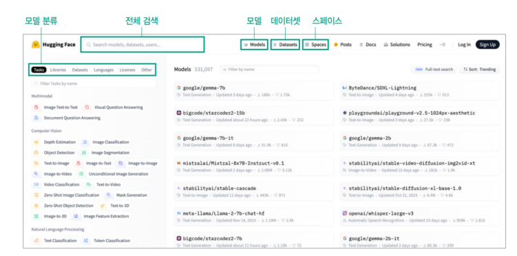  
https://huggingface.co/models  
  
모델 허브에는 위 그림과 같이 어떤 작업(Tasks)에 사용하는지, 어떤 언어(Languages)로 학습된 모델인지 등 다양한 기준으로 모델이 분류되어 있다. 그림에서 '모델 분류'로 
강조표시한 박스 안에서 Tasks를 선택하면 작업 종류에 따라 모델을 필터링할 수 있다. 모델 허브에서는 자연어 처리뿐만 아니라 컴퓨터 비전, 오디오 처리, 멀티 모달 등 
다양한 작업 분야의 모델을 제공한다. 모델 허브를 통해 사용자는 자신이 필요한 작업 분야와 언어 등에 따라 활용할 수 있는 사전 학습 모델이 있는지 탐색할 수 있고 
해당 분야에서 어떤 모델이 많이 사용되는지 확인할 수 있다. 또한 전체 검색으로 강조 표시한 박스에서 검색하면 모델, 데이터셋, 스페이스, 사용자 등을 검색할 수 있다. 
모델을 클릭하면 모델을 탐색할 수 있는 화면이 나오고 데이터셋을 클릭하면 허깅페이스의 datasets 라이브러리에서 제공하는 데이터셋을 탐색할 수 있는 화면으로 
이동한다. 스페이스를 누르면 공개된 스페이스를 탐색할 수 있는 화면으로 이동한다.  
  
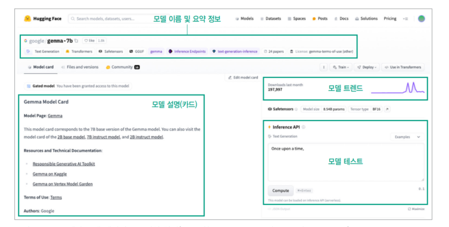  
https://huggingface.co/google/gemma-7b  
  
위 그림은 구글이 공개한 젬마(Gemma)모델의 화면이다. 상단에서 모델의 이름과 요약된 정보를 아이콘 형태로 확인할 수 있다. 어떤 작업을 위한 모델인지, 
라이선스 유형 등을 확인할 수 있다. 화면 왼쪽에는 모델에 대한 설명이 있다. 필수사항은 아니기 떄문에 모든 모델에 설명이 적혀 있는 것은 아니나 잘 작성된 
모델 카드의 경우 모델의 성능, 관련 있는 논문 소개, 사용 방법 등의 정보를 제공한다. 화면 오른쪽으로는 모델의 다운로드 수 추이를 볼 수 있는 모델 트렌드 
그래프가 있고 그 아래쪽으로 모델을 간단히 테스트해 볼 수 있는 추론 API가 있다.  
  
# **데이터셋 허브**  
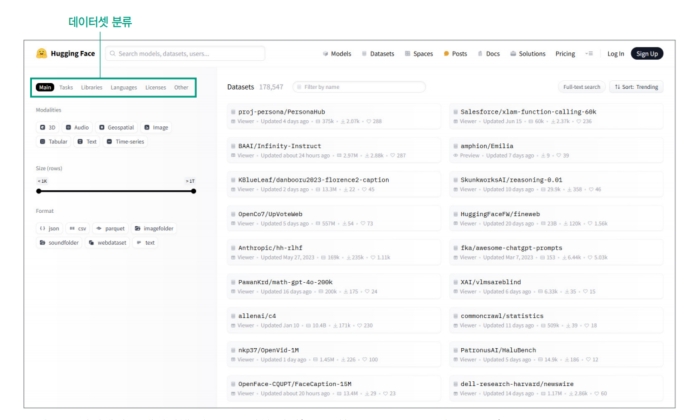  
https://huggingface.co/datasets  
  
데이터셋 허브 화면은 위 그림과 같이 모델 허브와 거의 동일한 형태다. 모델 허브와 달리 분류 기준에 데이터셋 크기(Size), 데이터 유형(Format) 등이 추가로 있고 
선택한 기준에 맞는 데이터셋을 보여준다는 점이 다르다.  
  
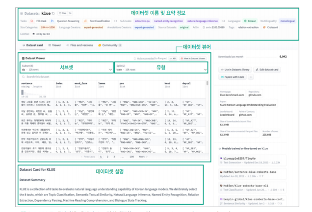  
https://huggingface.co/datasets/klue  
  
위 그림은 KLUE 데이터셋 페이지다. 데이터셋 페이지의 상단에서는 데이터셋의 이름과 작업 종류, 크기, 언어, 라이선스 등 요약 정보를 확인할 수 있고 화면 중앙과 
같이 데이터셋을 바로 확인할 수 있는 데이터셋 뷰어 기능을 제공한다. 데이터셋 뷰어 아래로 데이터셋에 대한 설명을 제공한다. 데이터셋에 대한 설명은 필수사항이 아니기 
때문에 제공하지 않는 데이터셋도 있다.  
  
대표적인 한국어 데이터셋 중 하나인 KLUE는 한국어 언어 이해 평가(Korean Language Understanding Evaluation)의 약자로 텍스트 분류, 기계 독해, 문장 유사도 판단 
등 다양한 작업에서 모델의 성능을 평가하기 위해 개발된 벤치마크 데이터셋이다. KLUE에는 기계 독해 능력 평가를 위한 MRC(Machine Reading Comprehension)데이터, 토픽 분류 
능력 평가를 위한 YNAT(Younhap News Agency news headlines for Topic Classification) 데이터 등 8개의 데이터가 포함돼 있다. 하나의 데이터셋에 
여러 데이터셋이 포함된 경우 서브셋(subset)으로 구분한다. 유형(split)은 일반적으로 학습용(train), 검증용(validation), 테스트용(test)으로 구분되는데 
정해진 것은 아니고 데이터셋에 따라 다른 이름을 사용하거나 다른 구분이 있기도 하다.  
  
# **모델 데모를 공개하고 사용할 수 있는 스페이스**  
스페이스는 사용자가 자신의 모델 데모를 간편하게 공개할 수 있는 기능이다. 모델을 개발하다 보면 동료에게 모델 데모를 보여줘야 하는 경우도 있고 수업이나 발표를 위해 
모델이 실행되는 화면이 필요한 경우도 있다. 이때 로컬에서 실행되는 주피터 노트북보다는 웹 페이지로 공유하는 것이 훨씬 편리한데 스페이스를 사용하면 별도의 복잡한 
웹 페이지 개발 없이 모델 데모를 공유할 수 있다.  
  
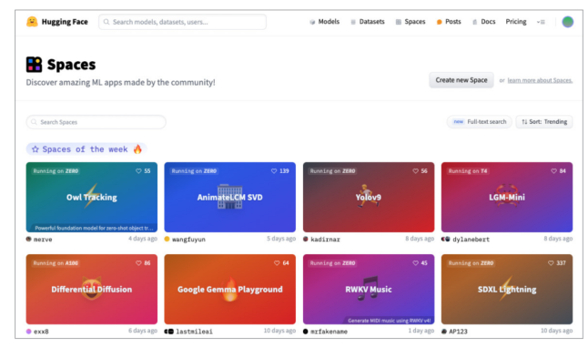  
https://huggingface.co/spaces  
  
스페이스 화면에 들어가 보면 위 그림과 같이 다양한 모델이 공개된 것을 확인할 수 있다.  
  
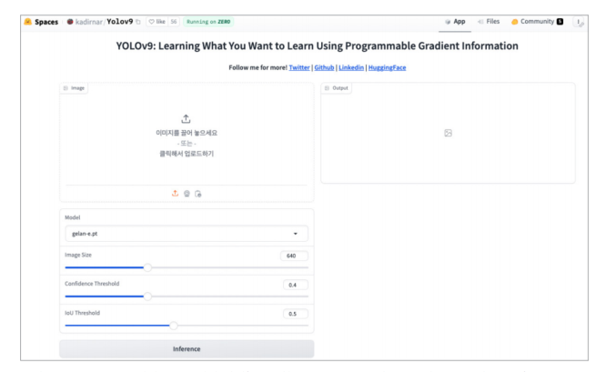  
https://huggingface.co/spaces/kadirnar/Yolov9  
  
위 그림은 다양한 스페이스 중 2024년 2월 공개된 물체 인식(object detection)모델인 Yolov9의 화면이다. 화면 왼쪽에 모델 추론에 사용할 이미지를 업로드할 
수 있는 영역이 있고, 그 아래로 사용할 모델의 종류와 추론에 사용할 모델의 설정을 선택할 수 있는 영역이 있다. 이미지를 업로드하고 화면 하단의 inference(추론) 
버튼을 누르면 화면 오른쪽에 추론 결과가 표시된다.  
  
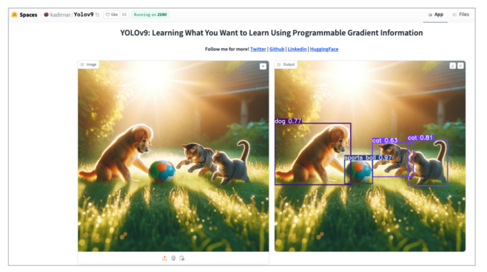  
  
위 그림은 YOLOv9 모델에 OpenAI의 이미지 생성 모델인 DALL-E 3를 사용해 생성한 강아지와 고양이 사진을 입력해 인식한 결과다. 이미지 왼쪽에 있는 강아지와 
오른쪽에 있는 두 마리의 고양이를 잘 인식했고 공도 'sports ball'로 잘 인식한 것을 확인할 수 있다.  
  
허깅페이스는 다양한 오픈소스 LLM과 그 성능 정보를 게시하는 리더보드를 운영하고 있다. 리더보드는 모델 데모는 아니지만 모델의 성능을 비교하는 웹 페이지 
형태이기 떄문에 스페이스를 활용해 제공하고 있다. 많은 오픈소스 모델이 새롭게 공개되고 있기 때문에 어떤 모델을 사용하는 것이 좋을지 판단하기 쉽지 않다. 이럴 때 
리더보드를 살펴보면 각 모델의 크기와 성능을 한눈에 비교할 수 있기 때문에 탐색에 큰 도움이 된다. 영어 데이터로 학습된 LLM의 리더보드는 Open LLM Leaderboard(
https://huggingface.co/spaces/HuggingFaceH4/open_llm_leaderboard)에서 확인할 수 있다.  
  
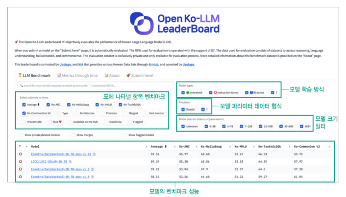  
  
한국어 LLM은 위 그림과 같이 업스테이지(Upstage)에서 운영하는 한국어 LLM 리더보드(https://huggingface.co/spaces/upstage/open-ko-llm-leaderboard)에서 
확인할 수 있다. 두 리더보드 모두 비슷한 형태인데 리더보드의 하단에 모델과 각 모델의 벤치마크 성능을 표시한다. 이떄 그림 왼쪽의 Select columns to show(컬럼 선택) 
섹션을 보면 표에 어떤 컬럼을 표시할지 선택할 수 있다. Ko-XX로 표시된 것은 모델의 성능을 평가하는 벤치마크 데이터셋의 종류이고 Average(평균)는 벤치마크 
평가의 평균 점수를 말한다. 나머지는 모델의 정보를 나타내는 옵션이다. 그림 오른쪽에서 선택할 수 있는 섹션은 탐색할 모델의 종류를 필터링하는 옵션이다. 위에서부터 
설명하면 Model types(모델 타입) 섹션에서는 모델 학습 방식에 따라 사전 학습(pre-trained), 지도 미세 조정 학습(instruction-tuned), 강화 학습(RL-tuned)한 
모델을 선택할 수 있다. Precision(정밀도) 섹션에서는 모델 파라미터의 데이터 형식에 따라 모델을 필터링 할 수 있다. 위 그림에서는 float16 형식을 사용하는 
모델을 선택하고 있다. Model sizes(모델 크기) 섹션에서는 10억 개 파라미터 단위로 모델의 크기를 선택할 수 있다.  
  
# **허깅페이스 라이브러리 사용법 익히기**  
# **모델 활용하기**  
허깅페이스 트랜스포머 라이브러리를 사용하면 허깅페이스 모델 허브의 모델을 쉽게 불러와 사용할 수 있다. 허깅페이스 모델을 불러오기 전에 꼭 알아야 하는 사실이 있는데 
허깅페이스에서는 모델을 바디(body)와 헤드(head)로 구분한다는 점이다. 이렇게 구분하는 이유는 같은 바디를 사용하면서 다른 작업에 사용할 수 있도록 만들기 위해서다.  
  
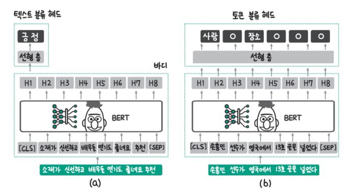  
  
예를 들어 위 그림과 같이 바디는 모두 구글에서 개발한 BERT 모델을 사용하지만 사용하려는 작업에 따라 서로 다른 헤드를 사용할 수 있다. 그림 a는 문장 전체가 
긍정인지 부정인지를 분류한느 모델인데 이떄는 바디가 반환하는 여러 잠재 상태(hidden state)중 가장 앞에 있는 [CLS] 토큰의 데이터만 받아 예측에 사용한다. 
그림 b는 각 토큰이 사람이나 장소에 해당하는지 판단하는 개체명 인식(named entity recognition)모델인데 각 토큰에 대해 판단해야 하기 떄문에 모든 토큰의 
데이터를 받아 각각 사람인지 장소인지를 예측한다. 그림에서 ㅇ로 표기된 것은 사람이나 장소에 해당하지 않는다는 예측 결과를 나타낸 것이다.  
  
바디는 모델의 기본 구조를 담당하는 부분이다. BERT 모델을 예로 들면 Transformer 블록으로 이루어진 기본적인 신경망 구조며 이 부분은 입력된 문장을 처리하고 
중요한 특징(Feature)을 추출하는 역할을 한다.  
  
헤드는 추출된 정보를 바탕으로 최종적인 예측을 수행하는 부분이다.(예: 감성 분석, 문장 분류, 변역 등) 바디에서 추출된 정보를 바탕으로 마지막 결정을 내리는 부분을 
담당한다.  
  
허깅페이스 트랜스포머 라이브러리에서는 모델의 바디만 불러올 수도 있고 헤드와 함꼐 불러올 수도 있다.  

chapter3.ipynb 파일에서 모델 아이디로 모델 불러오기 참조  
  
AutoModel은 모델의 바디를 불러오는 클래스로 from_pretrained() 메서드에서 인자로 받는 model_id에 맞춰 적절한 클래스를 가져온다. model_id가 허깅페이스 
모델 허브의 저장소 경로(예: klue/roberta-base)인 경우 모델 허브에서 모델을 다운로드하고 로컬 경로인 경우(예: ./text_classification) 지정한 로컬 경로에서 
모델을 불러온다. 위 예제에서는 모델 아이디로 klue/reberta-base를 지정해 허깅페이스 링크(https://huggingface.co/klue/roberta-base)의 모델을 
내려받아 model 변수에 저장한다. 해당 모델은 RoBERTa 모델을 한국어로 학습한 모델인데 여기서 RoBERTa는 구글의 BERT를 개선한 모델이다.  
  
그렇다면 AutoModel 클래스는 어떻게 klue/roberta-base 저장소의 모델이 RoBERTa 계열의 모델인지 알 수 있을까? 허깅페이스 모델을 저장할 때 config.json 
파일이 함께 저장되는데 해당 설정 파일에는 아래 예제와 같이 모델의 종류(model_type), 여러 설정 파라미터(num_attention_heads, num_hidden_layers 등), 
어휘 사전 크기(vocab_size), 토크나이저 클래스(tokenizer_class) 등이 저장된다. AutoModel과 AutoTokenizer 클래스는 config.json 파일을 참고해 적절한 
모델과 토크나이저를 불러온다. 아래 예제에서 klue/roberta-base의 model_type이 "roberta"로 되어 있는데 AutoModel은 이 정보를 통해 RoBERTa 모델을 불러온다. 
  
config.json 파일의 일부  
{  
 "architectures": ["RobertaForMaskedLM"],  
 "attention_probs_dropout_prob": 0.1,  
 ...  
 "model_type": "roberta",  
 "num_attention_heads": 12,  
 "num_hidden_layers": 12,  
 "pad_token_id": 1,  
 "type_vocab_size": 1,  
 "vocab_size": 32000,  
 "tokenizer_class": "BertTokenizer"  
}  
  
이번에는 텍스트 분류 헤드가 붙은 모델을 불러와 보자. 아래 예제를 실행하면 모델 허브의 SamLowe/roberta-base-go_emotions 저장소에서 텍스트 분류 
모델을 내려받아 classification_model 변수에 저장한다. 아래 예제를 보면 모델 바디만 불러올 때와 달리 AutoModelForSequenceClassification 클래스를 
사용했는데 이름에서 알 수 있듯이 텍스트 시퀀스 분류를 위한 헤드가 포함된 모델을 불러올 때 사용하는 클래스다. SamLowe/roberta-base-go_emotions 모델에 
대한 더 자세한 사항은 허깅페이스 링크(https://huggingface.co/SamLowe/roberta-base-go_emotions)에서 확인할 수 있다.  

chapter3.ipynb 파일에서 모델 아이디로 모델 불러오기 참조  
  
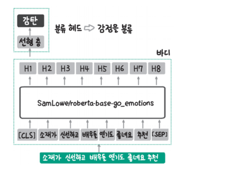  
  
SamLowe/roberta-base-go_emotions 모델은 위 그림과 같이 분류 헤드가 포함돼 있다. 이 모델은 입력 문장이 어떤 감성을 나타내는지 분류하는데 예를 
들어 문장에 감탄(admiration), 즐거움(amusement), 화(anger) 등과 같은 감정이 포함돼 있는지를 분류한다.  
  
그렇다면 분류 헤드가 어떤 감정을 분류하는지 어떻게 알 수 있을까? 앞서 모델 바디를 불러올 때와 마찬가지로 저장소의 config.json 파일에서 확인할 수 있다.  
SamLowe/roberta-base-go_emotions 저장소를 확인하면 아래와 같은 config.json 파일을 팢을 수 있다. 앞서 본 klue/roberta-base와 동일하게 model_type은 
"roberta"이지만 모델 아키텍처가 "~ForSequenceClassification"으로서 분류를 위한 모델임을 알 수 있다. 또 헤드의 분류 결과가 어떤 의미인지 확인할 수 있는 
id2label을 갖고 있다. id2label을 살펴보면 0은 감탄, 1은 즐거움, 2는 화를 의미한다.  
  
config.json  
{  
 "_name_or_path": "roberta-base",  
 "architectures": [  
  "RobertaForSequenceClassification"  
 ],  
 ...  
 "model_type": "roberta",  
 "id2label": {  
    "0": "admiration",  
    "1": "amusement",  
    "2": "anger",  
    ...
 }  
}  
  
텍스트 분류를 위한 아키텍처에 모델 바디만 불러와 보자. 앞서 살펴본 대로 AutoModelForSequenceClassification 클래스를 사용하면 분류 헤드가 붙은 
모델을 불러올 수 있다. 아래 예제에서는 모델 바디 부분의 파라미터만 있는 klue/roberta-base 저장소의 모델을 불러온다.  
  
chapter3.ipynb 파일에서 분류 헤드가 랜덤으로 초기화된 모델 불러오기 참조  
  
모델을 불러올 때 에러는 발생하지 않지만 경고가 나타난다. 경고의 내용은 모델의 바디 부분은 klue/reberta-base의 사전 학습된 파라미터를 불러왔지만 
klue/roberta-base 모델 허브에서는 분류 헤드에 대한 파라미터를 찾을 수 없어 랜덤으로 초기화했다는 것이다. 분류 헤드는 랜덤으로 초기화됐기 때문에 
그대로 사용해서는 안 되고 추가 학습 이후에 사용하라고 안내하고 있다.  
  
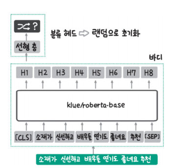  
  
경고의 내용을 명확히 이해하기 위해 그림으로 표현하면 위와 같다. 바디 부분은 klue/roberta-base 모델에서 가져왔지만 분류 헤드는 랜덤으로 초기화된 상태다. 
현재 상태에서는 분류 헤드가 학습되지 않았기 때문에 의미 있는 분류를 하지 못한다.  
  
첫 번째 바디만 불러오는 코드는 바디만 있어 직접 헤드를 추가하고 학습해야 하지만 마지막 예제는 바디 + 헤드(랜덤 초기화)가 있으므로 헤드만 학습시키면 된다.  
  
# **토크나이저 활용하기**  
토크나이저는 텍스트를 토큰 단위로 나누고 각 토큰을 대응하는 토큰 아이디로 변환한다. 필요한 경우 특수 토큰을 추가하는 역할도 한다. 토크나이저도 학습 
데이터를 통해 어휘 사전을 구축하기 때문에 일반적으로 모델과 함께 저장한다. 토크나이저도 모델을 불러올 때와 마찬가지로 허깅페이스 모델 저장소 아이디를 통해 
불러올 수 있다. 허깅페이스 허브에서 모델과 토크나이저를 불러오는 경우 동일한 모델 아이디로 맞춰야 한다.  
  
아래 예제를 실행하면 AutoTokenizer 클래스를 통해 앞서 모델을 불러올 때도 사용한 klue/roberta-base 저장소의 토크나이저를 불러온다. 모델 저장소(
https://huggingface.co/klue/roberta-base/tree/main)를 확인하면 tokenizer_config.json과 tokenizer.json 2개의 파일을 확인할 수 있는데 모델에 
대한 정보가 config.json 파일에 저장돼 있던 것처럼 토크나이저에 대한 정보를 저장하고 있다. tokenizer_config.json은 토크나이저의 종류나 설정에 대한 
정보를 갖고 있고 tokenizer.json 파일은 실제 어휘 사전 정보를 갖고 있다.  
  
chapter3.ipynb 파일에서 토크나이저 불러오기 참조  
  
토크나이저는 아래 예제와 같이 사용할 수 있다. tokenizer에 텍스트를 입력하면 토큰 아이디의 리스트인 input_ids, 토큰이 실제 텍스트인지 아니면 길이를 
맞추기 위해 추가한 패딩(padding)인지 알려주는 attention_mask, 토큰이 속한 문장의 아이디를 알려주는 token_type_ids를 반환한다. input_ids는 
토큰화했을 때 각 토큰이 토크나이저 사전의 몇 번째 항목인지를 나타낸다. input_ids의 첫 번째 항목은 0이고 두 번쨰 항목은 9157인데 각각 [CLS]와 '토크'에 
대응되는 것을 확인할 수 있다. attention_mask가 1이면 패딩이 아닌 실제 토큰임을 의미한다. token_type_ids가 0이면 일반적으로 첫 번째 문장임을 의미한다. 
토큰 아이디를 다시 텍스트로 돌리고 싶다면 토크나이저의 decode 메서드를 사용하면 된다. 이떄 [CLS]나 [SEP] 같은 특수 토큰이 추가된 것을 확인할 수 있는데 
만약 특수 토큰을 제외하고 싶다면 skip_special_tokens 인자를 True로 설정하면 된다.  
  
chapter3.ipynb 파일에서 토크나이저 사용하기 참조  
  
토크나이저는 한 번에 여러 문장을 처리할 수도 있다. 아래 예제에서는 2개의 문장('첫 번째 문장'과 '두 번째 문장')을 리스트로 함께 넣었다. 출력 결과를 확인하면 
input_ids, attention_mask, token_type_ids 모두 각 문장을 토큰화해 2개의 리스트를 반환한 것을 확인할 수 있다.  

chapter3.ipynb 파일에서 토크나이저에 여러 문장 넣기 참조  
  
한 번에 2개의 문장을 모델에 넣어야 하는 경우가 있다. 예를 들어 2개의 문장이 서로 원인과 결과 관계인지 학습시키고 싶다면 두 문장을 한번에 모델에 입력해야 한다. 
이때 2개의 문장이 하나의 데이터라는 것을 표시하기 위해 아래 예제와 같이 한 번 더 리스트로 감싸준다. 출력 결과를 확인하면 위의 예제와는 달리 하나의 결과만 반환하는 것을 
확인할 수 있다.  
  
chapter3.ipynb 파일에서 하나의 데이터에 여러 문장이 들어가는 경우 참조  
  
토크나이저의 batch_decode() 메서드를 사용하면 input_ids 부분의 토큰 아이디를 문자열로 복원할 수 있다. 기본적으로 토큰화를 하면 [CLS] 토큰으로 문장을 
시작하고 [SEP]으로 문장을 끝내는데 2개의 문장을 한번에 토큰화하면 [SEP]으로 두 문장을 구분한다. 특수 토큰은 모델의 아키텍처에 따라 달라질 수 있으니 사용하려는 
토크나이저가 어떤 특수 토큰을 사용하는지 확인해 볼 필요가 있다.  

chapter3.ipynb 파일에서 토큰 아이디를 문자열로 복원 참조  
  
토큰화 결과 중 token_type_ids는 문장을 구분하는 역할을 한다. BERT는 학습할 때 2개의 문장이 서로 이어지는지 맞추는 NSP(Next Sentence Prediction) 작업을 
활용하는데 이를 위해 문장을 구분하는 토큰 타입 아이디를 만들었다. 그래서 BERT 모델의 토크나이저를 불러오면 아래 예제에서 보듯이 문장에 따라 토큰 타입 아이디를 구분한다. 
이 코드에서 klue/bert-base 토크나이저를 사용하는 경우 첫 번째 문장의 토큰 타입 아이디는 0, 두 번째 문장의 토큰 타입 아이드는 1이다. 하지만 klue/roberta-base의 
경우 token_type_ids가 모두 0인 것을 볼 수 있는데 RoBERTa 계열 모델의 경우 NSP 작업을 학습 과정에서 제거했기 때문에 문장 토큰 구분이 필요 없다. 실제로 
영어 버전의 원본 roberta-base 토크나이저로 영어 문장을 토큰화하면 결과에 token_type_ids 항목 자체가 없는 것을 확인할 수 있다.  

chapter3.ipynb 파일에서 BERT 토크나이저와 RoBERTa 토크나이저 참조  
  
attention_mask는 해당 토큰이 패딩 토큰인지 실제 데이터인지에 대한 정보를 담고 있다. 패딩은 모델에 입력하는 토큰 아이디의 길이를 맞추기 위해 추가하는 특수 
토큰이다. 아래 예제와 같이 코트나이저의 padding 인자에 'longest'를 입력하면 입력한 문장 중 가장 긴 문장에 패딩이 추가될 것이다. 실제로 아래 예제의 실행 
결과를 보면 input_ids에서 첫 번쨰 문장에 패딩 토큰(토큰 아이디 = 1)이 6개 추가된 것을 확인할 수 있고 attention_mask에는 패딩 토큰을 나타내는 숫자 0이 
6개 붙은 것을 확인할 수 있다.  

chapter3.ipynb 파일에서 attention_mask 확인 참조  
  
# **데이터셋 활용하기**  
datasets 라이브러리를 사용하면 앞서 허깅페이스 허브에서 살펴봤던 데이터셋을 코드로 불러올 수 있다. 아래 예제는 KLUE 데이터셋의 서브셋 중 하나인 
MRC 데이터셋이다.  

chapter3.ipynb 파일에서 KLUE MRC 데이터셋 다운로드 참조  
  
데이터셋을 불러오는 함수는 load_dataset으로서 데이터셋의 이름인 klue와 서브셋 이름인 mrc를 load_dataset 함수에 인자로 전달해서 MRC 데이터셋을 
내려받았다.  
  
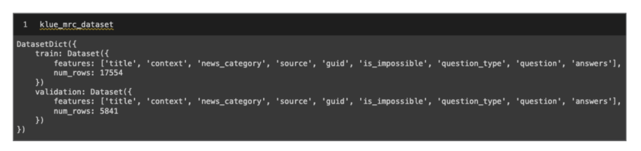  
  
klue_mrc_dataset의 내용을 확인하면 위 그림과 같다. 데이터셋에는 학습(train)과 검증(calidation) 유형의 데이터가 각각 17554개 5841개 있으며 
제목(title), 내용(context)과 질문(question), 정답(answers) 등의 컬럼이 있다.  
  
만약 유형이 train인 데이터만 받고 싶다면 load_dataset() 함수에 split='train'인자를 입력하면 된다.  
  
데이터셋 저장소에 있는 데이터만 불러올 수 있는 것은 아니고 아래 예제와 같은 코드로 로컬에 있는 파일이나 파이썬 객체를 받아 데이터셋으로 사용할 수 있다. 
코드를 보면 로컬에 저장된 csv 파일을 불러오기 위해 load_dataset에 데이터의 형식인 csv를 지정하고 파일 경로를 data_files의 인자로 전달했다. 파이썬 
딕셔너리를 데이터셋으로 변환하고 싶은 경우 Dataset 클래스의 from_dict 메서드를 사용해 데이터셋으로 변환할 수 있다. 데이터 처리에서 많이 사용하는 판다스 
데이터프레임을 데이터셋으로 변환하고 싶은 경우 Dataset 클래스의 from_pandas 메서드를 사용하면 된다. (공식 문서 https://huggingface.co/docs/datasets/loading 참고)  

chapter3.ipynb 파일에서 로컬의 데이터 활용하기 참조  
  
# **모델 학습시키기**  
한국어 기사 제목을 바탕으로 기사의 카테고리를 분류하는 텍스트 분류 모델을 학습시킬 것이다. 먼저 학습에 사용할 데이터셋을 준비하고 모델과 토크나이저를 불러와 
모델을 학습시킨다. 허깅페이스 트랜스포머에서는 간편하게 모델 학습을 수행할 수 있도록 학습 과정을 추상화한 트레이너(Trainer) API를 제공한다. 트레이너 
API를 사용하면 학습을 간편하게 할 수 있다는 장점이 있지만 내부에서 어떤 과정을 거치는지 알기 어렵다는 단점도 있다.  
  
