# **GPU 효율적인 학습**  
딥러닝 모델이 입력 데이터를 처리해 결과를 내놓을 때까지 많은 행렬 곱셈 연산을 처리한다. 행렬 곱셈은 숫자를 곱하고 더하는 단순한 연산을 반복 
계산하는 형태인데 GPU(Graphic Processing Unit)는 이러한 단순한 곱셈을 동시에 여러 개 처리하는 데 특화된 처리 장치다. 따라서 딥러닝 모델의 
연산을 빠르게 처리하기 위해 GPU를 많이 활용한다. GPU는 한정된 메모리를 갖고 있는데 최근 LLM의 등장과 함께 모델의 크기가 커지면서 하나의 GPU에 
모델을 올리지 못하거나 모델의 학습과 추론을 위해 더 많은 GPU가 필요해졌다. 하지만 GPU는 가격이 비싸기 때문에 일부 기업을 제외하고눈 풍부하게 사용하기 
어렵다. 이런 상활을 개선하고 더 많은 사람이 발전된 AI 기술을 사용할 수 있도록 GPU를 효율적으로 활용할 수 있는 방법을 찾기 위한 기술 발전이 
빠르게 이뤄지고 있다.  
  
구글 코랩 설치  
!pip install transformers==4.40.1 datasets==2.19.0 accelerate==0.30.0 peft==0.10.0  
bitsandbytes==0.43.1 -qqq  
  
# **GPU에 올라가는 데이터 살펴보기**  
딥러닝 모델을 학습시키고 추론하기 위해 GPU를 사용할 때 가장 자주 만나는 에러 중 하나는 OOM(Out of Memory)에러다. OOM 에러란 한정된 GPU 
메모리에 데이터가 가득 차 더 이상 새로운 데이터를 추가하지 못해 발생하는 에러다. GPU 메모리에는 기본적으로 딥러닝 모델 자체가 올라간다. 딥러닝 
모델은 수많은 행렬 곱셈을 위한 파리미터의 집합이다. 각각의 파라미터는 소수 또는 정수 형식의 숫자이다.  
  
# **딥러닝 모델의 데이터 타입**  
컴퓨터에서는 일반적으로 소수 연산을 위해 32비트 부동소수점(float32)을 사용한다. 만약 더 세밀한 계산이 필요하다면 64비트 부동소수점(float64)을 
사용한다. 부동소수점을 나타내는 비트의 수가 커질수록 표현할 수 있는 수의 범위나 세밀한 정도가 달라진다. 딥러닝 모델은 입력한 데이터를 최종 결과로 
산출할 때까지 많은 행렬 곱셈에 사용하는 파라미터로 구성된다. 예를 들어 파라미터가 70억 개인 LLM에는 행렬 연산에 사용되는 70억 개의 수가 저장돼 
있다. 따라서 LLM 모델의 용량은 모델을 몇 비트의 데이터 형식으로 표현하는지에 따라 달라진다.  
  
과거에는 딥러닝 모델을 32비트(4바이트) 부동소수점 형식을 사용해 저장했다. 하지만 성능을 높이기 위해 점점 더 파라미터가 많은 모델을 사용하기 시작했고 
모델의 용량이 너무 커 하나의 GPU에 올리지 못하거나 계산이 너무 오래 걸리는 문제가 발생했다. 이런 문제를 해결하기 위해 성능은 유지하면서 점점 더 
적은 비트의 데이터 타입을 사용하는 방향으로 딥러닝 분야가 발전했다. 최근에는 주로 16비트로 수를 표현하는 fp16 또는 bf16(brain float 16)을 
주로 사용한다.  
  
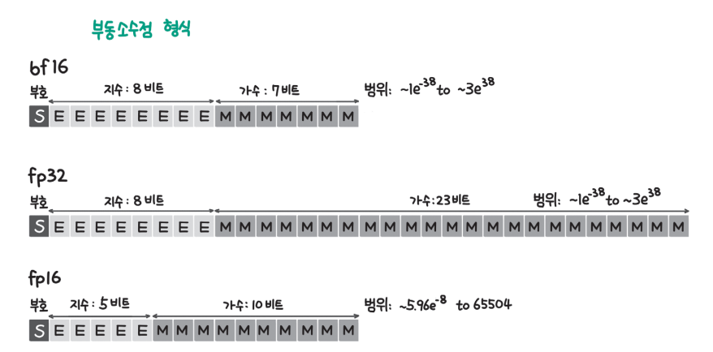  
  
위 그림에서 fp32와 fp16, bf16을 비교하고 있다. fp32는 32비트를 사용해 수를 표현하는데 그림에서 S는 부호(sign), E는 지수(exponent), M은 가수(mantissa)를 
의미한다. 지수는 수를 표현할 수 있는 범위의 크기를 결정하고 가수는 표현할 수 있는 수의 촘촘함을 결정한다. fp32는 지수로 8비트, 가수로 23비트를 사용하는데 
fp32를 사용하면 넓은 범위를 촘촘하게 표현할 수 있다. 반면 fp16 또는 bf16 형식은 사용하는 비트를 절반으로 줄였기 때문에 fp32에 비해 표현할 수 있는 
범위나 세밀함이 제한된다. fp16은 지수로 5비트, 가수로 10비트를 사용하기 때문에 fp32에 비해 표현할 수 있는 범위도 좁고 세밀함도 떨어진다. fp16이 
표현할 수 있는 수의 범위가 좁아 딥러닝 연산 과정에서 수를 제대로 표현하지 못하는 문제가 발생했다. bf16은 이런 문제를 줄이기 위해 지수에 fp32와 같이 8비트를 
사용하고 가수에 7비트만 사용하도록 개발됐다.  
  
딥러닝 모델은 학습과 추론 같은 모델 연산 과정에서 GPU 메모리에 올라가기 떄문에 모델의 용량이 얼마인지가 GPU 메모리 사용량을 체크할 때 중요하다. 
딥러닝 모델의 용량은 파라미터의 수에 파라미터당 비트(또는 바이트) 수를 곱하면 된다. 예를 들어 파라미터가 10억 개인 모델이 fp16 형식으로 저장돼 있다면 총 20억 
바이트가 된다. 20억 바이트를 기가바이트 단위로 표현하려면 1024로 세 번 나눠줘야 하는데 10억이 1024를 세 번 곱한 값과 가깝기 떄문에 간단히 계산하면 모델의 
용량은 2GB라고 할 수 있다. 최근 LLM은 모델이 커지면서 7B 모델과 같이 10억을 의미하는 B(billion)를 단위로 사용하는데 B를 지우고 모델의 데이터 타입 
바이트 수를 곱하면 모델의 용량이 된다. 예를 들어 파라미터가 70억 개인 7B 모델이 16비트(2바이트) 데이터 형식으로 저장된다면 모델의 용량은 7*2 = 14GB가 된다.  
  
# **양자화로 모델 용량 줄이기**  
모델 파라미터의 데이터 타입이 더 많은 비트를 사용할수록 모델의 용량이 커지기 때문에 더 적은 비트로 모델을 표현하는 양자화(quantization)기술이 개발됐다. 
예를 들어 fp32로 저장하던 모델을 fp16 형식으로 저장하면 모델의 용량은 절반이 된다. 하지만 fp32가 fp16에 비해 더 넓은 범위의 수를 더 세밀하게 
표현할 수 있기 때문에 fp16으로 변환하면 fp32의 수가 담고 있던 정보가 소실될 수 있는데 이런 이유로 양자화를 수행하면 딥러닝 모델의 성능이 저하된다. 
따라서 양자화 기술에서는 더 적은 비트를 사용하면서도 원본 데이터의 정보를 최대한 소실 없이 유지하는 것이 핵심 과제라고 할 수 있다.  
  
원본 데이터의 정보를 최대한 유지하면서 더 적은 용량의 데이터 형식으로 변환하려면 변환하려는 데이터 형식의 수를 최대한 낭비하지 않고 사용해야 한다.  
  
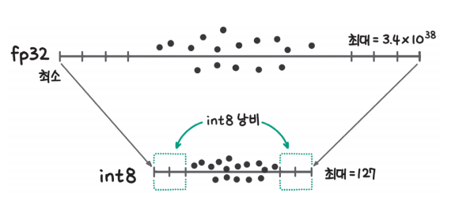  
  
예를 들어 위 그림과 같이 fp32의 데이터를 int8로 변환한다고 할 때 fp32는 하나의 수를 표현하기 위해 32비트나 사용하지만 int8은 8비트만 사용하기 때문에 
사용할 수 있는 수가 훨씬 적다. int8의 경우 256개의 수(-128~127)만 표현할 수 있기 때문에 256개 수 가운데 사용되지 않는 수를 줄여야 한다. 
위 그림에서는 두 데이터 형식의 최댓값을 각각 대응시키고 최솟값을 각각 대응시키는 간단한 양자화 방식을 사용했다. 그림에서 fp32범위의 양쪽 끝에는 
데이터가 없는데 서로 최대와 최소를 대응시키는 경우 int8의 양쪽 끝 수는 사용하는 데이터가 없이 존재해 낭비되는 문제가 발생한다.  
  
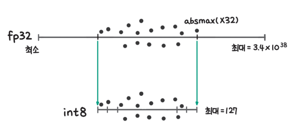  
  
낭비를 줄이기 위해 위 그림과 같이 데이터 형식 자체의 최대/최소를 대응시키는 것이 아니라 존재하는 데이터의 최댓값 범위로 양자화하는 방법도 있다. 
그림에서 absmax는 절대 최댓값을 말하는데 양수와 음수를 통틀어 가장 크기가 큰 값을 찾는다. 예를 들어 데이터에서 가장 큰 수가 15이고 가장 작은 
수가 -17이라면 absmax는 17이 된다. 이와 같은 양자화 방식을 사용할 경우 int8 값을 낭비하던 문제를 해결할 수 있다.  
  
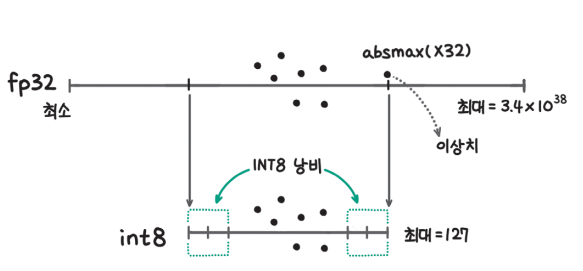  
  
절대 최댓값을 활용한 방법도 문제를 완전히 해결하지는 못한다. 이 방법은 대부분의 경우 잘 동작하지만 이상치(outlier)가 있는 경우 취약하다. 예를 들어 
위 그림과 같이 데이터에 이상치가 있는 경우 절대 최댓값이 이상치에 의해 정해지기 때문에 대부분의 데이터가 중앙에 모여 있고 int8의 범위 양쪽 수를 사용하지 
못하는 낭비가 발생하게 된다.  
  
이상치의 영향을 줄이고 int8 형식의 낭비를 줄이기 위해 전체 데이터에 동일한 변환을 수행하는 것이 아니라 K개의 데이터를 묶은 블록(block) 단위로 
양자화를 수행하는 방법이 있다. 위 그림에서 전체 데이터에 대해 절대 최댓값을 구하고 양자화를 수행하는 것이 아니라 3개씩 데이터를 묶어 그 안에서 
절대 최댓값을 구하고 변환을 수행한다면 이상치와 함께 블록으로 묶인 3개의 데이터에만 이상치의 영향이 미친다. 중앙에 모여 있는 대부분의 데이터는 
int8 형식을 낭비하지 않고 양자화를 수행하게 된다.  
  
또 다른 방법으로 퀀타일(quantile) 방식이 있다. 절대 최댓값(absmax)만 보는 것이 아니라 입력 데이터를 크기순으로 등수를 매겨 int8 값에 동일한 
개수의 fp32 값이 대응되도록 배치하는 방식이다.  
  
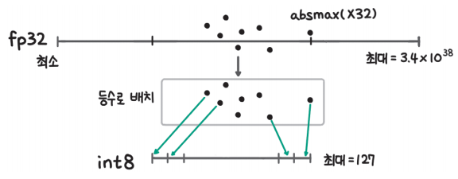  
  
위 그림에서는 각 int8 값에 fp32 값 1개가 대응되도록 변환하고 있다. 이 방식은 int8 값의 낭비는 없지만 매번 모든 입력 데이터의 등수를 확인하고 
배치해야 하기 떄문에 계산량도 많고 그 순서를 기억해야 하기 때문에 별도로 메모리를 사용해야 한다는 단점이 있다.  
  
양자화는 모델을 효율적으로 사용하는 다양한 기술에서 활용된다.  
  
# **GPU 메모리 분해하기**  
GPU 메모리에는 크게 다음과 같은 데이터가 저장된다.  
- 모델 파라미터  
- 그레이디언트(gradient)  
- 옵티마이저 상태(optimizer state)  
- 순전파 상태(forward activation)  
  
딥러닝 학습 과정을 간단히 요약하면 먼저 순전파를 수행하고 그때 계산한 손실로부터 역전파를 수행하고 마지막으로 옵티마이저를 통해 모델을 업데이트한다. 
역전파는 순전파의 결과를 바탕으로 수행하는데 이때 역전파를 수행하기 위해 저장하고 있는 값들이 순전파 상태 값이다. 그레이디언트는 역전파 결과 생성된다.  
  
fp16 모델을 기준으로 하고 AdamW와 같은 옵티마이저ㅡㄹ 사용한다고 할 때 학습에 필요한 최소한의 메모리는 다음과 같다. 이때 모델의 용량을 N(GB)이라고 하자.  
- 모델 파라미터: 2바이트 * 파라미터 수(B, 10억 개) = N  
- 그레이디언트: 2바이트 * 파라미터 수(B, 10억 개) = N  
- 옵티마이저 상태: 2바이트 * 파라미터 수(B, 10억 개) * 2(상태 수) = 2N  
  
모두 합치면 대략 4N의 메모리가 기본적으로 필요하고 이 외에도 순전파 상태(배치 크기, 시퀀스 길이, 잠재 상태 크기에 따라 달라짐)를 저장하기 위한 
메모리가 추가로 필요하다. 사용하려는 모델마다 학습과 추론에 어느 정도의 GPU 메모리가 필요한지 계산하기 어려울 수 있는데 허깅페이스는 모델 메모리 
계산기(https://huggingface.co/spaces/hf-accelerate/model-memory-usage)를 제공해 허깅페이스 모델 허브의 모델을 활용할 때 GPU 메모리가 
얼마나 필요한지 알려주고 있다.  
  
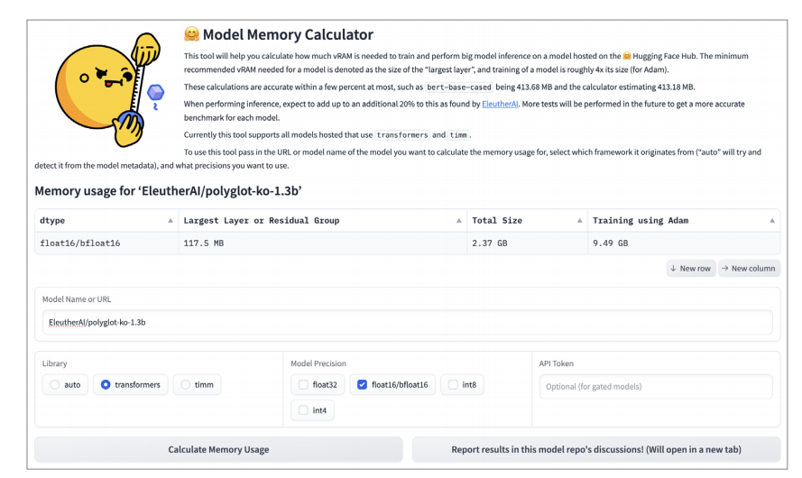  
  
위 그림과 같이 사용하려는 모델을 입력하고 모델의 데이터 타입을 설정하면 모델의 파라미터 수에 따라 모델의 크기, 학습에 필요한 메모리를 제공해 준다. 
이번 예제에서는 다양한 오픈소스 모델을 제공하는 비영리 단체인 EleutherAI가 제공하는 한국어 모델인 EleutherAI/polyglot-ko-1.3b(https://huggingface.co/EleutherAI/polyglot-ko-1.3b)
를 활용하는데 모델 메모리 계산기에서 제공하는 추정치는 모델 크기가 2.37GB, 학습에 필요한 메모리는 9.49GB이다.  
  
이번 예제에서는 실제로 코드를 통해 모델을 불러오고 학습을 수행하면서 얼마나 많은 GPU 메모리를 사용하는지 확인해 본다. 그러기 위해 아래 예제와 같이 
파이토치의 메모리 확인 함수인 torch.cuda.memory_allocated()를 사용해 메모리 사용량을 기가바이트 단위로 반환하는 함수인 print_gpu_utilization을 정의한다.  
  
chapter5.ipynb 파일에서 메모리 사용량 측정을 위한 함수 구현 참조  
  
다음으로 모델과 토크나이저를 불러오는 load_model_and_tokenizer를 정의한다. 이 함수는 사용할 모델과 토크나이저의 아이디(model_id)와 효율적인 
모델 학습을 사용할지와 어떤 방식을 사용할지 입력받는 peft 인자를 받는다. 받은 model_id를 통해 AutoTokenizer와 AutoModelForCausalLM 클래스의 
from_pretrained() 메서드로 대응하는 모델과 토크나이저를 내려받는다. 아래 예제를 실행하면 GPU 메모리 사용량은 2.599GB인데 앞서 모델 메모리 계산기에서는 
모델 크기를 2.37GB로 추정했다. 이 모델의 경우 다소 큰 오차가 있지만 대부분의 경우 거의 정확한 추정치를 제공한다.  

chapter5.ipynb 파일에서 모델을 불러오고 GPU 메모리와 데이터 타입 확인 참조  
  
GPU 메모리에는 모델, 그레이디언트, 옵티마이저 상태, 순전파 상태가 저장된다. 아래 예제에서는 그레이디언트의 메모리 사용량을 확인하는 estimate_memory_of_gradients 
함수와 옵티마이저 상태의 메모리 사용량을 확인하는 estimate_memory_of_optimizer 함수를 정의한다. estimate_memory_of_gradients 함수는 인자로 모델을 
받아 모델에 저장된 그레이디언트 값의 수(param.grad.nelement)와 값의 데이터 크기(param.grad.element_size)를 통해 전체 메모리 사용량을 계산한다. 
estimate_memory_of_optimizer 함수는 인자로 옵티마이저를 받아 옵티마이저에 저장된 값의 수(v.nelement)와 값의 데이터 크기(v.element_size)를 
곱해 전체 메모리 사용량을 계산한다.  
  
chapter5.ipynb 파일에서 그레이디언트와 옵티마이저 상태의 메모리 사용량을 계산하는 함수 참조  
  
다음으로 아래 예제에서 모델을 학습시키며 중간에 메모리 사용량을 확인하는 train_model 함수를 정의한다. 함수의 내용은 허깅페이스 트랜스포머의 Trainer 
API 없이 모델을 학습시킬 때 사용했던 코드와 유사하다. training_args.gradient_checkpointing 설정이 있는데 그레이디언트 체크포인팅 기능을 
사용할지 설정하는 부분으로 설정에 True 또는 False를 입력해 켜고 끌 수 있다. 기본값은 사용하지 않는 False이다. training_args.gradient_accumulation_steps 
설정은 그레이디언트 누적 기능을 사용할지 결정하는 설정인데 누적할 스텝 수에 따라 2 또는 4 등으로 설정하면 된다. 여기서는 우선 기본값인 1로 진행한다. 
결과로 그레이디언트와 옵티마이저의 메모리 사용량과 전체 메모리 사용량을 출력한다.  

chapter5.ipynb 파일에서 모델의 학습 과정에서 메모리 사용량을 확인하는 train_model 정의 참조  
  
모델을 학습시키기 위해서는 데이터가 필요한데 학습 과정에서 필요한 메모리 사용량에 집중하기 위해 아래 예제와 같이 랜덤 데이터를 생성하는 make_dummy_dataset 
함수를 정의한다. make_dummy_dataset 함수에서는 텍스트의 길이가 256이고 데이터가 64개인 더미 데이터를 생성하고 datasets 라이브러리의 Dataset 형태로 변환해 
반환한다.  

chapter5.ipynb 파일에서 랜덤 데이터셋을 생성하는 make_dummy_dataset 정의 참조  
  
아래 예제에서 GPU 메모리의 데이터를 삭제하는 cleanup 함수를 정의한다. cleanup 함수에서는 전역 변수 중 GPU 메모리에 올라가는 모델의 변수(model)와 
데이터셋 변수(dataset)를 삭제하고 gc.collect 함수를 통해 사용하지 않는 메모리를 회수하는 가비지 컬렉션을 수동으로 수행한다. torch.cuda.empty_cache() 함수는 
더 이상 사용하지 않는 GPU 메모리를 반환한다.  

chapter5.ipynb 파일에서 더 이상 사용하지 않는 GPU 메모리를 반환하는 cleanup 함수 참조  
  
아래 예제에서 앞서 정의한 함수를 종합해 배치 크기, 그레이디언트 누적, 그레이디언트 체크포인팅, peft 설정 등에 따라 GPU 사용량을 확인하는 gpu_memory_experiment 
함수를 정의한다. 먼저 load_model_and_tokenizer 함수와 make_dummy_dataset 함수로 모델, 토크나이저, 데이터셋을 불러온다. 다음으로 실험하려는 
설정에 따라 학습에 사용할 인자를 설정한다. 모델, 데이터셋, 학습 인자 준비를 마쳤으니 train_model 함수를 통해 학습을 진행하면서 GPU 메모리 사용량을 확인한다. 
마지막으로 실험이 끝난 모델과 데이터셋을 삭제하고 사용하지 않는 GPU 메모리를 반환한다.  
  
chapter5.ipynb 파일에서 GPU 사용량을 확인하는 gpu_memory_experiment 함수 정의 참조  
  
아래 예제를 실행해 배치 크기를 4에서 16까지 늘려면서 GPU 메모리 사용량을 측정한다. gpu_memory_experiment 함수에 batch_size를 변경하면서 
입력하면 배치 크기에 따른 메모리 사용량을 확인할 수 있다. 실험을 진행하기에 앞서 cleanup 함수와 print_gpu_utilization 함ㅅ로 GPU에서 불필요한 
데이터를 삭제하고 메모리를 사용하지 않고 있음을 확인한다.  

chapter5.ipynb 파일에서 배치 크기를 변경하며 메모리 사용량 측정 참조  
  
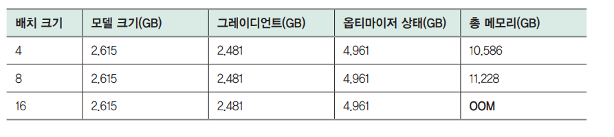  
  
배치 크기를 변경하면서 실행했을 때 출력된 결과를 정리하면 위 표와 같다. 배치 크기가 증가해도 모델, 그레이디언트, 옵티마이저 상태를 저장하는 데 필요한 
GPU 메모리는 동일하다. 총 메모리가 증가하는 것을 통해 순전파 상태의 계산에 필요한 메모리가 증가한다는 사실을 확인할 수 있다.  
  
# **단일 GPU 효율적으로 활용하기**  
GPU의 메모리는 크기가 제한적이기 떄문에 올릴 수 있는 모델의 크기도, 학습에 사용할 수 있는 배치 크기도 제한된다. 그레이디언트 누적이란 딥러닝 
모델을 학습시킬 때 각 배치마다 모델을 업데이트하지 않고 여러 배치의 학습 데이터를 연산한 후 모델을 업데이트해 마치 더 큰 배치 크기를 사용하는 것 
같은 효과를 내는 방법을 말한다. 그레이디언트 체크포인팅은 순전파의 계산 결과를 모두 저장하지 않고 일부만 저장해 학습 중 GPU 메모리의 사용량을 줄이는 
학습 방법이다. 두 방법 모두 모델 학습 시에 배치 크기를 키워 모델의 학습을 더 빠르고 안정적으로 만들어 준다.  
  
# **그레이디언트 누적**  
학습 과정에서 배치 크기를 크게 가져가면 더 빠르게 수렴하고 성능이 높아지는 효과가 있다. 하지만 배치 크기를 키우면 순전파 상태 저장에 필요한 
메모리가 증가하면서 OOM 에러가 발생한다. 그레이디언트 누적(gradient accumulation)은 제한된 메모리 안에서 배치 크기를 키우는 것과 동일한 효과를 
얻는 방법이다. 아래 예제의 train_model 함수에서 그레이디언트 누적과 관련된 부분을 가져오면 아래 예제와 같다. 학습 인자(training_args)에서 
그레이디언트 누적 횟수(gradient_accumulation_steps) 설정을 4로 두면 손실을 4로 나눠서 역전파를 수행하고 4번의 스텝마다 모델을 업데이터 한다. 
이를 통해 마치 배치 크기가 4배로 커진 것과 동일한 효과를 얻을 수 있다.  
  
chapter5.ipynb 파일에서 train_model에서 그레이디언트 누적과 관련된 부분 설명 참조  
  
메모리 사용량 측정 예제에서는 배치 크기를 16으로 설정했을 때 OOM 에러가 발생했다. 아래 예제에서는 배치 크기를 4, 그레이디언트 누적 스텝 수를 4로 
설정해 실행한다. 출력 결과를 확인하면 GPU 메모리 사용량은 10.586GB로 성공적으로 실행되면서도 배치 크기가 16일 때와 같은 효과를 얻을 수 있다. 
그레이디언트 누적을 사용하는 경우 적은 GPU 메모리로도 더 큰 배치 크기와 같은 효과를 얻을 수 있지만 추가적인 순전파 및 역전파 연산을 수행하기 
떄문에 학습 시간이 증가한다.  
  
chapter5.ipynb 파일에서 그레이디언트 누적을 적용했을 때의 메모리 사용량 참조  
  
# **그레이디언트 체크포인팅**  
딥러닝 모델에서는 모델 업데이트를 위한 그레이디언트를 계산하기 위해 순전파와 역전파를 수행하는데 이때 역전파 계산을 위해 순전파의 결과를 저장하고 
있어야 한다. 가장 기본적인 방식은 모두 저장하는것이다.  
    
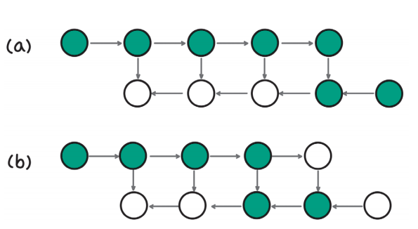  
  
위 그림에서는 오른쪽으로 진행하는 순전파와 왼쪽으로 진행하는 역전파가 있는데 녹색이 값을 저장하고 있는 상태이고 흰색이 저장하지 않은 상태다. 그림에서는 
역전파 계산을 위해 순전파 데이터를 모두 저장하고 있는데 (그림 a의 첫째 줄 녹색 원 5개) 이렇게 되면 GPU 메모리를 많이 차지하게 된다. 역전파를 
진행하면서 메모리를 절약하기 위해 사용이 끝난 데이터는 삭제한다(그림 b).  
  
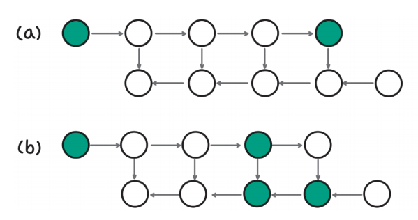  
  
다음으로 메모리를 가장 절약하는 방법은 위 그림과 같이 역전파를 계산할 때 필요한 최소 데이터만 저장하고 나머지는 필요할 때 다시 계산하는 방법이다. 
위 그림 a에서 볼 수 있듯이 메모리 효율성을 높이기 위해 순전파 과정에서는 중간 데이터를 삭제하면서 진행한다. 결국 마지막 데이터만 남긴 상태로 손실을 
계산한다. 그리고 역전파 계산을 위해 순전파 상태가 필요해지면 다시 순전파를 처음부터 계산한다. 이 방식은 메모리를 효율적을 쓸 수 있다는 장점이 있지만 
한 번의 역전파를 위해 순전파를 반복적으로 계산해야 한다는 단점이 있다.  
  
앞에서 설명한 두 가지 방식을 절충하기 위한 방법이 그레이디언트 체크포인팅(gradient checkpointing)이다. 순전파의 전체를 저장하거나 마지막만 
저장하는 게 아니라 중간중간에 값들을 저장(체크포인트)해서 메모리 사용량을 줄이고 필요한 경우 체크포인트부터 다시 계산해 순전파 계산량도 줄인다.  
  
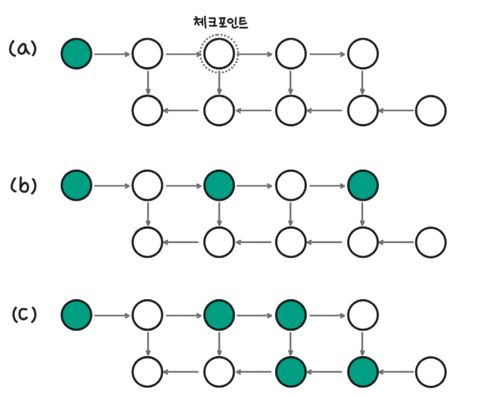  
  
위 그림 a에서 세 번째 노드의 순전파 데이터를 저장한다면 순전파가 완료됐을 때 그림 b와 같이 세 번째 노드와 마지막 노드의 값이 저장된다. 그리고 
역전파 계산을 위해 네 번째 노드의 값이 필요해지면 저장해 둔 세 번째 노드에서부터 순전파를 계산한다.  
  
역전파 시점의 세 가지 그림을 비교해 보면 모두 저장하는 방식은 6개의 데이터가 저장돼 있고 마지막만 저장하는 방식은 4개, 그레이디언트 체크포인팅의 경우 
5개의 노드 데이터가 저장된 것을 확인할 수 있다. 그레이디언트 체크포인팅은 추가적인 순전파 계산이 필요하기 때문에 메모리 사용량은 줄지만 학습 시간이 
증가한다는 단점도 있다.  
  
그레이디언트 체크포인트는 아래 예제와 같이 체크포인트 사용 설정만 변경해 줌으로써 활용할 수 있다. 배치 크기에 따른 메모리 사용량 측정 시 배치 크기가 
16일 때 OOM 에러가 발생했지만 그레이디언트 체크포인팅을 사용하자 GPU 메모리 사용량이 10.29GB로 줄어들고 성공적으로 실행된 것을 확인할 수 있다. 
GPU 메모리를 효율적으로 사용함으로써 동일한 GPU에서 더 큰 배치 크기로 모델 훈련이 가능해진 것이다.  
  
chapter5.ipynb 파일에서 그레이디언트 체크포인팅 사용 시 메모리 사용량 참조  
  
그레이디언트 누적과 그레이디언트 체크포인팅은 GPU를 1개 사용하는 학습에서도 적용할 수 있는 GPU 효율화 기법이다. GPU 메모리가 부족한 경우 가장 
직접적인 해결책은 더 많은 GPU를 사용해 GPU 메모리와 총량을 늘리는 것인데 2개 이상의 GPU를 사용해 모델을 학습시키는 방법을 분산 학습(distributed training)
이라고 한다.  
  
# **분산 학습과 ZeRO**  
# **분산 학습**  
분산 학습은 GPU를 여러 개 활용해 딥러닝 모델을 학습시키는 것을 말한다. 분산 학습의 목적은 크게 두 가지인데 모델 학습 속도를 높이는 것과 1개의 GPU로 
학습이 어려운 모델을 다루는 것이다. 모델이 작아 하나의 GPU에 올릴 수 있는 경우 여러 GPU에 각각 모델을 올리고 학습 데이터를 병렬로 처리해 학습 속도를 
높일 수 있다. 이를 데이터 병렬화(data parallelism)라고 한다.  
  
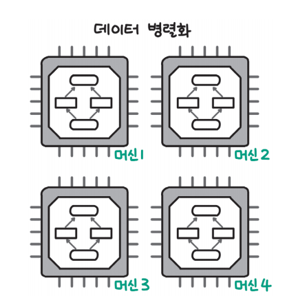  
  
위 그림과 같이 모델을 4개의 GPU에 각각 올리고 학습 데이터를 4개 묶음으로 나눠 동시에 학습을 수행하면 학습 속도를 4개 가까이 높일 수 있다.  
  
다음으로 하나의 GPU에 올리기 어려운 큰 모델의 경우 모델 병렬화(model parallelism)를 사용한다. 이름 그대로 모델을 여러 개의 GPU에 나눠서 올리는 
방식인데 크게는 딥러닝 모델의 층(layer)별로 나눠 GPU에 올리는 파이프라인 병렬화(pipeline parallelism)와 한 층의 모델도 나눠서 GPU에 올리는 
텐서 병렬화(tensor parallelism)가 있다.  
  
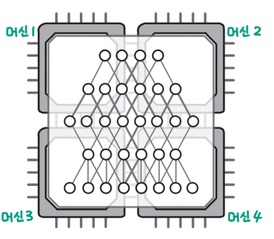  
  
위 그림에서 모델을 그림의 상하로 나누면(머신 1,2와 머신 3,4로 구분) 파이프라인 병렬화이고 좌우로 나누면(머신 1,3과 머신 2,4로 구분) 텐서 병렬화에 
해당한다.  
  
위 그림에서 파이프라인 병렬화의 경우 딥런이 모델의 각 층별로 나눠 GPU에 올리기 때문에 딥러닝 모델의 층 순서에 맞춰 순차적으로 연산하면 결과를 얻을 
수 있다고 쉽게 생각할 수 있다. 하지만 텐서 병렬화의 경우 하나의 층을 나눠 서로 다른 GPU에 올리기 때문에 어떻게 병렬화 전과 후에 동일한 결과를 
구할지 의문이 들 수 있다.  
  
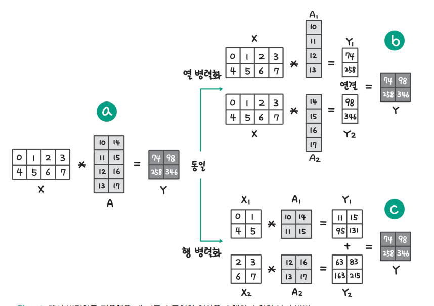  
  
텐서 병렬화를 사용할 경우 위 그림과 같이 행렬을 분리해도 동일한 결과를 얻을 수 있도록 행렬 곱셈을 적용한다. 그림 a에는 입력 X와 모델 가중치 A를 
곱해 결과 Y가 되는 기본 연산이 있다. 여기서 모델의 가중치를 한 열씩 분리하는 경우 그림 b와 같이 입력 X와 모델 가중치를 분리한 A1, A2를 곱하고 그 
결과인 Y1과 Y2를 하나로 연결해 기존의 결과와 동일하게 만들 수 있다. 그림 c는 모델 가중치를 행 방향으로 분리한 경우인데 이때는 입력 X와 모델 가중치 A를 
모두 분리해 X1과 A1을 곱하고 X2와 A2를 곱해 더함으로써 기존과 동일한 연산을 수행할 수 있다.  
  
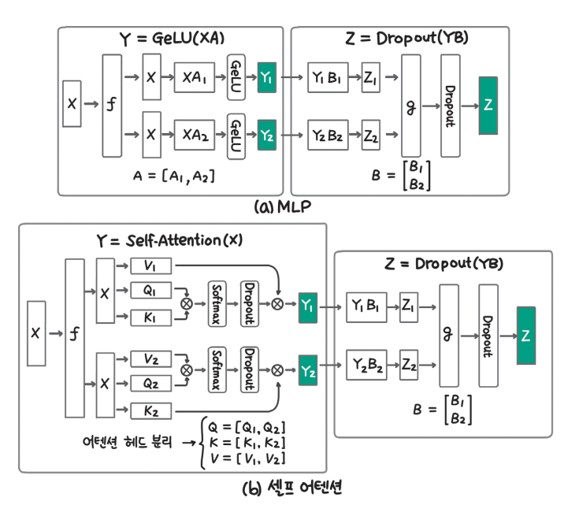  
  
이 방식이 실제 딥러닝 모델 연산에 어떻게 적용되는지 나타낸 그림이 위 그림이다. 그림 a는 MLP(Multi-Layer Perceptron)층에서 텐서 병렬화를 수행한 
그림으로 왼쪽에서는 가중치 행렬 A를 열 방향으로 나눠 행렬 곱셈을 수행하고 오른쪽에서는 입력인 Y1과 Y2가 열 방향으로 나눠져 있으므로 
가중치 행렬 B를 행 방향으로 나눠 행렬 곱셈을 수행한다. 그림 b는 트랜스포머 모델의 근간이 되는 셀프 어텐션 연산에 텐서 병렬화를 적용한 그림이다. 
쿼리, 키, 값 가중치 행렬을 열 방향으로 나눠서 행렬 곱셈을 수행하는데 3개의 가중치가 나온다는 점을 제외하고는 위쪽의 MLP 모델에서와 동일한 과정을 
밟는다.  
  
분산 학습을 사용하는 경우 모델이 작으면 데이터 병렬화를 통해 모델 학습 속도를 높일 수 있고 모델이 클 경우 모델을 여러 GPU에 올려 하나의 GPU로는 
불가능했던 학습을 가능하게 만들 수 있다. 데이터 병렬화를 사용하는 경우 동일한 모델을 여러 GPU에 올리기 때문에 중복으로 모델을 저장하면서 메모리 
낭비가 발생한다.  
  
# **데이터 병렬화에서 중복 저장 줄이기(ZeRO)**  
데이터 병렬화의 경우 속도를 높일 수 있다는 장점이 있지만 동일한 모델을 여러 GPU에 올려 중복으로 메모리를 차지하기 떄문에 메모리 관점에서는 비효율적이다. 
모델이 크가면 각각의 GPU에 온전히 하나의 모델을 올리는 것이 더욱 비효율적이다.  
  
2019년 마이크로소프트에서 개발한 ZeRO(Zero Redundancy Optimizer)는 이런 비효율을 해결하기 위해 개발됐다. 하나의 모델을 하나의 GPU에 올리지 않고 
마치 모델 병렬화처럼 모델을 나눠 여러 GPU에 올리고 각 GPU에서는 자신의 모델 부분의 연산만 수행하고 그 상태를 저장하면 메모리를 효율적으로 사용하면서 
속도도 빠르게 유지할 수 있다는 것이 ZeRO의 컨셉이다.  
  
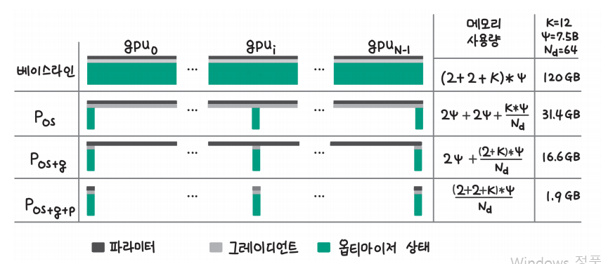  
  
위 그림에서 기존(베이스라인)에는 각 GPU마다 모델 파라미터(p), 그레이디언트(g), 옵티마이저 상태(os)를 저장하는 비효율이 있었는데 ZeRO는 각 
GPU가 모델을 부분적으로 가지고 필요한 순간에만 모델 파라미터를 복사해 연산을 수행하는 방식으로 메모리를 효율적으로 사용한다.  
  
ZeRO는 GPU를 많이 사용할수록 각 GPU당 사용하는 메모리가 줄어든다. 위 그림에서 64개의 GPU로 7.5B의 모델을 학습시키는 경우 GPU당 1.9GB만이 필요한데 
기존에는 120GB의 메모리가 필요했던 것에 비하면 1/60 수준으로 떨어진 것을 확인할 수 있다. 허깅페이스 트랜스포머에서는 ZeRO를 쉽게 사용할 수 있는 
기능을 지원한다. 예제에서는 GPU를 1개만 사용할 수 있는 구글 코랩으로 실습을 진행하므로 자세한 정보는 Accelerate의 딥스피드 사용 가이드
(https://huggingface.co/docs/accelerate/usage_guides/deepspeed)에서 허깅페이스 트랜스포머에서 ZeRO를 사용하는 방법을 확인  
  
# **효율적인 학습 방법(PEFT): LoRA**  
LLM과 같은 기반 모델의 크기가 커지면서 하나의 GPU를 사용해 모든 파라미터를 학습하는 전체 미세 조정(full fine-tuning)을 수행하기 어려워졌다. 
하지만 대부분의 개인과 조직은 여러 GPU를 사용해 모델을 학습시키기 어렵기 때문에 일부 파라미터만 학습하는 PEFT(Parameter Efficient Fine-Tuning) 
방법 연구가 활발히 이뤄지고 있다. 그중에서도 오픈소스 LLM 학습에서 가장 주목받고 많이 활용되는 학습 방법은 모델에 일부 파라미터를 추가하고 그 부분만 
학습하는 LoRA(Low-Rank Adaptation) 학습 방식이다.
