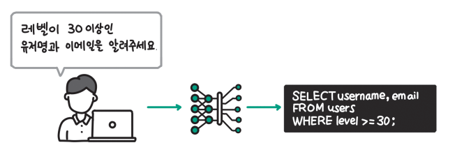
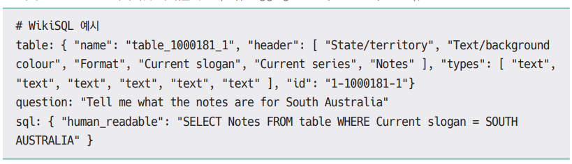
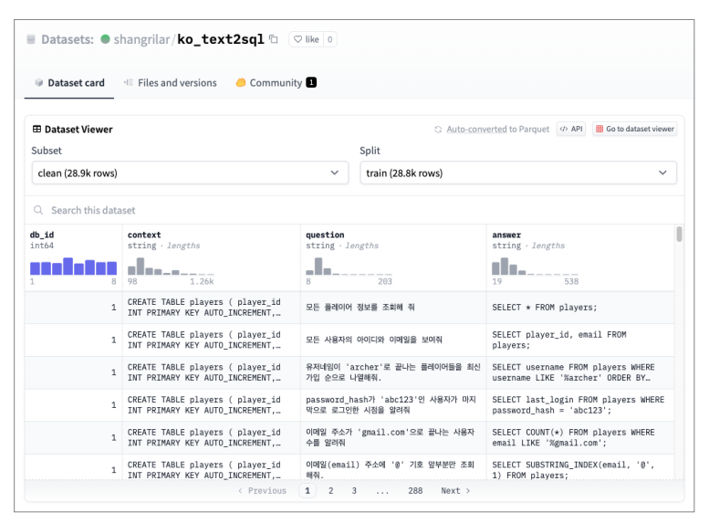
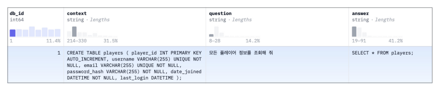
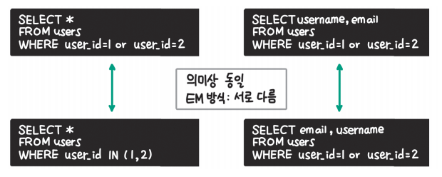
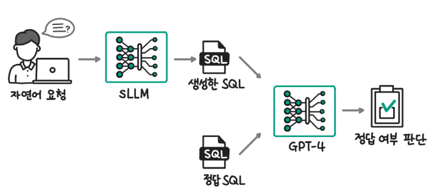
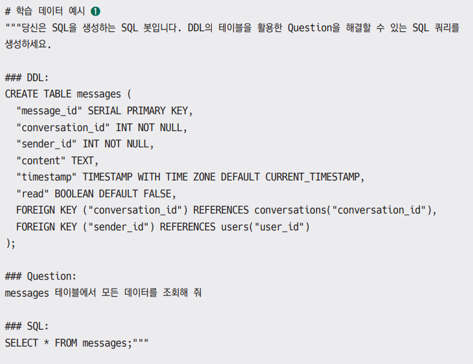
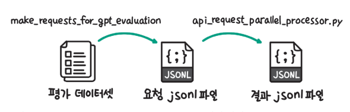
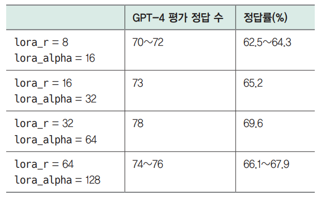

# **sLLM 학습하기**  
범용적인 성능이 뛰어난 상업용 LLM에 비해 비용 효율적이면서 특정 작업 또는 메도인에 특화된 sLLM이 주목받고 있다. 이번 장에서는 실습으로 자연어 
요청으로부터 적합한 SQL을 생성하는 Text2SQL(NL2SQL) sLLM을 만든다.  
  
  
  
Text2SQL은 위 그림과 같이 사용자가 얻고 싶은 데이터에 대한 요청을 자연어로 작성하면 LLM이 요청에 맞는 SQL을 생성하는 작업을 말한다. 자동 완성, 
코드 리뷰 등으로 개발자의 생산성을 높여주는 깃허브 코파일럿은 LLM을 활용한 제품 중 가장 성공적인 제품으로 꼽히낟. SQL 생성을 LLM이 보조할 수 있다면 
데이터 인력의 생산성을 높일 수 있을 뿐만 아니라 현업 구성원의 SQL 진입 장벽을 낮출 수 있다는 점에서 중요한 과제라고 할 수 있다.  
  
이번 장의 실습을 마치고 나면 Text2SQL이 아닌 다른 작업에서도 sLLM 학습을 기획하고 실행할 수 있는 준비가 될 것이다. 실습 진행 전에 다음 명령을 
실행해 실습에 필요한 라이브러리를 설치한다.  
  
!pip install transformers==4.40.1 bitsandbytes==0.43.1 accelerate==0.29.3  
datasets==2.19.0 tiktoken==0.6.0 -qqq  
!pip install huggingface_hub==0.22.2 autotrain-advanced==0.7.77 -qqq  
  
# **Text2SQL 데이터셋**  
# **대표적인 Text2SQL 데이터셋**  
대표적인 Text2SQL 데이터셋으로는 WikiSQL과 Spider가 있다. SQL을 생성하기 위해서는 크게 두 가지 데이터가 필요하다. 먼저 어떤 데이터가 있는지 알 수 
있는 데이터베이스 정보(테이블과 컬럼)가 필요하다. 다음으로 어떤 데이터를 추출하고 싶은지 나타낸 요청사항(request 또는 question)이 필요하다. 
WikiSQL 데이터를 예시로 살펴면 아래 예제와 같다. 테이블(table) 항목에 테이블 이름, 컬럼 이름(header), 컬럼 형식(types)이 있고 요청(question) 
항목으로 어떤 데이터가 필요한지 요청사항이 적혀 있다. 마지막으로 SQL 항목에 정답 SQL 데이터가 있다.  
  
  
  
WikiSQL은 하나의 테이블만 사용하고 SELECT 문에 컬럼을 1개만 사용하거나 조건절에 최대 3개의 조건만 사용하는 등 비교적 쉬운 SQL 문으로 구성돼 
있다. Spider는 좀 더 현실적인 문제 해결을 위해 구축된 데이터셋으로 ORDER BY, GROUP BY, HAVING, JOIN 등 비교적 복잡한 SQL 문도 포함하고 있다. 
하지만 두 데이터셋 모두 요청사항이 영어로 되어 있어 한국어 실습을 위한 데이터셋으로는 적합하지 않다. Spider 데이터셋에 관한 더 자세한 사항은 
Spider 데이터셋 소개 페이지(https://yale-lily.github.io/spider)에서 확인할 수 있다.  
  
# **한국어 데이터셋**  
한국어 Text2SQL 데이터셋으로는 AI 허브에서 구축한 자연어 기반 질의(NL2SQL) 검색 생성 데이터가 있고 AI 허브 NL2SQL 데이터셋 페이지 링크(https://
www.aihub.or.kr/aihubdata/data/view.do?currMenu=115&topMenu=100&aihubDataSe=data&dataSetSn=71351)에서 자세한 정보를 확인할 수 있다. 
하지만 2023년 12월 시점으로 데이터 보완 작업을 위한 공개가 중단돼 있고 AI 허브에서 구축한 데이터셋은 모델 학습을 위한 목적으로 활용할 수 있으나 
사용하지 않는다. 이번 실습에서 활용한 코드를 사용해 이후에 AI 허브의 데이터로도 학습을 진행한다면 좋은 연습이 될 것이다.  
  
# **합성 데이터 활용**  
기존에 구축된 대표성 있는 데이터셋을 활용한다면 좋겠지만 현재는 한국어 Text2SQL 작업을 위해 활용할 수 있는 데이터셋이 없기 때문에 실습에서 활용할 
데이터셋을 GPT-3.5와 GPT-4를 활용해 생성했다. 데이터셋은 허깅페이스의 실습 데이터셋 페이지(https://huggingface.co/datasets/shangrilar/ko_text2sql)에서 
확인할 수 있다.  
  
  
  
생성한 데이터셋은 위 그림과 같이 db_id, context, question, answer 4개의 컬럼으로 구성돼 있다. db_id는 테이블이 포함된 데이터베이스의 아이디로 
동일한 db_id를 갖는 테이블은 같은 도메인을 공유한다. 예를 들어 db_id가 1인 테이블은 분야(도메인)가 '게임'인 상황을 가정하고 생성한 테이블이다. 
context 컬럼은 SQL 생성에 사용할 테이블 정보를 갖고 있다. question 컬럼은 데이터 요청사항을, answer 컬럼은 요청에 대한 SQL 정답을 담고 있다.  
  
  
  
이해를 돕기 위해 예시 데이터를 살펴보면 위 그림과 같다. db_id가 1인 경우 게임 도메인을 가정하고 테이블을 생성했는데 context 컬럼에서 players라는 
테이블의 DDL을 통해 테이블 이름, 컬럼 이름, 컬럼 형식을 확인할 수 있다. question 컬럼의 값으로는 "모든 플레이어 정보를 조회해 줘"라는 요청이 있고 
answer 컬럼에는 SELECT * FROM players; 라는 SQL 정답이 있다.  
  
전체 데이터셋이 약 38000개 정도인데 시간 제약상 모든 데이터를 검수할 수 없어 최초 생성한 45000개에서 규칙 기반으로 간단한 데이터 정제를 수행한 
데이터이다. 따라서 학습 데이터에 잘못 생성된 데이터가 포함되어 있을 수 있다.  
  
# **성능 평가 파이프라인 준비하기**  
머신러닝 모델을 학습시킬 때는 학습이 잘 진행된 것인지 판단할 수 있도록 성능 평가 방식을 미리 정해야 한다. 실습에서 일반적으로 사용되는 Text2SQL 
평가 방식을 사용하지 않고 GPT-4를 사용해 생성된 SQL이 정답인지 판단하는 방식을 사용한다. GPT-4와 같이 뛰어난 성능의 LLM을 평가자로 활용하면 
빠르게 평가를 수행하면서도 신뢰할 수 있는 평가 결과를 기대할 수 있다.  
  
# **Text2SQL 평가 방식**  
LLM 모델을 개발하는 데 있어 성능 평가는 가장 어려운 부분 중 하나다. Text2SQL 작업 평가에서도 마찬가지다. 일반적으로 사용하는 평가 방법은 생성한 
SQL이 문자열 그대로 동일한지 확인하는 EM(Exact Match)방식과 쿼리를 수행할 수 있는 데이터베이스를 만들고 프로그래밍 방식으로 SQL 쿼리를 수행해 정답과 
일치하는지 확인하는 실행 정확도(Execution Accuracy, EX) 방식이 있다.  
  
  
  
하지만 EM 방식은 위 그림과 같이 의미상으로 동일한 SQL 쿼리가 다양하게 나올 수 있는데 문자열이 동일하지 않으면 다르다고 판단한다는 문제가 있고 
실행 정확도 방식의 경우 쿼리를 실행할 수 있는 데이터베이스를 추가로 준비해야 하기 때문에 이번 실습에서는 두 방식 모두 사용하지 않는다.  
  
최근 LLM을 이용해 LLM의 생성 결과를 평가하는 방식이 활발히 연구되고 있고 폭넓게 이용되고 있다. 생성 결과를 정량적으로 평가하기 어려운 작업이 많고 
사람이 직접 평가를 수행하기에는 시간과 비용이 많이 들어 개발 사이클을 늦춘다는 한계가 있기 때문이다.  
  
  
  
위 그림과 같이 LLM이 생성한 SQL이 데이터 요청을 잘 해결하는지 GPT-4를 사용해 확인한다.  
  
GPT를 활용한 성능 평가 파이프라인을 준비하기 위해서는 세 가지가 필요하다. 먼저 평가 데이터셋을 구축해야 한다. 다음으로 LLM이 SQL을 생성할 때 사용할 
프롬프트를 준비한다. 마지막으로 GPT 평가에 사용할 프롬프트와 GPT-4 API 요청을 빠르게 수행할 수 있는 코드를 작성한다.  
  
# **평가 데이터셋 구축**  
실습에 사용될 합성 데이터셋은 8개 데이터베이스(도메인)에 대해 생성했다. 모델의 일반화 성능을 확인하기 위해 7개의 데이터베이스 데이터는 학습에 
사용하고 1개의 데이터베이스는 평가에 사용한다. db_id가 1인 데이터는 게임 도메인을 가정하고 만든 데이터베이스인데 게임 도메인의 경우 테이블 이름이 다른 
도메인과 달리 플레이어(players), 퀘스트(quests), 장비(equipments)와 같이 특화된 이름을 사용하므로 db_id가 1인 데이터를 평가 데이터셋으로 
활용한다.  
  
시간 제약상 합성 데이터셋 전부를 직접 검수할 수 없어 평가 데이터로 사용할 데이터의 경우 직접 검수를 통해 112개의 데이터를 준비했다. 검사 데이터의 
수가 많을수록 더 정확한 성능 평가가 되겠지만 GPT-4를 활용해 평가를 수행할 것이기 때문에 발생하는 비용을 줄이면서 실습을 수행할 수 있도록 100게 
내외의 데이터만 사용한다. 평가 데이터셋은 실습 데이터셋의 test 서브셋 링크(https://huggingface.co/datasets/shangrilar/ko_text2sql/viewer/default/test)
에서 확인할 수 있다.  
  
# **SQL 생성 프롬프트**  
LLM이 SQL을 생성하도록 하기 위해서는 지시사항과 데이터를 포함한 프롬프트(prompt)를 준비해야 한다. LLM의 경우 학습에 사용한 프롬프트 형식을 추론할 
때도 동일하게 사용해야 결과 품질이 좋기 때문에 이번 절에서 준비한 프롬프트 형식은 이어지는 절에서 모델을 미세 조정할 때도 동일하게 적용한다.  
  
프롬프트는 아래 예제와 같은 make_prompt 함수를 통해 생성한다. 먼저 SQL을 생성하라는 명령을 작성하고 필요한 데이터(DDL과 Question)를 입력한 후 정답에 
해당하는 SQL을 마지막에 채워 넣는다. 학습 데이터에서는 정답이 채워진 형태로 사용하고 SQL을 생성할 때는 query를 입력하지 않아 기본값인 빈 문자열이 
들어가도록 한다.  
  
chapter6.ipynb 파일에서 SQL 프롬프트 참조  
  
make_prompt 함수를 사용해 생성한 예시 데이터는 아래와 같다. 아래 형태에서 학습에 사용되는 데이터는 query를 입력해 정답 SQL이 추가되어 있고 
학습에 사용하지 않는 형태는 query를 입력하지 않아 정답 SQL이 비어 있는 형태로 나올 것이다.  
  
  
  
# **GPT-4 평가 프롬프트와 코드 준비**  
마지막으로 GPT-4를 통해 평가를 수행할 때 사용할 프롬프트와 코드를 준비한다.  
  
GPT-4를 사용해 평가를 수행한다면 반복적으로 GPT-4 API 요청을 보내야 한다. 이번 실습에서는 112개의 평가 데이터를 사용하는데 112개 수준이라면 
for 문을 통해 반복적인 요청을 수행해도 시간이 오래 걸리지 않는다. 하지만 평가 데이터셋을 더 늘린다면 단순 for 문으로는 시간이 오래 걸린다. 그럴 때는 
OpenAI가 openai-cookbook 깃허브 저장소에서 제공하는 코드(https://github.com/openai-cookbook/blob/main/examples/api_request_parallel_processor.py)
를 활용하면 요청 제한(rate limit)을 관리하면서 비동기적으로 요청을 보낼 수 있다.  
  
  
  
해당 코드(api_request_parallel_processor.py)는 위 그림과 같이 요청을 보낼 내용을 저장한 jsonl 파일을 읽어 순차적으로 요청을 보낸다. 중간에 
에러가 발생하거나 요청 제한에 걸리면 다시 요청을 보내서 결과의 누락도 막아준다. make_requests_for_gpt_evaluation 함수는 평가 데이터셋을 읽어 
GPT-4 API 요청을 보낼 jsonl 파일을 생성할 때 사용한다.  
  
먼저 아래 예제에서 평가 데이터셋에서 요청 jsonl 파일을 생성하는 make_requests_for_gpt_evaluation 함수를 살펴보면 입력한 데이터프레임을 순회하면서 
평가에 사용할 프롬프트를 생성하고 jsonl 파일에 요청할 내용을 기록한다. 프롬프트에서는 DDL과 Question을 바탕으로 LLM이 생성한 SQL(gen_sql)이 
정답 SQL(gt_sql, ground truth sql)과 동일한 기능을 하는지 평가하도록 했다. 판단 결과는 resolve_yn이라는 키에 "yes" 또는 "no"의 텍스트가 
있는 JSON 형식으로 반환하도록 했다. 생성한 평가 프롬프트는 사용할 모델 이름을 지정해 요청 작업(jobs) 변수에 저장한다. 마지막으로 지정한 디렉토리 
경로와 파일 이름으로 요청 정보를 jsonl 파일 형태로 저장한다.  

chapter6.ipynb 파일에서 평가를 위한 요청 jsonl 작성 함수 참조  
  
생성한 jsonl 파일은 파라미터로 지정한 {dir}/{filename} 위치에 저장된다. 아래 예제의 코드를 실행해 OpenAI 쿡북의 비동기 요청 코드를 실행한다. 
중요한 인자를 살펴보면 requests_filepath에는 API에 전달할 데이터와 인자를 지정한 파일의 경로를 입력한다. 다음으로 save_filepath는 요청 결과가 
저장되는 파일 경로다. request_url에는 API의 엔드포인트 URL을 입력한다. gpt-4-turbo-preview 모델을 사용하기 위해 chat/completions 경로를 
지정했다. 마지막으로 max_requests_per_minute와 max_tokens_per_minute는 OpenAI가 모델마다 정해둔 요청 제한 값을 입력한다.  

chapter6.ipynb 파일에서 비동기 요청 명령 참조  
  
OpenAI는 이전 사용량에 따라 사용자의 티어(tier)를 구분하고 사용량 제한에 차등을 두고 있다. 최대 요청 제한 값으로 입력할 경우 제한 초과가 빈번히 
발생하기 때문에 위 예제와 같이 적절히 값을 낮춰 실행하는 걸 추천한다.  
  
아래 예제는 코드로 GPT-4에 요청을 전달해 반환된 평가 결과를 읽어와 csv 파일로 변환하는 change_jsonl_to_csv 함수를 정의한다. 평가 결과는 앞서 
make_requests_for_gpt_evaluation 함수에서 save_file 인자에 지정한 경로에 저장되는데 change_jsonl_to_csv 함수는 결과 파일을 불러와 
프롬프트와 판단 결과 데이터를 각각 prompts, response 변수에 저장한다. 저장한 데이터는 pd.DataFrame 클래스를 사용해 판다스 데이터프레임으로
만들고 to_csv() 메서드를 사용해 csv 파일로 저장한다.  

chapter6.ipynb 파일에서 결과 jsonl 파일을 csv로 변환하는 함수 참조  
  
GPT-4를 사용해 평가를 수행하기 때문에 빠르게 개발 사이클을 진행할 수 있다는 장점이 있다.  
  
# **실습: 미세 조정 수행하기**  
사용할 수 있는 다양한 기초 모델이 있지만 2023년 12월 시점에 7B 이하 한국어 사전 학습 모델 중 가장 높은 성능을 보이는 beomi/Yi-Ko-6B 모델을 사용한다. 
이 모델은 중국의 01.AI가 발표한 영어-중국어 모델인 01-ai/Yi-6B를 한국어에 확장한 모델로 현재 한국어 LLM 리더보이데서 사전 학습 모델 중 1위를 
차지하고 있다. 허깅페이스의 beomi/Yi-Ko-6B 저장소(https://huggingface.co/beomi/Yi-Ko-6B)에서 모델에 관한 더 많은 정보를 확인할 수 있다.  
  
# **기초 모델 평가하기**  
아래 예제로 예시 데이터를 입력했을 때 기초 모델이 어떤 결과를 생성하는지 확인한다. 코드를 실행하면 기초 모델을 불러와 프롬프트에 대한 결과를 생성한다. 
이 코드에서 make_inference_pipeline 함수는 입력한 모델 아이디에 맞춰 토크나이저와 모델을 불러오고 하나의 파이프라인으로 만들어 반환한다. 
make_inference_pipeline 함수를 사용해 beomi/Yi-Ko-6B 모델로 파이프라인을 만들고 hf_pipe 변수에 저장한다. example 데이터를 hf_pipe에 
입력하고 결과를 확인한다. 예제의 마지막 부분에서 생성된 결과를 보면 요청에 맞춰 SQL은 잘 생성한 것을 볼 수 있다. 하지만 SQL을 생성한 후에 반복적으로 
'SQL 봇', 'SQL 봇의 결과'와 같이 추가적인 결과를 생성했다. 이를 통해 기초 모델도 요청에 따라 SQL을 생성할 수 있는 능력이 있지만 형식에 맞춰 
답변하도록 하기 위해서는 추가적인 학습이 필요하다는 점을 확인할 수 있다.  

chapter6.ipynb 파일에서 기초 모델로 생성하기 참조  
  
다음으로 아래 예제의 코드로 평가 데이터셋에 대한 SQL 생성을 수행하고 GPT-4를 사용해 평가한다. 먼저 평가 데이터셋을 load_dataset 함수를 사용해 
내려받고 make_prompt 함수를 사용해 LLM 추론에 사용할 프롬프트를 생성한다. 다음으로 hf_pipe에 생성한 프롬프트를 입력해 SQL을 생성하고 gen_sqls 
변수에 저장한다. 마지막으로 make_requests_for_gpt_evaluation 함수를 사용해 평가에 사용할 jsonl 파일을 만들고 GPT-4 API에 평가 요청을 전달한다.  

chapter6.ipynb 파일에서 기초 모델 성능 측정 참조  
  
기초 모델에 대한 평가를 진행했을 때 112개의 평가 데이터셋 중 21개를 정답으로 판단했다. 18.75%의 정답률로 더 발전할 수 있는 여지가 충분히 있어 
보인다.  
  
# **미세 조정 수행**
기초 모델의 성능을 확인한 결과 아직 더 개선할 여지가 있어 보여 준비한 학습 데이터로 미세 조정을 수행한다. 모델의 미세 조정에는 autotrain-advanced 
라이브러리를 사용한다. autotrain-advanced 라이브러리는 허깅페이스에서 trl 라이브러리를 한 번 더 추상화해 개발한 라이브러리다. 먼저 아래 예제의 
코드를 실행해 학습 데이터를 내려받고 데이터셋에서 평가에 사용하기로 한 db_id가 1인 데이터를 제거한다. 다음으로 make_prompt 함수를 사용해 학습에 
사용할 프롬프트를 생성하고 data 폴더에 저장한다.  

chapter6.ipynb 파일에서 학습 데이터 불러오기 참조  
  
다음으로 autotrain-advanced 라이브러리를 사용해 지도 미세 조정을 수행한다. 이때 아래 예제의 코드에서 기초 모델과 미세 조정 모델 이름을 적절히 
지정한다. 데이터 경로는 앞서 학습 데이터를 저장한 data 폴더를 입력하고 사용할 컬럼은 프롬프트가 저장된 text 컬럼으로 지정한다. 학습에 사용할 
하이퍼파라미터는 기본적으로 많이 사용하는 값을 사용했지만 변경할 수 있다. 설정 인자에 대한 더 자세한 사항은 autotrain 라이브러리의 LLM 미세 조정 
코드 링크(https://github.com/huggingface/autotrain-advanced/blob/main/src/autotrain/cli/run_llm.py)에서 확인할 수 있다.  

chapter6.ipynb 파일에서 미세 조정 명령어 참조  
  
모델 학습 과정에서 메모리 에러가 발생할 경우 batch_size를 줄여서 다시 시도  
  
모델 학습에는 구글 코랩 프로의 A100 GPU 기준으로 약 1시간이 소요된다. 코랩 무료 버전에서 사용할 수 있는 T4 GPU를 사용하는 경우 A100 대비 약 
8~10배의 시간이 소요된다. 학습을 마친 후에는 아래 예제의 코드를 사용해 LoRA 어댑터와 기초 모델을 합치고 원한다면 허깅페이스 허브에 모델을 저장한다.  

chapter6.ipynb 파일에서 LoRA 어댑터 결합 및 허깅페이스 허브 업로드 참조  
  
학습한 모델의 성능을 확인하기 전에 아래 예제를 통해 앞서 살펴본 예시 데이터에 대해 다시 SQL을 생성한다. 모델 ID만 새로 업로드한 모델의 정보로 
변경하고 동일한 코드를 실행한다. 예제의 마지막 부분에서 생성한 SQL 쿼리를 보면 정확한 쿼리를 생성하면서 기초 모델과 달리 SQL 쿼리만 생성한 것을 
확인할 수 있다.  

chapter6.ipynb 파일에서 미세 조정한 모델로 예시 데이터에 대한 SQL 생성 참조  
  
아래 예제에서 학습한 모델에 대한 평가를 수행한다.  

chapter6.ipynb 파일에서 미세 조정한 모델 성능 측정 참조  
  
  
  
여러 하이퍼파라미터에서 미세 조정을 수행하면서 GPT-4로 성능을 평가하고 정리한 결과는 위의 표와 같다. LoRA 설정 중 랭크(rank)를 의미하는 lora_r과 
LoRA 파라미터의 반영 비율을 결정하는 lora_alpha 값의 변경에 따라 성능이 변화하는 것을 확인할 수 있다. LoRA 설정과 성능의 관계는 아직 명확하지 
않고 데이터셋에 따라 달라지므로 다양한 실험이 필요하다.  
  
