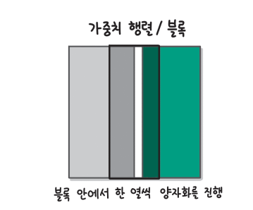
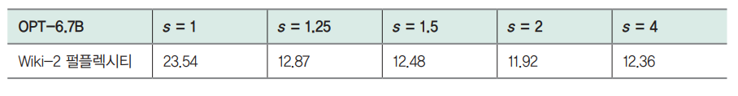

# **모델 가볍게 만들기**  
서비스를 위해 LLM을 배포하는 경우 가장 많은 비용은 GPU 사용에서 발생한다. 그렇기 때문에 GPU를 가능하면 적게 사용해서 비용을 낮춰야 비용 효율적인 
서빙을 할 수 있다. LLM은 모델의 크기가 기존 딥러닝 모델에 비해 훨씬 크기 때문에 효율적인 서빙이 더 중요하고 관련 연구도 활발히 진행되고 있다. 
GPU를 효율적으로 활용하는 방식은 모델의 성능을 약간 희생하더라도 비용을 크게 낮추는 방법과 모델의 성능을 그대로 유지하면서 연산 과정의 비효율을 
줄이는 방법으로 구분할 수 있다.  
  
LLM의 추론에서는 동일한 연산을 반복적으로 수행하면서 한 토큰씩 생성한다. 이때 발생하는 동일한 연산을 최대한 줄이기 위해 계산 결과를 저장하는 KV 캐시
(KV cache)를 사용한다. KV 캐시는 중복 계산을 줄여 추론 속도를 높이는 데 도움을 주지만 계산 결과를 저장해야 하기 때문에 많은 GPU 메모리를 사용한다. 
GPU를 효율적으로 활용하기 위해서는 한 번에 더 많은 데이터를 처리해야 하는데 KV 캐시와 모델 파라미터를 저장하는 데 많은 GPU 메모리를 사용하면 더 많은 
데이터를 처리하지 못한다.  
  
다음 명령을 실행해 라이브러리 설치
!pip install transformers==4.40.1 accelerate==0.30.0 bitsansbytes==0.43.1 auto-gptq==0.7.1 autoawq==0.2.5 optimum==1.19.1 -qqq  
  
# **언어 모델 추론 이해하기**  
# **언어 모델이 언어를 생성하는 방법**  
  
  
  
언어 모델은 위 그림과 같이 입력한 텍스트 다음에 올 토큰의 확률을 계산하고 그중에서 가장 확률이 높은 토큰을 입력 텍스트에 추가하면서 한 토큰씩 
생성한다. 그림에서 '검은 고양이가 밥을'이라는 텍스트를 입력했을 때 다음 토큰으로 '그리고'가 올 확률이 0.001, '마시고'가 올 확률은 0.04, '먹고'가 
올 확률이 0.9라고 예측했는데 이럴 때 가장 확률이 높은 '먹고'를 다음 토큰으로 결정하고 입력한 텍스트에 추가해 '검은 고양이가 밥을 먹고'라는 텍스트를 
생성한다. 언어 모델이 텍스트 생성을 마치는 이유는 두 가지로 나눌 수 있다. 먼저 다음 토큰으로 생성 종료를 의미하는 특수 토큰(예: EOS, End Of Sentence 토큰)
을 생성하는 경우 생성을 종료한다. 다음으로 사용자가 최대 길이로 설정한 길이에 도달하면 더 이상 생성하지 않고 종료한다. 두 가지 경우에 해당하기 
전까지는 위 그림의 순환 화살표와 같이 새로운 토큰을 추가한 텍스트를 다시 모델에 입력을 넣는 과정을 반복한다.  
  
  
  
앞서 살펴본 대로 언어 모델이 텍스트를 생성할 때는 한 번에 한 토큰씩만 생성할 수 있다. 위 그림처럼 다음 토큰과 그다음 토큰을 함께 예측할 수는 없다. 
이처럼 언어 모델은 입력 텍스트를 기반으로 바로 다음 토큰만 예측하는 자기 회귀적(auto-regressive) 특성을 갖는다. 하지만 새롭게 생성하는 부분이 아니라 
언어 모델에 입력하는 '검은 고양이가 밥을'같은 프롬프트는 이미 작성된 텍스트이기 때문에 한 번에 하나씩 토큰을 처리할 필요 없이 동시에 병렬적으로 
처리할 수 있다. 따라서 프롬프트가 길다고 하더라도 다음 토큰 1개를 생성하는 시간과 비슷한 시간이 거린다. 이런 이유로 추론 과정을 프롬프트를 처리하는 
단계인 사전 계산 단계(prefill phase)와 이후에 한 토큰씩 생성하는 디코딩 단계(decoding phase)로 구분한다.  
  
  
  
텍스트를 종료할 때까지 순환하며 반복 생성하는 과정을 풀어서 나타내면 위 그림과 같다. '검은 고양이가 밥을'이라는 프롬프트를 입력하고 '검은 고양이가 밥을 
먹고 물을 마신다!'라는 문장을 생성할 때까지 네 번의 생성 과정을 반복한다. 위 그림을 보면 동일한 텍스트가 반복적으로 모델에 입력되는 것을 볼 수 있다. 
예를 들어 '검은', '고양이가', '밥을'은 네 번의 생성 과정에 모두 동일하게 들어가고, '물은'은 두 번째부터 네 번째까지 세 번의 생성 과정에 들어간다. 
이렇게 동일한 토큰이 반복해서 입력으로 들어가면 동일한 연산을 반복적으로 수행하기 때문에 비효율적이다. 위 그림에서는 네 번의 생성만 수행했지만 
수백에서 수천 토큰을 생성한다면 동일한 연산을 수백 ~ 수천 번 수행하게 된다.  
  
셀프 어텐션 연산은 입력 텍스트에서 어떤 토큰이 서로 관련되는지 계산해서 그 결과에 따라 토큰 임베딩을 새롭게 조정한다. 이때 관련도를 계산하기 위해 
토큰 임베딩을 쿼리, 키, 값 벡터로 변환하는 선형 변환을 수행했다. 생성 속도를 높이기 위해 동일한 입력 토큰에 대해서는 키, 값, 벡터로의 변환을 
반복해서 수행하지 않고 계산 결과를 저장하고 있다가 다시 사용하는 방법을 사용한다.  
  
# **중복 연산을 줄이는 KV 캐시**  
KV 캐시는 셀프 어텐션 연산 과정에서 동일한 입력 토큰에 대해 중복 계산이 발생하는 비효율을 줄이기 위해 먼저 계산했던 키와 값 결과를 메모리에 저장해 
활용하는 방법을 말한다. 키와 값 계산 결과를 저장하기 떄문에 KV(Key-Value) 캐시라는 이름을 붙인 것이다.  
  
  
  
KV 캐시를 사용했을 때와 사용하지 않았을 떄의 생성 과정을 비교한 그림이 위 그림이다. 그림에서 '검은 고양이가 밥을'을 입력했을 때 다음 토큰으로 '먹고'가 
등장할 확률이 가장 높아 '검은 고양이가 밥을 먹고'를 생성하고 이제 다음 토큰을 예측하는 중이라고 하자. KV 캐시를 사용하지 않는 경우 이전에 수행했던 
'검은', '고양이가', '밥을'을 키와 값 벡터로 변환하는 동일한 연산을 반복해야 한다. 하지만 KV 캐시를 사용한다면 '검은', '고양이가', '밥을' 부분은 KV캐시에서 
계산 결과를 가져와 사용하고 새로운 토큰인 '먹고' 부분만 새롭게 연산한다.  
  
  
  
더 빠른 텍스트 생성을 위해 KV 캐시를 사용하면 추론을 수행할 때 키와 값에 대한 계산 결과를 메모리에 저장하기 때문에 GPU 메모리는 위 그림과 같이 
모델이 차지하는 부분과 KV 캐시가 차지하는 부분으로 크게 나뉜다. 그림에서 13B 모델을 fp16 데이터 형식으로 불러와 모델 파라미터를 저장하는 데 
26의 메모리를 사용하고 순전파 연산에 필요한 메모리(그림의 기타)를 제외한 나머지는 KV 캐시로 사용한다.  
  
간단한 형태의 KV 캐시의 메모리 사용량은 다음 계산식을 통해 구할 수 있다.  
  
KV 캐시 메모리 = 2바이트 * 2(키와 값) * (레이어 수) * (토큰 임베딩 차원) * (최대 시퀀스 길이) * (배치 크기)  
  
계산식을 풀어서 설명해 보면 먼저 처음의 2는 fp16형식을 사용하기 때문에 2를 곱해 주는 것이다. 다음으로 KV 캐시는 키 캐시와 값 2개를 저장하므로 
2를 곱해 준다. 또한 셀프 어텐션 연산 결과는 어텐션 레이어의 수만큼 생기기 떄문에 레이어 수를 곱해 주고 토큰 임베딩을 표현하는 차원의 수만큼의 수를 
저장하기 떄문에 토큰 임베딩 차원을 곱한다. 마지막으로 최대로 생성하려는 시퀀스 길이만큼의 메모리를 미리 확보하기 위해 최대 시퀀스 길이를 곱하고 배치 
크기가 커질수록 저장하는 데이터가 많아지기 때문에 배치 크기를 곱한다. 파라미터가 130억 개인 라마-2 13B 모델에서 각각의 값을 확인하면 다음과 같다. 
허깅페이스 모델 허브의 meta-llama/Llama-2-13b-hf 모델 설정(https://huggingface.co/meta-llama/Llama-2-13b-hf/blob/main/config.json)에서 
확인할 수 있다.  
  
- 레이어 수:40  
- 토큰 임베딩 차원: 5120  
- 최대 시퀀스 길이: 4096  
  
앞의 계산식에 라마-2 13B 모델의 값을 넣어 계산하면 KV 캐시를 저장하는 데 사용하는 메모리는 배치 크기 1당 3.125GB이다. 위 그림에서 40GB의 GPU 메모리 
중 모델을 저장하는 데 26GB를 사용했기 때문에 KV 캐시는 최대 14GB의 메모리를 사용할 수 있는데 배치 크기를 키울 때마다 추가로 3.125GB가 필요하기 때문에 
최대 배치 크기는 4 정도다.  
  
# **GPU 구조와 최적의 배치 크기**  
서빙이 효율적인지 판단하는 큰 기준으로는 1. 비용, 2. 처리량(throughput), 3. 지연 시간(latency)이 있다. 처리량은 시간당 처리한 요청 수(query/s)를 
의미하고 지연 시간은 하나의 토큰을 생성하는 데 걸리는 시간(token/s)을 말한다. 적은 비용으로 더 많은 요청을 처리하면서 생성한 다음 토큰을 빠르게 전달할 
수 있다면 효율적인 서빙이라고 할 수 있다. 여기서 비용이 GPU의 종류와 수에만 영향을 받는다고 가정하면 효율적인 서빙을 위해서는 같은 GPU로 처리량을 높이고 
지연 시간을 낮춰야 한다.  
  
  
  
GPU는 위 그림과 같은 구조로 되어 있다. 하나의 GPU는 여러 스트리밍 멀티프로세서(Streaming Multiprocessors, SM)으로 구성되고 각각의 SM에는 
연산을 수행하는 부분과 계산할 값을 저장하는 SRAM(Static Random Access Memory)이 있다. SRAM은 L1 캐시 또는 공유 메모리(shared memory)라고 
부르기도 한다. 연산을 수행하는 부분과 가까운 SRAM은 큰 메모리를 갖기 어렵기 때문에 큰 고대역폭 메모리(High Bandwidth Memory, HBM)에 큰 데이터를 
저장한다. 흔히 "GPU의 메모리가 16GB이다, 40GB이다"라고 할 때의 메모리는 HBM을 말한다.  
  
엔비디아의 A100 PCle GPU를 예시로 들면 1개의 A100 GPU에는 108개의 SM이 있고 각각의 SRAM은 192KB 메모리여서 모두 합치면 약 20MB의 데이터를 
저장할 수 있다. A100의 float16 형식에 대한 연산 속도는 312TF(테라플롭스 - TeraFLOPS, Tera Floating Point Operations per second)로 
1초에 312 * 10¹²번 연산이 가능하다. HBM의 용량은 40GB이고 HBM에서 데이터를 전달하는 대역폭(bandwidth)은 1,555GB/s이다. 자세한 사항은 A100 
GPU의 스펙 링크(https://www.nvidia.com/content/dam/en-zz/Solutions/Data-Center/a100/pdf/a100-80gb-datasheet-update-nvidia-us-1521051-r2-web.pdf)
에서 확인할 수 있다.  
  
  
  
추론을 수행할 떄는 위 그림과 같이 배치 크기만큼의 토큰을 한 번에 생성한다. 그림에서 입력 배치의 각 문장(그림의 S)은 길이가 서로 다른데 추론을 
수행하면 각각 프롬프트 토큰(그림의 옅은 회색 토큰)의 뒤로 새롭게 생성한 토큰(그림의 짙은 회색 토큰)이 더해진다. KV 캐시를 사용하면 옅은 회색 부분은 
KV 캐시에서 가져오고 짙은 회색 토큰 부분만 실제 계산한다. 모델 파라미터가 차지하는 메모리를 P라고 할 때 계산량은 대략 2 * P * (배치 크기) 바이트다.  
  
그런데 모델의 추론 과정에서 실제 행렬 곱셈 연산을 수행하는 데만 시간이 걸리는 것은 아니다. 앞서 GPU의 구조를 살펴보면서 SRAM은 크기가 작기 떄문에 
모델을 고대역폭 메모리에 저장한다고 설명했는데 연산을 수행하기 위해서는 고대역폭 메모리에 있는 모델 파라미터를 SRAM으로 이동시켜야 한다. 즉 P 만큼의 
메모리를 이동시키는데 시간이 걸린다.  
  
  
  
연산에 걸리는 시간과 모델 파라미터를 이동시키는 데 걸리는 시간을 하나의 그래프에 나타내면 위 그림과 같다. 배치 크기가 커지면 연산에 필요한 시간은 
증가하지만 모델 파라미터의 이동에 걸리는 시간은 변함없다. 모델 이동 과정과 연산 수행 과정은 함께 진행되기 때문에 두 가지 시간이 같을 때가 최적의 
배치 크기가 된다. 만약 서로 다른 시간이 걸린다면 모델 파라미터만 이동시키거나 연산만 하면서 다른 한쪽이 멈추기 때문에 비효율이 발생한다.  
  
  
  
그래프를 다시 최적의 배치 크기 관점에서 정리하면 위 그림과 같다. 최적의 배치 크기(B*)보다 배치 크기가 작으면 모델 파라미터를 이동시키느라 연산이 
멈추는 비효율이 생기는데 이런 경우를 메모리 바운드(memory bound)라고 부른다. 반대로 배치 크기가 최적 크기보다 더 커지면 연산에 오랜 시간이 걸리기 
때문에 지연 시간이 길어지는데 이런 경우를 연산 바운드(compute bound)라고 부른다.  
  
A100 GPU에 그래프의 두 계산식을 활용해 최적의 배치 크기를 구하면 약 100이 나온다. 계산식은 다음과 같다.  
  
- 2 * P * 배치 크기 / 하드웨어 연산 속도 = P / 메모리 대역폭  
- 배치 크기 = 하드웨어 연산 속도 / (2 * 메모리 대역폭) = (312 * 10¹²) / (2 * 1555 * 10⁹) = 102.73  
  
하지만 앞서 라마-2 13B 모델을 사용할 경우 GPU 메모리가 40GB인 GPU에서 최대 배치 크기가 5였다. 최적의 배치 크기에 비해 훨씬 낮은 배치 크기로 
모델을 활용하는 것이다. GPU를 더 효율적으로 활용하기 위해서는 최대 배치 크기가 최적의 배치 크기에 가까워질 수 있는 방법을 찾아야 한다. GPU 메모리에 
올라가는 주요 데이터가 모델 파라미터와 KV 캐시이기 떄문에 배치 크기를 키우기 위한 방안은 크게 모델의 용량을 줄이는 방법과 KV 캐시의 용량을 줄이는 
방법으로 나눌 수 있다.  
  
# **KV 캐시 메모리 줄이기**  
  
  
  
트랜스포머 모델이 셀프 어텐션 연산을 수행할 때는 한 번의 어텐션 연산만 수행하는 것이 아니라 위 그림과 같이 여러 헤드에 대해 어텐션 연산을 수행하는 
멀티 헤드 어텐션(multi-head attention, MHA)을 사용했다. 한 번에 여러 헤드(그림의 h)에 대한 연산을 수행하기 때문에 쿼리와 키 사이에 다양한 
측면의 관련성을 반영할 수 있고 성능을 높일 수 있었다. 하지만 많은 수의 키와 값 벡터를 저장하기 때문에 KV 캐시에 더 많은 메모리를 사용하고 KV 캐시에서 
더 많은 데이터를 불러와 계산하기 때문에 그만큼 속도가 느려진다.  
  
이런 단점을 극복하기 위해 2019년 구글의 노암 샤지르가 모든 쿼리 벡터가 하나의 키와 값 벡터를 공유하는 멀티 쿼리 어텐션(multi-query attention, MQA) 
방식을 개발했다.  
  
  
  
멀티 쿼리 어텐션 방식은 위 그림의 c와 같이 여러 헤드의 쿼리 벡터가 하나의 키와 값 벡터를 사용한다. 따라서 그림 a의 멀티 헤드 어텐션이 8개의 
키와 값 벡터를 저장했다면 멀티 쿼리 어텐션은 1개의 키와 값 벡터만 저장하기 때문에 KV 캐시를 저장하는 데 훨씬 적은 메모리를 사용한다. 하지만 키와 
값을 1개만 사용하면서 멀티 헤드 어텐션에 비해 성능이 떨어지는 문제가 있었다. 2023년 구글은 이런 문제를 해결하기 위해 멀티 헤드 어텐션보다는 
키와 값의 수를 줄이지만 멀티 쿼리 어텐션보다는 많은 키와 값을 사용하는 그룹 쿼리 어텐션(grouped-query attention, GQA)을 개발했다. 그림 b의 
그룹 쿼리 어텐션은 2개의 쿼리 벡터당 1개의 키와 값 벡터를 사용해 결과적으로 4개의 키와 값을 사용한다. 멀티 헤드 어텐션과 멀티 쿼리 어텐션을 절충한 
방법으로 볼 수 있다.  
  
멀티 쿼리 어텐션이나 그룹 쿼리 어텐션과 같이 키와 값의 수를 줄이면서 얻을 수 있는 이드은 크게 추론 속도 향상과 KV 캐시 메모리의 감소가 있다. 
구글 연구진은 6개의 텍스트 요약 벤치마크(예: CNN, arXiv 등)와 1개의 질문 답변 벤치마크(TriviaQA)를 통해 평가하고 그 평균으로 세 가지 어텐션 
속도와 성능을 비교했다.  
  
  
  
위 그림에서 멀티 헤드 어텐션을 사용했을 때 가장 성능이 높지만 그룹 쿼리 어텐션을 사용했을 때와 거의 성능이 비슷했다. 속도는 멀티 쿼리 어텐션이 가장 
빨랐지만 그룹 쿼리 어텐션도 비슷한 수준이었다. 즉 그룹 쿼리 어텐션은 속도는 멀티 쿼리 어텐션만큼 빠르면서 성능은 멀티 헤드 어텐션과 비슷했다.  
  
멀티 쿼리 어텐션의 경우 멀티 헤드 어텐션과 비교했을 때 성능 저하가 뚜렷하기 때문에 키와 값을 줄인 이후에 기존의 학습 데이터로 추가 학습(uptraining)을 
수행했다.  
  
  
  
위 그림은 추가 학습에 사용하는 학습 데이터의 비율(알파)에 따라 성능이 어떻게 달라지는지를 나타낸 그래프다. 멀티 쿼리 어텐션의 경우 추가 학습하지 
않았을 때 멀티 헤드 어텐션과 비교했을 때 뚜렷한 성능 하락이 있고 학습을 기존 학습 데이터의 10%까지 사용해도 여전히 성능 차이가 있음을 확인할 수 
있다. 하지만 그룹 쿼리 어텐션을 사용한 경우 추가 학습을 하지 않더라도 멀티 헤드 어텐션과 성능 차이가 크지 않고 기존 학습 데이터의 약 5%만 
사용해 추가 학습을 수행해도 성능 차이가 거의 없음을 확인할 수 있다.  
  
지금까지의 내용을 정리하면 그룹 쿼리 어텐션은 사용하는 키와 값 벡터의 수를 줄임으로써 성능 하락이 거의 없이도 모델의 추론 속도를 향상하고 KV 캐시의 
메모리 사용량을 줄일 수 있었다. 그룹 쿼리 어텐션은 메타에서 2023년 발표한 라마-2에 사용되기도 하며 더 효율적인 모델 개발을 위해 활발히 활용되고 
있다.  
  
# **양자화로 모델 용량 줄이기**  
양자화란 부동소수점 데이터를 더 적은 메모리를 사용하는 정수 형식으로 변환해 GPU를 효율적으로 사용하는 방법을 말한다. 이전에는 32비트 부동소수점(FP32) 
데이터 형식으로 모델 파라미터를 저장했다. 하지만 모델이 점점 커지면서 요즘은 16비트 형식을 기본으로 사용하는 경우가 많다(FP16 또는 BF16). 
모델 파라미터를 16비트로 저장한다고 하더라도 파라미터가 70억 개인 모델을 GPU에 올리는 데만 14GB의 메모리가 필요하다. 모델이 조금만 더 커진다면 
하나의 GPU에 올리지 못하는 일이 벌어진다. 따라서 더 작은 데이터 타입을 사용해 파라미터의 용량을 줄이려는 연구가 이어지고 있다. 16비트 파라미터는 
보통 8, 4, 3비트로 양자화하는데 최근에는 4비트로 모델 파라마터를 양자화하고 계산은 16비트로 하는 W4A16(Weight 4bits ans Activation 16bits)을 
주로 활용한다.  
  
양자화는 양자화를 수행하는 시점에 따라 학습 후 양자화(Post-Training Quantization, PTQ)와 양자화 학습(Quantization-Aware Training, QAT) 
으로 나뉜다. LLM은 보통 학습에 많은 자원이 들기 때문에 새로운 학습이 필요한 양자화 학습보다는 학습 후 양자화를 주로 활용한다. 2024년 5월 시점으로 
허깅페이스에서 가장 활발하게 활용되는 양자화의 형태는 다음 세 가지다. 셋 모두 학습 후 양자화 방식에 해당한다.  
  
- 비츠앤바이츠(bits-and-bytes)  
- GPTQ(GPT Quantization)  
- AWQ(Activation-aware Weight Quantization)  
  
# **비츠앤바이츠**  
비츠앤바이츠는 워싱턴대학교의 팀 데트머스가 개발한 양자화 방식을 쉽게 사용할 수 있도록 제공하는 양자화 라이브러리다. 비츠앤바이츠에서는 크게 두 
가지 양자화 방식을 제공한다. 먼저 8비트로 연산을 수행하면서도 성능 저하가 거의 없이 성능을 유지하는 8비트 행렬 연산과 4비트 정규 분포 양자화 방식이다. 
팀 데트머스는 QLoRA의 저자이기도 한데 여기서 말하는 4비트 정규 분포 양자화 방식이 5장에서 살펴본 4비트 양자화 방식을 의미한다.  
  
  
  
양자화를 할 때는 낭비되는 수를 줄이기 위해 그림 a와 같이 데이터의 최댓값(max(x))과 최솟값(min(x))을 변환하려는 데이터 형식의 범위로 변환하는 
영점(zero-point) 양자화나 그림 b와 같이 절대 최댓값(max(|x|))을 기준으로 대칭적으로 새로운 데이터 타입으로 변환하는 절대 최댓값(absmax) 양자화 
방식을 주로 사용한다.  
  
  
  
하지만 위와 같은 양자화 방식을 그대로 적용할 경우 기존 모델에 비해 성능이 떨어지는데 성능 저하를 줄이기 위해 위 그림과 같이 두 가지 새로운 방식을 
도입했다. 기존에는 전체 모델을 8비트로 양자화했지만 비츠앤바이츠는 위 그림의 아래쪽에서 확인할 수 있듯이 입력 X의 값 중 크기가 큰 이상치가 포함된 
열은 별도로 분리해서 16비트 그대로 계산했다. 입력에서 값이 큰 경우 중요한 정보를 담고 있다고 판단해 정보가 소실되지 않도록 양자화하지 않고 그대로 
연산한 것이다. 다음으로 정상 범위에 있는 열을 양자화할 때 벡터 단위(입력의 행, 모델의 열)로 절대 최댓값을 찾고 그 값을 기준으로 양자화를 수행했다.  
입력 X에서는 행별로 가장 절댓값이 큰 값을 찾으면 (2, 3, -1)이기 때문에 양자화 상수 Cx를 (2, 3, 1)로 잡았다. 다음으로 가중치 W에서 열별로 
절댓값이 가장 큰 값을 찾으면 (-1, 2)이기 때문에 양자화 상수 Cw를 (1, 2)로 잡았다. 8비트로 양자화한 정상 값 벡터끼리 행렬 곱셈을 하고 16비트 
그대로 사용하는 이상치 벡터끼리 행렬 곱셈을 수행해 최종적으로 16비트 결과를 산출한다.  
  
비츠앤바이츠가 지원하는 8비트 양자화와 4비트 양자화를 사용하려면 아래 예제와 같이 모델을 불러올 때 양자화 설정을 전달하면 된다. 먼저 모델을 불러오면서 
8비트 양자화를 수행하기 위해 BitsAndBytesConfig 클래스의 load_in_8bit 인자에 True를 설정하고 AutoModelForCausalLM 클래스로 모델을 불러오면서 
양자화 설정에 bnb_config_8bit 설정을 전달했다. 다음으로 모델을 불러오면서 4비트 양자화를 수행하기 위해 이번에는 BitsAndBytesConfig 클래스의 
load_in_4bit 인자에 True를 설정하고 양자화 데이터 형식으로 nf4를 설정했다. nf4는 정규 분포를 가정한 양자화 방식이다. 8비트 양자화 때와 동일하게 
모델을 불러오면서 양자화 설정으로 bnb_config_4bit를 전달한다. 비츠앤바이츠 양자화의 경우 다른 양자화와 달리 양자화에 별도의 시간이 걸리지 않는다. 
따라서 모델을 불러오면서 바로 양자화가 가능하다.  
  
chapter7.ipynb 파일에서 비츠앤바이츠 양자화 모델 불러오기 참조  
  
# **GPTQ**  
양자화는 기존 모델의 파라미털르 더 적은 용량을 사용하는 데이터 타입으로 변환하기 때문에 기본적으로 갖고 있던 정보를 잃어버릴 수밖에 없다. 따라서 
성능 하락이 발생하는데 각각의 양자화 방식은 각자의 방식으로 이런 성능 하락을 최소화하기 위해 노력한다. 2022년 엘리아스 프란타르가 개발한 GPTQ(
GPT Quantization)는 양자화 이전의 모델에 입력 X를 넣었을 때와 양자화 이후의 모델에 입력 X를 넣었을 때 오차가 가장 작아지도록 모델의 양자화를 
수행한다. 직관적으로 봤을 때 양자화 전과 후의 결과 차이가 작다면 훌륭한 양자화라고 볼 수 있다.  
  
GPTQ는 양자화를 위한 작은 데이터셋을 준비하고 그 데이터셋을 활용해 모델 연산을 수행하면서 양자화 이전과 유사한 결과가 나오도록 모델을 업데이트한다.  
  
  
  
위 그림은 GPTQ의 양자화 과정을 나타낸 그림인데 그림에서 전체 박스는 현재 양자화를 수행하는 가중치 행렬이고 그중에서 굵은 선으로 표현한 박스는 
실제 양자화를 수행하는 블록이다. 블록에서 흰색으로 표현된 부분은 현재 양자화를 수행하는 열이고 해당 열을 기준으로 왼쪽은 이미 양자화를 수행한 
열, 오른쪽은 다음에 양자화를 수행할 열이다. GPTQ는 흰색 열의 양자화를 수행하고 양자화를 위해 준비한 데이터를 입력한 결과가 이전과 최대한 가까워지도록 
아직 양자화하지 않은 오른쪽 부분의 파라미터를 업데이트한다. 왼쪽은 이미 양자화한 열이므로 업데이트하지 않는다. 이렇게 블록을 점차 오른쪽으로 이동시키고 
양자화하는 열도 오른쪽으로 이동하면서 전체 모델의 파라미터를 업데이트한다.  
  
  
  
GPTQ 양자화를 통해 3비트 또는 4비트로 변환한 모델의 성능을 16비트의 기존 모델과 비교하면 위 그림과 같다. 3비트 양자화의 경우 기존 모델과 비교했을 
때 성능 저하가 어느 정도 있지만 4비트 양자화의 경우 기존 모델과 거의 동일한 성능을 보이는 것을 확인할 수 있다. 그림에서 성능은 LAMBADA 벤치마크의 
정확도를 사용했는데 LAMBADA 벤치마크는 제시문을 바탕으로 문장의 빈칸을 채우는 문제를 푸는 능력을 평가하기 위한 데이터셋이다.  
  
허깅페이스 모델에 GPTQ 양자화를 적용하고 싶다면 아래 예제를 사용하면 된다. 이 코드에서는 양자화 설정을 전달하기 위해 GPTQConfig 클래스에 비트 
수(bits), 사용할 데이터셋(dataset), 토크나이저(tokenizer)를 설정했다. 양자화를 수행하기 위해 데이터셋을 입력하고 그 출력 결과를 확인하기 때문에 
양자화 설정에 데이터셋을 함께 전달해야 한다. 결과를 확인하면서 순차적으로 양자화를 수행하기 때문에 GPTQ 양자화를 수행하기 위해서는 시간이 걸리는데 
논문에 따르면 175B 모델을 양자화하는 데 엔비디아 A100 GPU로 4시간이 걸린다고 한다.  

chapter7.ipynb 파일에서 GPTQ 양자화 수행 코드 참조  
  
양자화에 시간이 걸리기 때문에 허깅페이스 모델 허브를 탐색해 보고 이미 양자화된 모델이 있다면 아래 예제와 같이 이미 양자화된 모델을 사용하는 것이 
좋다.  
  
chapter7.ipynb 파일에서 GPTQ 양자화된 모델 불러오기 참조  
  
# **AWQ**  
양자화의 과제는 더 적은 메모리를 사용하면서도 모델의 성능을 최대한 유지하는 것이다. 모델의 성능을 유지한다는 것을 다르게 말하면 모델이 가지고 있는 
정보를 최대한 손실 없이 변환해야 한다고 할 수 있다. 2023년 MIT에서 개발한 AWQ(Activation-aware Weight Quantization)는 모든 파라미터가 
동등하게 중요하지는 않으며 특별히 중요한 파라미터의 정보를 유지하면 양자화를 수행하면서도 성능 저하를 막을 수 있다는 아이디어에서 출발했다.  
  
어떤 파라미터가 중요한지 판단할 수 있는 방법은 다양하지만 대표적으로 두 가지를 생각해 볼 수 있다. 먼저 모델 파라미터의 값이 크다면 중요하다고 예상해 
볼 수 있다. 모델 파라미터의 값이 크다면 연산 과정에서도 큰 영향이 있을 확률이 높다.  
  
  
  
또 다른 방법으로는 위 그림과 같이 입력 데이터의 활성화 값(activation magnitude)이 큰 채널(channel)의 파라미터가 중요하다고 가정할 수도 있다. 
MIT 연구진은 모델 파라미터 자체와 활성화 값을 기준으로 상위 1%에 해당하는 모델 파라미터를 찾고 해당 파라미터는 기존 모델의 데이터 타입인 FP16으로 
유지하고 나머지는 양자화했다. 그 결과 활성화 값을 기준으로 상위 1%의 파라미터를 양자화하지 않았을 때 성능 저하가 거의 발생하지 않았다. 즉 활성화 값을 
기준으로 중요한 1% 파라미터의 정보만 지키면 모델의 성능이 유지된다는 사실을 발견한 것이다. 모델 파라미터의 크기를 기준으로 모델 파라미터를 유지했을 
때는 성능 저하가 발생했다.  
  
하지만 위 그림과 같이 모델 파라미터에 서로 다른 데이터 타입이 섞여 있는 경우 한번에 일괄적으로 연산하기 어렵기 때문에 연산이 느려지고 하드웨어 
효율성이 떨어지는 문제가 발생한다.  
  
  
  
위 그림의 왼쪽과 같은 모델 파라미터를 4비트 정수로 양자화한다고 하자. 강조 표시한 2번째 행을 중요한 파라미터가 있는 행이라고 하자. 기존 모델 파라미터의 
절대 최댓값(absmax)은 4이고 4비트 정수는 -8 ~ 7까지 표현할 수 있기 때문에 모델 파라미터에 2배를 해주고 반올림하면 양자화를 수행할 수 있다. 
양자화 이전에 -4였던 값은 양자화 이후 -8이 됐고 3.3이었던 값은 양자화 이후 7이 됐다. 이때 중요한 파라미터인 1.5와 1.7을 살펴보면 양자화를 
위해 2를 곱해 주고 반올림했을 때 둘 다 3이 된다. 즉 이전에는 서로 다른 값이었는데 양자화를 수행하면서 값이 같아지고 중요한 정보가 소실됐다고 
이해할 수 있다.  
  
MIT 연구진은 중요한 파라미터에만 1보다 큰 값을 곱하는 방식으로 이 문제를 해결했다. 이때 곱해 주는 값을 스케일러(scaler)라고 부른다.  
  
  
  
위 그림은 양자화 과정에서 중요한 파라미터에만 스케일러 2를 곱해 준 그림이다. 중요한 파라미터인 2번째 행에 2를 곱해 줘 각각 1.5, 1.7이던 파라미터가 
3과 3.4가 도ㅒㅆ다. 이 상태로 양자화를 수행하면 두 값이 모두 3으로 변했던 것과 달리 6과 7로 구분된 것을 확인할 수 있다. 양자화를 수행하면서도 
중요한 정보가 소실되지 않았다고 이해할 수 있다.  
  
  
  
MIT 연구진의 실험에 따르면 위 표와 같이 스케일러 s가 2일 떄까지는 성능이 향상되지만 2를 넘어가는 경우 성능이 다시 하락하는 것을 확인할 수 있었다.  
표에서 펄플렉시티는 텍스트를 생성할 때 언어 모델이 다음 토큰에 어떤 단어가 올지 확신하지 못하는 훈란도를 나타낸다. 펄플렉시티는 낮을수록 좋은 지표인데 
표에서 s가 2일 때 가장 작고 4에서는 더 커진 것을 볼 수 있다.  
  
  
  
스케일러 s가 더 커질 때 성능이 오히려 저하되는 이유는 위 그림과 같이 해석해 볼 수 있다. 스케일러 2를 곱해도 모델 파라미터에서 가장 큰 값은 중요한 
파라미터가 아닌 다른 파라미터(-4)였다. 따라서 중요한 파라미터에 2를 곱하고 양자화를 수행하면 나머지 모델 파라미터의 정보에는 영향을 주지 않으면서 
중요한 파라미터의 정보 소실을 막을 수 있었다. 하지만 위 그림에서 스케일러로 4를 곱한 경우 모델 파라미터에서 값이 가장 큰 수는 중요한 
파라미터인 7.8이 되고 7.8에 맞춰 나머지 파라미터도 양자화되기 때문에 나머지 파라미터가 좁은 범위로 변환되면서 정보 소실이 발생할 수 있다.  
  
AWQ는 모델의 활성화 값 분포를 통해 중요한 파라미터를 결정하고 양자화를 수행하기 때문에 양자화에 많은 시간이 걸리지 않고 기존 모델의 성능을 거의 
유지할 수 있어 활발히 활용되고 있다. 모델에 AWQ를 적용하기 위해 AWQ 논문의 저자가 작성한 라이브러리인 llm-awq(https://github.com/mit-han-lab/llm-awq)나 
autoawq(https://github.com/casper-hansen/AutoAWQ)를 사용할 수 있다. 이미 양자화된 모델은 아래 예제와 같이 불러올 수 있다. 모델을 불러올 때 
autoawq 라이브러리가 설치되어 있어야 한다.  

chapter7.ipynb 파일에서 AWQ 양자화 모델 불러오기 참조  
  
# **GGUF 형식**  
GGUF(Georgi Gerganov Unified Format)는 양자화 방식은 아니고 게오르기 게르가노프라는 개발자가 만든 딥러닝 모델 저장 형식이다. GGUF 저장 형식은 
모델의 양자화도 지원하기 때문에 GGUF라는 이름으로 다른 양자화 방식과 비교되기도 한다. GGUF는 같은 개발자가 만든 C언어 텐서 라이브러리인 GGML을 
기반으로 동작한다. 앞서 살펴본 GPTQ와 AWQ 양자화 모델의 경우 CPU에서 실행할 수 없다는 문제가 있는데 GGUF 형식의 양자화 모델은 GPU는 물론 애플의 
실리콘 칩을 포함한 다양한 CPU에서 모델 추론을 할 수 있다. 또한 모델의 일부는 CPU에 두고 일부만 GPU에서 실행할 수도 있기 때문에 고사양의 GPU를 
활용하기 어려운 사용자나 환경(예: 온디바이스)에 큰 도움이 된다.  
  
GGUF 이전에는 GGML 형식이 사용됐지만 GGML의 몇 가지 문제를 개선한 GGUF 형식이 개발됐다. 기존의 GGML은 모델의 추론과 관련된 새로운 정보를 추가하기 
어렵고 빠른 개발 과정에서 버전 호환성을 일부 포기하는 측면이 있었는데 GGUF는 새로운 정보를 추가할 수 있고 버전 호환성이 유지되도록 개선했다. GGUF는 
하나의 파일에 추론을 위한 모든 정보를 담을 수 있어 배포 과정이 간소화된다는 장점도 있다. 더 자세한 사항은 GGUF 소개 페이지 링크(https://github.com/ggerganov/ggml/blob/master/docs/gguf.md)
에서 확인할 수 있다.  
  

