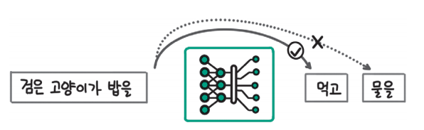

# **모델 가볍게 만들기**  
서비스를 위해 LLM을 배포하는 경우 가장 많은 비용은 GPU 사용에서 발생한다. 그렇기 때문에 GPU를 가능하면 적게 사용해서 비용을 낮춰야 비용 효율적인 
서빙을 할 수 있다. LLM은 모델의 크기가 기존 딥러닝 모델에 비해 훨씬 크기 때문에 효율적인 서빙이 더 중요하고 관련 연구도 활발히 진행되고 있다. 
GPU를 효율적으로 활용하는 방식은 모델의 성능을 약간 희생하더라도 비용을 크게 낮추는 방법과 모델의 성능을 그대로 유지하면서 연산 과정의 비효율을 
줄이는 방법으로 구분할 수 있다.  
  
LLM의 추론에서는 동일한 연산을 반복적으로 수행하면서 한 토큰씩 생성한다. 이때 발생하는 동일한 연산을 최대한 줄이기 위해 계산 결과를 저장하는 KV 캐시
(KV cache)를 사용한다. KV 캐시는 중복 계산을 줄여 추론 속도를 높이는 데 도움을 주지만 계산 결과를 저장해야 하기 때문에 많은 GPU 메모리를 사용한다. 
GPU를 효율적으로 활용하기 위해서는 한 번에 더 많은 데이터를 처리해야 하는데 KV 캐시와 모델 파라미터를 저장하는 데 많은 GPU 메모리를 사용하면 더 많은 
데이터를 처리하지 못한다.  
  
다음 명령을 실행해 라이브러리 설치
!pip install transformers==4.40.1 accelerate==0.30.0 bitsansbytes==0.43.1 auto-gptq==0.7.1 autoawq==0.2.5 optimum==1.19.1 -qqq  
  
# **언어 모델 추론 이해하기**  
# **언어 모델이 언어를 생성하는 방법**  
  
  
  
언어 모델은 위 그림과 같이 입력한 텍스트 다음에 올 토큰의 확률을 계산하고 그중에서 가장 확률이 높은 토큰을 입력 텍스트에 추가하면서 한 토큰씩 
생성한다. 그림에서 '검은 고양이가 밥을'이라는 텍스트를 입력했을 때 다음 토큰으로 '그리고'가 올 확률이 0.001, '마시고'가 올 확률은 0.04, '먹고'가 
올 확률이 0.9라고 예측했는데 이럴 때 가장 확률이 높은 '먹고'를 다음 토큰으로 결정하고 입력한 텍스트에 추가해 '검은 고양이가 밥을 먹고'라는 텍스트를 
생성한다. 언어 모델이 텍스트 생성을 마치는 이유는 두 가지로 나눌 수 있다. 먼저 다음 토큰으로 생성 종료를 의미하는 특수 토큰(예: EOS, End Of Sentence 토큰)
을 생성하는 경우 생성을 종료한다. 다음으로 사용자가 최대 길이로 설정한 길이에 도달하면 더 이상 생성하지 않고 종료한다. 두 가지 경우에 해당하기 
전까지는 위 그림의 순환 화살표와 같이 새로운 토큰을 추가한 텍스트를 다시 모델에 입력을 넣는 과정을 반복한다.  
  
  
  
앞서 살펴본 대로 언어 모델이 텍스트를 생성할 때는 한 번에 한 토큰씩만 생성할 수 있다. 위 그림처럼 다음 토큰과 그다음 토큰을 함께 예측할 수는 없다. 
이처럼 언어 모델은 입력 텍스트를 기반으로 바로 다음 토큰만 예측하는 자기 회귀적(auto-regressive) 특성을 갖는다. 하지만 새롭게 생성하는 부분이 아니라 
언어 모델에 입력하는 '검은 고양이가 밥을'같은 프롬프트는 이미 작성된 텍스트이기 때문에 한 번에 하나씩 토큰을 처리할 필요 없이 동시에 병렬적으로 
처리할 수 있다. 따라서 프롬프트가 길다고 하더라도 다음 토큰 1개를 생성하는 시간과 비슷한 시간이 거린다. 이런 이유로 추론 과정을 프롬프트를 처리하는 
단계인 사전 계산 단계(prefill phase)와 이후에 한 토큰씩 생성하는 디코딩 단계(decoding phase)로 구분한다.  
  
  
  
텍스트를 종료할 때까지 순환하며 반복 생성하는 과정을 풀어서 나타내면 위 그림과 같다. '검은 고양이가 밥을'이라는 프롬프트를 입력하고 '검은 고양이가 밥을 
먹고 물을 마신다!'라는 문장을 생성할 때까지 네 번의 생성 과정을 반복한다. 위 그림을 보면 동일한 텍스트가 반복적으로 모델에 입력되는 것을 볼 수 있다. 
예를 들어 '검은', '고양이가', '밥을'은 네 번의 생성 과정에 모두 동일하게 들어가고, '물은'은 두 번째부터 네 번째까지 세 번의 생성 과정에 들어간다. 
이렇게 동일한 토큰이 반복해서 입력으로 들어가면 동일한 연산을 반복적으로 수행하기 때문에 비효율적이다. 위 그림에서는 네 번의 생성만 수행했지만 
수백에서 수천 토큰을 생성한다면 동일한 연산을 수백 ~ 수천 번 수행하게 된다.  
  
셀프 어텐션 연산은 입력 텍스트에서 어떤 토큰이 서로 관련되는지 계산해서 그 결과에 따라 토큰 임베딩을 새롭게 조정한다. 이때 관련도를 계산하기 위해 
토큰 임베딩을 쿼리, 키, 값 벡터로 변환하는 선형 변환을 수행했다. 생성 속도를 높이기 위해 동일한 입력 토큰에 대해서는 키, 값, 벡터로의 변환을 
반복해서 수행하지 않고 계산 결과를 저장하고 있다가 다시 사용하는 방법을 사용한다.  
  
