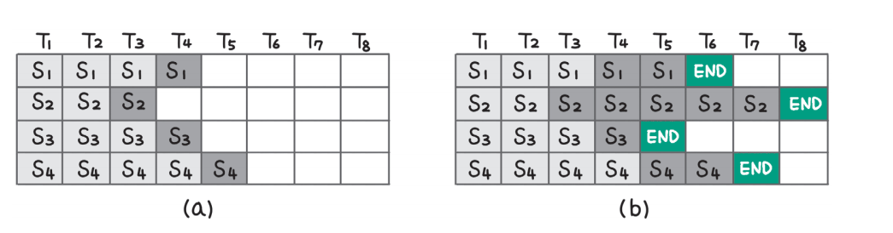
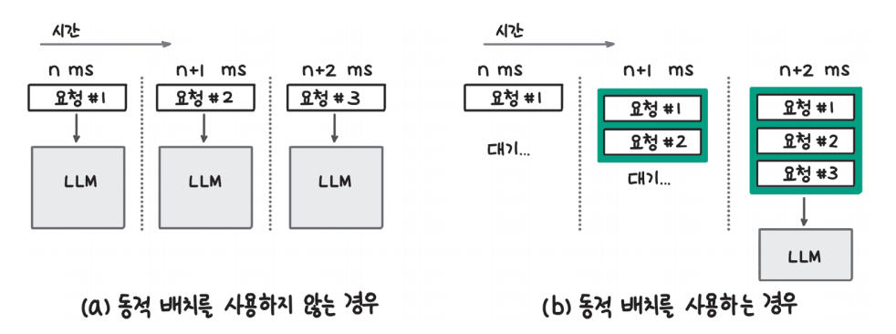
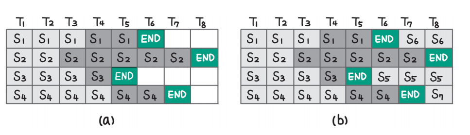

# **sLLM 서빙하기**  
실습을 들어가기 전에 필요한 라이브러리 설치  
  
!pip install transformers==4.40.1 accelerate==0.30.0 bitsandbytes==0.43.1  
datasets==2.19.0 vllm==0.4.1 openai==1.25.1 -qqq  
  
# **효율적인 배치 전략**  
딥런이 모델로 입력 데이터를 추론할 때 가능하면 한 번에 많은 데이터를 받아 처리량을 높이는 것이 GPU를 효율적으로 사용하는 방법이 된다. 하지만 언어 
모델의 특성상 한 번에 하나씩의 토큰을 생성하고 입력에 따라 몇 개의 토큰을 추가로 생성할지 예측하기 어렵기 때문에 기존의 딥러닝 모델보다 배치 전략을 
세우는 데 고려해야 할 사항이 더 많다.  
  
# **일반 배치(정적 배치)**  
입력 데이터를 배치 처리할 때 가장 기본적인 방식은 한 번에 N개의 입력을 받아 모두 추론이 끝날 때까지 기다리는 방식이다. 이를 일반 배치(native batching) 
또는 정적 배치(static batching)라 부른다.  
  
  
  
위 그림에서는 배치 크기가 4인 일반 배치 방식으로 입력을 처리하고 있다. 그림 a에서 첫 번째, 세 번째 입력은 프롬프트가 3개의 토큰으로 이뤄져 있고 두 
번째 입력은 2개의 토큰, 네 번째 입력은 4개의 토큰으로 이뤄져 있다. 그림 b에서는 모든 입력 데이터의 생성이 종료된 상태를 나타냈다. 이때 각 입력에 추가된 
토큰의 수가 다른데 세 번째 입력에는 1개의 토큰만 추가되고 생성이 종료됐고 두 번째 입력은 5개의 토큰이 추가되고 나서야 생성이 종료됐다.  
  
이렇게 되면 크게 두 가지 문제가 발생한다. 먼저 세 번째 입력은 생성이 종료된 이후에도 다른 데이터의 추론을 기다리느라 결과를 반환하지 못하고 대기하게 된다. 
다음으로 생성이 일찍 종료되는 문장이 있으면 결과적으로 배치 크기가 작어져 GPU를 효율적으로 사용하지 못하게 된다. 그림 b에서 첫 번째 토큰을 추가한 
이후 세 번째 문장의 생성이 끝나는데 그러면 이후로는 3개의 문장에 대해서만 추론을 수행한다. 또한 두 번째 토큰을 추가한 이후에 첫 번째 문장과 
네 번째 문장의 추론도 종료되는데 그러면 이후로는 1개의 문장에 대해서만 추론해 배치 크기가 작아지고 GPU를 비효율적으로 사용하게 되는 것이다. 
  
# **동적 배치**  
동적 배치(dynamic batching)는 비슷한 시간대에 들어오는 요청을 하나의 배치로 묶어 배치 크기를 키우는 전략이다. 딥러닝 모델을 활용해 서비스를 
제공하는 경우 언제 사용자가 요청을 보낼지 예측할 수 없고 완전히 같은 시간에 요청을 보내는 경우는 드물다. 만약 사용자가 요청을 보낼 때마다 딥러닝 
모델의 추론을 수행하게 되면 가장 먼저 요청을 보낸 사용자는 빠르게 응답을 받을 수 있지만 다음에 요청을 보낸 사용자는 이전 사용자의 추론이 끝나고 
자신의 요청을 처리할 때까지 오랜 시간 대기하게 된다. 이런 문제를 줄이기 위해 사용자가 요청을 보내더라도 바로 추론을 시작하지 않고 일정 시간 
대기하면서 다른 사용자의 요청을 기다렸다가 한 번에 처리할 수 있다.  
  
  
  
그림 a에서 동적 배치를 사용하지 않는 경우 요청이 들어올 때마다 추론을 수행하게 되는데 그러면 지연 시간은 짧을 수 있지만 GPU를 효율적으로 사용하지 
못한다. 또한 모델의 추론에 1ms 이상이 소요된다면 두 번째 요청은 처리되지 못하고 대기하는 경우도 발생한다. 그림 b와 같이 첫 번째 요청이 들어온 후 
2ms 동안 추가로 들어오는 요청들을 한 번에 배치로 처리한다면 첫 번재 요청과 두 번째 요청은 1~2ms 정도 지연 시간이 추가되지만 전체적으로 처리량을 
높일 수 있다. 동적 배치를 사용하면 온라인 서빙(online serving)에서 배치 크기를 키워 처리량을 높일 수 있다. 하지만 동적 배치 전략을 사용한다고 
하더라도 생성하는 토큰 길이 차이로 인해 처리하는 배치 크기가 점차 줄어 GPU를 비효율적으로 사용하게 되는 문제는 여전히 남게 된다.  
  
# **연속 배치**  
연속 배치(continuous batching)는 일반 배치와 달리 한 번에 들어온 배치 데이터의 추론이 모두 끝날 때까지 기다리지 않고 하나의 토큰 생성이 끝날 
떄마다 생성이 종료된 문장은 제거하고 새로운 문장을 추가한다. 생성이 끝나고도 다른 문장의 생성이 끝나길 기다리면서 대기 시간이 길어지는 문제를 줄이고 
배치 크기가 줄면서 GPU를 비효율적으로 사용하는 문제도 해결할 수 있다.  
  
  
  
위 그림 a는 일반 배치가 종료된 상태다. 하지만 연속 배치 전략에서는 그림 b와 같이 생성이 종료된 첫 번째, 세 번째, 네 번째 문장 자리에 새로운 
문장인 다섯 번째, 여섯 번째, 일곱 번째 문장(S5, S6, S7)을 추가한 것을 확인할 수 있다.  
  
하지만 새로운 데이터를 배치에 추가할 때 고려해야 할 사항이 있다. 언어 모델의 추론 과정을 설명하면서 언어 모델로 추론을 수행할 때 입력 프롬프트를 
병렬로 처리하는 사전 연산과 한 토큰씩 생성하는 디코딩으로 나눌 수 있다고 설명했다. 사전 연산과 디코딩은 처리 방식이 다르기 떄문에 한 번의 토큰 
생성이 끝날 떄마다 새로운 문장을 배치에 추가하지는 않고 처리 중인 문장과 대기 중인 문장의 비율을 지켜보고 특정 조건을 달성했을 때 추가하기도 한다. 
허깅페이스가 제공하는 LLM 추론 라이브러리인 Text-Generation-Inference의 경우 waiting_served_ratio와 같은 설정을 통해 대기 중인 요청이 
많거나 처리 중인 문장이 줄어들었을 때 새로운 요청을 배치에 추가하도록 한다. 더 자세한 사항은 허깅페이스 Text-Generation-Inference 라이브러리의 
설정 인자 공식 문서(https://huggingface.co/docks/text-generation-inference/basic_tutorials/launcher=#waitingservedratio)에서 확인할 
수 있다.  
  
연속 배치 방식은 다양한 LLM 서빙 프레임워크에서 사용되고 있기 때문에 잘 알아둘 필요가 있다.  
  

  
