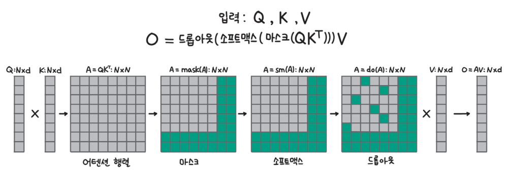
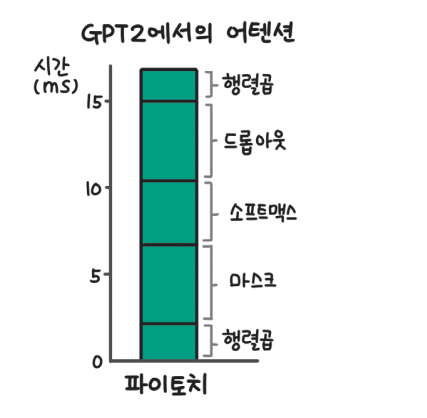
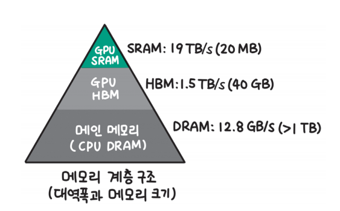
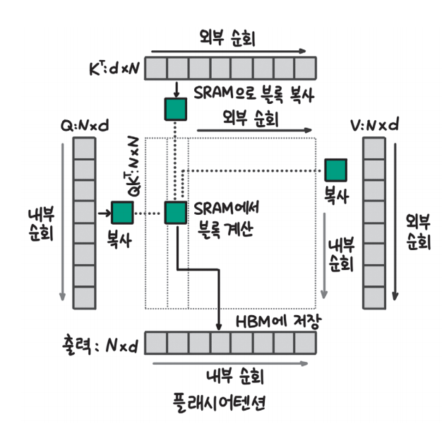
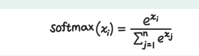
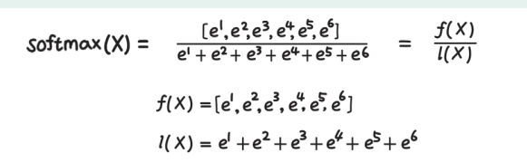
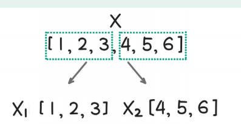
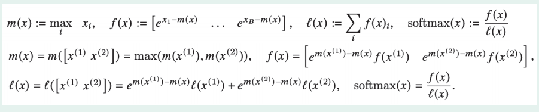
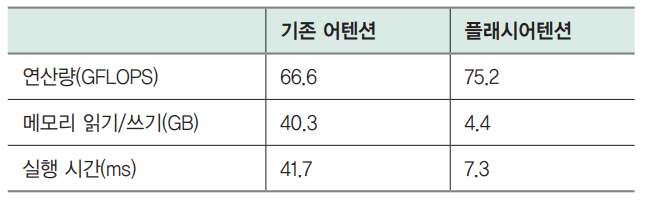

# **sLLM 서빙하기**  
실습을 들어가기 전에 필요한 라이브러리 설치  
  
!pip install transformers==4.40.1 accelerate==0.30.0 bitsandbytes==0.43.1  
datasets==2.19.0 vllm==0.4.1 openai==1.25.1 -qqq  
  
# **효율적인 배치 전략**  
딥런이 모델로 입력 데이터를 추론할 때 가능하면 한 번에 많은 데이터를 받아 처리량을 높이는 것이 GPU를 효율적으로 사용하는 방법이 된다. 하지만 언어 
모델의 특성상 한 번에 하나씩의 토큰을 생성하고 입력에 따라 몇 개의 토큰을 추가로 생성할지 예측하기 어렵기 때문에 기존의 딥러닝 모델보다 배치 전략을 
세우는 데 고려해야 할 사항이 더 많다.  
  
# **일반 배치(정적 배치)**  
입력 데이터를 배치 처리할 때 가장 기본적인 방식은 한 번에 N개의 입력을 받아 모두 추론이 끝날 때까지 기다리는 방식이다. 이를 일반 배치(native batching) 
또는 정적 배치(static batching)라 부른다.  
  
  
  
위 그림에서는 배치 크기가 4인 일반 배치 방식으로 입력을 처리하고 있다. 그림 a에서 첫 번째, 세 번째 입력은 프롬프트가 3개의 토큰으로 이뤄져 있고 두 
번째 입력은 2개의 토큰, 네 번째 입력은 4개의 토큰으로 이뤄져 있다. 그림 b에서는 모든 입력 데이터의 생성이 종료된 상태를 나타냈다. 이때 각 입력에 추가된 
토큰의 수가 다른데 세 번째 입력에는 1개의 토큰만 추가되고 생성이 종료됐고 두 번째 입력은 5개의 토큰이 추가되고 나서야 생성이 종료됐다.  
  
이렇게 되면 크게 두 가지 문제가 발생한다. 먼저 세 번째 입력은 생성이 종료된 이후에도 다른 데이터의 추론을 기다리느라 결과를 반환하지 못하고 대기하게 된다. 
다음으로 생성이 일찍 종료되는 문장이 있으면 결과적으로 배치 크기가 작어져 GPU를 효율적으로 사용하지 못하게 된다. 그림 b에서 첫 번째 토큰을 추가한 
이후 세 번째 문장의 생성이 끝나는데 그러면 이후로는 3개의 문장에 대해서만 추론을 수행한다. 또한 두 번째 토큰을 추가한 이후에 첫 번째 문장과 
네 번째 문장의 추론도 종료되는데 그러면 이후로는 1개의 문장에 대해서만 추론해 배치 크기가 작아지고 GPU를 비효율적으로 사용하게 되는 것이다. 
  
# **동적 배치**  
동적 배치(dynamic batching)는 비슷한 시간대에 들어오는 요청을 하나의 배치로 묶어 배치 크기를 키우는 전략이다. 딥러닝 모델을 활용해 서비스를 
제공하는 경우 언제 사용자가 요청을 보낼지 예측할 수 없고 완전히 같은 시간에 요청을 보내는 경우는 드물다. 만약 사용자가 요청을 보낼 때마다 딥러닝 
모델의 추론을 수행하게 되면 가장 먼저 요청을 보낸 사용자는 빠르게 응답을 받을 수 있지만 다음에 요청을 보낸 사용자는 이전 사용자의 추론이 끝나고 
자신의 요청을 처리할 때까지 오랜 시간 대기하게 된다. 이런 문제를 줄이기 위해 사용자가 요청을 보내더라도 바로 추론을 시작하지 않고 일정 시간 
대기하면서 다른 사용자의 요청을 기다렸다가 한 번에 처리할 수 있다.  
  
  
  
그림 a에서 동적 배치를 사용하지 않는 경우 요청이 들어올 때마다 추론을 수행하게 되는데 그러면 지연 시간은 짧을 수 있지만 GPU를 효율적으로 사용하지 
못한다. 또한 모델의 추론에 1ms 이상이 소요된다면 두 번째 요청은 처리되지 못하고 대기하는 경우도 발생한다. 그림 b와 같이 첫 번째 요청이 들어온 후 
2ms 동안 추가로 들어오는 요청들을 한 번에 배치로 처리한다면 첫 번재 요청과 두 번째 요청은 1~2ms 정도 지연 시간이 추가되지만 전체적으로 처리량을 
높일 수 있다. 동적 배치를 사용하면 온라인 서빙(online serving)에서 배치 크기를 키워 처리량을 높일 수 있다. 하지만 동적 배치 전략을 사용한다고 
하더라도 생성하는 토큰 길이 차이로 인해 처리하는 배치 크기가 점차 줄어 GPU를 비효율적으로 사용하게 되는 문제는 여전히 남게 된다.  
  
# **연속 배치**  
연속 배치(continuous batching)는 일반 배치와 달리 한 번에 들어온 배치 데이터의 추론이 모두 끝날 때까지 기다리지 않고 하나의 토큰 생성이 끝날 
떄마다 생성이 종료된 문장은 제거하고 새로운 문장을 추가한다. 생성이 끝나고도 다른 문장의 생성이 끝나길 기다리면서 대기 시간이 길어지는 문제를 줄이고 
배치 크기가 줄면서 GPU를 비효율적으로 사용하는 문제도 해결할 수 있다.  
  
  
  
위 그림 a는 일반 배치가 종료된 상태다. 하지만 연속 배치 전략에서는 그림 b와 같이 생성이 종료된 첫 번째, 세 번째, 네 번째 문장 자리에 새로운 
문장인 다섯 번째, 여섯 번째, 일곱 번째 문장(S5, S6, S7)을 추가한 것을 확인할 수 있다.  
  
하지만 새로운 데이터를 배치에 추가할 때 고려해야 할 사항이 있다. 언어 모델의 추론 과정을 설명하면서 언어 모델로 추론을 수행할 때 입력 프롬프트를 
병렬로 처리하는 사전 연산과 한 토큰씩 생성하는 디코딩으로 나눌 수 있다고 설명했다. 사전 연산과 디코딩은 처리 방식이 다르기 떄문에 한 번의 토큰 
생성이 끝날 떄마다 새로운 문장을 배치에 추가하지는 않고 처리 중인 문장과 대기 중인 문장의 비율을 지켜보고 특정 조건을 달성했을 때 추가하기도 한다. 
허깅페이스가 제공하는 LLM 추론 라이브러리인 Text-Generation-Inference의 경우 waiting_served_ratio와 같은 설정을 통해 대기 중인 요청이 
많거나 처리 중인 문장이 줄어들었을 때 새로운 요청을 배치에 추가하도록 한다. 더 자세한 사항은 허깅페이스 Text-Generation-Inference 라이브러리의 
설정 인자 공식 문서(https://huggingface.co/docks/text-generation-inference/basic_tutorials/launcher=#waitingservedratio)에서 확인할 
수 있다.  
  
연속 배치 방식은 다양한 LLM 서빙 프레임워크에서 사용되고 있기 때문에 잘 알아둘 필요가 있다.  
  
# **효율적인 트랜스포머 연산**  
셀프 어텐션 연산은 쿼리와 키 벡터 사이의 관련도를 계산해 새롭게 토큰 임베딩을 조정하기 때문에 성능이 높지만 많은 연산이 필요하다. 2장에서는 토큰의 
위치 정보를 추가할 때 토큰의 위치에 따라 동일한 임베딩을 추가하는 절대적 위치 인코딩(absolute positional encoding)을 사용했다. 하지만 절대적 
위치 인코딩은 학습 데이터보다 긴 입력 데이터가 들어올 경우 성능이 크게 저하된다는 단점이 있다. 이를 개선하기 위해 토큰 사이의 상대적 위치 정보를 
추가하는 상대적 위치 인코딩이 개발됐다.  
  
# **플래시어텐션**  
플래시어텐션(FlashAttention)은 트랜스포머가 더 긴 시퀀스를 처리하도록 만들기 위해 개발됐다. 트랜스포머 아키텍처는 연산량이 학습 과정에서는 시퀀스 
길이의 제곱에 비례하고 추론 과정에서는 시퀀스 길이에 비례하게 증가하기 떄문에 긴 시퀀스를 처리하는 데 어려움이 있다. 플래시어텐션은 어텐션 연산 
과정을 변경해 학습 과정에서 필요한 메모리를 시퀀스 길이에 비례하도록 개선했다. 플래시어텐션은 효율적인 학습을 위한 기술이기도 하다.  
  
자연어 처리에서도 더 많은 텍스트를 처리하는 능력이 중요하지만 컴퓨터 비전이나 시계열 데이터, 오디오/비디오 데이터 등에서는 텍스트보다 훨씬 긴 
시퀀스를 처리해야 한다. 따라서 트랜스포머가 더 긴 시퀀스를 처리하는 능력을 갖추면 자연어 처리뿐만 아니라 다양한 형태의 입력을 처리할 수 있게 된다.  
  
  
  
트랜스포머 연산은 쿼리와 키 벡터를 곱하는 과정에서 많은 메모리를 사용한다. 위 그림에서 쿼리와 키 행렬은 크기가 N * d인데 여기서 N은 시퀀스 길이, d는 
잠재 상태의 차원이다. 잠재 상태의 차원은 한 모델 내에서 변하지 않고 보통 700~1000 정도의 값을 갖는데 시퀀스의 길이는 입력에 따라 얼마든지 증가할 수 
있다. 위 그림에서 어텐션 행렬은 N * N 크기의 행렬로 어텐션 행렬에 마스크 연산, 소프트맥스 처리, 드롭아웃 처리를 거친 후 값 벡터와 곱해 최종적으로 
출력인 O 행렬이 된다. 어텐션 행렬부터 드롭아웃 처리까지의 행렬 크기가 입력인 쿼리(Q), 키(K), 값(V)이나 출력 행렬(O)에 비해 훨씬 큰 것을 확인할 
수 있다.  
  
  
  
어텐션 연산에 드는 시간을 측정하면 위 그림과 같이 마스크, 소프트맥스, 드롭아웃 처리에 드는 시간이 행렬 곱셈에 드는 시간보다 더 길다. 하지만 연산량 
자체는 행렬 곱셈이 다른 연산에 비해 훨씬 크다. 마스크, 소프트맥스, 드롭아웃 연산이 더 시간이 오래 걸리는 이유는 마스크, 소프트맥스, 드롭아웃 모두 어텐션 
행렬에 취하는 연산이기 떄문이다. 큰 메모리를 사용하는 세 연산이 많은 연산량이 필요한 행렬 곱셈보다 오래 걸리는 사실에서 어텐션 연산이 오래 걸리는 
이유가 GPU에서 메모리를 읽고 쓰는 데 오랜 시간이 걸리기 때문임을 알 수 있다.  
  
  
  
딥런이 연산에서 사용하는 메모리는 위 그림과 같은 계층적인 구조를 갖고 있다. GPU 메모리는 데이터를 빠르게 이동시킬 수 있는 SRAM(Static Random Access Memory)
과 데이터 이동 속도가 느린 고대역폭 메모리(High Bandwidth Memory, HBM)로 나뉜다. SRAM은 빠르지만 메모리 크기가 작아 대부분의 읽기 쓰기 작업은 
고대역폭 메모리에서 이뤄진다. 어텐션 행렬은 크기가 크기 떄문에 SRAM에서 처리할 수 없고 저장 공간이 큰 고대역폭 메미로에 쓰고 다시 읽으면서 연산을 
수행해야 한다. 그런데 고대역폭 메모리는 데이터 전달 속도가 느리기 때문에 큰 어텐션 행렬을 쓰고 읽는데 오랜 시간이 걸리게 된다.  
  
  
  
플래시어텐션에서는 데이터 이동 속도가 느린 고대역폭 메모리에 큰 어텐션 행렬을 쓰고 읽으면서 걸리는 시간을 줄이기 위해 위 그림과 같이 블록 단위
(그림의 상자) 어텐션 연산을 수행하고 전체 어텐션 행렬을 쓰거나 읽지 않는 방식으로 어텐션 연산의 속도를 높였다. 또 작은 블록 단위로 연산을 수행하기 떄문에 
고대역폭 메모리가 아닌 SRAM에 데이터를 읽고 쓰면서 다 빠르게 연산을 수행한다. 플래시어텐션은 이 두 가지 개선을 통해 속도를 높인다. 위 그림에서 
가운데에 어텐션 행렬이 점선으로 표시되어 있는데 이는 고대역폭 메모리에 읽고 쓰는 시간을 줄이기 위해 큰 어텐션 행렬을 따로 저장하지 않는다는 것을 
강조한 것이다. 속도가 느린 고대역폭 메모리에 큰 데이터를 쓰고 읽는 작업을 제거했기 때문에 동일한 연산을 수행하면서도 시간이 훨씬 짧게 걸린다. 
이렇게 블록 단위로 계산한 최종 결과를 그림 아랫부분에서 고대역폭 메모리에 저장한다. 이때 최종 결과는 N * d 차원으로 어텐션 행렬에 비해 훨씬 작다.  
  
어텐션 연산 과정에는 소프트맥스 연산이 들어가는데 어떻게 소프트맥스 연산을 블록 단위로 일부분씩 수행할 수 있을까?  
  
  
  
소프트맥스의 계산식은 위 그림과 같다. 아래 식에서 x는 백터 X에 속한 요소(스칼라)다. 계산식에서도 알 수 있듯이 소프트맥스 연산을 위해서는 
분모어세 전체 벡터의 값이 필요한데 블록 단위로 계산하려면 벡터 일부분의 소프트맥스 연산 결과로 전체 소프트맥스 연산 결과를 만들 수 있어야 한다.  
  
  
  
부븐(블록)의 값으로 전체 소프트맥스 연산 결과를 계산하는 트릭은 생각보다 간단하다. 예를 들어 위 그림과 같이 [1, 2, 3, 4, 5, 6]으로 구성된 벡터 X의 
소프트맥스를 게싼한다고 하자.  
  
  
  
소프트맥스 계산식에 따르면 위 그림과 같이 계산할 수 있다. 이때 분자는 벡터 X의 각 요소를 자연 상수 e의 지수로 올린 벡터이고 분모는 분자의 각 요소를 
모두 더한 값이다. 그림에서는 분자를 f(X), 분모를 l(X)로 표기했다.  
  
  
  
벡터 X를 2개로 나눠 부분의 소프트맥스로 전체 소프트맥스를 구하는 방법을 알아보면 우선 위 그림과 같이 벡터 X를 요소 3개씩 나눠 X1과 X2로 나눈다.  
  
  
  
그러면 전체의 소프트맥스 값은 위 그림과 같이 f(X1)과 f(X2), l(X1)과 l(X2)를 조합해 계산할 수 있다. 분자에서는 f(X1)과 f(X2)를 연결해서 하나의 
벡터로 만들고 분모에서는 l(X1)과 l(X2)를 더하면 된다.  
  
  
  
논문에서는 위 그림과 같이 좀 더 복잡한 식으로 두 부분의 값으로 전체 소프트맥스 값을 계산하는데 그림의 m(x)는 각 부분 벡터의 최댓값으로 벡터의 요소를 
그대로 자연 상수의 지수로 사용할 경우 값이 너무 커질 수 있어 정규화(mormalization)를 해주는 것이고 나머지는 앞서 살펴본 식과 완전히 동일하다.  
  
플래시어텐션을 사용하면 N * N 크기의 행렬을 저장하지 않고 어텐션 연산이 가능하다. 하지만 역전파 계산 과정에서 순전파에서 계산한 N * N 행렬의 값이 
필요한데 플래시어텐션에서는 역전파 과정에서 다시 순전파를 계산하는 방식으로 이 문제를 해결한다.  
  
  
  
행렬을 다시 계산해야 하기 때문에 계산량은 증가하지만 앞서 살펴본 대로 처리 시간이 대부분 고대역폭 메모리에 큰 행렬을 쓰고 읽을 때 발생하기 때문에 
위 표와 같이 연산량은 66.6에서 75.2로 증가하지만 메모리를 읽고 쓰는 양이 40.3에서 4.4로 크게 줄면서 실행 시간은 오히려 1/6 ~ 1/5 정도로 감소한다.  
  
플래시어텐션은 파이토치, 허깅페이스, JAX 등 많은 프레임워크에서 채택해 반영하고 있다.  
  

