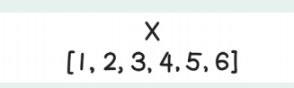
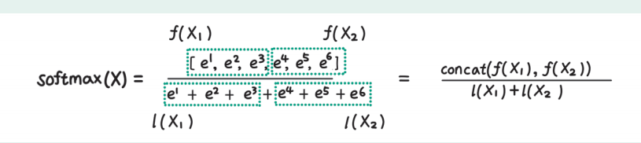
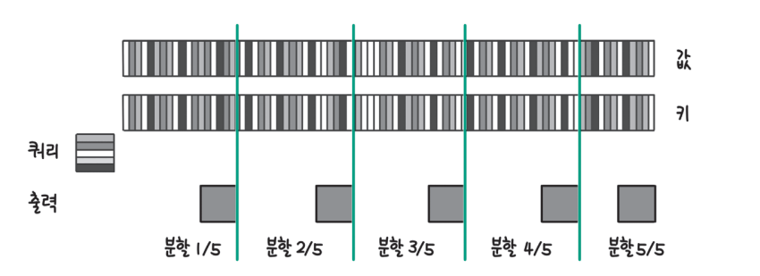

# **sLLM 서빙하기**  
실습을 들어가기 전에 필요한 라이브러리 설치  
  
!pip install transformers==4.40.1 accelerate==0.30.0 bitsandbytes==0.43.1  
datasets==2.19.0 vllm==0.4.1 openai==1.25.1 -qqq  
  
# **효율적인 배치 전략**  
딥런이 모델로 입력 데이터를 추론할 때 가능하면 한 번에 많은 데이터를 받아 처리량을 높이는 것이 GPU를 효율적으로 사용하는 방법이 된다. 하지만 언어 
모델의 특성상 한 번에 하나씩의 토큰을 생성하고 입력에 따라 몇 개의 토큰을 추가로 생성할지 예측하기 어렵기 때문에 기존의 딥러닝 모델보다 배치 전략을 
세우는 데 고려해야 할 사항이 더 많다.  
  
# **일반 배치(정적 배치)**  
입력 데이터를 배치 처리할 때 가장 기본적인 방식은 한 번에 N개의 입력을 받아 모두 추론이 끝날 때까지 기다리는 방식이다. 이를 일반 배치(native batching) 
또는 정적 배치(static batching)라 부른다.  
  
  
  
위 그림에서는 배치 크기가 4인 일반 배치 방식으로 입력을 처리하고 있다. 그림 a에서 첫 번째, 세 번째 입력은 프롬프트가 3개의 토큰으로 이뤄져 있고 두 
번째 입력은 2개의 토큰, 네 번째 입력은 4개의 토큰으로 이뤄져 있다. 그림 b에서는 모든 입력 데이터의 생성이 종료된 상태를 나타냈다. 이때 각 입력에 추가된 
토큰의 수가 다른데 세 번째 입력에는 1개의 토큰만 추가되고 생성이 종료됐고 두 번째 입력은 5개의 토큰이 추가되고 나서야 생성이 종료됐다.  
  
이렇게 되면 크게 두 가지 문제가 발생한다. 먼저 세 번째 입력은 생성이 종료된 이후에도 다른 데이터의 추론을 기다리느라 결과를 반환하지 못하고 대기하게 된다. 
다음으로 생성이 일찍 종료되는 문장이 있으면 결과적으로 배치 크기가 작어져 GPU를 효율적으로 사용하지 못하게 된다. 그림 b에서 첫 번째 토큰을 추가한 
이후 세 번째 문장의 생성이 끝나는데 그러면 이후로는 3개의 문장에 대해서만 추론을 수행한다. 또한 두 번째 토큰을 추가한 이후에 첫 번째 문장과 
네 번째 문장의 추론도 종료되는데 그러면 이후로는 1개의 문장에 대해서만 추론해 배치 크기가 작아지고 GPU를 비효율적으로 사용하게 되는 것이다. 
  
# **동적 배치**  
동적 배치(dynamic batching)는 비슷한 시간대에 들어오는 요청을 하나의 배치로 묶어 배치 크기를 키우는 전략이다. 딥러닝 모델을 활용해 서비스를 
제공하는 경우 언제 사용자가 요청을 보낼지 예측할 수 없고 완전히 같은 시간에 요청을 보내는 경우는 드물다. 만약 사용자가 요청을 보낼 때마다 딥러닝 
모델의 추론을 수행하게 되면 가장 먼저 요청을 보낸 사용자는 빠르게 응답을 받을 수 있지만 다음에 요청을 보낸 사용자는 이전 사용자의 추론이 끝나고 
자신의 요청을 처리할 때까지 오랜 시간 대기하게 된다. 이런 문제를 줄이기 위해 사용자가 요청을 보내더라도 바로 추론을 시작하지 않고 일정 시간 
대기하면서 다른 사용자의 요청을 기다렸다가 한 번에 처리할 수 있다.  
  
  
  
그림 a에서 동적 배치를 사용하지 않는 경우 요청이 들어올 때마다 추론을 수행하게 되는데 그러면 지연 시간은 짧을 수 있지만 GPU를 효율적으로 사용하지 
못한다. 또한 모델의 추론에 1ms 이상이 소요된다면 두 번째 요청은 처리되지 못하고 대기하는 경우도 발생한다. 그림 b와 같이 첫 번째 요청이 들어온 후 
2ms 동안 추가로 들어오는 요청들을 한 번에 배치로 처리한다면 첫 번재 요청과 두 번째 요청은 1~2ms 정도 지연 시간이 추가되지만 전체적으로 처리량을 
높일 수 있다. 동적 배치를 사용하면 온라인 서빙(online serving)에서 배치 크기를 키워 처리량을 높일 수 있다. 하지만 동적 배치 전략을 사용한다고 
하더라도 생성하는 토큰 길이 차이로 인해 처리하는 배치 크기가 점차 줄어 GPU를 비효율적으로 사용하게 되는 문제는 여전히 남게 된다.  
  
# **연속 배치**  
연속 배치(continuous batching)는 일반 배치와 달리 한 번에 들어온 배치 데이터의 추론이 모두 끝날 때까지 기다리지 않고 하나의 토큰 생성이 끝날 
떄마다 생성이 종료된 문장은 제거하고 새로운 문장을 추가한다. 생성이 끝나고도 다른 문장의 생성이 끝나길 기다리면서 대기 시간이 길어지는 문제를 줄이고 
배치 크기가 줄면서 GPU를 비효율적으로 사용하는 문제도 해결할 수 있다.  
  
  
  
위 그림 a는 일반 배치가 종료된 상태다. 하지만 연속 배치 전략에서는 그림 b와 같이 생성이 종료된 첫 번째, 세 번째, 네 번째 문장 자리에 새로운 
문장인 다섯 번째, 여섯 번째, 일곱 번째 문장(S5, S6, S7)을 추가한 것을 확인할 수 있다.  
  
하지만 새로운 데이터를 배치에 추가할 때 고려해야 할 사항이 있다. 언어 모델의 추론 과정을 설명하면서 언어 모델로 추론을 수행할 때 입력 프롬프트를 
병렬로 처리하는 사전 연산과 한 토큰씩 생성하는 디코딩으로 나눌 수 있다고 설명했다. 사전 연산과 디코딩은 처리 방식이 다르기 떄문에 한 번의 토큰 
생성이 끝날 떄마다 새로운 문장을 배치에 추가하지는 않고 처리 중인 문장과 대기 중인 문장의 비율을 지켜보고 특정 조건을 달성했을 때 추가하기도 한다. 
허깅페이스가 제공하는 LLM 추론 라이브러리인 Text-Generation-Inference의 경우 waiting_served_ratio와 같은 설정을 통해 대기 중인 요청이 
많거나 처리 중인 문장이 줄어들었을 때 새로운 요청을 배치에 추가하도록 한다. 더 자세한 사항은 허깅페이스 Text-Generation-Inference 라이브러리의 
설정 인자 공식 문서(https://huggingface.co/docks/text-generation-inference/basic_tutorials/launcher=#waitingservedratio)에서 확인할 
수 있다.  
  
연속 배치 방식은 다양한 LLM 서빙 프레임워크에서 사용되고 있기 때문에 잘 알아둘 필요가 있다.  
  
# **효율적인 트랜스포머 연산**  
셀프 어텐션 연산은 쿼리와 키 벡터 사이의 관련도를 계산해 새롭게 토큰 임베딩을 조정하기 때문에 성능이 높지만 많은 연산이 필요하다. 2장에서는 토큰의 
위치 정보를 추가할 때 토큰의 위치에 따라 동일한 임베딩을 추가하는 절대적 위치 인코딩(absolute positional encoding)을 사용했다. 하지만 절대적 
위치 인코딩은 학습 데이터보다 긴 입력 데이터가 들어올 경우 성능이 크게 저하된다는 단점이 있다. 이를 개선하기 위해 토큰 사이의 상대적 위치 정보를 
추가하는 상대적 위치 인코딩이 개발됐다.  
  
# **플래시어텐션**  
플래시어텐션(FlashAttention)은 트랜스포머가 더 긴 시퀀스를 처리하도록 만들기 위해 개발됐다. 트랜스포머 아키텍처는 연산량이 학습 과정에서는 시퀀스 
길이의 제곱에 비례하고 추론 과정에서는 시퀀스 길이에 비례하게 증가하기 떄문에 긴 시퀀스를 처리하는 데 어려움이 있다. 플래시어텐션은 어텐션 연산 
과정을 변경해 학습 과정에서 필요한 메모리를 시퀀스 길이에 비례하도록 개선했다. 플래시어텐션은 효율적인 학습을 위한 기술이기도 하다.  
  
자연어 처리에서도 더 많은 텍스트를 처리하는 능력이 중요하지만 컴퓨터 비전이나 시계열 데이터, 오디오/비디오 데이터 등에서는 텍스트보다 훨씬 긴 
시퀀스를 처리해야 한다. 따라서 트랜스포머가 더 긴 시퀀스를 처리하는 능력을 갖추면 자연어 처리뿐만 아니라 다양한 형태의 입력을 처리할 수 있게 된다.  
  
  
  
트랜스포머 연산은 쿼리와 키 벡터를 곱하는 과정에서 많은 메모리를 사용한다. 위 그림에서 쿼리와 키 행렬은 크기가 N * d인데 여기서 N은 시퀀스 길이, d는 
잠재 상태의 차원이다. 잠재 상태의 차원은 한 모델 내에서 변하지 않고 보통 700~1000 정도의 값을 갖는데 시퀀스의 길이는 입력에 따라 얼마든지 증가할 수 
있다. 위 그림에서 어텐션 행렬은 N * N 크기의 행렬로 어텐션 행렬에 마스크 연산, 소프트맥스 처리, 드롭아웃 처리를 거친 후 값 벡터와 곱해 최종적으로 
출력인 O 행렬이 된다. 어텐션 행렬부터 드롭아웃 처리까지의 행렬 크기가 입력인 쿼리(Q), 키(K), 값(V)이나 출력 행렬(O)에 비해 훨씬 큰 것을 확인할 
수 있다.  
  
  
  
어텐션 연산에 드는 시간을 측정하면 위 그림과 같이 마스크, 소프트맥스, 드롭아웃 처리에 드는 시간이 행렬 곱셈에 드는 시간보다 더 길다. 하지만 연산량 
자체는 행렬 곱셈이 다른 연산에 비해 훨씬 크다. 마스크, 소프트맥스, 드롭아웃 연산이 더 시간이 오래 걸리는 이유는 마스크, 소프트맥스, 드롭아웃 모두 어텐션 
행렬에 취하는 연산이기 떄문이다. 큰 메모리를 사용하는 세 연산이 많은 연산량이 필요한 행렬 곱셈보다 오래 걸리는 사실에서 어텐션 연산이 오래 걸리는 
이유가 GPU에서 메모리를 읽고 쓰는 데 오랜 시간이 걸리기 때문임을 알 수 있다.  
  
  
  
딥러닝이 연산에서 사용하는 메모리는 위 그림과 같은 계층적인 구조를 갖고 있다. GPU 메모리는 데이터를 빠르게 이동시킬 수 있는 SRAM(Static Random Access Memory)
과 데이터 이동 속도가 느린 고대역폭 메모리(High Bandwidth Memory, HBM)로 나뉜다. SRAM은 빠르지만 메모리 크기가 작아 대부분의 읽기 쓰기 작업은 
고대역폭 메모리에서 이뤄진다. 어텐션 행렬은 크기가 크기 떄문에 SRAM에서 처리할 수 없고 저장 공간이 큰 고대역폭 메미로에 쓰고 다시 읽으면서 연산을 
수행해야 한다. 그런데 고대역폭 메모리는 데이터 전달 속도가 느리기 때문에 큰 어텐션 행렬을 쓰고 읽는데 오랜 시간이 걸리게 된다.  
  
  
  
플래시어텐션에서는 데이터 이동 속도가 느린 고대역폭 메모리에 큰 어텐션 행렬을 쓰고 읽으면서 걸리는 시간을 줄이기 위해 위 그림과 같이 블록 단위
(그림의 상자) 어텐션 연산을 수행하고 전체 어텐션 행렬을 쓰거나 읽지 않는 방식으로 어텐션 연산의 속도를 높였다. 또 작은 블록 단위로 연산을 수행하기 떄문에 
고대역폭 메모리가 아닌 SRAM에 데이터를 읽고 쓰면서 다 빠르게 연산을 수행한다. 플래시어텐션은 이 두 가지 개선을 통해 속도를 높인다. 위 그림에서 
가운데에 어텐션 행렬이 점선으로 표시되어 있는데 이는 고대역폭 메모리에 읽고 쓰는 시간을 줄이기 위해 큰 어텐션 행렬을 따로 저장하지 않는다는 것을 
강조한 것이다. 속도가 느린 고대역폭 메모리에 큰 데이터를 쓰고 읽는 작업을 제거했기 때문에 동일한 연산을 수행하면서도 시간이 훨씬 짧게 걸린다. 
이렇게 블록 단위로 계산한 최종 결과를 그림 아랫부분에서 고대역폭 메모리에 저장한다. 이때 최종 결과는 N * d 차원으로 어텐션 행렬에 비해 훨씬 작다.  
  
어텐션 연산 과정에는 소프트맥스 연산이 들어가는데 어떻게 소프트맥스 연산을 블록 단위로 일부분씩 수행할 수 있을까?  
  
  
  
소프트맥스의 계산식은 위 그림과 같다. 아래 식에서 x는 백터 X에 속한 요소(스칼라)다. 계산식에서도 알 수 있듯이 소프트맥스 연산을 위해서는 
분모어세 전체 벡터의 값이 필요한데 블록 단위로 계산하려면 벡터 일부분의 소프트맥스 연산 결과로 전체 소프트맥스 연산 결과를 만들 수 있어야 한다.  
  
  
  
부븐(블록)의 값으로 전체 소프트맥스 연산 결과를 계산하는 트릭은 생각보다 간단하다. 예를 들어 위 그림과 같이 [1, 2, 3, 4, 5, 6]으로 구성된 벡터 X의 
소프트맥스를 게싼한다고 하자.  
  
  
  
소프트맥스 계산식에 따르면 위 그림과 같이 계산할 수 있다. 이때 분자는 벡터 X의 각 요소를 자연 상수 e의 지수로 올린 벡터이고 분모는 분자의 각 요소를 
모두 더한 값이다. 그림에서는 분자를 f(X), 분모를 l(X)로 표기했다.  
  
  
  
벡터 X를 2개로 나눠 부분의 소프트맥스로 전체 소프트맥스를 구하는 방법을 알아보면 우선 위 그림과 같이 벡터 X를 요소 3개씩 나눠 X1과 X2로 나눈다.  
  
  
  
그러면 전체의 소프트맥스 값은 위 그림과 같이 f(X1)과 f(X2), l(X1)과 l(X2)를 조합해 계산할 수 있다. 분자에서는 f(X1)과 f(X2)를 연결해서 하나의 
벡터로 만들고 분모에서는 l(X1)과 l(X2)를 더하면 된다.  
  
  
  
논문에서는 위 그림과 같이 좀 더 복잡한 식으로 두 부분의 값으로 전체 소프트맥스 값을 계산하는데 그림의 m(x)는 각 부분 벡터의 최댓값으로 벡터의 요소를 
그대로 자연 상수의 지수로 사용할 경우 값이 너무 커질 수 있어 정규화(mormalization)를 해주는 것이고 나머지는 앞서 살펴본 식과 완전히 동일하다.  
  
플래시어텐션을 사용하면 N * N 크기의 행렬을 저장하지 않고 어텐션 연산이 가능하다. 하지만 역전파 계산 과정에서 순전파에서 계산한 N * N 행렬의 값이 
필요한데 플래시어텐션에서는 역전파 과정에서 다시 순전파를 계산하는 방식으로 이 문제를 해결한다.  
  
  
  
행렬을 다시 계산해야 하기 때문에 계산량은 증가하지만 앞서 살펴본 대로 처리 시간이 대부분 고대역폭 메모리에 큰 행렬을 쓰고 읽을 때 발생하기 때문에 
위 표와 같이 연산량은 66.6에서 75.2로 증가하지만 메모리를 읽고 쓰는 양이 40.3에서 4.4로 크게 줄면서 실행 시간은 오히려 1/6 ~ 1/5 정도로 감소한다.  
  
플래시어텐션은 파이토치, 허깅페이스, JAX 등 많은 프레임워크에서 채택해 반영하고 있다.  
  
# **플래시어텐션 2**  
플래시어텐션 2는 플래시어텐션을 개선해 2배 정도 속도를 향상했다. 플래시어텐션은 기존 어텐션 구현에 비해 2 ~ 4배 정도 빨랐지만 최대 GPU 처리량 
대비 순전파에서는 30 ~ 50%, 역전파에서는 25 ~ 35% 정도만 사용했다. GPU를 이상적으로 활용하는 경우 GPU 처리량의 80 ~ 90%까지 활용할 수 있기 때문에 
여전히 개선의 여지가 많았다. 플래시어텐션 2의 개선을 통해 순전파에서 최대 GPU 처리량의 73%, 역전파에서는 63%를 달성했다. 버전 2에서 개선한 부분은 
크게 다음 두 가지다.  
  
- 행렬 곱셈이 아닌 연산 줄이기  
- 시퀀스 길이 방향의 병렬화 추가  
  
각각의 요소를 살펴보면 먼저 연산 과정에서 행렬 곱셈이 아닌 연산을 줄였다. 딥러닝 연산에 사용하는 GPU의 경우 행렬 연산에 최적화돼 있다. A100 GPU를 
기준으로 FP16 또는 BF16의 행렬 곱셈 연산은 최대 312TFLOPS까지 가능하지만 FP32인 비 행렬 곱셈 연산은 19.5TFLOPS밖에 처리하지 못한다. 대력 16배 
속도 차이인데 비용 측면에서 보자면 비 행렬 곱셈 연산이 행렬 곱셈 연산에 비해 16배 비싸다고 생각할 수 있다. 플래시어텐션 2에서는 어텐션 연산 중에 
발생하는 비 행렬 곱셈 연산을 최대한 효율적으로 수행하는 방식으로 속도를 향상했다.  
  
다음에는 기존에는 (배치 크기 * 어텐션 헤드 수) 만큼의 스레드 블록(thread block)으로 병렬 처리를 했는데 시퀀스 길이 방향으로 병렬화를 추가했다. GPU의 
가장 작은 계산 단위는 스레드이고 GPU에서는 스레드의 모음인 스레드 블록 단위로 병렬 처리를 수행한다. GPU에는 여러 개의 스트리밍 멀티프로세서 SM(
Streaming Multiprocessor)이 있는데 하나의 스레드 블록은 하나의 SM에 배정돼 처리된다.  
  
  
  
스레드 블록과 GPU 하드웨어가 대응되는 개념은 위 그림과 같다. 그림에서 스레드는 최소의 계산 단위로 하나의 스트리밍 프로세서에서 처리된다. 워프(warp)는 
GPU에서 더 효율적인 연산을 위해 보통 32개의 스레드를 하나의 명령으로 실행하는(Single Instruction Multi-Threads, SIMT) 단위를 말한다. 마지막으로 
4 ~ 8개의 워프를 모아 스레드 블록으로 묶는데 하나의 스레드 불록은 각각의 SM에 배정된다.  
  
GPU를 효율적으로 활용하기 위해서는 충분한 수의 스레드 블록이 있어야 하는데 만약 배치 크기가 작거나 어텐션 헤드 수가 작은 경우 GPU의 SM을 충분히 
활용하지 못하는 경우가 생긴다. 예를 들어 A100 GPU에는 108개의 SM이 있는데 32개의 어텐션 헤드가 있는 상황에서 1 ~ 2의 배치 크기로 실행한다면 상당수의 
SM이 실행되지 않고 낭비될 수 있다.  
  
  
  
이런 문제를 해결하기 위해 플래시어텐션 2에서는 위 그림과 같이 시퀀스 길이 방향으로 여러 개의 묶음으로 나눠 사용하는 스레드 불록 수를 늘린다. 
이와 같은 개선을 통해 플래시어텐션 2는 플래시어텐션에 비해 약 2배의 속도 향상이 있었다.  
  
# **상대적 위치 인코딩**  
셀프 어텐션 연산은 입력 토큰의 위치에 관계없이 모두 동등하게 처리하기 때문에 위치 정보를 별도로 추가해야 했다.  
  
  
  
최초의 트랜스포머 아키텍처에서는 위 그림의 식과 같이 토큰 위치에 따라 사인과 코사인 수식으로 정해진 값을 더해줬다. 식에서는 pos는 토큰의 위치, d(model)은 
임베딩의 차원, i는 임베딩에서 몇 번째 차원인지를 의미한다. 지금은 수식을 이해하기보다는 수식에 따라 정해지는 값을 위치 임베딩 값으로 더해줬다는 
사실만 이해하면 충분하다. 이렇게 사인과 코사인을 사용해 위치 인코딩을 더하는 방식을 사인파(sinusoidal) 위치 인코딩이라고 부른다.  
  
이후에는 위치 인코딩을 수식으로 정하는 것이 아니라 학습할 수 있는 파라미터로 두고 모델 학습 과정에서 함께 학습하는 방법도 많이 활용했다. 2장에서는 
위치 인코딩을 구현할 때 학습할 수 있는 임베딩 층으로 구현했었다. 위치 인코딩을 학습할 수 있는 파라미터로 처리하더라도 결국 학습이 끝나는 시점에는 토큰의 
절대적인 위치에 따라 정해진 값을 더한다는 점은 동일하다. 이렇게 위치에 따라 정해진 값을 추가하는 방식을 절대적 위치 인코딩이라고 부른다. 절대적 
위치 인코딩은 학습 데이터와 비슷한 입력 데이터에서는 잘 동작하지만 학습 데이터보다 더 긴 입력이 들어오면 언어 모델의 생성 품질이 바르게 떨어진다는 
한계가 있다.  
  
이런 한계를 극복하기 위해 토큰의 절대적인 위치에 따라 임베딩을 더하는 것이 아니라 토큰과 토큰 사이의 상대적인 위치 정보를 추가하는 상대적 위치 
인코딩(relative positional encoding)방식이 활발히 연구됐다.  
  
  
  
상대적 위치 인코딩의 원리와 중요성을 이해하기 위해 위 그림의 예시 문장을 살펴보자. 첫 번째 예시 문장에서 '검은 고양이가'는 문장의 첫 두 단어다. 
두 번째 예시 문장에서는 '검은 고양이가'가 네 번째, 다섯 번째 단어에 해당한다. 절대적 위치 인코딩을 사용한다면 두 예시 문장에서 '검은 고양이가'는 
절대적인 위치가 다르기 때문에 서로 다른 위치 임베딩 값이 더해진다. 하지만 두 문장을 비교했을 때 '검은 고양이가'가 몇 번째 토큰으로 등장했는지보다는 
'검은'과 '고양이가'가 서로 한 칸 떨어져 등장한다는 사실이 더 중요하다고 볼 수 있다. 상대적 위치 인코딩은 이처럼 '검은'이 첫 번째 등장하는지 
네 번째에 등장하는지가 아니라 '검은'과 '고양이가' 얼마나 떨어져 있는지를 모델에 입력해서 토큰의 상대적 위치에 따라 입력 문장의 의미가 어떻게 
달라지는지 학습할 수 있도록 한다.  
  
대표적인 상대적 위치 인코딩 방식으로는 RoPE(Rotary Positional Embedding)와 ALiBi(Attention with Linear Biases)가 있다.  
  
  
  
RoPE는 위 그림과 같이 각각의 토큰 임베딩을 토큰 위치에 따라 회전시킨다. 그림 a가 '검은'과 '고양이가'의 토큰 임베딩이라고 하자. 그림 b에서 
'검은'은 첫 번째 위치, '고양이가'는 두 번째 위치에 있기 때문에 각각 θ와 2θ씩 회전시킨다. 그림 c에서는 '검은'이 네 번째 위치, '고양이가'가 
다섯 번째 위치에 있기 떄문에 각각 4θ와 5θ씩 회전시켰다. 그림 b와 그림 c를 비교했을 때 '검은'과 '고양이가'에 위치 인코딩을 적용한 결과 임베딩은 서로 
달라지지만 '검은'과 '고양이가'가 둘 다 한 칸 떨어져 있기 때문에 결과적으로 두 임베딩 사이의 각도는 동일하다. 즉 RoPE를 사용할 경우 토큰 사이의 위치 
정보가 두 임베딩 사이의 각도를 통해 모델에 반영된다.  
  
  
  
RoPE는 간단하고 직관적인 위치 인코딩 방식으로 모델이 학습 데이터보다 더 긴 입력을 처리하는 능력을 높였다. ALiBi는 RoPE보다 더 간단한 상대적 위치 
인코딩 방식인데 위 그림과 같이 그림 왼쪽의 쿼리와 키 벡터를 곱한 어텐션 행렬에 오른쪽에서 왼쪽으로 갈수록 더 작은 값을 더하는 방식을 사용한다. 
오른쪽의 행렬은 현재 쿼리의 위치를 의미하는 0을 기준으로 앞에 있을수록 더 작은 값을 더해 상대적인 위치를 나타낸다고 볼 수 있다.  
  
  
  
RoPE와 ALiBi 같은 상대적 위치 인코딩을 사용하면 위 그림과 같이 입력 토큰이 길어져도 사인파 위치 인코딩에 비해 성능이 빠르게 나빠지지 않는다. 
위 그림에서 512개의 토큰 길이를 갖는 학습 데이터로 학습시킨 모델에 더 긴 입력을 넣었을 때 사인파 위치 인코딩 방식의 경우 성능(펄플렉시티)이 빠르게 
증가하고 있다. 펄플렉시티는 새로운 토큰을 예측할 때 확신의 정도(확률)를 곱해 역수를 취한 성능 지표로 낮을수록 좋은 값이다. 직관적으로는 다음 토큰 
예측의 불확실성을 의미하는데 다음 토큰을 더 확신을 가지고 예측할수록 불확실성은 낮아진다. 하지만 RoPE의 경우 사인파 방식에 비해 천천히 성능이 
떨어지고 ALiBi는 입력이 길어져도 성능이 거의 떨어지지 않는다.  
  
  
  
ALiBi의 경우 간단한 인코딩 방식을 사용하기 때문에 학습과 추론에도 별도로 처리 시간을 추가하지 않는다. 위 그림에서 각 위치 인코딩 방식을 사용하는 
모델의 학습 및 추론 속도를 비교하고 있는데 RoPE는 토큰 임베딩을 횐전하는 처리가 추가되기 때문에 학습 속도와 추론 속도가 느려지지만 사인파 방식과 
ALiBi의 경우 정해진 값을 추가하기 때문에 속도가 거의 동일한 것을 확인할 수 있다.  
  
상대적인 위치 인코딩은 GPT-J, Llama, Falcon, PaLM, MPT 등 최신의 LLM에서 많이 활용되고 있으며 특히 생성형 AI 기업인 모자익ML이 개발한 MPT 
모델은 ALiBi를 활용해 상대적 위치 인코딩을 적용한다.  
  
상대적 위치 인코딩을 사용하면 학습 데이터보다 입력 데이터가 길어져도 성능이 비교적 잘 유지됐고 특히 ALiBi 방식의 경우 빠르면서도 성능이 거의 떨어지지 
않았다.  
  
# **효율적인 추론 전략**  
배치 전략과 트랜스포머 아키텍처를 개선한 방식 외에도 다양한 추론 전략이 있다. 먼저 GPU에서 반복적으로 수행하는 연산을 하나로 묶어 더 효율적으로 
처리하는 커널 퓨전이 있다. KV 캐시도 중복 연산을 줄여 추론 속도를 높이기 위한 대표적인 추론 전략 중 하나다. KV 캐시는 추론 속도를 높이지만 그만큼 
GPU 메모리를 차지하는데 KV 캐시가 차지하는 메모리를 더 효율적으로 관리하기 위해 페이지어텐션 기술을 활용할 수 있다. 마지막으로 언어 모델의 
추론 과정에서 비교적 명확하고 쉬운 다음 단어는 더 작고 효율적인 모델이 수행하고 어려운 다음 단어는 더 크고 성능이 좋은 모델이 수행하는 추측 
디코딩 기법을 사용할 수 있다.  
  
# **커널 퓨전**  
  
  
GPU에서 연산은 커널 단위로 이뤄진다. 예를 들어 2개의 텐서(다차원 배열)를 곱하는경우 Matmul(Matrix multiplication)커널이 실행된다. 하지만 연산을 수행하기 
위해서는 위 그림 a와 같이 전후에 추가적인 작업을 위한 오버헤드(overhead, 추가적인 비용 또는 부하 - 연산 수행 시 필요 이상의 리소스 사용)가 발생한다. 
대표적인 오버헤드로는 고대역폭 메모리에서 데이터를 읽어오고 연산 결과를 쓰는 작업이 있다. 그림 a에서 N개의 커널이 수행되는 경우 오버헤드도 그만큼 
많이 발생하기 때문에 연산 시간이 길어진다. 따라서 반복적으로 수행하는 연산에 대해서는 각 커널 단위로 분리해서 수행하는 것보다 그림 b와 같이 연산을 
하나로 묶어 오버헤드를 줄이는 커널 퓨전(kernel fusion)을 사용해 연산 과정을 더 효율적으로 만들 수 있다.  
  
커널 퓨전을 활용해 연산을 효율적으로 만드는 대표적인 예시로는 앞서 살펴본 플래시어텐션이 있다. 플래시어텐션은 어텐션 연산 과정에서 중간에 큰 행렬을 
읽고 쓰는 데 오랜 시간이 걸려 블록 단위로 연산을 수행해서 연산 속도를 높였다. 큰 행렬을 읽고 쓰는 과정에서 많은 오버헤드가 발생하면서 연산이 
느려졌던 것이다.  
  
  
  
플래시어텐션에서는 반복적으로 수행되는 어텐션 연산에서 커널 퓨전을 사용해 위 그림과 같이 마스크, 소프트맥스, 드롭아웃처럼 큰 행렬을 읽고 쓰느라 오랜 
시간이 걸리던 연산들을 하나로 묶어 연산 시간을 대폭 줄였다.  
  
# **페이지어텐션**  
어텐션 연산 과정에서 키와 값 벡터를 중복해서 계산하기 때문에 키와 값 벡터 결과를 저장했다가 불러올 수 있도록 KV 캐시를 사용한다.  
  
  
  
KV 캐시는 중복 연산을 줄여 전체적인 연산 시간을 줄이는 데 도움이 되지만 위 그림 a에서 확인할 수 있듯이 많은 GPU 메모리를 사용한다. 엔비디아의 
A100(40기가) GPU에서 26기가는 모델 파라미터를 저장하는 데 사용하고 약 30%의 메모리는 KV 캐시를 저장하는 데 사용한다. KV 캐시가 사용하는 
메모리로 인해 그림 b의 기존 KV 캐시 방식에서는 최대 배치 크기가 8 정도로 많은 데이털르 동시에 처리할 수 없었다. 하지만 페이지어텐션을 사용하면 
KV 캐시를 효율적으로 관리하면서 그림 b에서와 같이 40에 가까운 배치 크기를 사용할 수 있다.  
  
기존의 KV 캐시는 앞으로 사용할 수도 있는 메모리를 미리 잡아두면서 GPU 메모리를 많이 낭비한다는 문제가 있었다.  
  
  
  
위 그림은 2개의 요청을 처리하는 동안 메모리를 관리하는 기존 방식을 보여준다. 요청 A는 '검은 고양이가 밥을 먹고 물을 마시다 큰'이라는 프롬프트로 
생성을 시작했고 현재까지 '소리에'와 '놀라' 2개의 토큰을 생성했다. 그리고 앞으로 '숨었다'를 생성하고 <eos> 토큰을 마지막으로 생성을 종료할 
예정이라고 하자. 그런데 요청 A의 사용자는 최대 2048개의 토큰을 생성하도록 요청했는데 기존 KV 캐시는 몇 개의 토큰을 생성할지 알지 못하기 때문에 
최대 생성 토큰 수만큼 미리 메모리를 예약해 뒀다. 그러면 그림에서 확인할 수 있듯이 입력 프롬프트, 이미 생성할 토큰, 앞으로 생성할 토큰을 제회한 2038개의 
메모리는 결국 사용되지 않고 자리만 차지하게 된다. 요청 B에서도 동일한 비효율이 발생하고 있다.  
  
위 그림에서 발생하는 메모리 낭비는 연속적인 물리 메모리를 사용하기 위해 미리 메모리를 준비하기 때문에 발생한다. 즉 GPU 메모리에서 KV 캐시를 토큰 
순서에 따라 바로 옆에 저장할 수 있도록 미리 예약해 두는 것이다.  
  
메모리를 효율적으로 관리하기 위한 노력은 컴퓨터 과학에서 어제 오늘 일이 아니고 1957년 램(RAM)을 효율적으로 활용하기 위해 가상 메모리(virtual memory) 
같은 개념이 개발됐다. 가상 메모리란 프로그램이 실제 물리적 메모리 주소를 통해 메모리에 접근하지 않고 운영체제가 관리하는 논리적 메모리 주소를 사용하는 
방식을 말한다. 프로그램이 물리적 메모리 주소를 직접 사용할 경우 서로 다른 프로그램이 같은 메모리 주소를 사용해 문제가 발생하지 않도록 프로그램마다 
미리 메모리를 배정해서 분배해야 하는데 배정된 메모리를 프로그램이 충분히 사용하지 않으면 메모리를 낭비하게 된다. 앞서 KV 캐시를 살펴볼 때 요청을 
처리하기 위해 미리 많은 메모리를 예약하지만 결국 사용하지 않는 것과 유사하다.  
  
  
  
페이지어텐션에서는 운영체제의 가상 메모리 개념을 빌려와 위 그림과 같이 중간에서 논리적 메모리와 물리적 메모리를 연결하는 블록 테이블을 관리해서 
실제로는 물리적으로 연속된 메모리를 사용하지 않으면서도 논리적 메모리에서는 서로 연속적이도록 만들었다. 또한 블록 단위로 메모리를 배정하기 때문에 
한 번에 512개 또는 2048개와 같이 큰 메모리를 예약하지 않고 최대 블록 크기만큼의 메모리만 배정한다. 위 그림은 블록 크기(또는 페이지 크기)기 4인 
페이지어텐션을 사용할 때 입력 프롬프트로 '검은 고양이가 밥을 먹고 물을 마시다 큰'이 들어온 상황을 보여준다. 입력 토큰은 논리적 KV 블록에서는 
블록 0과 블록 1에 순차적으로 채워지고 생성하는 토큰인 '소리에'와 '놀라'도 블록 1과 블록 2에 순서대로 채워진다. 하지만 실제 GPU 메모리에 저장될 
때는 블록 7, 블록 1, 블록 3에 저장하고 논리적 블록과 물리적 블록이 어떻게 연결되는지는 블록 테이블에서 관리한다. 블록 테이블을 보면 논리적 블록 
0은 물리적 블록 7과 연결되고 블록 7은 4칸이 모두 차 있다는 정보를 기록하고 있다. 논리적 블록 1은 물리적 블록 1에 연결되고 처음에는 3칸만 차 
있었지만 2에서 '소리에'를 생성하면서 4칸이 모두 찼다고 정보를 업데이트한 것을 확인할 수 있다.  
  
위 그림은 블록 크기가 4인 페이지어텐션이기 때문에 3에서 토큰을 생성하면서 새로운 블록이 필요해질 때도 물리적 메모리를 4칸만 예약한다. 최대 토큰 
크기가 512 또는 2048인 요청이 들어오면 기존 KV 캐시에서는 512개 또는 2048개의 메모리 슬롯을 예약했고 사용하지 않으면 낭비하게 됐다. 하지만 블록 
크키가 4이면 배정 후에 생성이 종료돼 사용하지 않게 되더라도 최대 (블록 크기 - 1)개의 메모리만 낭비하기 때문에 낭비되는 메모리양을 훨씬 줄일 수 있다.  
  
  
  
또한 페이지어텐션은 다양한 디코딩 방식에서 메모리를 절약할 수 있는데 동일한 입력 프롬프트에서 여러 개의 출력을 생성하는 병렬 샘플링(parallel sampling)에서 
위 그림과 같이 입력 프롬프트에 대한 메모리를 공유함으로써 메모리를 절약한다. 만약 '검은 고양이가 밥을 먹고 물을 마시다 큰'을 입력 프롬프트로 2개의 
텍스트를 생성하고 싶다고 하자. 그러면 위 그림과 같이 처음에는 입력 프롬프트를 몰리적 블록 7과 1에 저장하고 샘플 A1과 A2가 공유한다. 이제 새로운 
토큰을 생성했고 샘플 A1은 '소리에'를, 샘플 A2는 '쥐를'을 생성했다고 하자. 각기 다른 토큰을 생성했기 때문에 이제는 함께 블록을 공유하지 못하고 
분리해야 하는데 이때 페이지어텐션에서는 참조 카운트(reference count)라는 개념을 활용한다. 참조 카운트란 물리적 블록을 공유하고 있는 논리적 블록 수를 
의미한다. 샘플 A1과 A2가 물리적 블록 1을 공유하고 있는 상황에서는 물리적 블록 1은 2개의 샘플과 연결돼 있기 때문에 참조 카운트가 2이다.  
  
페이지어텐션에서는 참조 카운트가 1보다 클 경우 새로운 토큰을 바로 이어서 저장하지 않고 새로운 물리적 블록에 기존 토큰을 복사(copy-on-write)해서 
새롭게 분리한다. 위 그림에서 샘플 A1의 '소리에'를 저장하기 위해 물리적 블로 1을 물리적 블록 3으로 복사하고 '소리에'를 이어서 저장했다. 이제 물리적 
블록 1은 샘플 A2만 연결돼 있기 때문에 참조 카운트가 1이 된다. 그러면 샘플 A2가 생성한 '쥐를'은 물리적 블록 1에 이어서 저장한다. 이런 방식을 
사용하면 동일한 토큰은 최대한 메모리를 공유하고 새롭게 생성하는 토큰만 서로 분리해 저장하면서 GPU 메모리를 효율적으로 활용할 수 있다.  
  
# **추측 디코딩**  
언어 모델이 다음 단어를 예측하면서 텍스트를 생성하는 과정은 사람이 글을 쓸 때와 유사한 점이 많다. 사람은 글을 쓸 때 어떤 문장은 쉽게 써 내려가지만 
어떤 문장은 오랫동안 고민하고 완성하기 어려운 경우가 있다. 예를 들어 '철수는 학교에'라는 문장을 봤을 때 뒤에 '간다'가 이어진다고 쉽게 생각할 수 
있지만 '반도체의 원리는'같은 문장 다음에 어떤 단어가 올지 빠르게 생각하기는 어렵다. 그 이유는 대부분의 사람들은 반도체의 원리를 잘 알지 못하고 
또 원리를 안다고 하더라도 다음에 올 수 있는 단어는 다양하기 때문이다. 즉 사람이 글을 쓸 때 다음 단어를 예측하기 쉬운 경우가 있고 어려운 경우가 있다. 
이런 의문에 기반해 쉬운 단어는 더 작고 효율적인 모델이 예측하고 어려운 단어는 더 크고 성능이 좋은 모델이 예측하는 방식을 추측 디코딩(speculative decoding)
이라고 한다.  
  
추측 디코딩은 작은 드래프트 모델(draft model)과 큰 타깃 모델(target model)이라는 2개의 모델을 사용해 추론을 수행한다. 작은 드래프트 모델은 
큰 모델에 비해 빠르게 추론이 가능하기 때문에 K개의 토큰을 먼저 생성한다. 그리고 타깃 모델이 드래프트 모델이 생성한 K개의 토큰이 타깃 모델이 추론했다면 
생성했을 결과와 동일한지 계산해 동일하다면 승인하고 동일하지 않다면 거절한다. 영어 단어 speculative에는 '어림짐작'이라는 의미가 있는데 드래프트 
모델은 타깃 모델에 비해 빠르지만 생성 정확도는 떨어지기 때문에 드래프트 모델로 결과를 어림짐작하고 타깃 모델로 그 짐작을 확인하면서 추론을 진행한다는 
의미를 담고 있다.  
  
  
  
좀 더 상세한 추론 과정을 확인하기 위해 위 그림을 살펴보자. 위 그림에서는 K가 2인 경우의 추측 디코딩 과정을 나타냈다. 먼저 드래프트 모델이 입력 
프롬프트에 대해 2개의 토큰을 먼저 생성한다. 그러면 타깃 모델이 입력 프롬프트와 드래프트 모델이 생성한 2개의 토큰을 입력으로 받고 다음에 올 토큰을 
1개 생성한다. 타깃 모델은 새로운 토큰을 생성하는 과정에서 드래프트 모델이 만든 2개의 토큰을 타깃 모델이 추론했어도 동일하게 만들었을지 판단한다. 
만약 타깃 모델도 동일하게 만들었을 것으로 판단된다면 그림 a와 같이 드래프트 모델이 생성한 2개의 토큰을 모두 승인하고 타깃 모델이 생성한 1개의 토큰을 
그대로 사용해 총 3개의 토큰을 추가한다. 만약 드래프트 모델이 생성한 토큰 중 1개만 타깃 모델의 판단과 일치한다면 그림 b와 같이 드래프트 모델이 
생성한 1개의 토큰은 승인하고 그 토큰을 기반으로 타깃 모델이 다음에 등장할 확률이 가장 높은 토큰으로 예측한 토큰을 추가해 총 2개의 토큰을 생성한다. 
마지막으로 드래프트 모델이 생성한 토큰이 타깃 모델이 봤을 때 모두 틀렸다면 그림 c와 같이 타깃 모델이 생성한 1개의 토큰만 추가한다.  
  
모델의 추론 시간은 파라미터의 수와 거의 비례하는데 예를 들어 7B 모델이 추론에 5ms가 걸린다면 70B 모델은 대략 50ms가 걸린다. 드래프트 모델로 
7B를 사용하고 타깃 모델로 70B 모델을 사용한다면 드래프트 모델 추론 두 번과 타깃 모델 추론 한 번에는 대략 60ms가 걸린다고 할 수 있다. 60ms의 
시간으로 그림 a에서는 3개의 토큰을, 그림 b에서는 2개의 토큰을, 그림 c에서는 1개의 토큰을 생성한다. 타깃 모델 한 번의 추론 시간과 유사한 시간 동안 
1~3개의 토큰을 생성할 수 있기 때문에 전체적인 추론 속도가 발라진다.  
  
  
  
실제로 어느 정도의 속도 향상 효과가 있는지 확인하기 위해 구글의 딥마인드에서 파라미터가 700억 개인 친칠라(Chinchilla) 모델과 파라미터가 40억 개인 
드래프트 모델로 실험한 결과를 확인해 보자. 드래프트 모델은 1개의 토큰을 추론하는 데 1.8ms가 걸리고 친칠라 모델은 14.1ms가 걸렸다. K를 4로 하고 
추측 디코딩을 수행했을 때 위 그림과 같이 요약 작업에서는 토큰 생성 시간을 14.1ms에서 7.52ms로 줄일 수 있었고 코드 생성 작업에서는 14.1ms에서 
5.73ms로 줄일 수 있었다.  
  
추측 디코딩은 원본 모델에 비해 훨씬 작은 드래프트 모델의 추가만으로 원본 모델의 성능을 그대로 유지하면서 속도를 2배 이상 높일 수 있다는 점 때문에 
다양한 서빙 프레임워크에서 채택하고 있다. 하지만 작은 모델이라고 하더라도 추가적인 모델이 필요하고 2개의 모델을 사용하기 때문에 시스템 복잡도가 
올라간다는 단점이 있는데 이 문제를 해결하기 위해 하나의 원본 모델 내에서 여러 토큰을 예측하는 메두사(Medusa)와 같은 방식도 있다. 자세한 내용은 
메두사의 블로그(https://sites.google.com/view/medusa-llm)를 통해 자세한 내용을 확인해 볼 수 있다.  
  
# **실습: LLM 서빙 프레임워크**  
vLLM(모두 적용)은 허깅페이스의 유명 모델을 중심으로 서빙을 지원하며 사용 가능한 모델군을 지속적으로 확대하고 있다. 사용하려는 모델이 vLLM으로 추론할 수 있는지는 
vLLM 지원 모델 공식 문서(https://docs.vllm.ai/en/latest/models/supported_models.html)에서 확인할 수 있다.  
  
LLM의 추론은 크게 오프라인 추론과 온라인 추론으로 나눌 수 있다. 오프라인 추론은 대량의 입력 데이터에 비해 추론을 수행해 충분히 큰 배치 크기를 
활용할 수 있는 추론을 말하고 온리안 추론은 사용자의 요청에 따라 모델 추론을 수행하는 방식을 말한다.  
  
# **오프라인 서빙**  
오프라인 서빙이란 정해진 입력 데이터에 대해 배치 추론을 수행하는 것을 말한다. 모델에 입력할 데이터가 이미 정해져 있기 때문에 배치 처리를 통해 
처리량을 높일 수 있다. 먼저 허깅페이스 파이프라인을 활용해 기본 배치 추론을 수행한다. 아래 예제의 코드로 추론에 사용할 데이터셋을 준비한다. 
load_dataset 함수로 허깅페이스 허브에서 6장의 실습에 사용한 데이터셋을 내려받는다. to_pandas() 메서드를 사용해 데이터셋을 판다스 데이터프레임으로 
변환한 후 각 행을 순회하면서 make_prompt 함수를 사용해 프롬프트 형식에 맞춘다.  
  
chapter8.ipynb 파일에서 실습에 사용할 데이터셋 준비 참조  
  
다음으로 아래 예제 코드로 추론에 사용할 모델과 토크나이저를 불러와 파이프라인에서 사용한다. AutoTokenizer와 AutoModelForCausalLM 클래스를 
사용해 입력하는 model_id에 맞춰 토크나이저와 모델을 불러온다. 허깅페이스에서 제공하는 pipeline을 사용하면 모델 추론과 전후처리를 간편하게 수행할 
수 있다. pipeline에 사용할 모델과 토크나이저로 앞서 불러온 모델과 토크나이저를 입력하고 수행할 작업은 "text-generation"으로 한다.  

chapter8.ipynb 파일에서 모델과 토크나이저를 불러와 추론 파이프라인 준비 참조  
  
이제 아래 예제의 코드로 배치 크기를 변경하면서 추론에 걸리는 시간을 확인한다. 배치 크기를 1에서 32까지 2배씩 증가시키면서 hf_pipeline에 프롬프트를 
입력한다. hf_pipeline으로 추론할 때 batch_size 인자에 원하는 배치 크기를 입력하면 입력한 배치 크기에 맞춰 추론을 수해한다.  

chapter8.ipynb 파일에서 배치 크기에 따른 추론 시간 확인 참조  
  
  
  
실행한 결과를 정리하면 위 표와 같다. 배치 크기가 2일 때 추론 시간이 증가하기도 했지만 전체적으로 배치 크기가 증가하면서 추론 시간이 줄어들고 있다.  
  
이번에는 vLLM 프레임워크로 동일한 모델을 불러와 추론을 수행해 보자. vllm의 LLM 클래스에 모델 아이디를 전달하면 기본적으로 허깅페이스 모델 허브에서 
모델을 불러온다. 코드는 아래 예제와 같다. 함께 불러온 SamplingParams는 추론을 수행할 때 추론 설정을 입력하기 위해 사용한다.  
  
chapter8.ipynb 파일에서 vLLM 모델 불러오기 참조  
  
아래 예제를 통해 추론 데이터셋에 대해 추론을 수행한다. vLLM에서는 max_num_seqs 인자를 통해 동시에 추론을 수행하는 입력 데이터 수를 조절할 수 있다. 
앞서 허깅페이스 모델 추론과 동일하게 max_num_seqs 인자를 1에서 32까지 늘리면서 추론 시간을 확인한다. SamplingParams에 추론에서 사용할 샘플링 
설정을 입력하는데 temperature를 1로 top_p도 1로 설정했다. temperature와 top_p가 클수록 더 랜덤한 답변이 생성되고 작을수록 다음에 등장할 확률이 
높은 토큰을 위졸 선택한다. 허깅페이스 트랜스포머에서 pipeline에 입력 프롬프트를 전달한 것과 마찬가지로 vLLM에서는 generate() 메서드에 입력 
프롬프트를 전달한다.  

chapter8.ipynb 파일에서 vLLM을 활용한 오프라인 추론 시간 측정 참조  
  
  
  
예제에서 출력된 결과를 정리하면 위 표와 같다. 배치 크기가 1일 때는 거의 비슷한 시간이 걸렸지만 배치 크기가 커지면서 허깅페이스 배치 추론 대비 
추론 시간이 약 1/3로 줄어든 것을 확인할 수 있다.  
  
# **온라인 서빙**  
온라인 서빙은 사용자의 요청이 올 때 모델 추론을 수행한다는 점에서 오프라인 서빙과 다르다. vLLM 프레임워크는 온라인 서빙에 사용할 수 있는 API 
서버를 제공한다. 아래 예제의 명령을 수행하면 모델을 허깅페이스 허브에서 다운로드하고 API 서버를 실행한다. 이 명령에서는 --model 인자에 모델의 
아이디를 전달하고 --host 인자로 로컬에서 실행하기 위해 127.0.0.1을 --port 인자에는 8888을 전달해 로컬호스트의 8888포트로 요청을 받도록 
설정했다.  

chapter8.ipynb 파일에서 온라인 서빙을 위한 vLLM API 서버 실행 참조  
  
구글 코랩에서 예제를 실행할 경우 API 서버를 계속해서 실행하기 때문에 새로운 셀을 실행해 서버에 요청을 전달할 수 없다. 요청을 전달해 API 서버가 
잘 작동하는지 확인하기 위해서는 API 서버를 백그라운드에서 실행해야 한다. 아래 예제에서는 nohup 명령을 사용해 API 서버를 백그라운드에서 실행한다. 
별도의 프로세스에서 실행해 구글 코랩 셀을 실행할 수 있다는 점을 제외하고는 위의 예제와 동일하다. nohup 명령에 관한 자세한 사항은 Nohup에 대한 
위키피디아 정보(https://ko.wikipedia.org/wiki/Nohup)에서 확인할 수 있다.  
  
백그라운드에서 실행하는 경우 API 서버가 완전히 실행됐는지 확인하기 어려운데 예제를 실행하면 허깅페이스 허브에서 다운로드하는 시간이 소요된다.  
  
chapter8.ipynb 파일에서 백그라운드에서 vLLM API 서버 실행하기 참조  
  
서버가 실행됐는지 확인하기 위해 아래 예제를 실행해 보자. curl은 CLI에서 서버에 요청을 보낼 수 있는 도구로, curl과 함께 조회할 URL을 입력하면 
입력한 URL을 조회한다. http://localhost:8888 부분은 우리가 vLLM API 서버를 실행한 주소이고 /v1/models는 vLLM 프레임워크에서 API 서버에서 
사용할 수 있는 모델 정보를 제공하도록 구현한 경로다. 실행했을 때 모델에 대한 정보가 출력되면 API 서버가 잘 실행된 것이다.  
  
chapter8.ipynb 파일에서 API 서버 실행 확인 참조  
  
API 서버가 완전히 실행됐다면 아래 예제의 코드로 API 서버에 요청을 전달한다. 경로 요청을 /v1/completions로 변경했는데 해당 경로는 vLLM API 
서버에서 LLM 텍스트 생성 기능이 구현된 경로다. 또한 curl 요청에 데이터(json_data)를 함께 전달하는데 json_data에는 LLM 생성에 사용할 모델 이름, 
입력 프롬프트, 최대 생성 토큰 수, temperature 등 추론에 필요한 설정을 함께 전달한다. 아래 예제의 출력을 확인하면 입력 프롬프트에 대한 SQL을 
잘 생성해 반환한 것을 확인할 수 있다.  
  
chapter8.ipynb 파일에서 API 요청 참조  
  
vLLM의 API 서버는 OpenAI의 API와 동일한 형태로 구현되어 있어 OpenAI 클라이언트를 사용해서도 요청을 전달할 수 있다. 아래 예제에서는 OpenAI의 
클라이언트를 사용하기 위해 OpenAI 클래스를 불러온다. 이후에 OpenAI 클라이언트가 요청을 보낼 주소를 vLLM 서버가 실행 중인 주소로 openai_api_base 
변수에 설정해 전달한다. 이전에 OpenAI API를 사용하기 위해서는 OpenAI에서 발급받은 API 키를 입력해 줘야 했는데 이번에는 로컬에서 실행 중인 vLLM 
서버에 요청을 보내기 때문에 "EMPTY"라는 문자열로 입력했다. 마지막으로 요청을 보낼 모델 이름을 실습에서 사용하고 있는 "shangrilar/yi-ko-6b-text2sql"
로 변경하면 OpenAI API를 사용할 때와 동일하게 요청을 보내고 동일한 형태의 결과를 반환받을 수 있다.  
  
chapter8.ipynb 파일에서 OpenAI 클라이언트를 사용한 API 요청 참조  
  
vLLM은 허깅페이스 라이브러리를 활용한 추론 대비 더 빠른 오프라인 추론이 가능하고 온라인 서빙에 사용할 수 있는 편리한 API 서버를 제공해서 많이 
활용되고 있다.