# **LLM 애플리케이션 개발하기**  
4장에서 8장에 걸쳐 LLM이 무엇인지 살펴보고 LLM을 학습시키고 배포하는 방법을 알아봤다.  
  
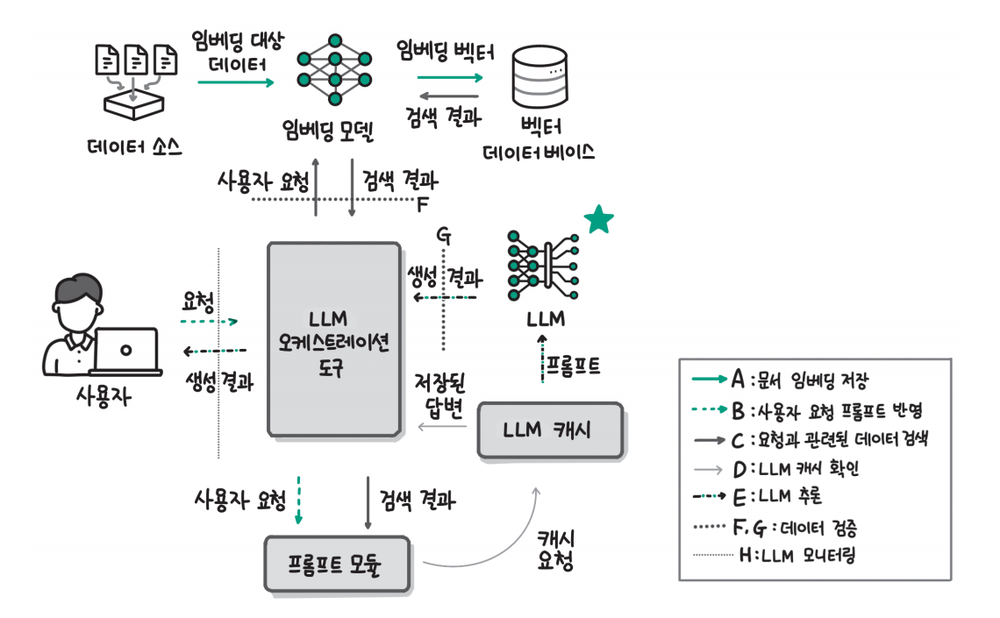  
  
하지만 LLM을 활용한 애플리케이션을 개발하려면 모델 이외에도 위 그림과 같은 다양한 구성요소가 필요하다. 그림에서 LLM은 전체 시스템의 일부분에 
불과하고 임베딩 모델, 벡터 데이터베이스 등 새로운 요소가 추가적으로 필요하다.  
  
먼저 위 그림에서 A, B, C의 요소는 LLM에 답변에 필요한 정보를 제공하는 기능을 수행한다. 챗GPT가 출시된 이후 사람들은 챗GPT가 거짓말을 하고 
말을 지어낸다는 사실을 발견했다. 이런 현상을 환각(hallucination)이라고 부른다. 그리고 LLM이 답변할 때 필요한 정보를 프롬프트에 함께 전달하는 
검색 증강 생성(Retrieval Augmented Generation, RAG)을 사용하면 환각 현상을 크게 줄일 수 있었다. 검색 증강 생성은 이름 그대로 필요한 정보를 
'검색'하고 프롬프트를 '보강(증강)'해서 '생성(추론)'하는 기술이다. 그림에서 A는 검색하고 싶은 데이터를 데이터 소스에서 가져와 임베딩 모델을 통해 
임베딩 벡터로 만들고 벡터 데이터베이스에 저장하는 과정이다. C는 검색할 데이터를 저장한 벡터 데이터베이스에서 요청과 관련된 데이터를 검색하고 
검색한 결과를 프롬프트에 반영하는 과정이다. B는 검색한 문서를 사용자의 프롬프트에 반영하는 과정이다.  
  
앞서 7장과 8장에서는 LLM 추론을 효율적으로 만드는 다양한기술을 살펴봤다. 다양한 효율화 기술이 개발될 정도로 LLM 추론은 계산량이 많고 비용이 많이 
발생한다. 따라서 가능하면 LLM 추론을 줄여야 한다. LLM 추론을 줄이기 위해 이전에 같거나 비슷한 요청이 있었다면 그 결과를 활용하는 LLM 캐시를 도입할 
수 있다. 그림에서 D는 LLM 추론을 진행하기 전에 이전에 동일하거나 유사한 요청이 있었는지 확인하기 위해 캐시에 요청하는 과정이다. 만약 비슷한 요청이 
없었다면 E에서 LLM 추론을 수행한다.  
  
LLM을 활용한 애플리케이션을 개발할 때 LLM이 답변하지 않아야 할 요청에 답변하지 않고 LLM의 생성 결과에 부적절한 내용이 포함되지 않도록 해야 한다. 
예를 들어 정치적인 질문에 답변하지 않도록 만들 수 있다면 서비스가 여러 오해를 받거나 서비스의 응답으로 불편함을 느끼는 사용자를 줄일 수 있다. 
이를 위해 F는 벡터 데이터베이스에서 검색한 결과를 확인하고 G는 LLM이 생성한 결과에 문제가 없는지 검증한다.  
  
서비스에 들어온 사용자의 요청과 LLM의 응답을 기록해야 한다. 기록해 두지 않으면 사용자의 문의에 대응하기 어렵고 서비스가 잘 작동하고 있는지 확인할 수 
없다. 특히 생성형 AI 서비스의 경우 입력이 동일하더라도 추론한 생성 결과가 다를 수 있기 때문에 꼭 기록해야 한다. 그림에서 H는 사용자의 요청과 LLM 
시스템의 생성 결과를 기록하는 모니터링 과정이다.  
  
다음 명령을 실행해 실습에 사용할 라이브러리를 설치한다.  
  
!pip install datasets llama-index==0.10.34 langchain-openai==0.1.6  
"nemoguardrails[openai]==0.8.0" openai==1.25.1 chromadb==0.5.0 wandb==0.16.6  
llama-index-callbacks-wandb==0.1.2 -qqq  
  
# **검색 증강 생성(RAG)**  
LLM을 학습시킬 때는 많은 시행착오가 필요하다. 그렇기 때문에 최신 정보나 조직의 데이터를 제대로 활용할 수 있도록 모델을 학습시키는 데 상당한 시간과 
비용이 든다. 또한 LLM의 답변은 근거나 출처가 불명확하고 부정확한 정보를 지어내는 환각 현상도 존재한다.  
  
이런 문제를 해결하기 위해 RAG라는 기법이 활용된다. 검색 증강 생성이란 LLM에게 단순히 질문이나 요청만 전달하고 생성하는 것이 아니라 답변에 필요한 
충분한 정보와 맥락을 제공하고 답변하도록 하는 방법을 말한다. 이때 답변에 필요한 정보를 검색(retrieval)을 통해 선택하기 때문에 '검색을 통해 보충한 
생성'이라는 의미로 붙은 이름이다.  
  
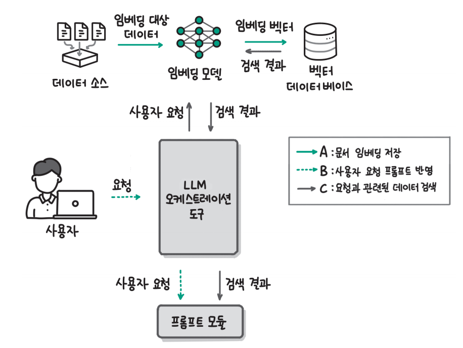  
  
위 그림은 LLM 애플리케이션 아키텍처에서 검색 증강 생성과 관련된 부분이다. 검색 증강 생성은 '검색'을 통해 필요한 정보를 추가한다고 했는데 워크플로 A는 
검색할 데이터를 벡터 데이터베이스에 저장하는 과정이다. 워크플로 B와 C는 사용자 인터페이스를 통해 들어온 사용자의 요청에 관련된 정보를 벡터 데이터베이스에서 
검색한 후 사용자의 요청과 결합해 프롬프트를 완성하는 과정이다. LLM 오케스트레이션 도구는 사용자 인터페이스, 임베딩 모델, 벡터 데이터베이스 등 LLM 
애플리케이션을 위한 다양한 구성요소를 연결하는 프레임워크로 대표적으로 라마인덱스(Llamaindex), 랭체인(Langchain), 캐노피(Canopy) 등이 있다. 
이번 장에서는 라마인덱스를 중심으로 설명과 실습을 진행한다.  
  
# **데이터 저장**  
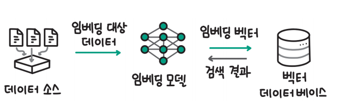  
  
워크플로 A는 위 그림과 같이 데이터 소스, 임베딩 모델, 벡터 데이터베이스로 구성된다. 데이터 소스는 텍스트, 이미지와 같은 비정형 데이터가 저장된 데이터 
저장소를 의미한다. 이번 장에서는 텍스트로 한정해서 설명하지만 이미지나 음성도 동일한 원리가 적용된다. 데이터 소스의 텍스트를 임베딩 모델을 사용해 
임베딩 벡터로 변환한다. 변환한 임베딩 벡터는 벡터 사이의 거리를 기준으로 검색하는 특수한 데이터베이스인 벡터 데이터베이스에 저장한다.  
  
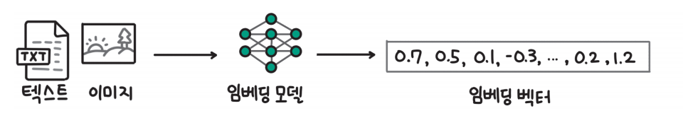  
  
임베딩 모델은 위 그림과 같이 텍스트나 이미지 같은 비정형 데이터를 입력했을 때 그 의미를 담은 임베딩 벡터로 변환하는 모델을 말한다. 텍스트 임베딩 
모델에는 대표적인 상업용 모델로 OpenAI의 text-embedding-ada-002가 있고 오픈소스로는 Sentence-Transformers 라이브러리를 활용해 임베딩 모델을 
구현할 수 있다. 이번 장에서는 간편하게 사용할 수 있는 OpenAI의 text-embedding-ada-002로 텍스트 임베딩 모델을 활용한다.  
  
벡터 데이터베이스는 임베딩 벡터의 저장소이고 입력한 벡터와 유사한 벡터를 찾는 기능을 제공한다. 대표적인 벡터 데이터베이스로는 크로마(Chroma),
밀버스(Milvus) 같은 오픈소스와 파인콘(Pinecone), 위비에이트(Weaviate) 같은 상업 서비스가 있고 최근에는 PostgreSQL 같은 관계형 데이터베이스에서도 
벡터 검색 기능을 도입하고 강화하고 있다. 이번 장에서는 벡터 데이터베이스를 쉽게 활용할 수 있도록 도와주는 라마인덱스 라이브러리의 기본 벡터 
데이터베이스를 활용한다.  
  
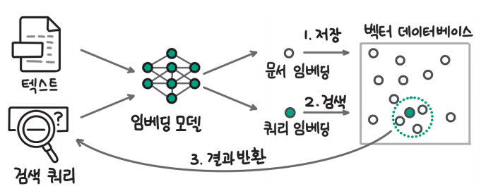  
  
워크플로 A와 C에서 텍스트 데이터를 임베딩 벡터로 만들어 벡터 데이터베이스에 저장하고 검색하는 과정을 그림으로 나타내면 위 그림과 같다. 먼저 문서를 
임베딩 모델을 통해 임베딩 벡터로 변환하고 벡터 데이터베이스에 저장한다. 벡터 데이터베이스는 내부에 각각의 벡터를 저장한다. 특정 문장(검색 쿼리)
으로 검색을 수행하는 경우 임베딩 모델을 통해 검색 쿼리도 벡터로 변환해 벡터 데이터베이스에서 위치를 찾고 쿼리 임베딩과 가장 가까운 벡터를 찾는다. 
이때 일반적으로 유클리드 거리(Euclidean distance)나 코사인 유사도(Cosine similarity)를 활용해 거리를 계산한다.  
  
# **프롬프트에 검색 결과 통합**  
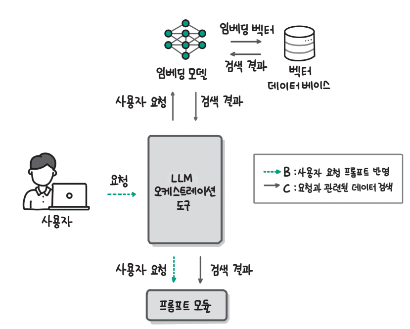  
  
LLM은 결과를 생성할 떄 프롬프트만 입력으로 받는다. 따라서 우리가 앞서 저장한 텍스트를 LLM에 전달하기 위해서는 위 그림과 같이 사용자의 요청과 
관련이 큰 문서를 벡터 데이터베이스에서 찾고(C) 검색 결과를 프롬프트에 통합(B)해야 한다. 그림에서는 사용자의 요청을 임베딩 모델을 통해 임베딩 벡터로 
변환하고 벡터 데이터베이스에서 검색 임베딩 벡터와 가까운 벡터를 찾아 검색 결과를 반환받는다(C). 임베딩 모델에서 벡터 데이터베이스로 
임베딩 벡터를 보내는 부분을 임베딩 저장 범례 A로 표현했지만 검색 과정에서도 임베딩 벡터를 보내기 때문에 위 그림에서는 검색 범례 C로 표현했다. 
검색 결과는 프롬프트 모듈에서 사용자의 요청과 하나로 통합된다.  
  
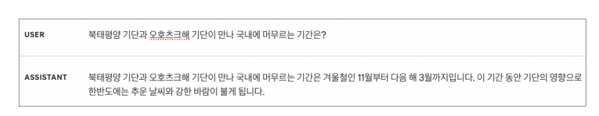    
  
검색 증강 생성의 전체 흐름을 이해하기 위해 먼저 위 그림과 같이 검색 증강 생성을 사용하지 않고 사용자의 질문을 그대로 전달하는 예시를 살펴보자. 
위 그림에서 사용자는 "북태평양 기단과 오호츠크해 기단이 만나 국내에 머무르는 기간은?"이라는 질문을 하고 어시스턴트(GPT-3.5)는 "북태평양 기단과 
오호츠크해 기단이 만나 국내에 머무르는 기간은 겨울철인 11월부터 다음 해 3월까지입니다. 이 기간 동안 기단의 영향으로 한반도에는 추운 날씨와 강한 바람이 
불게 됩니다."라고 응답했다.  
  
기단에 대한 지식이 없다고 가정했을 때 LLM의 답변은 굉장히 믿음직스러워 보인다. 위의 예시 질문은 KLUE MRC 데이터셋에서 가져온 질문인데 KLUE MRC 
데이터셋은 기사와 해당 기사에 대한 질문과 답변을 모은 데이터셋이다. 실제 데이터셋의 정답은 '한 달' 또는 '한 달가량'이다. 위 그림에서 어시스턴트는 
'11월부터 3월'이라고 답변했는데 실제 정답인 '한 달'과 상당한 차이가 있다. 데이터셋은 허깅페이스 데이터셋 허브의 KLUE MRC 데이터셋 링크(https://huggingface.
co/datasets/klue/viewer/mrc?row=0)에서 확인할 수 있다.  
  
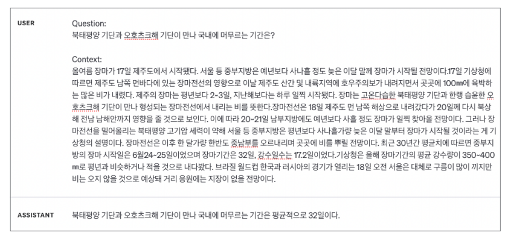  
  
데이터셋에 포함된 기사 본문을 함께 gpt-3.5-turbo에 전달하면 위 그림과 같이 기사 본문에 있는 내용을 반영해 '32일'이라고 잘 답변한다. 처음에 질문만 
던져 받은 답변과 비교하면 시기(겨울 X -> 여름 O)와 기간(4개월 X -> 1개월 O)모두 달라졌다. 이번 예시를 통해 사용 모델인 GPT-3.5조차 관련 정보를 
충분히 제공하지 않으면 언제든 환각 현상을 보일 수 있다는 사실을 확인할 수 있다.  
  
이번 예시에서는 관련된 텍스트를 데이터셋에서 직접 찾아 프롬프트에 입력해 줬다. 하지만 매번 질문에 관련된 정보를 수동으로 찾아 입력해 줄 수는 없기 
때문에 프로그래밍 방식으로 관련된 정보를 찾아 프롬프트에 넣을 수 있어야 한다.  
  
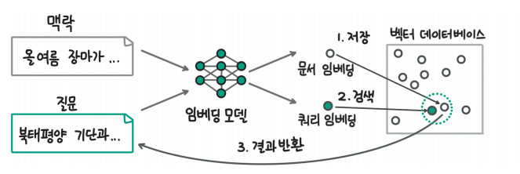  
  
텍스트를 임베딩 벡터로 변환해 벡터 데이터베이스에 저장하고 검색하는 과정을 살펴봤는데 우리의 예시에 대응시켜 새롭게 나타내면 위 그림과 같다. 예시에서 
질문과 관련된 맥락(context) 정보인 '올여름 장마가...'를 임베딩 모델을 통해 문서 임베딩으로 변환하고 벡터 데이터베이스에 저장하고 사용자의 질문(question)인 
'북태평양 기단과...'를 쿼리 임베딩으로 변환해 검색했을 때 두 임베딩이 가까워 검색 결과로 반환된다면 우리는 자동으로 관련된 정보를 찾아 프롬프트에 
추가하는 검색 증강 생성 기능을 구현할 수 있다.  
  
# **실습: 라마인덱스로 RAG 구현하기**  
이번 실습세어는 대표적인 LLM 오케스트레이션 라이브러리인 라마인덱스를 사용해 KLUE MRC 데이터셋을 활용한 질문-답변 RAG를 구현해 본다. 라마인덱스 
라이브러리에 대한 더 자세한 사항은 라마인덱스 공식 사이트(https://www.llamaindex.ai/)에서 확인할 수 있다.  
  
실습을 준비하기 위해 아래 예제를 실행해 실습에 사용할 KLUE MRC 데이터셋을 내려 받고 OpenAI의 임베딩 모델을 사용할 때 필요한 API 키를 설정한다. 
datasets 라이브러리의 load_dataset 함수에 데이터셋 이름인 klue와 서브셋 이름인 mrc를 입력하면 허깅페이스 데이터셋 허브에서 KLUE MRC 데이터셋을 
다운로드한다.  
  
chapter9.ipynb 파일에서 데이터셋 다운로드 및 API키 설정 참조  
  
dataset[0]을 통해 예제에서 내려받은 데이터셋의 첫 번째 데이터를 확인하면 예시로 사용했던 질문과 기사 본문을 확인할 수 있다. 질문(question) 컬럼에 
예시의 '북태평양 기단과...' 질문이 있고 맥락(context) 컬럼에 '올여름 장마가...' 데이터가 있음을 확인할 수 있다.  
  
다음으로 아래 예제를 사용해 실습 데이터셋 중 앞에서 100개만 뽑아 임베딩 벡터로 만들고 벡터 데이터베이스에 저장한다. dataset[:100]['context']에서 
첫 100개의 맥락 데이터를 추출하고 라마인덱스의 Document 클래스의 text 인자에 맥락 데이터를 전달해 라마인덱스가 어떤 텍스트를 임베딩 벡터로 
변환할지 지정한다. 라마인덱스는 기본 임베딩 모델로 OpenAI의 text-embedding-ada-002 모델을 사용하고 기본 벡터 데이터베이스로 인메모리(in-memory) 
방식의 벡터 데이터베이스를 사용한다. VectorStoreIndex 클래스의 from_documents() 메서드를 사용하면 우리가 Document 클래스로 생성한 documents를 
입력으로 해서 라마인덱스가 내부적으로 텍스트를 임베딩 벡터로 변환해 인메모리 벡터 데이터베이스에 저장한다. 데이터 저장 과정을 라마인덱스를 사용하면 
한 줄의 코드로 수행할 수 있다.  
  
chapter9.ipynb 파일에서 실습 데이터 중 첫 100개를 뽑아 임베딩 벡터로 변환하고 저장 참조  
  
이제 100개의 기사 본문을 작성한 벡터 데이터베이스에서 아래 예제의 코드로 예시의 질문('북태평양 기단과...')과 유사한 기사 본문을 찾아보자. 기사 
본문을 저장한 인덱스(index)를 벡터 검색에 사용할 수 있도록 as_retriever 메서드로 검색 엔진으로 변환한다. 이때 가장 가까운 5개의 기사를 반환하도록 
similarity_top_k 인자에 5를 전달했다. 검색 엔진(retrieval_engine)에 retrieve 메서드로 찾으려는 질문을 입력으로 넣으면 입력한 질문과 가장 
유사한 5개의 기사 본문을 찾아 반환한다.  
  
chapter9.ipynb 파일에서 100개의 기사 본문 데이터에서 질문과 가까운 기사 찾기 참조  
  
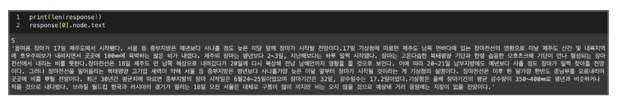  
  
print(len(response))를 통해 반환된 결과의 수를 확인하면 similarity_top_k에 설정한 대로 5개의 기사를 반환한 것을 확인할 수 있다. 우리가 
원하는 기사를 잘 찾았는지 확인하기 위해 response[0].node.text를 통해 질문과 가장 가까운 기사를 확인하면 위 그림과 같이 '올여름 장마가...'로 
시작하는 기사 본문을 잘 찾았음을 확인할 수 있다.  
  
이번에는 검색한 본문을 활용해 LLM의 답변까지 생성해 보자. 아래 예제를 실행하면 인덱스를 as_query_engine 메서드를 통해 쿼리 엔진으로 변환하고 
query 메서드에 질문을 입력하면 질문과 관련된 기사 본문을 찾아 프롬프트에 추가하고 LLM의 답변까지 생성한다. 라마인덱스는 OpenAI의 gpt-3.5-turbo를 
기본 언어 모델로 사용한다. 예제의 출력 결과를 확인하면 질문에 대한 답이 '한 달 정도'라고 정확히 답한 것을 확인할 수 있다.  
  
chapter9.ipynb 파일에서 라마인덱스를 활용해 검색 증강 생성 수행하기 참조  
  
앞서 RAG에 대해 설명하면서 다양한 구성요소와 과정이 필요하다고 했는데 라마인덱스를 사용하면 위 예제와 같이 단 두 줄의 코드만으로 유사한 텍스트를 
검색하고 생성하는 모든 과정을 수행할 수 있다. 중간의 모든 과정을 내부에서 알아서 처리하기 때문에 편하기도 하지만 정확히 어떻게 작동하는지 파악하기 
어렵다는 단점도 있다. 내부적으로는 아래 예제와 같이 세 단계를 거쳐 RAG를 수행한다. 먼저 VectorIndexRetriever 클래스를 사용해 벡터 데이터베이스에서 
검색하는 retriever를 만든다. 검색 결과를 사용자의 요청과 통합하기 위해 get_response_synthesizer() 함수를 사용해 프롬프트를 통합할 때 사용할 
response_synthesizer를 만든다. 마지막으로 RetrieverQueryEngine 클래스에 앞서 생성한 retriever와 response_synthesizer를 전달해 검색 
증강 생성을 한 번에 수행하는 query_engine을 생성한다. 이때 SimilarityPostprocessor와 같은 클래스를 사용해 질문과 유사도가 낮은 경우는 필터링하도록 
설정할 수 있다. 아래 예제에서는 유사도사 0.7 이하인 문서는 필터링하도록 설정했다.  
  
chapter9.ipynb 파일에서 라마인덱스 내부에서 검색 증강 생성을 수행하는 과정 참조  
  
라마인덱스와 같은 LLM 오케스트레이션 도구를 활용하면 몇 줄의 코드만으로 RAG를 구현할 수 있다.  
  
# **LLM 캐시**  
벡터 데이터베이스에서 사용자의 질문과 관련된 정보를 찾아 프롬프트에 통합했다면 이제 LLM에 프롬프트를 입력하고 결과를 생성하면 된다. LLM을 통해 
생성을 수행하는 작업은 시간과 비용이 많이 든다. OpenAI의 GPT-4와 같이 상업용 API를 사용할 경우 입력 프롬프트의 토큰 수와 생성하는 토큰 수에 
따라 비용이 발생한다. 또한 텍스트를 생성할 때 걸리는 시간만큼 사용자는 응답을 기다려야 하는데 사용자 경험을 위해 기다리는 시간은 가능하면 줄여야 한다. 
상업용 서비스를 사용하지 않고 LLM을 직접 서빙하는 경우 요청이 많아지면 그만큼 더 많은 GPU를 사용해야 한다. 따라서 상업용 서비스를 사용하거나 직접 
LLM을 서빙하는 두 가지 경우 모두 LLM 추론을 가능하면 줄여야 한다.  
  
LLM 캐시는 LLM 추론을 수행할 때 사용자의 요청과 생성 결과를 기록하고 이후에 동일하거나 비슷한 요청이 들어오면 새롭게 텍스트를 생성하지 않고 이전의 
생성 결과를 가져와 바로 응답함으로써 LLM 생성 요청을 줄인다. LLM 생성이 줄어드는 만큼 LLM 애플리케이션에서 발생하는 비용과 지연 시간이 줄어들기 
때문에 LLM 애플리케이션을 효율적으로 운영하는 데 꼭 필요한 구성요소라고 할 수 있다.  
  
# **LLM 캐시 작동 원리**  
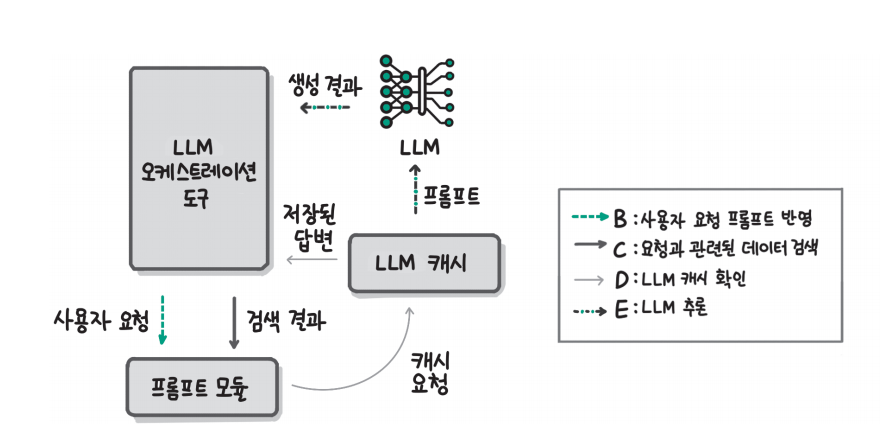  
  
LLM 캐시는 위 그림과 같이 프롬프트 통합과 LLM 생성 사이에 위치한다. 우리는 벡터 데이터베이스에서 사용자의 요청과 관련된 문서를 검색하고 사용자의 요청과 
검색결과를 하나의 프롬프트에 통합했다. LLM 캐시를 사용하지 않는다면 통합한 프롬프트를 바로 LLM에 전달하고 결과를 생성한다. 하지만 LLM 캐시를 
사용한다면 위 그림과 같이 캐시 요청을 통해 이전에 동일하거나 유사한 요청이 있었는지 확인하고 만약 있었다면 LLM 캐시에 저장된 답변을 전달하고 없었다면 
LLM에 프롬프트를 전달해 새롭게 텍스트를 생성해서 LLM 오케이스트레이션 도구로 전달한다.  
  
LLM 캐시는 크게 두 가지 방식으로 나눌 수 있다. 먼저 요청이 완전히 일치하는 경우 저장된 응답을 반환하는 일치(exact match)캐시가 있다. 일치 캐시는 
문자열 그대로 동일한지를 판단하기 때문에 파이썬의 딕셔너리같은 자료구조에 프롬프트와 그에 대한 응답을 저장하고 새로운 요청이 들어왔을 때 딕셔너리의 
키에 동일한 프롬프트가 있는지 확인하는 방식으로 구현할 수 있다. 다음으로 유사한 요청이 있었는지 확인하는 유사 검색(similar search)캐시가 있다. 
유사 검색 캐시에서는 이전에 유사한 요청이 있었는지 확인해야 하기 때문에 문자열을 그대로 비교하는 것이 아니라 문자열 임베딩 모델을 통해 변환한 
임베딩 벡터를 비교한다.  
  
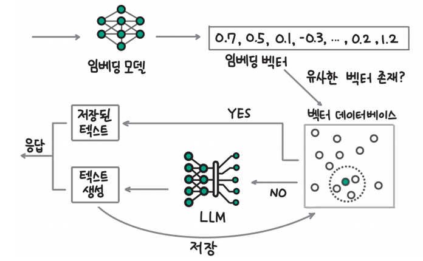  
  
그림으로 나타내면 위와 같다. 먼저 요청이 들어오면 요청을 임베딩 모델로 임베딩 벡터로 변환하고 벡터 데이터베이스에 유사한 요청이 있었는지 검색한다. 
만약 유사한 벡터가 있다면 저장된 텍스트를 반환한다. 유사한 벡터가 없다면 LLM으로 새롭게 텍스트를 생성해 응답하면서 벡터 데이터베이스에 요청의 임베딩 
벡터와 생성 결과를 저장한다.  
  
# **실습: OpenAI API 캐시 구현**  
이번 실습에서는 파이썬 딕셔너리와 오픈소스 벡터 데이터베이스인 크로마(Chroma)를 사용해 캐시 기능을 구현해 본다. 실습을 진행하기 위해서는 먼저 
언어 모델과 임베딩 모델을 사용할수 있는 OpenAI의 클라이언트와 임베딩 벡터를 저장하고 검색할 때 사용할 크로마 벡터 데이터베이스 클라이언트가 필요하다. 
아래 예제의 코드를 통해 OpenAI API 키를 설정하고 OpenAI 클라이언트와 크로마 DB 클라이언트를 생성한다.  

chapter9.ipynb 파일에서 실습에 사용할 OpenAI와 크로마 클라이언트 생성 참조  
  
다음으로 LLM 캐시를 사용하지 않았을 때 동일한 요청을 두 번 처리하는 과정을 살펴보기 위해 아래 예제를 실행한다. 이 코드에서 response_text 함수는 
OpenAI 클라이언트의 응답에서 텍스트를 추출해 반환하는 함수다. "북태평양 기단과 오호츠크해 기단이 만나 국내에 머무르는 기간은?"이라는 질문을 
OpenAI 클라이언트에 두 번 요청하고 생성에 걸린 시간과 답변을 출력했다. 출력 결과를 확인하면 동일한 질문을 두 번 처리했을 때 각각 2.71초와 4.13초가 
걸렸다.  
  
chapter9.ipynb 파일에서 LLM 캐시를 사용하지 않았을 때 동일한 요청 처리에 걸린 시간 확인 참조  
  
완전히 동일한 요청이 들어왔을 때 더 효율적으로 처리할 수 있도록 일치 캐시를 구현해 보자. 아래 예제의 OpenAICache 클래스는 OpenAI의 API 요청에 
대한 캐시를 저장하는 기능을 수행한다. __init__ 메서드에서 파이썬 딕셔너리로 프롬프트와 그 응답을 저장할 일치 LLM 캐시(self.cache)를 생성한다. 
OpenAICache 클래스에서 텍스트를 생성할 때는 generate 메서드를 사용하는데 이때 입력으로 받은 prompt가 self.cache에 없다면 새롭게 텍스트를 
생성하고 생성한 결과는 이후에 활용할 수 있도록 self.cache에 저장한다. 캐시에 동일한 프롬프트가 있다면 캐시에 저장된 응답을 그대로 반환한다. 
OpenAICache 클래스를 사용해 동일한 두 번의 요청을 처리한 결과를 확인하면 첫 요청에서는 2.74초가 걸렸지만 두 번째 요청에서는 0.00초가 걸렸다. 
self.cache에서 동일한 프롬프트를 찾아 저장된 결과를 반환헀기 때문에 시간이 거의 걸리지 않은 것이다.  
  
chapter9.ipynb 파일에서 파이썬 딕셔너리를 활용한 일치 캐시 구현 참조  
  
이번에는 유사 검색 캐시를 추가로 구현해 보자. 아래 예제에서는 기존의 OpenAICache 클래스에 유사 검색 캐시를 구현하기 위한 self.semantic_cache를 
추가한다. __init__ 메서드는 외부에서 벡터 데이터베이스 클라이언트인 semantic_cache를 입력받아 self.semantic_cache 속성세 저장한다. generate 
메서드에서는 일치 캐시를 통해 동일한 프롬프트가 있는지 확인해서 있다면 저장된 결과를 반환하고 없다면 유사 검색 캐시를 확인한다. 크로마 벡터 데이터베이스의 
query 메서드에 query_texts를 입력하면 벡터 데이터베이스에 등록된 임베딩 모델을 사용해 텍스트를 임베딩 벡터로 변환하고 검색을 수행한다. 검색 결과가 
존재하고 검색한 문서와 검색 결과 문서 사이의 거리(distance)가 충분히 가까운지(예: 0.2 미만) 확인하고 조건을 만족시키면 검색된 문서를 반환한다. 
조건을 만족시키지 못한 경우 새롭게 결과를 생성한다. 생성한 결과는 이후에 LLM 캐시에서 활용할 수 있도록 일치 캐시와 유사 검색 캐시에 저장한다.  
  
chapter9.ipynb 파일에서 유사 검색 캐시 추가 구현 참조  
  
앞서 언급한 대로 크로마 DB는 컬렉션(테이블)을 생성할 때 임베딩 모델을 등록하고 입력으로 텍스트를 전달하면 내부적으로 등록된 임베딩 모델을 사용해 
임베딩 벡터로 변환하는 기능을 지원한다. 이 기능을 사용하기 위해 아래 예제에서 OpenAIEmbeddingFunction 클래스에 api_key와 model_name을 설정해 
OpenAI의 text-embedding-ada-002를 임베딩 모델로 사용하도록 설정한다. 그리고 크로마 DB의 컬렉션을 생성할 때 생성한 임베딩 모델을 사용하도록 
embedding_function 인자의 입력으로 전달한다. 유사 검색 캐시 기능을 테스트하기 위해 OpenAI 클라이언트와 크로마 DB 클라이언트를 사용해 OpenAICache 
클래스를 인스턴스화한다. question에는 테스트에 사용할 질문 리스트를 저장하는데 첫 번째와 두 번째 데이터는 완전히 동일하고 세 번째와 네 번째 데이터는 
첫 번째 데이터와 유사하지만 동일하지는 않다. 네 번의 요청을 처리한 결과를 확인하면 첫 번째 요청에 응답하는 데 3.49초가 걸렸고 두 번째 요청은 첫 번째 
요청과 동일하므로 일치 캐시를 통해 0.00초 만에 응답했다. 다음으로 세 번째와 네 번째 요청의 경우 유사 검색 캐시를 통해 각각 0.13초, 0.11초가 걸린 
것을 확인할 수 있다. 유사 검색 캐시는 일치 캐시와 달리 임베딩 벡터 변환과 벡터 DB 검색에 시간이 소요된다.  
  
chapter9.ipynb 파일에서 유사 검색 캐시 결과 확인 참조  
  
